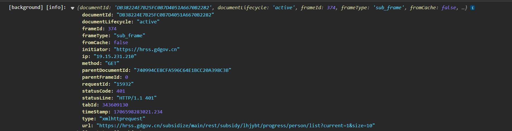
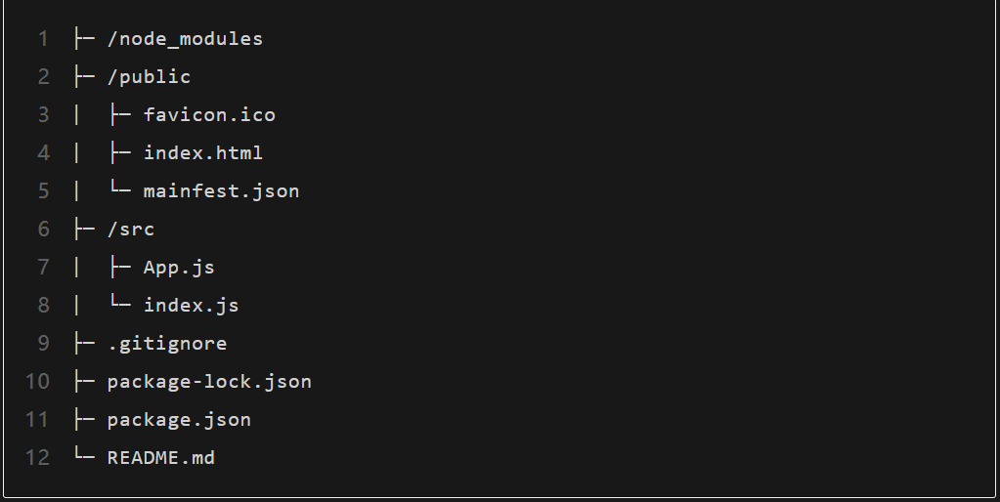
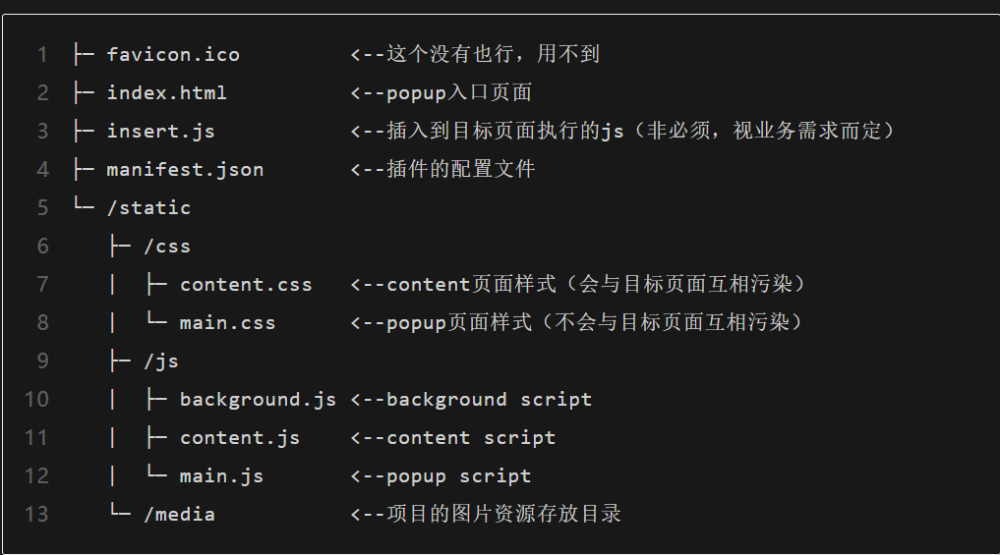
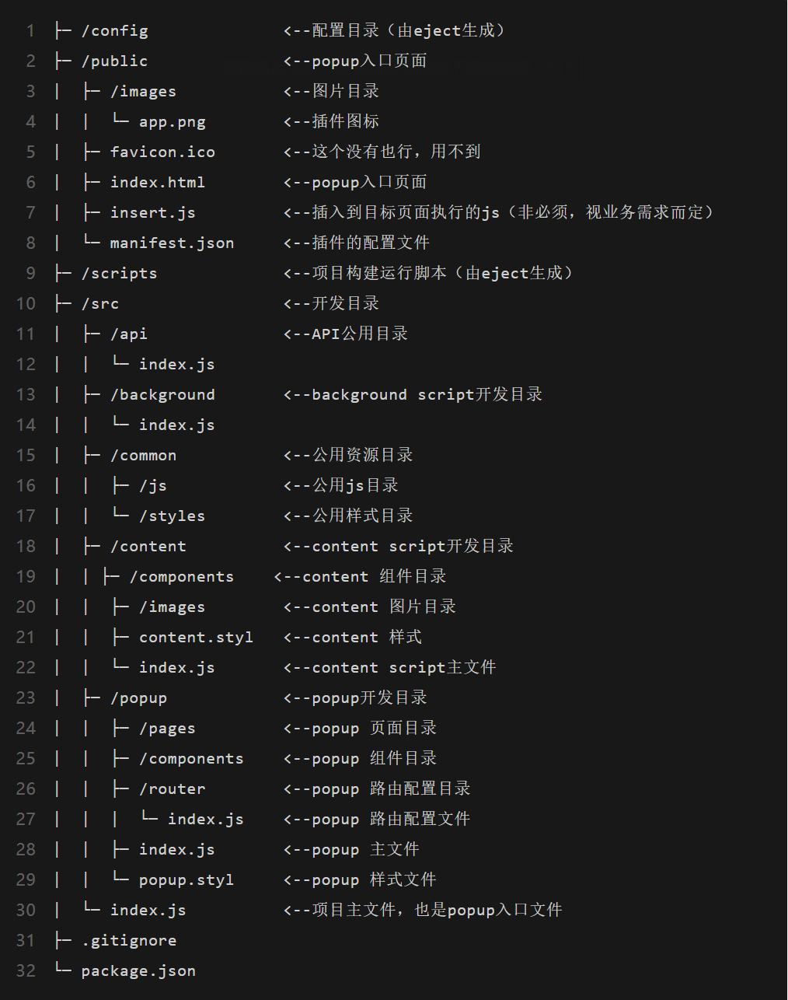

# 内容介绍

插件，在浏览器中称为`扩展`，是自定义浏览体验的小型软件程序。它们让用户可以通过多种方式定制 Chrome 的功能和行为。适用于各个chrome内核的浏览器，比如：360浏览器，edge浏览器，谷歌浏览器等。

搭建一个react版的谷歌插件。

相关文档参考`https://doc.yilijishu.info/chrome`

PS:版本依赖，manifest2已过时，谷歌不再兼容，该笔记只记录manifest3的内容。

​	

使用的技术以及版本号

|       技术       | 版本号 |                     备注                     |
| :--------------: | :----: | :------------------------------------------: |
|       antd       | 5.13.2 | 使用5.x以上版本可以解决css注入污染页面的问题 |
|     pubsubJs     | 1.9.4  |           发布与订阅，组件通信工具           |
| react-router-dom | 5.3.4  |                  react路由                   |


# 知识点

## 插件组成部分

插件主要由`manifest.json`、`background`、`content_script`、`popup`组成

>  manifest.json是插件的核心配置文件，可以参考【环境搭建】-->【环境准备】的第五点

> background是浏览器的后台脚本，可以调用chrome的所有接口，权限也是最大的。作用：发送外部请求、监听请求

> ​	content_script是浏览器标签页的脚本代码，相当于在目标页面注入一个html、css、js代码，但权限有限，只可以调用chrome部分的接口，通用功能：给目标页面添加样式。

> popup是插件的拓展页面，类似于一个小页面。

## 拦截请求chrome.webRequest

chrome.webrequest事件监听器是指在特定网络请求事件发生时执行的回调函数，它们可以对网络请求进行拦截、修改等操作。chrome.webrequest API提供了多个可用的事件监听器

| 事件                | 解释         |
| ------------------- | ------------------------------------------------------------ |
 | onBeforeRequest     | 当请求即将发生时触发。此事件在建立任何 TCP 连接之前发送，可用于取消或重定向请求。 |
| onBeforeSendHeaders | 当请求即将发生并且初始标头已准备好时触发。 该事件旨在允许扩展添加、修改和删除请求标头 (*)。 onBeforeSendHeaders 事件传递给所有订阅者，因此不同的订阅者可能会尝试修改请求； 有关如何处理的信息，请参见实施细节部分。 此事件可用于取消请求。 |
| onSendHeaders       | 在所有扩展都有机会修改请求标头后触发，并呈现最终 (*) 版本。 该事件在标头发送到网络之前触发。 此事件是信息性的并且是异步处理的。 它不允许修改或取消请求。 |
| onHeadersReceived   | 每次收到 HTTP(S) 响应标头时触发。 由于重定向和身份验证请求，每个请求可能会发生多次。 此事件旨在允许扩展添加、修改和删除响应标头，例如传入的 Content-Type 标头。 在触发此事件之前会处理缓存指令，因此修改 Cache-Control 等标头对浏览器的缓存没有影响。 它还允许您取消或重定向请求。 |
| onAuthRequired      | 当请求需要对用户进行身份验证时触发。 可以同步处理此事件以提供身份验证凭据。 请注意，扩展可能会提供无效的凭据。 注意不要通过重复提供无效凭据进入无限循环。 这也可以用来取消请求。 |
 | onBeforeRedirect    | 在即将执行重定向时触发。重定向可以由 HTTP 响应代码或扩展触发。此事件是信息性的并且是异步处理的。它不允许您修改或取消请求。 |
| onResponseStarted   | 当收到响应body的第一个字节时触发。 对于 HTTP 请求，这意味着状态行和响应标头可用。 此事件是信息性的并且是异步处理的。 它不允许修改或取消请求。 |
| onCompleted         | 成功处理请求时触发。                                         |
| onErrorOccurred     | 当请求无法成功处理时触发。                                   |

chrome.webRequest.xxxx.addListener(callback,filter,opt_extraInfoSpec)

每个 `addListener()` 调用都将强制回调函数作为第一个参数。此回调函数传递一个包含有关当前 URL 请求的信息的字典。该字典中的信息取决于具体的事件类型以及 `opt_extraInfoSpec` 的内容。

如果可选的 `opt_extraInfoSpec` 数组包含字符串 'blocking'（仅允许用于特定事件），则同步处理回调函数。这意味着请求被阻塞，直到回调函数返回。在这种情况下，回调可以返回一个` webRequest.BlockingResponse`来确定请求的进一步生命周期。根据上下文，此响应允许取消或重定向请求 (`onBeforeRequest`)，取消请求或修改标头（`onBeforeSendHeaders`、`onHeadersReceived`），以及取消请求或提供身份验证凭据（`onAuthRequired`）。

如果可选的 `opt_extraInfoSpec` 数组包含字符串 '`asyncBlocking`'（仅允许 `onAuthRequired`），则扩展可以异步生成 webRequest.BlockingResponse 。

webRequest.RequestFilter过滤器允许限制在各个维度触发事件的请求：

- **URLs**: `URL patterns`比如 `*://www.google.com/foo*bar`.
- **Types**：请求类型，例如 `main_frame`（为顶级框架加载的文档）、`sub_frame`（为嵌入的框架加载的文档）和`image`（网站上的图像）
- **Window ID**：窗口的标识符。


### 准备工作

需求：监控`https://hrss.gdgov.cn/`下所有的请求

配置manifest.json

```json
"permissions": [
    ...,
    "webRequest"    // 开放拦截请求的许可。

],
"host_permissions": [
    "https://hrss.gdgov.cn/*"  // 配置允许监听的url_pattern
],
```

定义一个api变量，存放需要监听的接口url

完整路径记得需要带`*`，否则无法监听

```js
// 补贴页面的监听请求url
export const page_api_url = {

    // 灵活就业补贴列表页面
    lhjybt_list:"https://hrss.gdgov.cn/subsidize/main/rest/subsidy/lhjybt/progress/person/list*",

    // 补贴的人员详情页面
    subsidy_detail: "https://hrss.gdgov.cn/subsidize/main/rest/subsidy/file/upload/material*",

}
```

在background.js添加webRequest的监听函数

```js
// 监听宿主页面的请求
chrome.webRequest.onCompleted.addListener(
    (detail) => {
        Logger.info(TAG, detail)
        switch (detail) {
            case page_api_url.lhjybt_list:
                Logger.info(TAG, `监听到灵活就业补贴列表页面`)
                break
            case page_api_url.subsidy_detail:
                Logger.info(TAG, `监听到补贴人员详情页面`)
                break
            default:
                break
        }
    },

    {
        urls: [...Object.values(page_api_url)]  // 监听的url
    }

);
```

detail的返回值如下图



## URL patterns

url由三部分组成

url-pattern = `<scheme>`://`<host>``<path>`

- `scheme`:方案，可选值有`http`,`https`,`file`,`urn`,`*`(只匹配http或https)
- `host`:主机,可选值有`*`(所有主机)
- `path`:路径，可选值有`*`(所有路径)


| Pattern                            | What it does                                                 | Examples of matching URLs                                    |
| ---------------------------------- | ------------------------------------------------------------ | ------------------------------------------------------------ |
| `https://*/*`                      | 匹配任何使用 https 方案的 URL                                | `https://www.google.com/ https://example.org/foo/bar.html`   |
| `https://*/foo*`                   | 匹配任何使用 https 方案的 URL，在任何主机上，只要路径以 /foo 开头 | `https://example.com/foo/bar.html https://www.google.com/foo` |
| `https://*.google.com/foo*bar`     | 匹配任何使用 https 方案、位于 google.com 主机（例如` www.google.com`、docs.google.com 或 google.com）上的 URL，只要路径以 /foo 开头并以 bar 结尾 | `https://www.google.com/foo/baz/bar https://docs.google.com/foobar` |
| `https://example.org/foo/bar.html` | 匹配指定的 URL                                               | `https://example.org/foo/bar.html`                           |
| `file:///foo*`                     | 匹配路径以 /foo 开头的任何本地文件                           | `file:///foo/bar.html file:///foo`                           |
| `http://127.0.0.1/*`               | 匹配任何使用 http 方案且位于主机 127.0.0.1 上的 URL          | `http://127.0.0.1/ http://127.0.0.1/foo/bar.html`            |
| `*://mail.google.com/*`            | 匹配任何以`http://mail.google.com` or `https://mail.google.com`. | `http://mail.google.com/foo/baz/bar https://mail.google.com/foobar` |
| `urn:*`                            | 匹配任何以 urn: 开头的 URL。                                 | urn:uuid:54723bea-c94e-480e-80c8-a69846c3f582 urn:uuid:cfa40aff-07df-45b2-9f95-e023bcf4a6da |
| `<all_urls>`                       | 匹配任何使用允许方案的 URL。 （有关允许的方案列表，请参阅本节开头。） | `http://example.org/foo/bar.html file:///bar/baz.html`       |

以下是无效模式匹配的一些示例：

| Bad pattern              | 为什么不好                          |
| :----------------------- | :---------------------------------- |
| `https://www.google.com` | 没有路径                            |
| `https://*foo/bar`       | 主机中的“*”后只能跟一个“.”或者 '/'  |
| `https://foo.*.bar/baz`  | 如果'*'在主机中，它必须是第一个字符 |
| `http:/bar`              | 缺少scheme分隔符（“/”应为“//”）     |
| `foo://*`                | 无效方案                            |


## background、content、popup通信

第一种情况：

background向content发送信息

```js
// background.js
// 发送消息给content_scripts

function sendContentMessage(todoType, data = {}) {
    chrome.tabs.query({ active: true, currentWindow: true }, (tabs) => {
        chrome.tabs.sendMessage(tabs[0].id, {
            todo: todoType,
            data: data
        })
    })

}
```

content接收信息

```js
// content.js
chrome.runtime.onMessage.addListener(async (req, sender, sendResponse) => {
    console.log("come from background message...")
    switch (req.todo) {
        case "setMedicalInfoData":
            setLoading(false)
            console.log("setMedicalInfoData", req.data)
            let resource = req.data
            if (resource.code === -1) {
                message.error(resource.msg)
            } else {
                let mainData = resource.data.data
                let mainPage = resource.data.page

                setMedicalInfoData(mainData || [])
                verifyAndRemark(mainData || [])
                setPage(mainPage)
            }

            break
    }
})
```

第二种情况

content_script发送信息

background接受信息

发送信息端(content_script)

```jsx
const dealDetailPageData = async () => {
    let pageData = await getDetailPageData()
    // 向background发送信息
    chrome.runtime.sendMessage({todo: "getMeicalInfoData",data:pageData},(response) => { 
        Logger.info(TAG,"dealDetailPageData",response)
    })

    let subsidyData = await getSubsidyTableData()
    Logger.info(TAG,"subsidyData",subsidyData)
}
```


接收信息端（background）

```js
// 开启双监听器策略，避免出现接收信息的监听器在异步操作前关闭信息端口
chrome.runtime.onMessage.addListener((request, sender, sendResponse) => {
    return true
});

// 监听content_scripts页面发来的消息
chrome.runtime.onMessage.addListener(async (request, sender, sendResponse) => {
    switch (request.todo) {
        case "getMeicalInfoData":
            let responseData = await getMedicalInfoData(request.data);
            sendResponse(responseData)
            break;
        default:
            break;
    }
});

```


- **接收消息：chrome.runtime.onMessage.addListener**
- **发送消息：chrome.runtime.sendMessage**


## 本地仓库存储Storage

`chrome.storage.sync.set(Object obj)`:将obj信息保存到本地谷歌仓库，注意：需要搭配使用async、await关键字

`chrome.storage.sync.get()`:获取本地仓库的所有数据

chrome.storage.local.set()

chrome.storage.local.get()

```jsx
  // 点击删除按钮的回调
  const onDelete = async (value) => {
    // 获取日志数据
    const data = await chrome.storage.sync.get("logs");
    if (data?.logs?.length) {
      const newLogs = data.logs.filter((log) => log !== value);
      // 重新保存日志数据
      await chrome.storage.sync.set({ logs: newLogs });
      // 修改数据刷新页面
      setLogList(newLogs);
      // 更改插件图标上徽标文字
      chrome.action.setBadgeText({
        text: newLogs.length ? newLogs.length.toString() : "",
      });
    }
  };
```


## chrome.tabs接口相关操作

新建标签页

```js
chrome.tabs.create({
    url: url,
    active: true,  // 是否聚焦该tab
}).then(tab=>{})
```

## chrome.cookies接口相关操作

在manifest.json配置cookies的权限

```json
 "permissions": [
    ...,
    "cookies"
],
```


设置网页cookie

```js
// 设置token
await chrome.cookies.set({
    url: url,
    domain: "19.15.80.59",
    path: "/",
    name: "XSRF-TOKEN",
    value: token
})
```


# 环境搭建

## 环境准备


1. npm下载create-react-app

    > npm install -g create-react-app@5.0.1

2. 创建react项目

    > npx create-react-app jyzx-crx

3. 精简目录

    

4. 新建文件层级

    

5. 配置manifest.json

    ```json
    {
        "name": "就业中心插件",
        "version": "1.0.0",
        "description": "辅助业务人员智能审批业务",
        // Chrome Extension版本号
        "manifest_version": 3,
        // background script配置（根目录最终build生成的插件包目录）
        "background": {
            "service_worker": "static/js/background.js"
        },
        // content_script配置
        "content_scripts": [
            {
                // 应用于哪些页面地址（可以用正则，<all_urls>表示所有地址）
                "matches": [
                    "<all_urls>"
                ],
                // 注入到目标页面的js，与目标页面隔离的，没有污染问题
                "js": [
                    "static/js/content.js"
                ],
                // 注入到目标页面的css，注意不要污染目标页面的样式
                "css": [
                    "static/css/content.css"
                ],
                // 代码注入时机，可选document_start,document_end,document_idle(默认)
                "run_at": "document_end"
            }
        ],
        // 申请chrome extension API权限
        "permissions": [
            "storage",
            "contextMenus",
            "tabs"
        ],
        // 插件涉及的外部请求地址，暂未发现影响跨域请求
        "host_permissions": [],
        // 如果向目标页面插入图片或者js，需要在这里授权插件本地资源
        "web_accessible_resources": [
            {
                // 资源地址
                "resources": [
                    "/images/*.png"
                ],
                // 应用于哪些页面地址
                "matches": [
                    "<all_urls>"
                ]
            }
        ],
    
        // popup页面配置
        "action": {
            // popup页面的路径
            "default_popup": "index.html",
            // 浏览器插件按钮的图标
            "default_icon": {
                "16": "images/employ_icon.png",
                "32": "images/employ_icon.png",
                "48": "images/employ_icon.png",
                "128": "images/employ_icon.png"
            },
            // 浏览器插件按钮hover显示的文字
            "default_title": "就业中心小助手"
        },
        "icons": {
            "16": "images/employ_icon.png",
            "32": "images/employ_icon.png",
            "48": "images/employ_icon.png",
            "128": "images/employ_icon.png"
        }
    }
    ```
    
    其他配置可以参考官网
    
    ```text
    manifest
    https://developer.chrome.com/docs/extensions/mv3/manifest/
    manifest_version
    https://developer.chrome.com/docs/extensions/mv3/manifest/manifest_version/
    content_script
    https://developer.chrome.com/docs/extensions/mv3/content_script/
    permissions
    https://developer.chrome.com/docs/extensions/mv3/declare_permissions/
    
    ```
    
    
    
6. 暴露react配置`npm run eject`,注意：如果报错了，则需要使用`git init`，创建一个git仓库，`git add *`添加所有文件，`git commit -m "msg"`添加备注，最后再重新执行暴露react配置命令即可。

7. 最终的项目目录结构

    

8. npm安装node-sass依赖包`npm i node-sass --dev`

9. 支持less， `npm i less less-loader --dev`

    支持stylus,跟less的步骤一致，`npm i stylus stylus-loader --dev`

    修改`config/webpack.config.js`,本质复制sass的代码，改成less

    ```js
    // style files regexes
    const cssRegex = /\.css$/;
    const cssModuleRegex = /\.module\.css$/;
    const sassRegex = /\.(scss|sass)$/;
    const sassModuleRegex = /\.module\.(scss|sass)$/;
    //+++++++++++++++++++++++++++++++++++++++++++++++++++++++
    const lessRegex = /\.less$/;
    const lessModuleRegex = /\.module\.less$/;
    //++++++++++++++++++++++++++++++++++++++++++++++++++++++
    //+++++++++++++++++++++++++++++++++++++++++++++++++++++++
    const stylusRegex = /\.styl$/;
    const stylusModuleRegex = /\.module\.styl$/;
    //++++++++++++++++++++++++++++++++++++++++++++++++++++++
    
    {
      test: sassRegex,
      exclude: sassModuleRegex,
      use: getStyleLoaders(
        {
          importLoaders: 3,
          sourceMap: isEnvProduction
            ? shouldUseSourceMap
            : isEnvDevelopment,
          modules: {
            mode: 'icss',
          },
        },
        'sass-loader'
      ),
    
      sideEffects: true,
    },
    
    {
      test: sassModuleRegex,
      use: getStyleLoaders(
        {
          importLoaders: 3,
          sourceMap: isEnvProduction
            ? shouldUseSourceMap
            : isEnvDevelopment,
          modules: {
            mode: 'local',
            getLocalIdent: getCSSModuleLocalIdent,
          },
        },
        'sass-loader'
      ),
    },
    // ++++++++++++++++++++++++++++++++++++++++++++++++++++++++++++++++++++
    {
      test: lessRegex,
      exclude: lessModuleRegex,
      use: getStyleLoaders(
        {
          importLoaders: 3,
          sourceMap: isEnvProduction
            ? shouldUseSourceMap
            : isEnvDevelopment,
          modules: {
            mode: 'icss',
          },
        },
        'less-loader'
      ),
    
      sideEffects: true,
    },
    
    {
      test: lessModuleRegex,
      use: getStyleLoaders(
        {
          importLoaders: 3,
          sourceMap: isEnvProduction
            ? shouldUseSourceMap
            : isEnvDevelopment,
          modules: {
            mode: 'local',
            getLocalIdent: getCSSModuleLocalIdent,
          },
        },
        'less-loader'
      ),
    },
    // ++++++++++++++++++++++++++++++++++++++++++++++++++++++++++++++++++++
    // ++++++++++++++++++++++++++++++++++++++++++++++++++++++++++++++++++++
    {
      test: stylusRegex,
      exclude: stylusModuleRegex,
      use: getStyleLoaders(
        {
          importLoaders: 3,
          sourceMap: isEnvProduction
            ? shouldUseSourceMap
            : isEnvDevelopment,
          modules: {
            mode: 'icss',
          },
        },
        'stylus-loader'
      ),
    
      sideEffects: true,
    },
    
    {
      test: stylusModuleRegex,
      use: getStyleLoaders(
        {
          importLoaders: 3,
          sourceMap: isEnvProduction
            ? shouldUseSourceMap
            : isEnvDevelopment,
          modules: {
            mode: 'local',
            getLocalIdent: getCSSModuleLocalIdent,
          },
        },
        'stylus-loader'
      ),
    },
    // ++++++++++++++++++++++++++++++++++++++++++++++++++++++++++++++++++++
    ```

10. 设置路径别名

    导入其他包时，就不需要使用多个`..`，直接使用`@`表示src根目录

    修改`config/webpack.config.js`

    ```js
    alias: {
        // Support React Native Web
        // https://www.smashingmagazine.com/2016/08/a-glimpse-into-the-future-with-react-native-for-web/
        'react-native': 'react-native-web',
        // Allows for better profiling with ReactDevTools
        ...(isEnvProductionProfile && {
          'react-dom$': 'react-dom/profiling',
          'scheduler/tracing': 'scheduler/tracing-profiling',
        }),
        ...(modules.webpackAliases || {}),
        // +++++++++++++++++++++++++++++++++++++++++++++
        "@":path.join(__dirname,"..","src")
        // +++++++++++++++++++++++++++++++++++++++++++++
      },
    ```

11. 禁止build项目生成map文件

    防止能够快速定位到压缩前的源代码的辅助性文件

    修改`config/webpack.config.js`

    ```js
    // const shouldUseSourceMap = process.env.GENERATE_SOURCEMAP !== 'false';
    const shouldUseSourceMap = false;
    ```

12. 设置多入口

    关键一步操作，为了让`background/index.js`,`content/index.js`,`popup/index.js`按照manifest.json设置的文件目录，分别编译出对应的文件

    修改`config/webpack.config.js`

    ```js
    // entry: paths.appIndexJs,
    entry: {
      main: paths.appIndexJs,
      content: "./src/content/index.js",
      background: "./src/background/index.js"
    },
    ```

13. 固定build生成的文件名

    1. 去掉文件hash值，删除webpack配置代码的`[contenthash:8]`,共四处
    2. 由于是多入口，需要将`static/js/bundle.js`修改为`static/js/[name].bundle.js`
    3. 将runtimeChunk设置为false,否则build后还会多生成`runtime-background.js`,`runtime-content.js`,`runtime-main.js`

    ```js
    // const shouldInlineRuntimeChunk = process.env.INLINE_RUNTIME_CHUNK !== 'false';
    const shouldInlineRuntimeChunk = false;
    ```

14. 设置popup只引入自己的index.js

    对webpack.config.js做修改

    ```js
    new HtmlWebpackPlugin(
        Object.assign(
          {},
          {
            inject: true,
            chunks:["main"],
            template: paths.appHtml,
          },
           ...
            )
    ```

15. 设置全局公用样式

    合理的样式命名规范对项目开发有巨大帮助

    1. 避免因样式名重复导致的污染。
    2. 从命名上可以直观区分`组件样式`,`页面样式`、`全局样式`
    3. 快速定位模块，查找问题。

    ```text
    G-xx:表示全局样式
    P-xx:表示页面样式
    M-xx:表示组件样式
    ```

16. 新建清零样式文件`/src/common/css/reset.less`

    把浏览器默认的css样式重置

    ```css
    /*采用阿里的reset.css*/
    body,h1,h2,h3,h4,h5,h6,hr,p,blockquote,dl,dt,dd,ul,ol,li,pre,form,fieldset,legend,button,input,textarea,th,td{margin:0;padding:0}
    
    html{color:#000;overflow-y:scroll;overflow:-moz-scrollbars-vertical}
    
    body,button,input,select,textarea{font-size:12px;font-family:arial,'Hiragino Sans GB','Microsoft Yahei','微软雅黑','宋体',\5b8b\4f53,Tahoma,Arial,Helvetica,STHeiti}
    
    h1,h2,h3,h4,h5,h6{font-size:100%}
    
    em{font-style:normal}
    
    small{font-size:12px}
    
    ul,ol{list-style:none}
    
    a{text-decoration:none}
    
    a:hover{text-decoration:underline}
    
    legend{color:#000}
    
    fieldset,img{border:0}
    
    button,input,select,textarea{font-size:100%}
    
    table{border-collapse:collapse;border-spacing:0}
    
    img{-ms-interpolation-mode:bicubic}
    
    textarea{resize:vertical}
    
    .left{float:left}
    
    .right{float:right}
    
    .overflow{overflow:hidden}
    
    .hide{display:none}
    
    .block{display:block}
    
    .inline{display:inline}
    
    .error{color:#F00;font-size:12px}
    
    label,button{cursor:pointer}
    
    .clearfix:after{content:'\20';display:block;height:0;clear:both}
    
    .clearfix{zoom:1}.clear{clear:both;height:0;line-height:0;font-size:0;visibility:hidden;overflow:hidden}
    
    .wordwrap{word-break:break-all;word-wrap:break-word}
    
    pre.wordwrap{white-space:pre-wrap}
    
    body{text-align:center}
    
    body,form{position:relative}
    
    td{text-align:left}
    
    img{border:0}
    
    
    
    ```

17. 新建`/src/common/css/global.css`

    ```css
    html,body,#root {
        height: 100%;
    }
    
    .clearfix::after {
        content: "";
        display: block;
        clear: both;
        height: 0;
        visibility: hidden;
    }
    
    .clearfix {
        display: block;
    }
    ```

18. 样式导入到`src/index.js`

    新建`/src/common/css/frame.css`

    ```css
    @import "./reset.css";
    @import "./global.css"
    
    ```

    导入`src/index.js`

    ```js
    import ReactDOM from "react-dom/client";
    import { ConfigProvider } from "antd";
    import zhCN from "antd/es/locale/zh_CN";
    import Popup from "./Popup";
    import "./index.less";
    
    const antdConfig = {
      locale: zhCN,
    };
    
    const root = ReactDOM.createRoot(document.getElementById("root"));
    root.render(
      <ConfigProvider {...antdConfig}>
        <Popup />
      </ConfigProvider>
    );
    
    ```

19. 引入antd5.x

    Antd5.x,解决了全局样式污染的问题

**注意**：`background/index.js`和`content/index.js`如果需要使用chrome的API，则开头需要写上

```text
/*global chrome*/
```


## content配置

```jsx
import React from 'react'
import "./content.less"
import FloatWindow from './components/FloatWindow'
export default function Content() {
  return (
      <div className='CRX-content'>
          <FloatWindow/>
    </div>
  )
}

// 创建id为CRX-container的div
const app = document.createElement('div')
app.id = "CRX-container"
// 将刚刚创建的div插入body最后
document.body.append(app)
// 将ReactDom插入刚刚创建的div
const crxContainer = React.createRoot(document.getElementById('CRX-container'))
crxContainer.render(<Content />)

```


## permissions集合

  声明 权限（插件实现基础功能所需要的）

 - `activeTab` 允许用户在调用扩展时临时访问当前活动的选项卡， // 常用
 - `background` 后台权限，可以用来增加Chrome 运行时间，即开机即运行（虽然是不可见的）
 - `bookmarks` 书签操作权限
 - `browsingData` 浏览器数据操作权限，主要用来清除浏览器数据 cookie storage 等
 - `contentSettings` 浏览器设置权限
 - `contextMenus` 上下文菜单添加权限
 - `cookies` cookie 的查询、修改、onChange 监听  //常用
 - `history` 浏览器历史记录操作权限
 - `storage` chrome.storage 的使用权限（注意不是浏览器的 localStorage）
 - `tabs` 选项卡权限，允许创建、修改、重新排列选项卡   // 常用
 - `webNavigation` 请求进行过程中的操作权限
 - `webRequest` | `webRequestBlocking` 开放 正在运行请求的 拦截、阻塞、或修改的权限
 - `tts`:允许插件访问浏览器的文本转语音功能，使插件能够将网页上的文本内容转换为语音播放。这个权限可以让插件为用户提供语音阅读网页内容的功能
 - `declarativeContent`:允许插件根据浏览器标签页的内容和URL动态地修改浏览器的外观和行为


# 代码片段

## 设置cookie

```js
function setCookie() {
    chrome.cookies.set({
        url: "https://www.baidu.com",
        domain: "www.baidu.com",
        path: "/",
        name: "yangjj",
        value: "yangjj,sendi,test1"
    })
    console.log("background设置cookie成功！！！！")
}
```

## 设置定时器

```js
let interval;
interval = setInterval(() => { 
    if (listDataLoadCompleted) {
        Logger.info(TAG,"页面数据加载完成！！")
        clearInterval(interval)

    }
},500)
```


# 问题集

## React在src中如何引入public文件夹的静态资源

### content_script引入public静态文件

1. manifest.json配置

    ```json
    ..., 
    "web_accessible_resources": [
        {
          "resources": ["/images/*.png"],  // 仅允许引入public/images文件夹里所有png文件
          "matches": ["<all_urls>"]
        }
      ],
    ```

2. 导入静态文件

    ```js
    const float_icon_url = chrome.runtime.getURL("images/brain.png")
    ```


### popup引入public静态文件

```jsx
export default function Login() {
  return (
      <div className='P-login'>
          
    
    </div>
  )
}
```


## 变量引入异常		

异常信息:`ReferenceError: Cannot access ‘xxx‘ before initialization`

原来的代码如下

```js
// 写法1
export const page_api_url = [
    ...lhjybt_api_url
]

export const pattern_url_list = page_api_url.map(item=>item.pattern);


//写法2 
export const page_api_url = [
    ...lhjybt_api_url
]

const url_list = []
for (var item of page_api_url){
    url_list.push(item.pattern)
}

export const pattern_url_list = url_list;
```

**声明的变量被提升，但变量只是创建被提升，初始化并没有被提升，在初始化之前使用变量，就会形成一个暂时性死区。**

- **var的创建和初始化被提升，赋值不会被提升。**
- **let的创建被提升，初始化和赋值不会被提升。**
- **function的创建、初始化和赋值均会被提升。**

最终使用function解决该问题

```js
export const page_api_url = [
    ...lhjybt_api_url
]


function getPatternUrl(url) {
    let url_list = []
    for (var item of url) {
        url_list.push(item.pattern)
    }
    return url_list
}


export const pattern_url_list = getPatternUrl(page_api_url);
```

## 组件通信报错：The message port closed before a response was received.

这个错误通常因为`chrome.runtime.onMessage`监听器在异步操作完成之前关闭了消息端口，导致无法发送响应。


解决方法：

双监听器策略

```js
// 开启双监听器策略，避免出现接收信息的监听器在异步操作前关闭信息端口
chrome.runtime.onMessage.addListener((request, sender, sendResponse) => {
    return true
});

// 监听content_scripts页面发来的消息
chrome.runtime.onMessage.addListener(async (request, sender, sendResponse) => {
    switch (request.todo) {
        case "getMeicalInfoData":
            let responseData = await getMedicalInfoData(request.data);
            sendResponse(responseData)
            break;
        default:
            break;
    }
});
```

## 跨域请求报错

