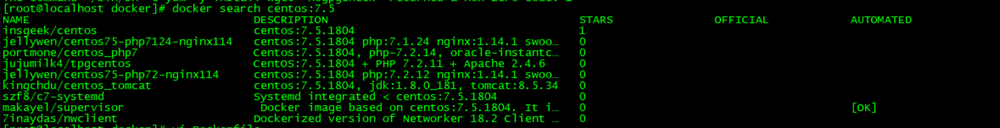
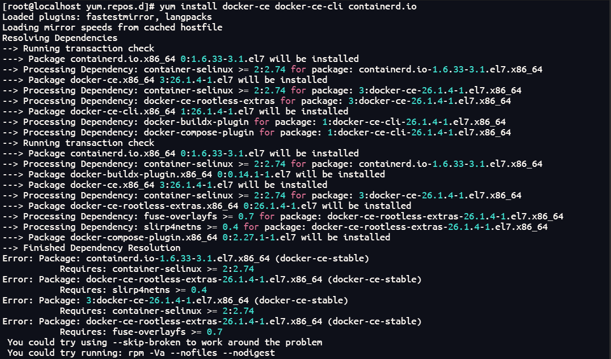

## 启动镜像

docker run

-i 交互操作
-t 终端
-d 不进入容器
-P:将容器内部使用的网络端口随机映射到我们使用的主机上。
	docker run -d -P training/webapp python app.py
	0.0.0.0:32769->5000/tcp
-p 5000:5000 指定端口 
	docker run -d -p 5000:5000 training/webapp python app.py
	0.0.0.0:5000->5000/tcp 

-v /usr/local/lib:/var/lib/mysql  挂载

-w /usr/local/lib:/var/lib/mysql 映射

/usr/local/lib : 本地绝对文件夹

/var/lib/mysq:容器内部的文件夹

---

## 1、docker基础学习

> 下载docker
>
> yum install docker

> 查看docker服务是否启动
> service docker status

> 启动docker服务
> service docker start

> docker下载mysql镜像
> docker pull mysql:latest  --->docker拉取最近版本的mysql镜像

> docker ps -a 查看所有容器（类似进程）

> docker启动容器
> docker start 容器ID

> 停止容器
> docker stop 容器ID

> 进入容器
> docker attach 进入容器
> docker exec：推荐大家使用 docker exec 命令，因为此退出容器终端，不会导致容器的停止。
> docker exec -it mysql-test /bin/bash

---

>  删除容器
>  docker rm -f 容器ID

> docker image -q     #列出所有的镜像ID

> 删除镜像
> docker rmi -f REPOSITORY:TAG 或者 docker rmi -f 镜像ID

---

> 查看端口映射
> docker port 容器ID

> 查看容器日志
> docker logs -f 容器ID
> -f: 让 docker logs 像使用 tail -f 一样来输出容器内部的标准输出

> 查看容器进程
> docker top

> 列出镜像列表
> docker images
>
> - REPOSITORY：表示镜像的仓库源
> - TAG：镜像的标签
> - IMAGE ID：镜像ID
> - CREATED：镜像创建时间
> - SIZE：镜像大小

> 查找镜像
> docker search httpd
>
> - NAME: 镜像仓库源的名称
> - DESCRIPTION: 镜像的描述
> - OFFICIAL: 是否 docker 官方发布
> - stars: 类似 Github 里面的 star，表示点赞、喜欢的意思。
> - AUTOMATED: 自动构建。

>构建镜像
>docker build  需要 Dockerfile 文件

> 清空ps -a 记录
> docker rm `docker ps -a -q`

---

> 导入/导出容器
> 导出：docker export  容器ID > xxx.tar

>  导入:   cat xxx.tar | docker import - test/xxx:v1   或者  docker import nginx-test.tar nginx:imp
>  将快照文件xxx.tar导入到镜像test/xxx:v1

> 镜像导出
> docker save -o nginx.tar nginx:latest 或者  docker save > nginx.tar nginx:latest  nginx.tar为目标文件，nginx:latest是源镜像名（name:tag）

> 镜像导入
> docker load < nginx.tar  或者  docker load -i nginx.tar  导入镜像及相关元数据，包括tag信息

若是只想备份images，使用save、load即可
若是在启动容器后，容器内容有变化，需要备份，则使用export、import


## 2、docker 安装MySQL

- docker pull mysql:latest

- docker run -itd --name mysql-test -p 19999:3306 -e MYSQL_ROOT_PASSWORD=123456 mysql

- > -p 3306:3306 ：映射容器服务的 3306 端口到宿主机的 3306 端口，外部主机可以直接通过 宿主机ip:3306 访问到 MySQL 的服务。
  > MYSQL_ROOT_PASSWORD=123456：设置 MySQL 服务 root 用户的密码。
  > --name 为mysql容器取名字
  > 启动mysql服务后，需要进入容器
  > docker exec -it mysql-test /bin/bash

- > 在linux实体机上运行docker的mysql
  > mysql -h127.0.0.1 -P19999 -uroot -p123456


启动mysql镜像：

```shell
docker run -itd -p 3306:3306 --name mysql -v /usr/local/lib/docker/mysql/conf:/etc/mysql/conf.d -v /usr/local/lib/docker/mysql/logs:/var/log/mysql -v /usr/local/lib/docker/mysql/data:/var/lib/mysql -e MYSQL_ROOT_PASSWORD=123456 mysql:5.7


# 运行 Docker 容器命令
# /etc/localtime 时间同步
# /docker/software/mysql/conf 同步配置文件，上面配置的内容就会覆盖容器中的配置文件
# /docker/software/mysql/log 同步日志目录
# /docker/software/mysql/data 同步 MySQL 的一些文件内容（对数据进行备份）
# MYSQL_ROOT_PASSWORD=root 默认 root 的密码是 root
docker run --name mysql \
-p 3306:3306 \
-v /etc/localtime:/etc/localtime \
-v ~/docker/software/mysql/conf:/etc/mysql/mysql.conf.d \
-v ~/docker/software/mysql/log:/var/log/mysql \
-v ~/docker/software/mysql/data:/var/lib/mysql \
-e MYSQL_ROOT_PASSWORD=123456 \
-d mysql:5.7.36
```

## docker安装Redis	

拉取镜像`docker pull redis:latest`

本地创建redis配置文件`vi /data/redis/redis.conf`和持久化文件`mkdir /data/redis/data`

redis配置

```conf
//#bind 127.0.0.1 #允许远程连接
 
protected-mode no #启用保护模式
 
appendonly yes #持久化
 
requirepass 123456 #密码
```

启动`$ docker run --name redis -p 6379:6379 -v /data/redis/data:/data -v /data/redis/redis.conf:/etc/redis/redis.conf -d redis redis-server /etc/redis/redis.conf`


## docker容器内将文件取出

docker cp '容器的id':/opt/app.jar /opt/apps/app.jar

## 3、docker创建镜像

### **<font color='area'>方法一：从已经创建的容器中更新镜像，并且提交这个镜像</font>**

**<font color='pink'>镜像启动后，容器里发生变动，镜像也不会跟着变化，因此需要将容器更新到镜像中</font>**

- 进入容器内  docker exec -it 容器ID或者名字 /bin/bash

- docker commit -m="has update" -a="runoob" e218edb10161 runoob/ubuntu:v2

- > - **-m:** 提交的描述信息
  > - **-a:** 指定镜像作者
  > - **e218edb10161：**容器 ID
  > - **runoob/ubuntu:v2:** 指定要创建的目标镜像名

### 方法二：使用 Dockerfile 指令来创建一个新的镜像

- docker build -t runoob/centos:6.7 .

- > - **-t** ：指定要创建的目标镜像名
  > - **.** ：Dockerfile 文件所在目录，可以指定Dockerfile 的绝对路径

## 4、设置镜像标签

**相当于复制一个镜像，更改名字和版本号**

- docker tag 860c279d2fec runoob/centos:dev

## 5. docker运行python文件

- docker python pip下载第三方库

  > ​	docker run python:3.6 python -m pip install flask

- docker run -v $PWD/myapp:/usr/local/lib/myapp -w /usr/local/lib/myapp python:3.6 python helloworld.py

>**-v $PWD/myapp:/usr/local/lib/myapp:** 将主机中当前目录下的 myapp 挂载到容器的 /usr/src/myapp。
>
>**-w /usr/local/lib/myapp:** 指定容器的 /usr/src/myapp 目录为工作目录。
>
>**python helloworld.py:** 使用容器的 python 命令来执行工作目录中的 helloworld.py 文件。

> 查看挂载目录
>
> docker inspect 容器名字或者容器ID | grep Mounts -A 20

- docker 启动python flask项目

- > docker run -v /root/myBlog:/usr/local/lib/myBlog -w /usr/local/lib/myBlog -itd --name "myBlog" -p 5000:5000  python3:dev1 python main.py

  **<font color='red'>宿主机无法访问docker部署后的python项目</font>**

  解决方法：

  > 重启python服务

## 6. docker配置nginx

- 拉取nginx镜像

  > docker pull nginx:latest

- 启动nginx

  > docker -itd --name "nginx" -p 55314:80 nginx:latest

- 进入nginx容器中

  > docker exec -it nginx /bin/bash

- 编辑nginx.conf配置文件

  > vim /etc/nginx/nginx.conf
  >
  > **<font color='pink'>如果没有vim或者vi，则以下操作</font>**
  >
  > > apt-get update
  > >
  > > apt-get install vim

- 重启nginx

---

**<font color='skyblue'>推荐使用第二种方式通过挂载本地的nginx配置文件启动nginx</font>**

docker run --name nginx2 -p 8001:80 -v /usr/local/nginx/conf/nginx.conf:/etc/nginx/nginx.conf -v /usr/local/nginx/logs:/etc/nginx/logs -d nginx:latest 


## docker配置镜像源

1.   创建文件

     `vim /etc/docker/daemon.json`

     配置阿里云镜像

     ```json
     {
     "registry-mirrors":["https://y5u7p3c7.mirror.aliyuncs.com"]
     }
     ```

2.   加载

     `systemctl daemon-reload;systemctl restart docker;docker info`


## docker网络配置

> docker提供三种自定义网络驱动，
>
> **bridge**(默认)
>
> overlay
>
> macvlan
>
> ps:overlay和macvlan用于创建跨主机网络


## 修改docker镜像存储位置

查看docker镜像的默认存储路径

docker info

1、修改docker.service文件，使用-g参数指定存储位置

```html
vi /usr/lib/systemd/system/docker.service  
```

 ExecStart=/usr/bin/dockerd **--graph /新path/docker** 

2、reload配置文件 

  systemctl daemon-reload

 

3、 重启docker 

systemctl restart docker.service
4、查看 Docker Root Dir: /var/lib/docker 是否改成设定的目录 /新-path/docker 


## DockerFile定制镜像

在一个文件夹中写入Dockerfile文件

### 基本指令

```dockerfile
FROM
构建镜像基于哪个镜像

MAINTAINER
镜像维护者姓名或邮箱地址

RUN
构建镜像时运行的指令

CMD
运行容器时执行的shell环境

VOLUME
指定容器挂载点到宿主机自动生成的目录或其他容器

USER
为RUN、CMD、和 ENTRYPOINT 执行命令指定运行用户

WORKDIR
为 RUN、CMD、ENTRYPOINT、COPY 和 ADD 设置工作目录，就是切换目录

HEALTHCHECH
健康检查

ARG
构建时指定的一些参数

EXPOSE
声明容器的服务端口（仅仅是声明）

ENV
设置容器环境变量

ADD
拷贝文件或目录到容器中，如果是URL或压缩包便会自动下载或自动解压

COPY
拷贝文件或目录到容器中，跟ADD类似，但不具备自动下载或解压的功能

ENTRYPOINT
运行容器时执行的shell命令

```

### 构建镜像

docker build -t yangjj:v1 .


## 复制容器内的代码

`docker cp <container name>:<code path> <local path>`

## 自定义DockerFile

查询需要装的系统版本

docker search centos:7.5



```dockerfile
# 构建镜像基于centos
FROM centos:7.5.1804

# 镜像维护者姓名或邮箱地址
MAINTAINER yangjj 995854654@qq.com

# 更换yum源
RUN yum -y install wget
#RUN mv /etc/yum.repos.d/CentOS-Base.repo /etc/yum.repos.d/CentOS-Base.repo.bak \
#&& wget http://mirrors.aliyun.com/repo/Centos-7.repo -O /etc/yum.repos.d/CentOS-Base.repo\
#&& yum clean all && yum makecache
# 下载基础包
RUN yum -y install proc-devel gcc gcc-c++ zlib zlib-devel make openssl-devel curl

# 下载anaconda3环境,下载到opt/conda,将conda目录下的指令添加到环境变量中
RUN wget https://mirrors.tuna.tsinghua.edu.cn/anaconda/archive/Anaconda3-2021.11-Linux-x86_64.sh --no-check-certificate -O ~/anaconda3.sh \
&& bash ~/anaconda3.sh -b -p /opt/conda \
&& echo "export PATH=/opt/conda/bin:$PATH" >> ~/.bashrc


# 设置变量 TIME_ZONE,修改时间
ENV  TIME_ZONE Asia/Shanghai
RUN echo "${TIME_ZONE}" > /etc/timezone
RUN ln -sf /usr/share/zoneinfo/${TIME_ZONE} /etc/localtime
```

## 问题大全

### Docker安装失败



```bash
# 解决方法
yum install --setopt=obsoletes=0 \
   docker-ce-17.03.2.ce-1.el7.centos.x86_64 \
   docker-ce-selinux-17.03.2.ce-1.el7.centos.noarch
```


### Error response from daemon: pull access denied for rocketmq, repository does not exist or may require 'docker login'

docker安装rocketmq时提示权限不足

修改其他指令：docker pull docker.io/rocketmqinc/rocketmq

### docker拉取镜像失败，无法上网

`Error response from daemon: Get https://registry-1.docker.io/v2/: dial tcp: lookup registry-1.docker.io on [::1]:53: read udp [::1]:37361->[::1]:53: read: connection refused`

解决方法：

vi /etc/resolv.conf

nameserver 8.8.8.8

### docker拉取镜像超时

`Error response from daemon: Get https://registry-1.docker.io/v2/: net/http: request canceled while waiting for connection (Client.Timeout exceeded while awaiting headers)`

修改镜像源

```shell
cd /etc/docker
vi daemon.json
# 添加以下内容
{
"registry-mirrors":["http://hub-mirror.c.163.com","https://docker.mirrors.ustc.edu.cn"]
}

# 重启
systemctl daemon-reload
systemctl restart docker
```

### docker无法进入容器报错

connection error: desc = "transport: dial unix:///var/run/docker/containerd/docker-containerd.sock: timeout": unknown

解决方法：

usermod -a -G docker $USER

