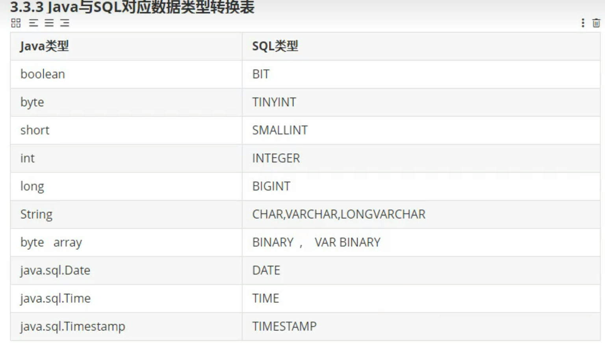

## 连接MySQL

1.   驱动类driver-class-name

     MySQL 5版本使用jdbc5驱动，驱动类使用：com.mysql.jdbc.Driver

     MySQL 8版本使用jdbc8驱动，驱动类使用：com.mysql.cj.jdbc.Driver

2.   连接地址url

     MySQL 5:`jdbc:mysql://localhost:3306/ssm`

     MySQL 8:`jdbc:mysql://localhost:3306/ssm?serverTimezone=UTC`


```java
 // 连接数据库
String url = "jdbc:mysql://localhost:3306/blogdb";
Properties info = new Properties();
info.setProperty("user","root");
info.setProperty("password","123456");

// 加载驱动,MySQL默认自动加载，但其他数据库则需要显性加载，从通用性的角度上看，需要加上加载驱动
Class.forName("com.mysql.cj.jdbc.Driver");

// Connection conn = DriverManager.getConnection(url,"root","123456");
Connection conn = DriverManager.getConnection(url,info);
System.out.println(conn);
```


## SQL注入

```java
String sql = "select * from test where user='" + user + "' AND password='" + password + "';"
String ex = "select * from test where user='admin' AND password='123456';"  // 例子  user="admin"  password="123456"
String err = "select * from test where user='1' or ' AND password='=1 OR '1'='1';" // sql注入， user="1' or "   password="=1 OR '1'='1"
// err返回所有数据
```

## 增

```java
 @Test
public void test() throws SQLException, ParseException {
    /**
         * user_info
         *  u_user  varchar(255)
         *  u_pwd  varchar(255)
         *  u_email varchar(255)
         *  create_date date
         */
    String sql = "INSERT INTO user_info(u_user,u_email,create_date) values(?,?,?);";
    PreparedStatement preparedStatement =  conn.prepareStatement(sql);
    preparedStatement.setString(1,"马云"); // 索引从1开始，定位占位符
    preparedStatement.setString(2,"995854@@qq.com");

    // date格式
    // 日期格式转换  java.util.Date --> java.sql.Date
    SimpleDateFormat sdf = new SimpleDateFormat("yyyy-MM-dd");
    // java.util.Date date = sdf.parse("1999-10-01");
    preparedStatement.setDate(3,new Date(sdf.parse("1999-10-01").getTime()));

    preparedStatement.execute(); // 执行sql
}
```

## 通用的增删改操作

```java
 public static int normalUpdate(String sql, Object... args) {
     // 通用的增删改操作
     Connection conn = null;
     PreparedStatement ps = null;
     int count = 0;
     try {
         // 通用的增删改操作
         conn = com.jdbc.JDBCUtil.connect();
         ps = conn.prepareStatement(sql);
         for (int i = 0; i < args.length; i++) {
             ps.setObject(i + 1, args[i]);
         }
         /**
             * ps.execute()
             * 如果执行的是查询操作，有返回结果，则此方法返回true
             * 如果执行的是增、删、改操作，没有返回结果，则此方法返回false
             */
         // ps.execute();
         count = ps.executeUpdate(); // 返回影响行数
     } catch (SQLException e) {
         throw new RuntimeException(e);
     } finally {
         // 关闭资源
         JDBCUtil.closeConnection(conn, ps);
     }
     return count;
 }
```


## 通用的查询操作(只针对固定类)

```java
// 通用的多数据查询记录
public static <T> List<T> getForList(Class<T> clazz,String sql,Object ...args)throws Exception {
    Connection conn = JDBCUtil.connect();
    PreparedStatement ps = conn.prepareStatement(sql);
    // 填补 占位符
    for (int i=0;i<args.length;i++){
        ps.setObject(i+1,args[i]);
    }
    // 获得ResultSet查询结果
    ResultSet rs = ps.executeQuery();
    // 获取查询结果的信息
    ResultSetMetaData rsmd = rs.getMetaData();
    int columnColumn = rsmd.getColumnCount();  // 获取列数
    List<T> list = new ArrayList<>();
    while (rs.next()){
        T t = clazz.newInstance();
        for (int i=0;i<columnColumn;i++){
            String columnName = rsmd.getColumnLabel(i+1);  // 获取列名
            Object columnValue = rs.getObject(i+1);  // 获取值

            try{
                Field field = clazz.getDeclaredField(columnName);  // 如果没有这个字段则跳过
                field.setAccessible(true);
                field.set(t,columnValue);
            }catch (NoSuchFieldException e){
                continue;
            }
        }
        list.add(t);
    };
    return list;
}
```

## JDBC-API总结

两种思想：

1. 面向接口编程的思想

2. ORM思想

    - 一个数据表对应一个java类

    - 表中的一条记录对应java类的一个对象
    - 表中的一个字段对应java类的一个属性

两种技术

1. JDBC结果集的元数据：ResultSetMetaData
    - 获取列数：getColumnCount()
    - 获取列的别名：getColumnLabel()
2. 通过反射，创建指定类的对象，获取指定的属性并赋值。


## Blob类型

- `TinyBlob`:文件大小最大255b
- `Blob`:文件大小最大65k
- `MediumBlob`:文件大小最大16M
- `LongBlob`:文件大小最大4G

如果在指定了相关的Blob类型后，还报错：xxx too large,那么在MySQL安装目录下，修改my.ini文件，添加配置`max_allowed_packet=16M`。


## 批量操作

1. url后需要添加`?rewriteBatchedStatements=true`
2. 使用`addBatch()`、`executeBatch()`、`clearBatch()`

```java
// url=jdbc:mysql://localhost:3306/blogdb?rewriteBatchedStatements=true
@Test
public void test() throws SQLException {
    long start = System.currentTimeMillis();
    Connection conn = null;
    PreparedStatement ps = null;
    try {
        // 批量插入
        conn = JDBCUtil.connect();
        
        // 设置不允许自动提交数据
        conn.setAutoCommit(false);
        String sql = "insert into test_info(`name`) VALUES (?)";
        ps = conn.prepareStatement(sql);

        for (int i = 0; i < 20000; i++) {
            ps.setString(1, "name_" + i);
            //                ps.execute();
            // 存入缓冲区
            ps.addBatch();
            if (i % 500 == 0) {
                // 提交缓冲区的内容
                ps.executeBatch();
                // 清除缓冲区
                ps.clearBatch();
            }
        }
        ps.executeBatch();
        ps.clearBatch();
        conn.commit();
    } catch (Exception e) {
        throw new RuntimeException(e);
    } finally {
        JDBCUtil.closeConnection(conn, ps);
    }
    long end = System.currentTimeMillis();
    System.out.println("花费时间：" + (end - start));


}
```


## Druid数据库连接池

```java
package com.DBPool;

import com.alibaba.druid.pool.DruidDataSourceFactory;
import org.apache.commons.dbutils.QueryRunner;
import org.apache.commons.dbutils.handlers.MapListHandler;
import org.apache.commons.dbutils.handlers.ScalarHandler;
import org.junit.Test;

import javax.sql.DataSource;
import java.io.IOException;
import java.io.InputStream;
import java.sql.Connection;
import java.util.List;
import java.util.Map;
import java.util.Properties;

public class DruidTest {
    @Test
    public void test1() throws Exception {
        Properties pro = new Properties();
        InputStream is = ClassLoader.getSystemClassLoader().getResourceAsStream("druid.properties");
        pro.load(is);
        DataSource dataSource = DruidDataSourceFactory.createDataSource(pro);


        QueryRunner qr = new QueryRunner(dataSource);
        MapListHandler rsh = new MapListHandler();
        List<Map<String, Object>> query = qr.query("select * from user_info", rsh);
        query.forEach(System.out::println);


    }
}

```


## 事务隔离级别（transaction isolation）


READ UNCOMMITTED

READ COMMITTED

REPEATABLE READ

## commons-dbutils

```java
Properties pro = new Properties();
InputStream is = ClassLoader.getSystemClassLoader().getResourceAsStream("druid.properties");
pro.load(is);
DataSource dataSource = DruidDataSourceFactory.createDataSource(pro);
QueryRunner qr = new QueryRunner(dataSource);  // 使用数据库连接池
// ScalarHandler 处理特殊值
MapListHandler rsh = new MapListHandler();
List<Map<String, Object>> query = qr.query("select * from user_info", rsh);
query.forEach(System.out::println);

```


## 添加log4j日志

在resources文件夹下添加log4j.xml

```xml
<?xml version="1.0" encoding="UTF-8"?>
<!DOCTYPE log4j:configuration SYSTEM "log4j.dtd">

<log4j:configuration xmlns:log4j="http://jakarta.apache.org/log4j/">
    <appender name="STDOUT" class="org.apache.log4j.ConsoleAppender">
        <param name="Encoding" value="UTF-8"/>
        <layout class="org.apache.log4j.PatternLayout">
            <param name="ConversionPattern" value="%-5p %d{MM-dd HH:mm:ss,SSS} %m (%F:%L) \n"/>
        </layout>
    </appender>

    <logger name="java.sql">
        <level value="debug"/>
    </logger>

    <logger name="org.apache.ibatis">
        <level value="info"/>
    </logger>

    <!-- 默认配置，级别为debug 且根据name为log.console和 log.file两个appender输出-->
    <root>
        <level value="debug"/>
        <appender-ref ref="STDOUT"/>
    </root>
</log4j:configuration>
```

日志级别：FATAL(致命)> ERROR(错误)>WARN(警告)>INFO(信息)>DEBUG(调试)

从左到右打印的内容越来越详细。
