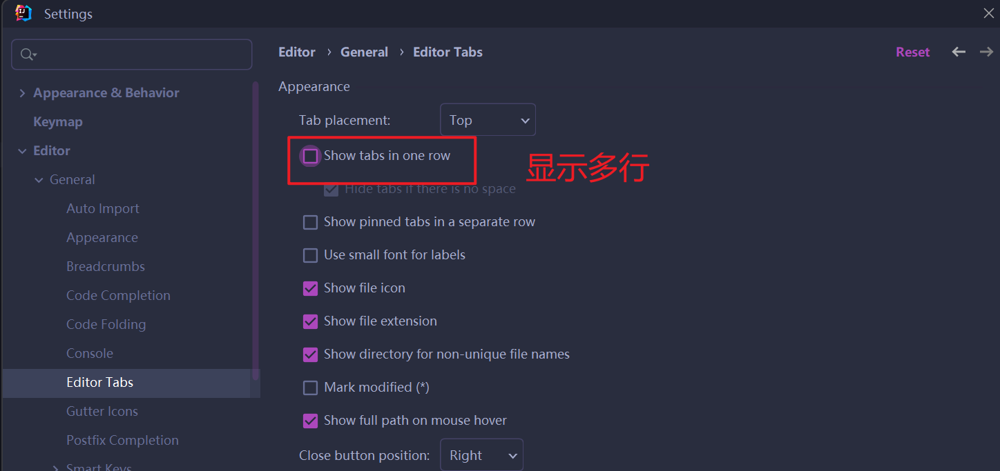
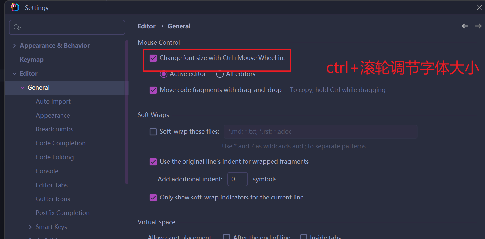
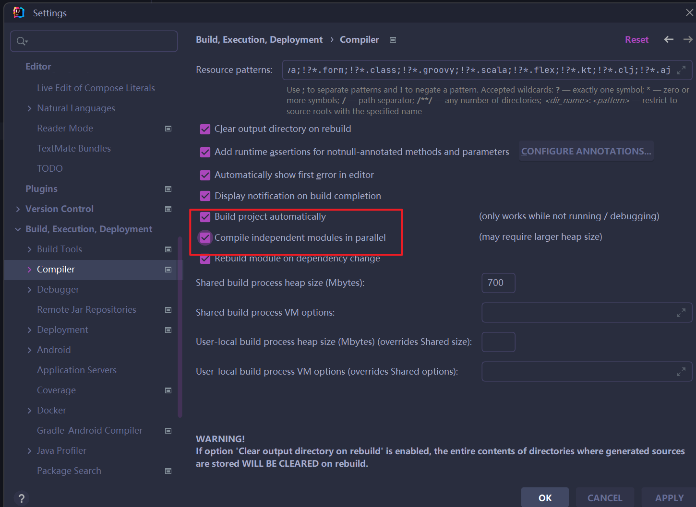
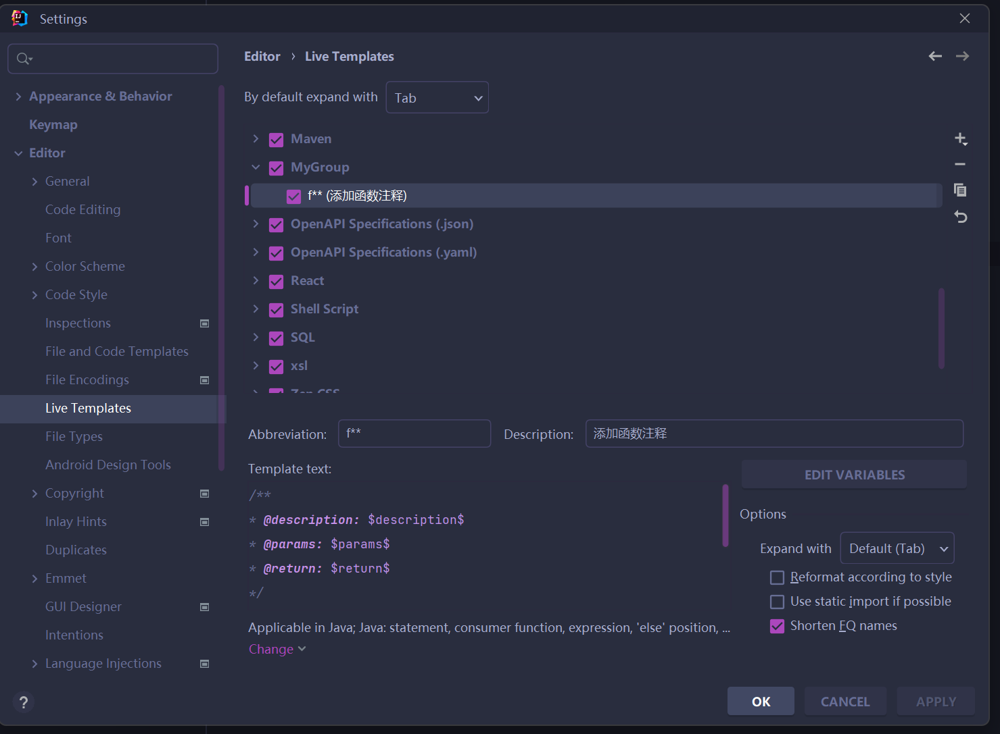
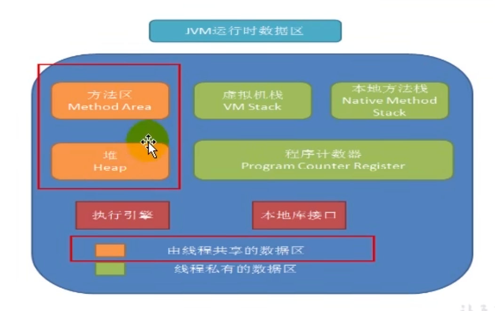
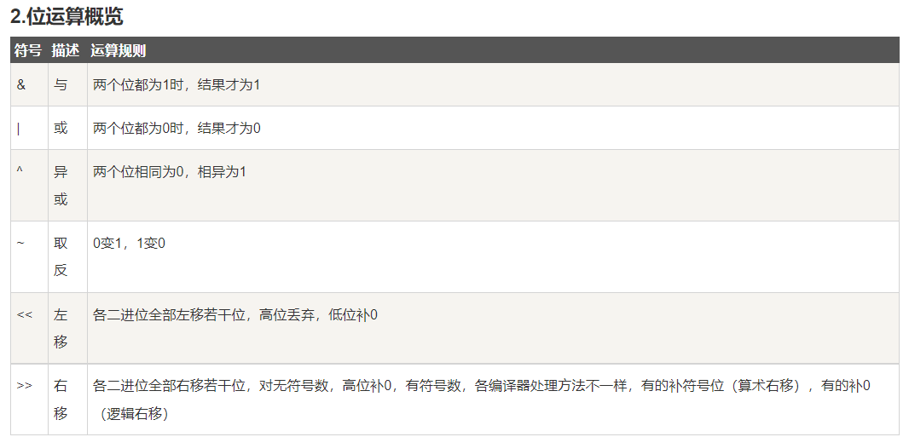
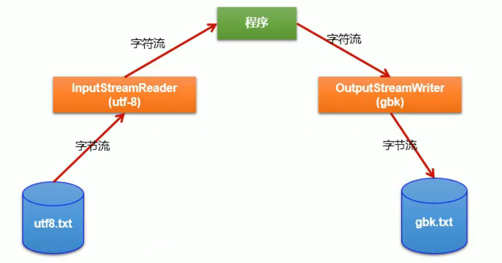

## IntelliJ IDEA 主题

`http://www.riaway.com`

plubgin 下载主题Material Theme UI	

## Intellij快捷键

`ctrl+alt+T`:surround with

`alt+Enter`:导入包

`ctrl+O`:查看该类的结构

## 运行java文件指令

编译 `.java`文件，生成`.class`文件：`javac Test.java`

运行`.class`文件(不能加.class)：`java Test`

运行`.jar`文件：`java -jar Test.jar`

## 常见字符编码

1.   `ASCII`:美国标准信息交换码。用一个字节的7位表示
2.   `ISO8859-1`:拉丁码表、欧洲码表。用一个字节的8位表示
3.   `GB2312`:中国的中文编码表。最多两个字节编码所有字符。
4.   `GBK`:中国的中文编码表升级，融合了更多的中文文字符号。
5.   `Unicode`:国际标准码。融合了目前人类使用的所有字符
6.   `UTF-8`:变长的编码方式，可用1-4个字节表示一个字符


## IntelliJ 相关配置





自动编译




自定义模板




## JVM



## 位运算符



```java
public class Test {
    public static void main(String[] args) {
        /**
         * 43： 101011
         * 37:  100101
         *
         */
        System.out.println(43 & 37);  // 逻辑与，两个位都为1时，结果为1，33: 100001
        System.out.println(43 | 37);  // 逻辑或，两个位都为0时，结果为0，47：101111
        System.out.println(43 ^ 37);  // 异或， 两位相同为0，相异为1，  14：001110
        System.out.println(~43);  // 取反，0变1，1变0，               20：010100？？？ -44
        System.out.println(43 << 2);  // 左移若干位，               172：10101100
        System.out.println(43 >> 2);  // 右移若干位,                 10: 1010
    }
}

```


## 多线程

### 创建多线程的四种方法

1. 继承Thread对象

    ```java
    @Test
    public void test1() throws InterruptedException {
        // 方式一：创建Thread类
        MyThread t1 = new MyThread();
        MyThread t2 = new MyThread();
        t1.start();
        t2.start();
        t1.join();
        t2.join();
        System.out.println("线程运行完成");
    
    }
    class MyThread extends Thread {
    
        @Override
        public void run() {
            MyThread.printConsole();
        }
    
        public static void printConsole(){
            for (int count=0;count < 100; count++){
                System.out.println(Thread.currentThread().getName() + ":" + count);
                try {
                    Thread.sleep(1);
                } catch (InterruptedException e) {
                    throw new RuntimeException(e);
                }
    
            }
        }
    }
    
    
    ```

    

2. 实现Runnable接口

    ```java
    @Test
        public void test2() throws InterruptedException {
    
            Runnable r1 = MyThread::printConsole;
            /**
            Runnable r1 = new Runnable() {
                @Override
                public void run() {
                    MyThread.printConsole();
                }
            };
            */
            Runnable r2 = MyThread::printConsole;
            Thread t1 = new Thread(r1);
            Thread t2 = new Thread(r2);
            t1.start();
            t2.start();
            for (int i=0;i<100;i++){
                System.out.println(Thread.currentThread().getName() + ":" + i);
                Thread.sleep(1);
            }
            t1.join();
            t2.join();
    
        }
    ```

    

3. 实现Callable接口

   ```java
   package com.java.study;
   
   import java.util.concurrent.Callable;
   import java.util.concurrent.ExecutionException;
   import java.util.concurrent.FutureTask;
   
   /**
    * callable创建线程
    */
   class MyThread4 implements Callable {
       private int num = 0;
       @Override
       public Object call() throws Exception {
   
           for (int i=0;i<100;i++){
               num++;
               System.out.println(Thread.currentThread().getName() + "==>"  +  num);
           }
           return num;
       }
   }
   
   public class ThreadTest4 {
       public static void main(String[] args){
           MyThread4 mt = new MyThread4();
           FutureTask ft1 = new FutureTask(mt);
           FutureTask ft2 = new FutureTask(mt);
           new Thread(ft1).start();
           new Thread(ft2).start();
           try {
               Object total = ft1.get();
               System.out.println("总和" + total);
           } catch (InterruptedException e) {
               throw new RuntimeException(e);
           } catch (ExecutionException e) {
               throw new RuntimeException(e);
           }
   
       }
   }
   
   ```

4. 线程池

   ```java
   package com.java.study;
   
   import java.util.concurrent.ExecutorService;
   import java.util.concurrent.Executors;
   import java.util.concurrent.ThreadPoolExecutor;
   
   /**
    * 线程池
    *  corePoolSize:核心池的大小
    *  maximumPoolSize:最大线程数
    *  keepAliveTime:线程没有任务时最多保持多久时间后会终止。
    */
   public class ThreadPools {
       public static void main(String[] args) {
           ExecutorService service =  Executors.newFixedThreadPool(10);
           ThreadPoolExecutor poolExecutor = (ThreadPoolExecutor) service;
       
   //        service.submit();  // 支持Runnable，Callable
   //        service.execute(); // 支持Runnable
   
       }
   
   
   
   }
   ```

   

### Thread常用的方法

1. `start()`:启动当前线程；调用当前线程的`run()`
2. `run()`:通常需要重写Thread类中的此方法
3. `currentThread()`:静态方法，返回执行当前代码的线程。
4. `getName()`:获取当前线程的名字
5. `setName()`:设置当前线程的名字
6. `yield()`:释放当前cpu的执行权
7. `join()`:在线程a中调用线程b的join()，此时线程a进入阻塞状态，直到线程b完全执行完以后，线程a才结束阻塞状态继续运行。
8. `sleep()`：让当前线程睡眠指定的millitime毫秒，阻塞状态
9. `isAlive()`:判断当前线程是否存活


### Thread线程优先级

MAX_PRIORITY:10 最大优先级

MIN_PRIORITY:1 最小优先级

NORM_PRIORITY:5  默认优先级

getPriority() 获取线程优先级

setPriority(int p) 设置线程优先级


### 同步锁

1. 同步代码块

   ```java
   
   /*
   synchronized(同步监视器){
       // 需要被同步的代码
   }
   说明： 1. 操作共享数据的代码，即为需要被同步的代码。
          2. 共享数据：多个线程共同操作的变量
          3. 同步监视器：俗称：锁，任何一个类的对象，都可以充当锁。
        	  要求：多个线程必须要共用同一个锁。
        	  
   */
   
   class Window implements Runnable {
       private int ticket = 100;
       public void run(){
           
       }
   }
   ```

2. 同步方法

   ```java
   public synchronized void deposit(){
       ...
   }
   ```

3. 显性锁

   ```java
   class Man implements Runnable {
       private ReentrantLock lock = new ReenTrantLock();  // 参数fair,默认为false，true时，线程先进先出
       @Override
       public void run(){
           try{
               lock.lock();
           }finally{
               lock.unlock();
           }
       }
   }
   ```

### 线程通信

```java
/*
* wait() 一旦执行此方法，当前线程就进入阻塞状态，并释放同步监视器
* notify()  一旦执行此方法，就会唤醒被wait的一个线程，如果有多个线程被wait，则唤醒优先级高的线程
* notifyAll() 一旦执行此方法，就会唤醒所有被wait的线程。
* 必须在同步方法或同步代码块中使用。
* 调用者必须是同步方法或同步代码块中的同步监视器

*/
```


## 枚举类

```java


public class EnumTest2 {
    public static void main(String[] args) {
        Season s1 = Season.SPRING;

        switch (s1){
            case SPRING:
                System.out.println(Season.SPRING.getEnumName());
                break;

            case SUMMER:
                System.out.println(Season.SUMMER.getEnumName());
                break;
        }

    }
}
enum Season {
    SPRING("春天","春暖花开"),
    SUMMER("夏天","夏日炎炎"),
    AUTUMN("秋天","秋高气爽"),
    WINTER("冬天","天寒地冻");

    // 声明对象的属性：private final修饰
    private final String EnumName;
    private final String EnumDesc;


    // 私有化构造器，并给对象赋值
    private Season(String name,String description){
        this.EnumName = name;
        this.EnumDesc = description;

    }


    public String getEnumName() {
        return EnumName;
    }

    public String getEnumDesc() {
        return EnumDesc;
    }


}
```


## 注解

1. 自定义注解：参照@SuppressWarnings 定义

   1. 注解声明为：@interface
   2. 内部定义成员，通常使用value表示
   3. 可以指定成员的默认值，使用default定义
   4. 如果自定义注解没有成员，表明是一个标识作用

   ```java
   package com.java.study;
   
   public @interface MyAnnotation {
   
       String value() default "hello";
   
   }
   
   // 使用注解
   @MyAnnotation
   class Person{} 
   
   ```

如果注解有成员，在使用注解时，需要指明成员的值。

自定义注解必须配上注解的信息处理流程（使用反射）才有意义。

### 元注解

`元注解`:对现有的注解进行解释说明的注解

`Retention`: 指定所修饰的 Annotation 的生命周期: SOURCE\CLASS (默认行为)RUNTIME只有声明为RUNTIME生命周期的注解，才能通过反射获取。

`Target`:用于指定被修饰的 Annotation 能用于修饰哪些程序元素

`Documented`:表示所修饰的注解在被javadoc解析时，保留下来Inherited: 被它修饰的 Annotation 将具有继承性

`Inherited`:被它修饰的Annotation将具有继承性

`可重复注解`:

1. 在@MyAnnotation上声明@Repeatable，成员值为MyAnnotations.class

2. @MyAnnotation的Target和Retention和MvAnnotations相同

```java
// 可重复注解方式一
import java.lang.annotation.Retention;
import java.lang.annotation.RetentionPolicy;

// MyAnnotation.java
@Retention(RetentionPolicy.RUNTIME)
public @interface MyAnnotation {

    String value() default "hello";

}

// MyAnnotations.java
@Retention(RetentionPolicy.RUNTIME)
public @interface MyAnnotations {
    Annotation[] value();
}

// test.java
@MyAnnotations({@MyAnnotation("hello"),@MyAnnotation("world")})  // 可重复注解
public class SystemTest {
    public static void main(String[] args) {
        System.out.println(System.getProperty("os.version"));
        System.out.println(System.getProperty("os.name"));
        System.out.println(System.getProperty("java.home"));
        System.out.println(System.getProperty("java.version"));
        System.out.println(System.getProperty("user.dir"));

//        BigDecimal bd = new BigDecimal("156132.856");
//        System.out.println(bd);
//        System.out.println(bd.divide(new BigDecimal("11"),10,BigDecimal.ROUND_HALF_UP));
    }
}

```

```java
// 可重复注解方式二
// MyAnnotation.java

@Repeatable(MyAnnotations.class)
@Retention(RetentionPolicy.RUNTIME)
public @interface MyAnnotation {

    String value() default "hello";

}

// MyAnnotations.java
@Retention(RetentionPolicy.RUNTIME)
public @interface MyAnnotations {
    MyAnnotation[] value();
}

// test.java
@MyAnnotation("hello")
@MyAnnotation("world")  // 可重复注解
public class SystemTest {
    public static void main(String[] args) {
        System.out.println(System.getProperty("os.version"));
        System.out.println(System.getProperty("os.name"));
        System.out.println(System.getProperty("java.home"));
        System.out.println(System.getProperty("java.version"));
        System.out.println(System.getProperty("user.dir"));

//        BigDecimal bd = new BigDecimal("156132.856");
//        System.out.println(bd);
//        System.out.println(bd.divide(new BigDecimal("11"),10,BigDecimal.ROUND_HALF_UP));
    }
}
```


`类型注解`:

1. `ELementType.TYPE PARAMETER` 表示该注解能写在类型变量的声明语句中(如: 泛型声明)

    ```java
    class Person<@MyAnnotation T>{
        
    }
    ```

    

2.  `ELementType.TYPE _USE` 表示该注解能写在使用类型的任何语句中。

    ```java
    class Person<@MyAnnotation T> throws @MyAnnotation IOException{
        int num = (@MyAnnotation int) 10L;
        ArrayList<@MyAnnotation String> a = new ArrayList<>();
    }
    ```

    


## 泛型


```java
// 基本使用
public class Test {
    
    public static void main(String[] args){
        ArrayList<String> list = new ArrayList<>();
        
    }
}

// 泛型对象
class Person<T>{
    
    T objectT;
    public T getObjectT(){
        return objectT;
    }
    public setObjectT(T objectT){
        this.objectT = objectT;
    }
}
```


通配符

?:不限制类型

```java
List<?> l1 = new List<>();
```

extends Object: 允许传入Object类型及Object的子类，类似于 <=

```java
class Person {
    
}
class Student extends Person {
    
}
List<? extends Person> l1 = null;  // 可传入Person,Student对象
```

 super Object:允许传入Object类型及Object的父类，类似于>=

```java
class Person {
    
}
class Student extends Person {
    
}
List<? extends Person> l1 = null;  // 可传入Person,Object对象
```


## IO流


按数据单位分类，字节流和字符流

按流向分类，输入流和输出流

按流的角色分类，节点流与处理流


### 转换流



### 对象流

对象可序列化条件：

1.   对象实现Serializable接口
2.   当前类提供一个全局常量：serialVersionUID,参考String
3.   保证其内部所有属性都可以序列化


## 反射机制（Reflection）

反射的特征：动态性

### java.lang.Class类的理解

1.   类的加载过程：

     程序经过javac.exe命令以后，会生成一个或多个字节码文件（.class结尾）

     接着使用java.exe命令对某个字节码文件进行解释运行。相当于将某个字节码文件加载到内存中。此过程称为`类的加载`。加载到内存中的类，称为运行时类，此运行时类就作为Class的一个实例。

2.   Class的实例就对应一个运行时类。

3.   加载到内存中的运行时类，会缓存一定的时间。在此时间之内，我们可以通过不同的方式获取该Class实例。


### 反射获取类的结构

没有declared，获取的是public

有declared，获取的是类的所有

有s，获取所有相同类型

#### 获取属性结构

```java
// FieldTest.java
package com.java2;

import com.java1.Person;
import org.junit.Test;

import java.lang.reflect.Field;
import java.lang.reflect.Modifier;

/**
 * 获取当前运行时类的属性结构
 *
 */
public class FieldTest {
    @Test
    public void test1(){
        Class clazz = Person.class;
        // 获取属性结构
        // getFields()获取当前运行时类及其父类中声明为public的属性
        Field[] fields = clazz.getFields();
        for (Field f:fields){
            System.out.println(f);
        }
        System.out.println("========================================");
        // getDeclaredFields() 获取当前运行时类所有的属性(不包含父类)
        Field[] fields1 = clazz.getDeclaredFields();
        for (Field f:fields1){
            System.out.println(f);
        } 
    }


    // 获取权限修饰符，数据类型，变量名
    @Test
    public void test2(){
        Class clazz = Person.class;
        Field[] fields = clazz.getDeclaredFields();
        for (Field f:fields){
            // 获取权限修饰符
            int modify = f.getModifiers();
            System.out.print(Modifier.toString(modify) + "\t");

            // 获取数据类型
            Class c = f.getType();
            System.out.print(c.getName() + "\t");

            // 获取变量名
            String n = f.getName();
            System.out.print(n + "\t");

            System.out.println("\n====================");
        }
    }
}

```

#### 获取方法结构

```java
package com.java1;

import java.io.IOException;

@MyAnnotation("hhah")
public class Person extends Creature<String> implements Comparable<String>, MyInterface {
    private String name;
    int age;
    public int id;

    public Person() {

    }

    @MyAnnotation
    private Person(String name) {
        this.name = name;
    }

    Person(String name, int age) {
        this.name = name;
        this.age = age;
    }

    @MyAnnotation(value = "abc123")
    private String show(String nation) {
        System.out.println("我的国籍是：" + nation);
        return nation;
    }

    public String display(String interest,int hobby) throws IOException {
        return interest;
    }

    @Override
    public int compareTo(String o) {
        return 0;
    }

    @Override
    public void info() {
        System.out.println("我是一个人");
    }
}

```

#### 获取构造器结构

```java
// 与获取属性结构基本一致
getConstructors();
getDeclaredConstructors();

```

#### 获取其他结构

```java
package com.java2;

import com.java1.Person;
import org.junit.Test;

import java.lang.reflect.ParameterizedType;
import java.lang.reflect.Type;

public class OtherTest {
    public void test1(){
        Class clazz = Person.class;
        // 获取运行时类的运行时父类
        Class clazz2 = clazz.getSuperclass();
        System.out.println(clazz2.getName());
    }
    /*
    获取运行时类的带泛型的父类的泛型
     */
    @Test
    public void test2() {
        Class clazz = Person.class;
        // 获取运行时类的带泛型的父类
        Type gs = clazz.getGenericSuperclass();
        System.out.println(gs.getTypeName());

        ParameterizedType paramType = (ParameterizedType) gs;
        // 获取泛型类型
        Type[] actualTypeArguments = paramType.getActualTypeArguments();
        System.out.println(((Class)actualTypeArguments[0]).getName());
    }
    
    // 获取接口结构
    getInterfaces()
    // 获取运行时类所在的包
    getPackage()
}

```


#### 获取指定的方法结构

```java
package com.java2;

import com.java1.Person;
import org.junit.Test;

import java.lang.reflect.InvocationTargetException;
import java.lang.reflect.Method;

public class ReflectTest {
    @Test
    public void test1() throws InstantiationException, IllegalAccessException, NoSuchMethodException, InvocationTargetException {
        // 调用运行时类的指定方法
        Class clazz = Person.class;
        Person p = (Person)clazz.newInstance();
        
        Method method = clazz.getDeclaredMethod("display",String.class,int.class);
        // invoke的返回值就是方法的返回值
        String s = (String) method.invoke(p,"打篮球",95);
        System.out.println(s);


    }
    @Test
    public void test2() throws NoSuchMethodException, InvocationTargetException, IllegalAccessException {
        // 调用静态方法
        Class clazz = Person.class;
        Method method = clazz.getDeclaredMethod("dance");
        method.setAccessible(true);
        method.invoke(clazz);
    }
}

```


## 代理

### 静态代理

```java
package com.agent;
// 静态代理,类似python的装饰器

/**
 * 明星与经济代理人
 * 代理人代替明星签合同，约出场时间
 */
interface AgentFactory {
    void pay();  // 签合同

    void entrance();  // 约出场时间

}

// 代理人
class Agent implements AgentFactory {
    private AgentFactory factory;

    public Agent(AgentFactory factory) {
        this.factory = factory;
    }

    @Override
    public void pay() {
        System.out.println("代理人帮明星干活");
        factory.pay();
        System.out.println("===================================");
    }

    @Override
    public void entrance() {
        System.out.println("代理人帮明星干活");
        factory.entrance();
        System.out.println("===================================");
    }
}

class Star implements AgentFactory {
    public Star() {
    }

    @Override
    public void pay() {
        System.out.println("明星准备合同");
    }

    @Override
    public void entrance() {
        System.out.println("明星准备出场活动");
    }
}

public class StaticProxyTest {

    public static void main(String[] args) {
        Agent ag = new Agent(new Star());
        ag.pay();
    }
}

```

### 动态代理

```java
package com.agent;

import java.lang.reflect.InvocationHandler;
import java.lang.reflect.Method;
import java.lang.reflect.Proxy;

/**
 * 动态代理
 * 歌手作为被代理人，当有人想让歌手点歌，需要通过代理人去传达信息
 *
 */
interface Singer {
    // 点歌
    void orderSong(String songName);

    // 说再见
    void sayGoodBye(String message);
}

// 代理类
class ProxyFactory {
    public static Object getProxyInstance(Object obj){

        MyInvocationHandler mih = new MyInvocationHandler();
        mih.bind(obj);
        // 返回代理类对象
        return Proxy.newProxyInstance(obj.getClass().getClassLoader(), obj.getClass().getInterfaces(),mih);
    }
}

// 被代理类
class Dengziqi implements Singer {

    @Override
    public void orderSong(String songName) {
        System.out.println("邓紫棋点歌，歌名：" + songName);
    }

    @Override
    public void sayGoodBye(String message) {
        System.out.println("邓紫棋说再见了，" + message);
    }
}
class MyInvocationHandler implements InvocationHandler{
    // 被代理对象
    private Object obj;
    public void bind(Object obj){
        this.obj = obj;
    }

    @Override
    public Object invoke(Object proxy, Method method, Object[] args) throws Throwable {
        System.out.println("有人找到代理人");
        Object result = method.invoke(obj,args);
        return result;
    }
}

public class ProxyTest {
    public static void main(String[] args) {
        Singer proxy = (Singer) ProxyFactory.getProxyInstance(new Dengziqi());
        proxy.orderSong("泡沫");
        proxy.sayGoodBye("欢迎下次再来！！");
    }

}

```

## Stream API

1.   Stream关注的是对数据的运算，与CPU打交道

     集合关注的是数据的存储，与内存打交道

2.   Stream 自己不会存储元素

     Stream不会改变源对象，相反，他们会返回一个持有结果的新Stream

     Stream操作是延迟执行，意味着他们会等到需要结果的时候才执行

3.   Stream执行流程

     1.   Stream的实例化
     2.   一系列的中间操作（过滤、映射、....）
     3.   终止操作 

### 创建Stream

```java
package com.streamAPI;

import org.junit.Test;

import java.util.ArrayList;
import java.util.Arrays;
import java.util.List;
import java.util.stream.Stream;

class Employee {
    private String name;
    private int id;

    public Employee(String name, int id) {
        this.name = name;
        this.id = id;
    }
}
public class StreamTest {
    // 创建Stream方式一：通过集合
    @Test
    public void test1(){
        List<Employee> list = new ArrayList<>();
        list.add(new Employee("张三",19));
        list.add(new Employee("马云",39));
        list.add(new Employee("马化腾",26));
        Stream<Employee> stream = list.stream();  // 返回一个顺序流
        Stream<Employee> parallelStream = list.parallelStream();  // 返回一个并行流

    }

    // 创建Stream方式二：通过数组创建
    @Test
    public void test2(){
        Employee[] list = {new Employee("马云",10),new Employee("张飞",19)};
        Stream<Employee> stream= Arrays.stream(list);
        /*
          public static IntStream stream(int[] array)
          public static LongStream stream(long[] array)
          public static DoubleStream stream(double[] array)
         */
    }

    // 创建Stream方式三：Stream.of()
    @Test
    public void test3(){
        Stream<Integer> stream = Stream.of(1,34,5,6,7,8);
    }

    // 创建Stream方式四：无限流
    @Test
    public void test4(){
        // 迭代
        // public static<T> Stream<T> iterate(final T seed,final UnaryOperator<T> f)
        // 遍历前10个偶数
        Stream.iterate(0,f -> f+2).limit(10).forEach(System.out::println);


        // 生成
        // public static<T> Stream<T> generate(Supplier<T> s)
        Stream.generate(Math::random).limit(10).forEach(System.out::println);
    }
}

```


### Stream方法

`filter(Predicate p)`:过滤,从流中排除某些元素

```java
list.stream().filter(e -> e.getAge() > 18).forEach(System.out::println)  // 筛选出大于18岁的人
```

`limit(int n)`:截断流，使其元素不超过给定数量

`skip(int n)`:跳过元素，返回一个扔掉前n个元素的流。若不足n个，返回一个没有元素的流

`distinct()`:根据对象的`hashCode()`和`equals()`去重

`map(Function f)`:将每个元素转成其他形式或者提取信息

```java
Stream<Employee> stream = list.stream().map(e->e.toUpperCase())  // 转成其他形式，都大写
Stream<String>  stream = list.stream().map(e->e.getName())  // 提取信息，赋给新的Stream实例
```

`flatMap(Function f)`:将流中的每个值都换成另外一个流，然后把所有流其中在一个新的流中。把嵌套的流拆解成每个流

`sorted(Comparator com)`:排序 

```java
list.stream().sorted((o1,o2) -> {
    Integer.compareTo(o1,o2)
}).forEach(System.out::println)
```

### 终止操作

`allMatch(Predicate p)`:检查是否匹配所有元素

```java
Boolean result = list.stream().allMatch(e -> e.getAge() > 18)  // 所有元素的年龄是否都大于18
```

`anyMatch(Predicate p)`:检查是否至少匹配有一个元素

```java
Boolean result = list.stream().anyMatch(e -> e.getFund() > 10000)  // 所有元素的工资是否有至少一个大于10000
```

`noneMatch(Predicate p)`:检查是否没有匹配的元素

`findFirst()`:返回第一个元素

```java
Optional<Employee> emp = list.stream().findFirst()  // 返回一个元素
```

`findAny()`:返回当前流中的任意元素（并行流中有效）

`count()`:返回流中元素个数

`max(Comparator c)|min(Comparator c)`:返回流中最大或者最小的元素

`forEach(Consumer c)`:内部迭代

`reduce(T identify,BinaryOperator)`:规约，可以将流中的元素反复结合一起，得到一个值。

```java
List<Integer> arr = Arrays.asList(15,64,54,78,134,54);
int result = arr.stream().reduce(0,Integer::sum);
System.out.println(result);   // 399
```

`reduce(BinaryOperator)`:规约，可以将流中的元素反复结合一起，得到一个值，返回一个Optional对象

```java
List<String> arr = Arrays.asList("aa", "re", "bb", "gh", "qp");
// 将所有元素拼成一个字符串
Optional<String> result = arr.stream().reduce((o1, o2)->o1 + o2);
System.out.println(result);   // Optional[aarebbghqp]
```

`collect(Collector c)`:收集，将流转换成其他形式

```java
List<String> arr = Arrays.asList("aa", "re", "bb", "gh", "qp");
Set<String> set = arr.stream().filter(s -> s.indexOf("a") >= 0).collect(Collectors.toSet()); // 筛选出集合中包含a的元素
set.forEach(System.out::println);
System.out.println();
List<String> list = arr.stream().filter(s -> s.indexOf("a") >= 0).collect(Collectors.toList()); // 筛选出集合中包含a的元素
list.forEach(System.out::println);
```

