## Linux指令大全

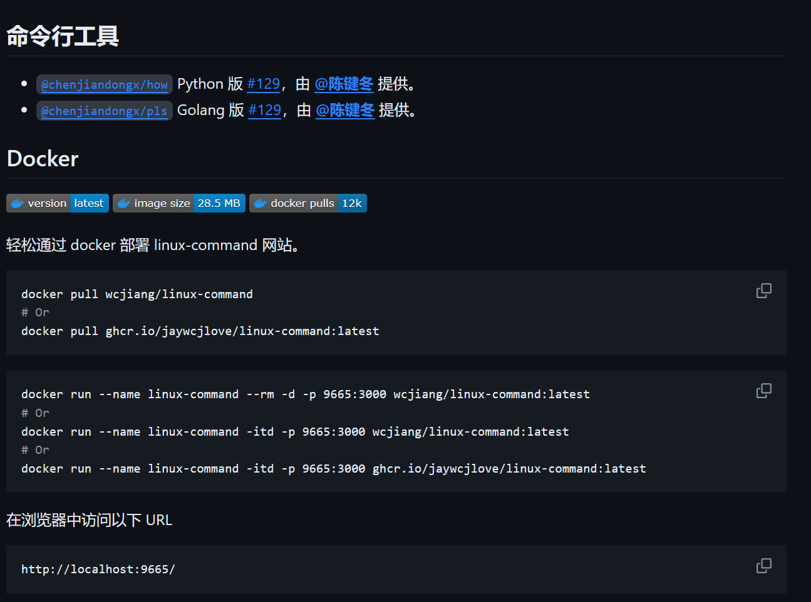

## 跨网段访问遇到的问题

网关路由没有配置好，原因是网络配置有问题

排查方法：

netstat -rn 

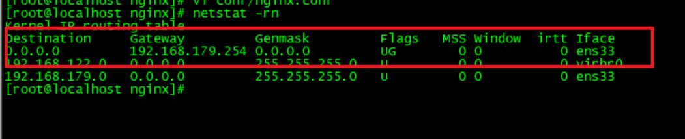

红色框表示默认路由，如果没有默认路由，跨网段访问会出问题，在同一网段下可以访问。

## 定时任务

```shell
设置脚本的定时任务
#通过crontab计划任务运行sh脚本
执行命令：  crontab -e
添加一行记录：
0 23 * * * /bin/bash /data/mysql_bak/mysql_dump.sh
#从左往右分别表示“分 时 日 月 星期”
#如上面例子：0表示0分，23表示时间23点，*表示任意数（此处可理解未占位符）
##查看最新的计划任务
执行命令：  crontab -l
```

## 端口映射

ssh -CfNg -L 23306:127.0.0.1:3306 root@127.0.0.1

将端口3306映射到23306

## web查看并发量

1. web进程连接数(通过web状态):netstat -an | grep 80 | grep ESTABLISHED | wc -l

2. web并发数(通过web进程，线程数)要排除系统保留的进程数:ps -ef | grep nginx | wc -l (进程查看)

3. web并发数(通过系统tcp状态)要排除系统其他服务的连接状态:

   netstat -n | awk '/^tcp/ {++S[$NF]} END {for(a in S) print a, S[a]}'

   netstat -n|grep  ^tcp|awk '{print $NF}'|sort -nr|uniq -c

   netstat -n | awk '/^tcp/ {++state[$NF]} END {for(key in state) print key,"t",state[key]}'

   结果：

   ```text
   ESTABLISHED t 212  // 正常传输数据状态
   TIME_WAIT t 201  // 处理完成，等待超时结束的请求数
   ```


## 安装redis

资源包：[redis](资源包/redis-7.0.4.tar.gz)

```shell
cd /usr/local/lib/
tar zxvf /data/redis-7.0.4.tar.gz
cd redis-7.0.4
make
cd src
make PREFIX=/usr/local/lib/redis install
mkdir -p /usr/local/lib/redis/bin
mkdir -p /usr/local/lib/redis/etc
cd /usr/local/lib/redis/etc
cp /data/redis/redis.conf .
# 启动项目
cd /usr/local/lib/redis/bin
./redis-server ../etc/redis.conf
```


## linux配置环境

> [r oot@lyh:] # vi /etc/profile 
> 在文件最下方或者指定文件添加 

> export JAVA_HOME=/usr/local/java/jdk1.8.0_161 
>
> export CLASSPATH=$:CLASSPATH:$JAVA_HOME/lib/ 
>
> export PATH=$PATH:$JAVA_HOME/bin 
>
> export PATH=$PATH:/usr/local/python/bin

> 重新加载配置文件
>
> source /etc/profile

## 创建多级目录

`mkdir -p /sss/xxx/ddd/fff`

## Linux用户授权

> /file目录授权给sendi
>
> chown -R sendi.sendi /file
>
> -R 处理指定目录以及其子目录下的所有文件
>
> **第一个sendi:**拥有者
>
> **第二个sendi:** 群组

## Linux添加系统用户

添加用户：`adduser admin`

设置密码：`passwd admin`

设置用户组：`usermod -g root admin`

建立组：`groupadd groupname`

---

添加用户：`useradd -g groupname -d /home/group -s /bin/bash -m username`

-d 目录，指定用户主目录

-m 可以创建主目录

-g 用户组，指定用户所属用户组


---

## 虚拟机centos扩容

**1.给虚拟机添加磁盘**

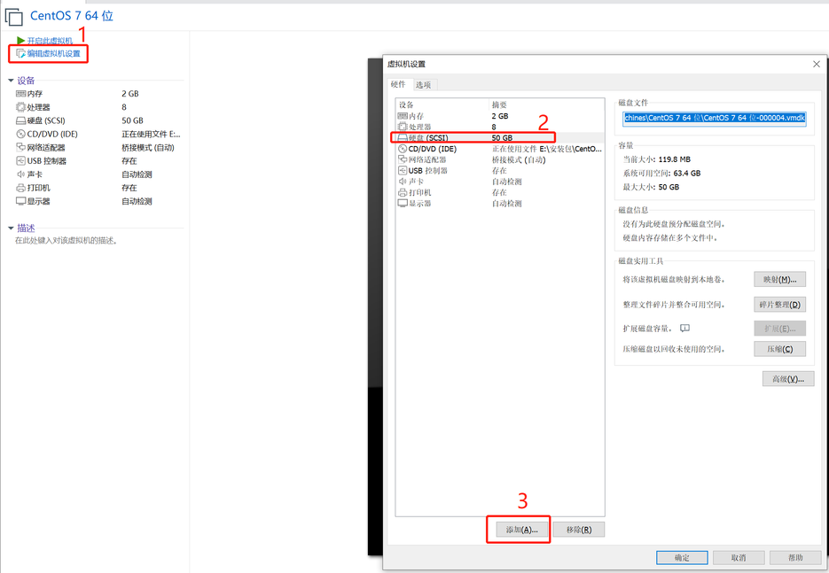


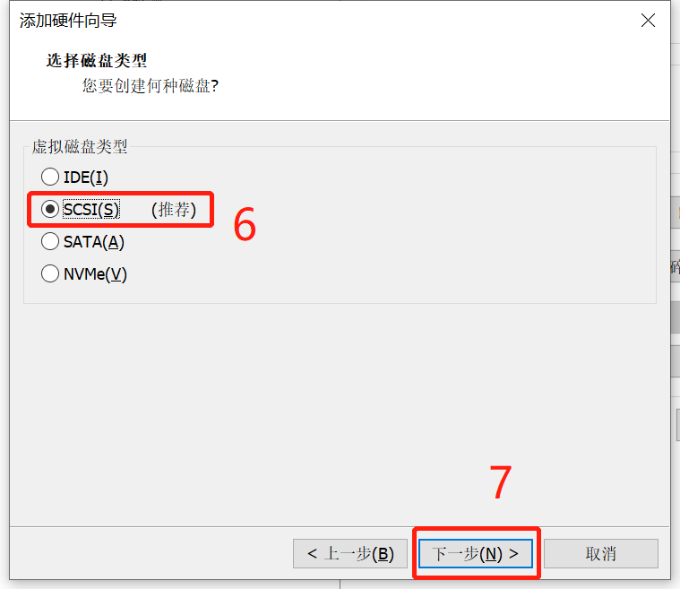

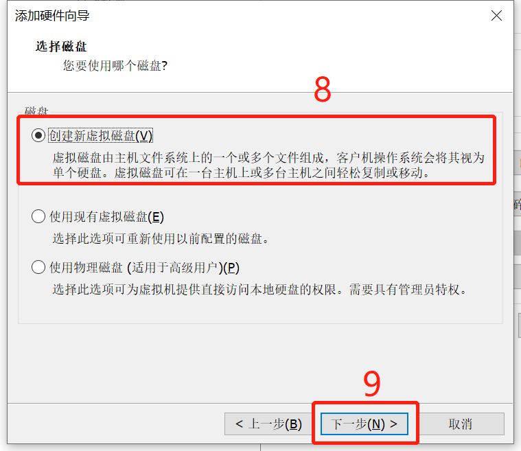

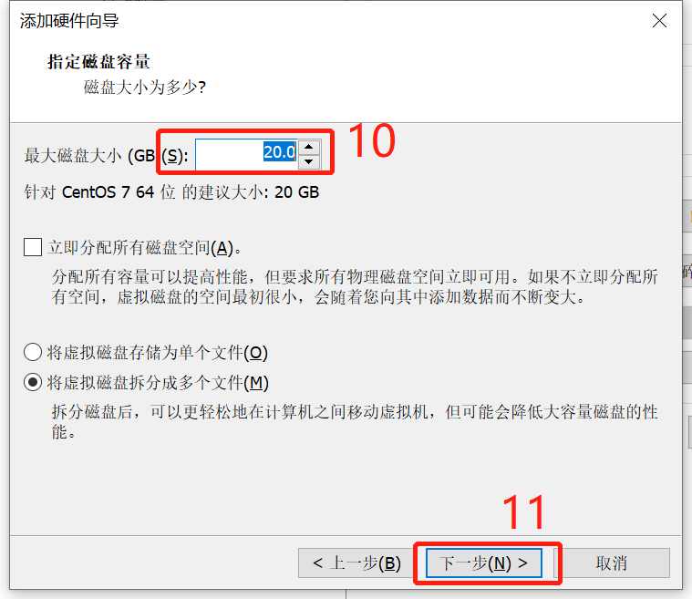

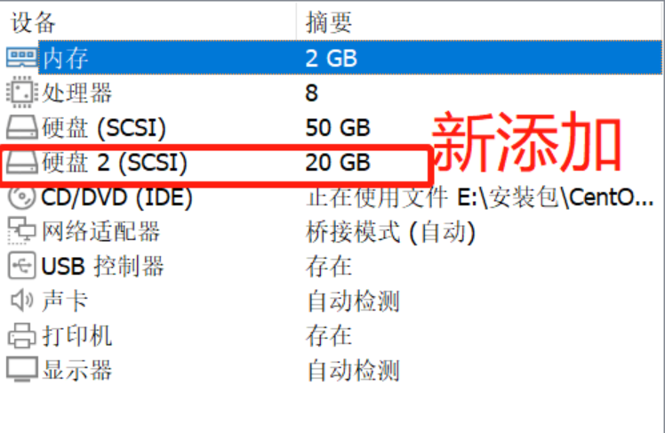

重启Linux系统，让系统识别到新增的磁盘，例如新增了sdb：

[root@localhost ~]# fdisk -l|grep /dev/sd
Disk /dev/sda: 10.7 GB, 10737418240 bytes, 20971520 sectors
/dev/sda1   *        2048     2099199     1048576   83  Linux
/dev/sda2         2099200    20971519     9436160   8e  Linux LVM
<font color='aqua'>Disk /dev/sdb: 10.7 GB, 10737418240 bytes, 20971520 sectors</font>

2.创建分区
创建主分区
fdisk /dev/sdb 

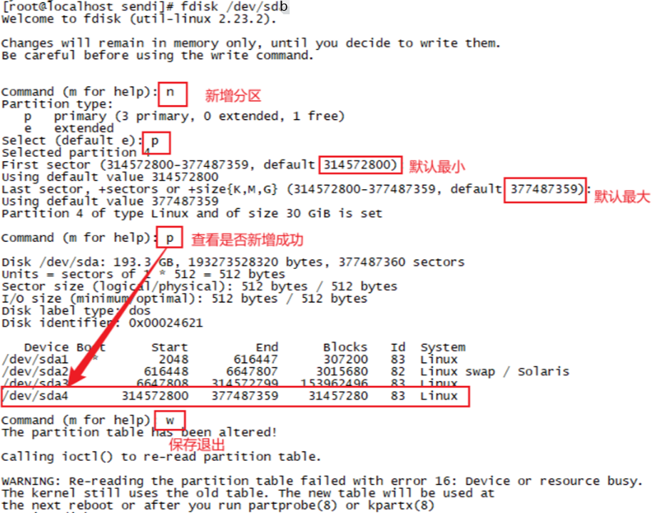

查看是否新增成功
fdisk -l

3.格式化及挂载
\#将新建分区格式化为xfs格式
mkfs.xfs /dev/sdb1

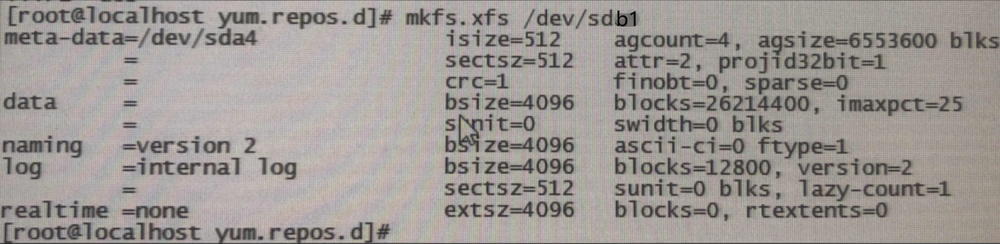

> 注意：若出现Could not stat /dev/sda4 --- No such file or directory错误，是因为没有重启系统。

创建挂载点
mkdir /data
mount /dev/sdb1 /data
df -h

对文件系统的静态信息文件进行备份
cp /etc/fstab /etc/fstab_old 


\#使用blkid查看设备的UUID

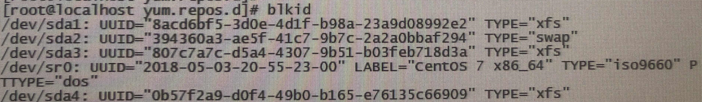


添加sdb1记录
vi /etc/fstab
在最底下添加此行内容：
UUID='上面查询到的UUID值'   /data    xfs    defaults   1   2

> 注意：挂载点/data  ，文件系统类型xfs，请注意按需填写！

重启系统
reboot 
确定是否自动挂载成功
df -h 

## 基本指令

- du -sh  查看文件大小
- du -h / --max-depth=1  查看根目录下的文件大小
- find / -name mysql 查找全盘名字叫mysql的文件
- lscpu 查看cpu情况
  - CPU(s) : 表示逻辑cpu数，这里是4个。   
  - Socket(s) : 表示物理cpu数，这里是4个。
  - Thread(s) per core : 表示每个cpu有1个超线程。
  - Core(s) per socket : 表示每个cpu有1个核。 

- top 查看linux服务运行详细情况
  - 按 1，显示cpu的资源占用情况
  - ctrl + M 排序，内存使用从大到小排序
- uname -a 查看内核情况

## 软链接删除

- rm -r lib 
- **<font color='red'>切记不要加斜杠，加斜杠是删除链接文件的文件</font>**

## 软链接


> 将/usr/local/python3/bin/python3.6文件软连接到/usr/bin/python3
>
> 访问/usr/bin/python3，即链接到/usr/local/python3/bin/python3.6此文件
>
> 类似 Windows 的 D://ocr2文件 在D://桌面 创建快捷方式
>
> cd /usr/bin
>
> ln -s /usr/local/python3/bin/python3.6 python3

## iptables防火墙

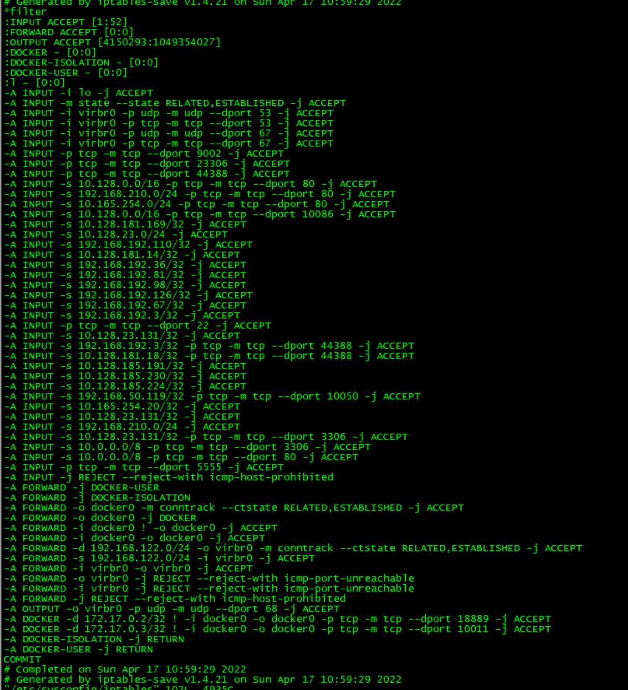

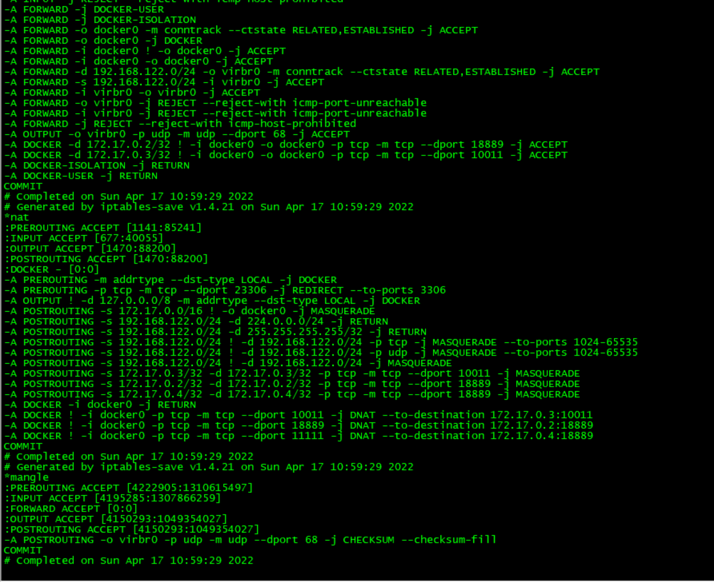

### iptables配置参数说明

命令              说明
-P    --policy  链名>         定义默认策略
-L    --list  链名>           查看iptables规则列表
-A    --append  链名>         在规则列表的最后增加1条规则
-I    --insert  链名>         在指定的位置插入1条规则
-D    --delete  链名>         从规则列表中删除1条规则
-R    --replace  链名>        替换规则列表中的某条规则
-F    --flush  链名>          删除表中所有规则
-Z    --zero  链名>           将表中数据包计数器和流量计数器归零
-X    --delete-chain  链名>   删除自定义链
-v    --verbose  链名>        与-L他命令一起使用显示更多更详细的信息

（3） 匹配规则
匹配选项指定数据包与规则匹配所具有的特征，包括源地址，目的地址，传输协议和端口号，如下表所示
匹配                              说明
-i     --in-interface  网络接口名>       指定数据包从哪个网络接口进入，
-o    --out-interface  网络接口名>       指定数据包从哪个网络接口输出
-p    ---proto协议类型                   指定数据包匹配的协议，如TCP、UDP和ICMP等
-s     --source  源地址或子网>           指定数据包匹配的源地址
--sport 源端口号>                        指定数据包匹配的源端口号
--dport 目的端口号>                      指定数据包匹配的目的端口号
-m  --match 匹配的模块                   指定数据包规则所使用的过滤模块

-j  --jump 目标跳转

iptables执行规则时，是从规则表中从上至下顺序执行的，如果没遇到匹配的规则，就一条一条往下执行，如果遇到匹配的规则后，那么就执行本规则，执行后根据本规则的动作(accept，reject，log，drop等)，决定下一步执行的情况，后续执行一般有三种情况。
一种是继续执行当前规则队列内的下一条规则。比如执行过Filter队列内的LOG后，还会执行Filter队列内的下一条规则。
一种是中止当前规则队列的执行，转到下一条规则队列。比如从执行过accept后就中断Filter队列内其它规则，跳到nat队列规则去执行
一种是中止所有规则队列的执行。

2、iptables规则的动作 
前面我们说过iptables处理动作除了 ACCEPT、REJECT、DROP、REDIRECT 、MASQUERADE 以外，还多出 LOG、ULOG、DNAT、RETURN、TOS、SNAT、MIRROR、QUEUE、TTL、MARK等。我们只说明其中最常用的动作：

REJECT    拦阻该数据包，并返回数据包通知对方，可以返回的数据包有几个选择：ICMP port-unreachable、ICMP echo-reply 或是tcp-reset（这个数据包包会要求对方关闭联机），进行完此处理动作后，将不再比对其它规则，直接中断过滤程序。 范例如下：
iptables -A  INPUT -p TCP --dport 22 -j REJECT --reject-with ICMP echo-reply
DROP  丢弃数据包不予处理，进行完此处理动作后，将不再比对其它规则，直接中断过滤程序。
REDIRECT   将封包重新导向到另一个端口（PNAT），进行完此处理动作后，将会继续比对其它规则。这个功能可以用来实作透明代理 或用来保护web 服务器。例如：
iptables -t nat -A PREROUTING -p tcp --dport 80 -j REDIRECT--to-ports 8081
MASQUERADE 改写封包来源IP为防火墙的IP，可以指定port 对应的范围，进行完此处理动作后，直接跳往下一个规则链（mangle:postrouting）。这个功能与 SNAT 略有不同，当进行IP 伪装时，不需指定要伪装成哪个 IP，IP 会从网卡直接读取，当使用拨接连线时，IP 通常是由 ISP 公司的 DHCP服务器指派的，这个时候 MASQUERADE 特别有用。范例如下：
iptables -t nat -A POSTROUTING -p TCP -j MASQUERADE --to-ports 21000-31000
LOG   将数据包相关信息纪录在 /var/log 中，详细位置请查阅 /etc/syslog.conf 配置文件，进行完此处理动作后，将会继续比对其它规则。例如：
iptables -A INPUT -p tcp -j LOG --log-prefix "input packet"
SNAT 改写封包来源 IP 为某特定 IP 或 IP 范围，可以指定 port 对应的范围，进行完此处理动作后，将直接跳往下一个规则炼（mangle:postrouting）。范例如下：
iptables -t nat -A POSTROUTING -p tcp-o eth0 -j SNAT --to-source 192.168.10.15-192.168.10.160:2100-3200
DNAT 改写数据包包目的地 IP 为某特定 IP 或 IP 范围，可以指定 port 对应的范围，进行完此处理动作后，将会直接跳往下一个规则链（filter:input 或 filter:forward）。范例如下：
iptables -t nat -A PREROUTING -p tcp -d 15.45.23.67 --dport 80 -j DNAT --to-destination 192.168.10.1-192.168.10.10:80-100
MIRROR  镜像数据包，也就是将来源 IP与目的地IP对调后，将数据包返回，进行完此处理动作后，将会中断过滤程序。
QUEUE   中断过滤程序，将封包放入队列，交给其它程序处理。透过自行开发的处理程序，可以进行其它应用，例如：计算联机费用.......等。
RETURN  结束在目前规则链中的过滤程序，返回主规则链继续过滤，如果把自订规则炼看成是一个子程序，那么这个动作，就相当于提早结束子程序并返回到主程序中。
MARK 将封包标上某个代号，以便提供作为后续过滤的条件判断依据，进行完此处理动作后，将会继续比对其它规则。范例如下：

### iptables流量转发

iptables -t nat -A PREROUTING -p tcp --dport 23306 -j REDIRECT --to-ports 3306

-A PREROUTING -p tcp -m tcp --dport 23306 -j REDIRECT --to-ports 3306

### iptables开放端口号

对192.168.210.0网段开放80端口

-A INPUT -s 192.168.210.0/24 -p tcp -m tcp --dport 80 -j ACCEPT

注意：

192.0.0.0/8

192.168.0.0/16

192.168.210.0/24

192.168.210.10/32

---


安装防火墙
yum install -y iptables
安装防火墙服务
yum install iptables-services

修改防火墙
vi /etc/sysconfig/iptables

重启防火墙
iptables-restore /etc/sysconfig/iptables

将防火墙配置保存到iptables-save > /etc/sysconfig/iptables
iptables-save > /etc/sysconfig/iptables

查看防火墙配置
iptables -nL

-A INPUT -j REJECT --reject-with icmp-host-prohibited  拒绝所有ip访问
-A FORWARD -j REJECT --reject-with icmp-host-prohibited

### 限制访问指定端口

方式一（已实践）：

- vi /etc/sysconfig/iptables

- `-A INPUT -p tcp --dport 18889 -j DROP`

- `-A INPUT -s 10.128.0.0/16 -p tcp -m tcp --dport 18889 -j ACCEPT`

- `iptable-restore /etc/sysconfig/iptables`

方法二：

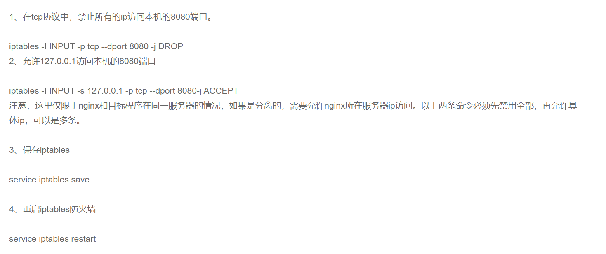


## 禁止root远程登录

- 需要编辑/etc/ssh/sshd_config。
- vim /etc/ssh/sshd_config   找到 PermitRootLogin
- 改为 **PermitRootLogin no**
- 重启  service sshd restart

## unzip解压中文乱码

指定解压编码`unzip -O CP936 xxx.zip`

## firewalld的基本使用

启动：

`service firewalld start`

`systemctl start firewalld`

查看状态：

`service firewalld status`

`systemctl status firewalld`

禁用：

`service firewalld stop`

`systemctl stop firewalld`

配置firewall-cmd

查看版本：`firewall-cmd --version`

更新防火墙规则：`firewall-cmd --reload`

查看所有打开的端口：`firewall-cmd --zone=public --list-ports`

添加一个端口（80端口）：

`firewall-cmd --zone=public --add-port=80/tcp --permanent`

--permanent表示永久生效，没有此参数重启后失效

查看端口是否开放

`firewall-cmd --zone=public --query-port=80/tcp`

删除端口

`firewall-cmd --zone=public --remove-port=80/tcp --permanent`

对特定IP开放端口访问

redis端口设置。允许192.168.142.166访问6379端口

`firewall-cmd --permanent --add-rich-rule="rule family="ipv4" source address="192.168.142.166/32" port protocol="tcp" port="6379" accept"`

```bash
# 禁用服务器里的ping
firewall-cmd --permanent --add-rich-rule='rule protocol value=icmp drop'
将来自192.168.2.0/24网段访问本机80端口的流量转发到本机的22端口
# 流量转发
firewall-cmd --zone=drop --add-rich-rule="rule family=ipv4 source address=192.168.2.0/24 forward-port port=80 protocol=tcp to-port=22"
将来自192.168.2.0/24网段访问本地80端口的流量转发到192.168.2.208主机的22端口
firewall-cmd --zone=drop --add-rich-rule="rule family=ipv4 source address=192.168.2.0/24 forward-port port=80 protocol=tcp to-port=22 to-addr=192.168.2.208"

```

查看配置结果

`firewall-cmd --list-all`

## firewalld开通访问docker端口

1. 配置 docker 容器内允许访问外部网络

   firewall-cmd --permanent --zone=trusted --change-interface=docker0

2. 重启firewalld

   systemctl restart firewalld

3. 检查配置

   firewall-cmd --get-zone-of-interface=docker0

   firewall-cmd --get-active-zones

4. 开放docker服务端口

   firewall-cmd --zone=public --add-port=80/tcp --permanent

5. 重新加载firewalld配置

   firewall-cmd --reload

6. 测试是否通

   telnet  IP  PORT

## firewalld端口转发

1. 配置ip转发功能

   vi /etc/sysctl.conf

   在文本内容中添加：net.ipv4.ip_forward = 1

   保存文件后，输入命令sysctl -p生效

2. 开启防火墙伪装：`firewall-cmd --add-masquerade --permanent` //开启后才能转发端口

3. 添加转发规则：`firewall-cmd --add-forward-port=port=80:proto=tcp:toport=8080:toaddr=192.168.1.1 --permanent`

   （PS：此规则将本机80端口转发到192.168.1.1的8080端口上，配置完–reload才生效）

   比如：访问23306端口，即可访问服务器的3306端口

   `firewall-cmd --add-forward-port=port=23306:proto=tcp:toport=3306:toaddr=127.0.0.1 --permanent`

4. firewall-cmd --reload

## 查看硬盘

`fdisk -l`

## 安装rpm包

rpm -ivh


## 虚拟机服务器桥接网络

查看主机使用的网卡

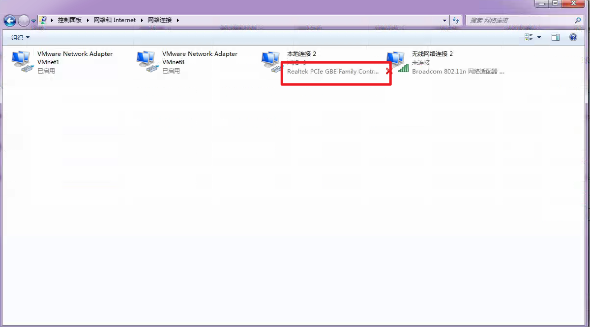

在【虚拟网络编辑器】中，修改桥接模式的网卡


## 修改yum源

目的：

为了下载包的版本与当前服务器一致，如果使用当前服务器的yum源下载包，下载的依赖包版本不一致容易引起问题。

yum源配置版本需要与当前服务器版本一致

操作：

1. 挂载服务器上的镜像

   mkdir /cen7.5

   #1. 如果是把iso复制到硬盘里面，就类似这样执行类似这样的命令：
   mount /home/CentOS-7-XXX.iso /cen7.5
   #2. 否则，如果是挂载了光盘，就类似这样执行类似这样的命令：
   mount /dev/cdrom /cen7.5

2. 配置yum文件

   ```shell
   # 进入yum仓库目录
   cd /etc/yum.repos.d/
   
   #挪作已有的配置（如果不是全新的系统，而是跟其他业务共用一台机器的，请慎重操作）
   mkdir bk
   mv /etc/yum.repos.d/* /etc/yum.repos.d/bk/
   
   # 创建新的yum仓库文件
   vi yum.repo
   #加入以下四行
   [cen7.5]
   name=cen7.5
   baseurl=file:///cen7.5
   gpgcheck=0
   
   #重新加载yum配置，如图3
   yum clean all
   
   #测试能否安装一个简单的命令，如图4
   yum install -y dos2unix
   ```

   

## echo > 和 >>的区别

`echo 'xxx' > index.txt` : 将xxx写入到index.txt，如果文件已存在，则会覆盖写

`echo 'xxx' >> index.txt` 将xxx写入到index.txt，如果文件已存在，则会追加写


## 杀某个服务的进程

`ps -ef|grep mysql|awk '{print $2}'|xargs kill -9`

```shell
port=8030
# 根据端口号去查询对应的PID
pid=$(netstat -nlp | grep :$port | awk '{print $7}' | awk -F"/" '{print $1}');
# 杀掉对应的进程 如果PID不存在,即该端口没有开启,则不执行
if [ -n  "$pid" ]; then
    kill  -9  $pid;
fi

```

杀死某个端口的所有进程 kill -9 $(lsof -i tcp:5000 -t)

## 虚拟机电脑断电重启进入系统失败

客户现场断电后，虚拟机服务器意外关机，等到恢复电源时，虚拟机服务器无法进入系统

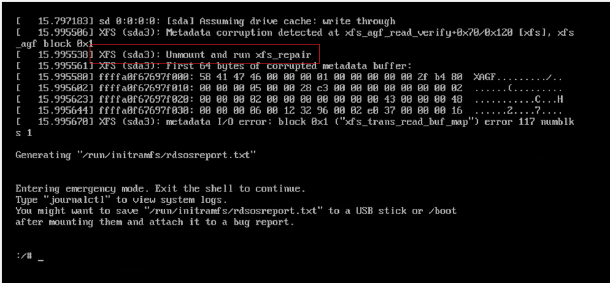

根据问题反馈，sda3挂载盘需要unmount和xfs_repair

### 解决方法

1. 启动服务器时，按E进入单用户模式或救援模式
1. 在linux16开头的那一行后面添加rd.break，ctrl+x进入救援模式

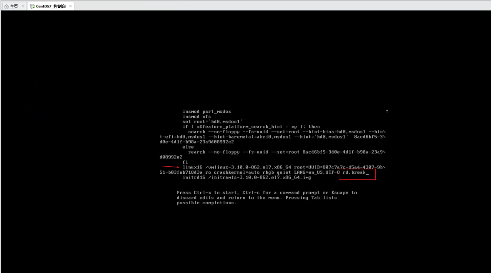

3. 执行umount /dev/sda3 (现象中的sda3出问题)
3. xfs_repair -L /dev/sda3

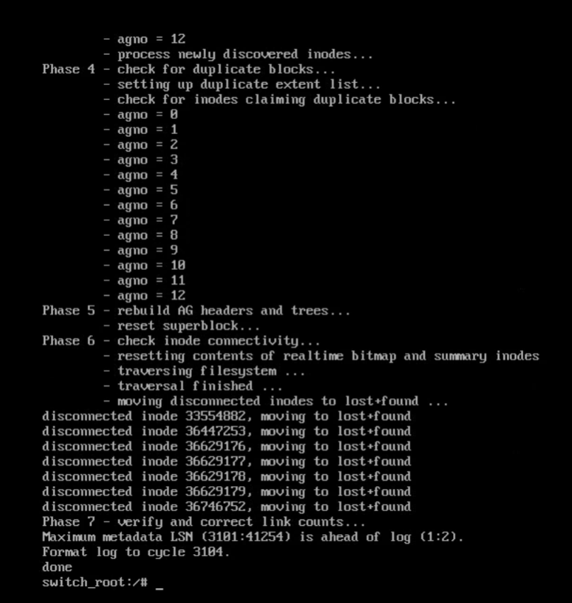

5. 修复完成后，即可重新mount挂载磁盘
5. 重启电脑


## home目录空间分配到根目录下

- 备份并卸载/home目录

  ```text
  # 如果无法删除，执行下面代码
  fuser -km /home  # 终止相关进程
  # 如果/home下有文件要备份，可以在这里先复制到另外的目录（我这里不需要就跳过了）
  $ umount /home/
  $ lvremove /dev/mapper/centos-home
  Do you really want to remove active logical volume centos/home? [y/n]: y
    Logical volume "home" successfully removed
  ```

- 将腾的的空间移动根目录下，这里移走85%

  ```text
  $ lvextend -l +85%FREE /dev/centos/root
    Size of logical volume centos/root changed from 50.00 GiB (12800 extents) to 84.95 GiB (21748 extents).
    Logical volume centos/root successfully resized.
  $ cat /etc/fstab |grep root   # 查看文件类型
  /dev/mapper/centos-root /                       xfs     defaults        0 0
  # 扩充到空间
  $ xfs_growfs /dev/mapper/centos-root
  meta-data=/dev/mapper/centos-root isize=512    agcount=4, agsize=3276800 blks
           =                       sectsz=512   attr=2, projid32bit=1
           =                       crc=1        finobt=0 spinodes=0
  data     =                       bsize=4096   blocks=13107200, imaxpct=25
           =                       sunit=0      swidth=0 blks
  naming   =version 2              bsize=4096   ascii-ci=0 ftype=1
  log      =internal               bsize=4096   blocks=6400, version=2
           =                       sectsz=512   sunit=0 blks, lazy-count=1
  realtime =none                   extsz=4096   blocks=0, rtextents=0
  data blocks changed from 13107200 to 22269952
  
  //查看剩余FREE空间
  vgdisplay
  ```

- 再创建回/home目录

  ```text
  $ lvcreate -l +100%FREE -n home centos
  Logical volume "home" created.
  $ mkfs.xfs  /dev/mapper/centos-home
  meta-data=/dev/mapper/centos-home isize=512    agcount=4, agsize=404224 blks
           =                       sectsz=512   attr=2, projid32bit=1
           =                       crc=1        finobt=0, sparse=0
  data     =                       bsize=4096   blocks=1616896, imaxpct=25
           =                       sunit=0      swidth=0 blks
  naming   =version 2              bsize=4096   ascii-ci=0 ftype=1
  log      =internal log           bsize=4096   blocks=2560, version=2
           =                       sectsz=512   sunit=0 blks, lazy-count=1
  realtime =none                   extsz=4096   blocks=0, rtextents=0
  $ mount  /dev/mapper/centos-home  /home
  # 之前如果有备份的，可以在这时复制回来
  
  
  完成查看
  
  $ df -h
  ```

  


## 打包排除某些目录

tar -zcvf scheduler_20180508.tar.gz     --exclude=scheduler/lib.bk     --exclude=scheduler/logs scheduler


## Centos安装网卡驱动

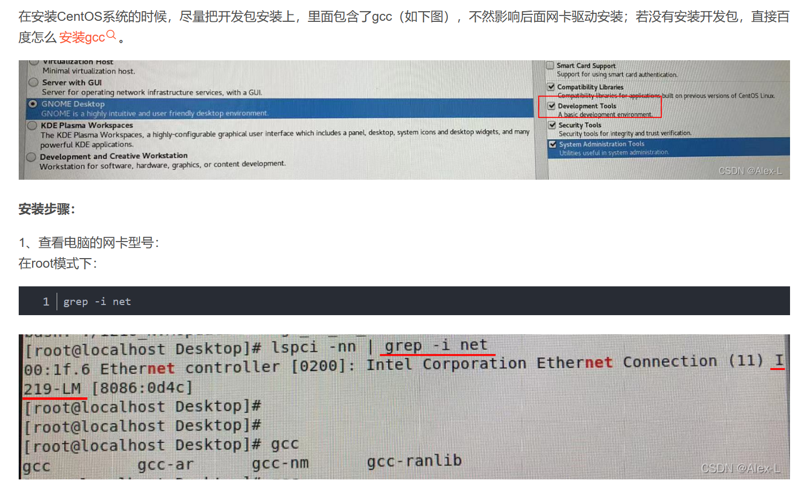


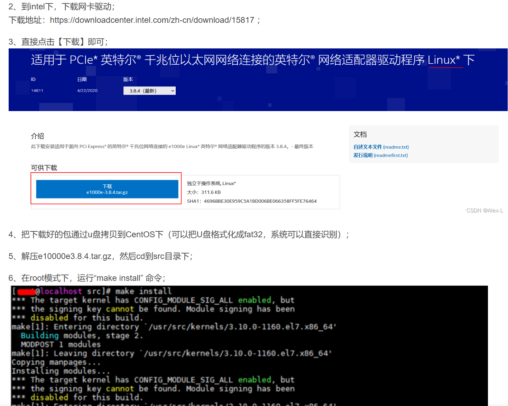

网卡驱动链接：https://downloadcenter.intel.com/zh-cn/download/15817 ；

网卡驱动文件： [e1000e-3.8.4.tar.gz](资源包\e1000e-3.8.4.tar.gz) 

网卡名字修改：https://blog.csdn.net/shallow72/article/details/121831469


## 数据备份超大文件

当附件内容太大时，需要打包拆分为多个小文件

注意：最后需要有个点

`tar -czf - 大文件夹|split -b 2G - 目标路径/大文件夹.tar.gz.`

压缩效果：

大文件夹.tar.gz.aa

大文件夹.tar.gz.ab

大文件夹.tar.gz.ac

例如：

> tar -czf - zygbt/ |split -b 2G  -  /data/local/lib/byrsjPro/zygbt_bk/zygbt.tar.gz.

解压

`cat 大文件夹.tar.gz.* | tar -zxv`

## 查看centos版本号

cat /etc/redhat-release


## 问题大全

### 配置yum源，提示This system is not registered with an entitlement server. You can use subscription-manager to register.

原因：redhat自带的插件subscription-manager。这个插件的作用就是Red Hat Subscription Manager订阅管理器，就是它让你一直register

解决办法：将配置文件subscription-manager.conf中的enable注释掉

```text
vi /etc/yum/pluginconf.d/subscription-manager.conf

[main]
#enabled=1

```

