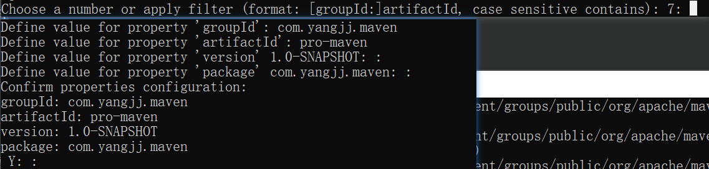
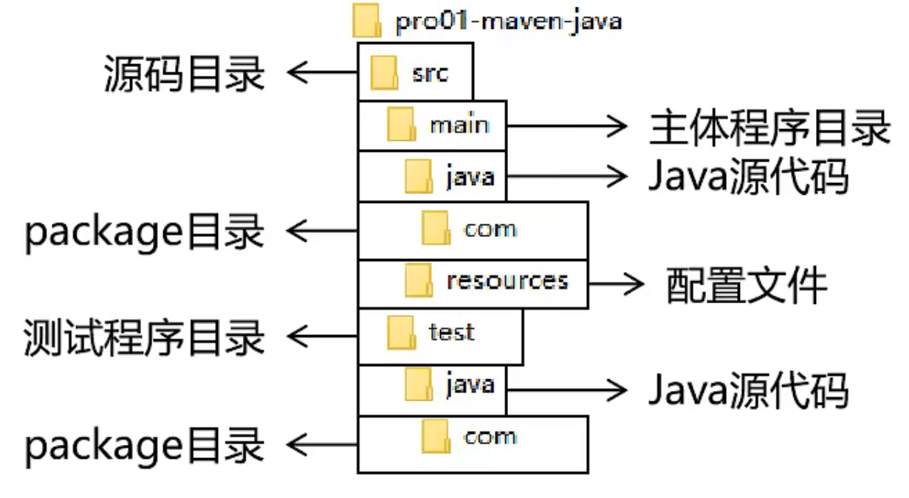

# Maven

作用：包管理

## 配置maven

修改`conf/settings.xml`文件

1. 设置本地仓库

    ```xml
    <!-- 选择本地仓库地址 -->
    <localRepository>d:\java_repository\maven_repo</localRepository>
    ```

2. 配置阿里云仓库镜像(中央仓库)

    ```xml
    <!-- 设置中央仓库 -->
    <mirrors>
        <mirror>
            <id>nexus-aliyun</id>
            <mirrorOf>central</mirrorOf>
            <name>Nexus aliyun</name>
            <url>http://maven.aliyun.com/nexus/content/groups/public</url>
        </mirror>
    </mirrors>
    ```

3. 配置maven工程的基础java版本

    ```xml
    <profiles>
    	<profile>
        	<id>jdk-1.8</id>
            <activation>
            	<activeByDefault>true</activeByDefault>
                <jdk>1.8</jdk>
            </activation>
            <properties>
            	<maven.compiler.source>1.8</maven.compiler.source>
                <maven.compiler.target>1.8</maven.compiler.target>
                <maven.compiler.compilerVersion>1.8</maven.compiler.compilerVersion>
            </properties>
        </profile>
    </profiles>
    ```

4. 配置maven环境变量

    1. 新建系统变量`MAVEN_HOME`:maven安装路径 -->D:\java_repository\apache-maven-3.9.0
    2. PATH路径下添加bin：%MAVEN_HOME%\bin

## Maven中的坐标

### 向量说明

使用三个`向量`在`Maven的仓库`中唯一的定位导一个`jar`包

- `groupId`:公司或组织的id
- `artifactId`:一个项目或者是项目中的一个模块的id
- `version`:版本号

### 三个向量的取值方式

- `groupId`:公司或组织域名的倒序，通常也会加上项目名称
    - 例如：com.atguigu.maven
- `artifactId`:模块的名称，将来作为Maven工程的工程名
- `version`:模块的版本号，根据自己的需要设定
    - 例如： SNAPSHOT表示快照版本，正在迭代过程中，不稳定版本
    - 例如：RELEASE表示正式版本

### 坐标和仓库中jar包的存储路径之间的对应关系

坐标：

```xml
<groupId>javax.servlet</groupId>
<artifactId>servlet-api</artifactId>
<version>2.5</version>
```

坐标对应的jar包在Maven本地仓库的位置：

```text
Maven本地仓库根目录\javax\servlet\servlet-api\2.5\servlet-api-2.5.jar
```


## Maven创建工程

### 使用命令行创建


1. 运行 `mvn archetype:generate`命令

2. 根据提示输出或者回车确认

    输入`groupId`、`artifactId`、`version`【直接回车选择默认值】、`package`【直接回车选择默认值】

    

### 创建web的Maven工程

运行命令

```text
mvn archetype:generate -DarchetypeGroupId=org.apache.maven.archetypes -DarchetypeArtifactId=maven-archetype-webapp -DarchetypeVersion=1.4
```


### pom.xml解读

```xml
<!-- project 标签：根标签 表示对当前工程进行配置、管理-->
<project xmlns="http://maven.apache.org/POM/4.0.0" xmlns:xsi="http://www.w3.org/2001/XMLSchema-instance"
  xsi:schemaLocation="http://maven.apache.org/POM/4.0.0 http://maven.apache.org/xsd/maven-4.0.0.xsd">
 <!-- modelVersion 标签：从Maven 2开始固定4.0.0 -->
    <!-- 代表当前 pom.xml所采用的标签结构 -->
    <modelVersion>4.0.0</modelVersion>
<!--坐标信息： 三个向量 groupId,artifactId,version-->
  <!-- 在本地仓库中安装后对应的路径：
		com\yangjj\maven\pro-maven\1.0-SNAPSHOT\pro-maven-1.0-SNAPSHOT.jar
	-->
  
  <groupId>com.yangjj.maven</groupId>
  <artifactId>pro-maven</artifactId>
  <version>1.0-SNAPSHOT</version>
    
  <!-- packaging 标签：打包方式-->
  <!-- 取值 jar:生成jar包，说明这是一个JAVA工程-->
  <!-- 取值 war:生成war包，说明这是一个Web工程-->
  <!-- 取值 pom:说明这个工程是用来管理其他工程的工程-->
  <!-- 当前工程为父工程，要去管理其他工程，打包方式必须是pom-->
  <packaging>jar</packaging>

  <name>pro-maven</name>
  <url>http://maven.apache.org</url>
	
  <!-- properties 标签：在Maven中定义属性值 -->
  <properties>
    <!-- 在构建过程中读取源码时使用的字符集-->
    <project.build.sourceEncoding>UTF-8</project.build.sourceEncoding>
     <!-- 创建自定义的属性标签-->
     <!--引用方式：${yangjj.spring.version}-->
      <yangjj.spring.version>4.1.0.RELEASE</yangjj.spring.version>
  </properties>
  <!-- dependencies 标签：配置具体依赖信息，可以包含多个dependency子标签 -->
  <dependencies>
    <!-- 配置一个具体的依赖信息-->
    <dependency>
      <!--坐标信息：导入哪个jar包，就配置它的坐标信息即可-->
      <groupId>junit</groupId>
      <artifactId>junit</artifactId>
      <version>4.12</version>
      <!-- scope 标签：配置当前依赖的范围-->
      <scope>test</scope>
    </dependency>
     <dependency>
      <groupId>org.springframework</groupId>
      <artifactId>spring-core</artifactId>
         <!--引用属性表达式设定版本号-->
      <version>${yangjj.spring.version}</version>
      </dependency>
  </dependencies>
</project>

```

### 配置依赖的排除

```xml
<dependency>
      <groupId>org.springframework</groupId>
      <artifactId>spring-core</artifactId>
      <version>4.0.0.RELEASE</version>
      <scope>compile</scope>
    <exclusions>
        <!-- 配置排除项，让commons-logging不要传递到当前工程 -->
    	<exclusion>
            <groupId>commons-logging</groupId>
      		<artifactId>commons-logging</artifactId>
        </exclusion>
    </exclusions>
</dependency>
```


## Maven核心概念：约定的目录结构

开发领域的技术发展趋势：约定大于配置，配置大于编码




## 执行Maven的构建指令

要求：需要在工程根目录（pom.xml目录）下运行

### 清理操作

mvn clean

效果：删除target目录

### 编译操作

主程序编译：mvn compile

测试程序编译：mvn test-compile

主题程序编译结果存放目录：target/classes

测试程序编译结果存放目录：target/test-classes

### 测试操作

mvn test

测试的报告存放目录：target/surefire-reports

### 打包操作

mvn package

mvn clean package(常用)

打包的结果--jar包，存放的目录：target

### 安装操作

mvn install

### 查看依赖

mvn dependency:tree

mvn dependency:list


### 跳过测试

mvn clean install -Dmaven.test.skip=true

## scope依赖范围

可选值：`compile`/`test`/`provided`/system/runtime/import

### compile和test对比

|         | main目录（空间）编译后是否可用 | test目录（空间） | 开发过程（时间） | 部署到服务器（时间）是否打包到包里 |
| :-----: | :----------------------------: | :--------------: | :--------------: | :--------------------------------: |
| compile |              有效              |       有效       |       有效       |                有效                |
|  test   |              无效              |       有效       |       有效       |                无效                |

provided：Tomcat已经有xxx.jar，项目包里就不需要打包xxx.jar，依赖范围就为provided

### 总结

- compile:通常使用的第三方框架的jar包。项目实际运行时真正要用到的jar包

- test:测试过程中使用的jar包，以test范围依赖进来。比如：junit

- provided：服务器上已经有了，就别带了
- 不知道需不需要加，可在`https://mvnrepository.com`查询


## 继承

创建父工程pro-parent

```xml
<project xmlns="http://maven.apache.org/POM/4.0.0" xmlns:xsi="http://www.w3.org/2001/XMLSchema-instance"
  xsi:schemaLocation="http://maven.apache.org/POM/4.0.0 http://maven.apache.org/xsd/maven-4.0.0.xsd">
    <modelVersion>4.0.0</modelVersion>
  <groupId>com.yangjj.maven</groupId>
  <artifactId>pro-parent</artifactId>
  <version>1.0-SNAPSHOT</version>
  <!-- 当前工程为父工程，要去管理其他工程，打包方式必须是pom-->
  <packaging>pom</packaging>

  <name>pro-parent</name>
  <url>http://maven.apache.org</url>

  <properties>
    <project.build.sourceEncoding>UTF-8</project.build.sourceEncoding>
  </properties>
  <dependencies>
    <dependency>
      <groupId>junit</groupId>
      <artifactId>junit</artifactId>
      <version>4.12</version>
      <scope>test</scope>
    </dependency>
  </dependencies>
    <!-- 聚合的配置 -->
   <modules>
    	<module>pro1-children</module>
        <module>pro2-children</module>
        <module>pro3-children</module>
    </modules>
</project>
```

创建子工程pro1-children、pro2-children、pro3-children

```xml
<project xmlns="http://maven.apache.org/POM/4.0.0" xmlns:xsi="http://www.w3.org/2001/XMLSchema-instance"
  xsi:schemaLocation="http://maven.apache.org/POM/4.0.0 http://maven.apache.org/xsd/maven-4.0.0.xsd">
    <modelVersion>4.0.0</modelVersion>
    <parent>
        <groupId>com.yangjj.maven</groupId>
        <artifactId>pro-parent</artifactId>
        <version>1.0-SNAPSHOT</version>
    </parent>
    
    <!--子工程的groupId和父工程的groupId一致，可省略-->
    <groupId>com.yangjj.maven</groupId>
    <artifactId>pro1-children</artifactId>
    <!--子工程的version和父工程的version一致，可省略-->
    <version>1.0-SNAPSHOT</version>


  <name>pro-parent</name>
  <url>http://maven.apache.org</url>

  <properties>
    <project.build.sourceEncoding>UTF-8</project.build.sourceEncoding>
  </properties>
  <dependencies>
    <dependency>
      <groupId>junit</groupId>
      <artifactId>junit</artifactId>
      <version>4.12</version>
      <scope>test</scope>
    </dependency>
  </dependencies>

</project>
```
