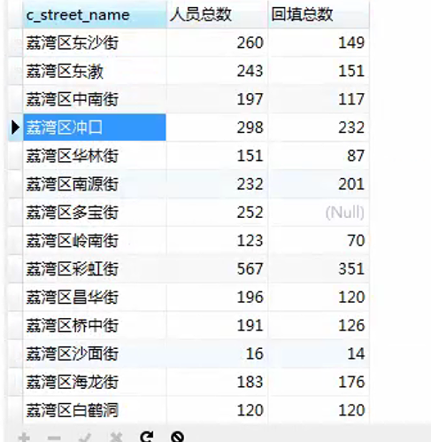

# 知识点

## 基本指令

- 查看配置信息：show variables like "%配置名%";
- 查看进程：show processlist;

## MySQL API

### 字符串类

- `SUBSTRING(field,index,length)`:分割字符串，第一个参数为字段名，第二个参数是从哪里开始截取（从1开始，不是从0开始），第三个参数是截取长度。

    ```text
    查询`person_info`表中，身份证号码的第七位开始截取6位，小于`197112`和性别为女性
    
    `select * from person_info where SUBSTRING(p_Id,7,6) <'197112' and p_sex='女';`
    ```

- `INSTR(string,substring,[start_position,occurence])`:返回一个字符串在另一个字符串中第一次出现的位置索引。（索引从0开始）

    ```text
    表格test_info的company_name值为A有限公司
    INSTR(company_name,"有")
    返回 2
    ```

- `LEFT(string,lenth)`:从左切割字符串，string为字段名，length为切割长度。

    ```text
    表格test_info的company_name值为A有限公司
    LEFT(company_name,INSTR(company_name,"有"))
    返回 A有
    ```
    
- `CONCAT(str1,str2,str3)`:拼接字符串，将str1,str2,str3直接拼接

    ```text
    select CONCAT("aa","bb","cc")
    // aabbcc
    ```

- `CONCAT_WS(seq,str1,str2,str3,..)`:拼接字符串，通过seq拼接str1,str2,str3

    ```text
    select CONCAT_WS(",","aa","bb","cc")
    // aa,bb,cc
    ```


### 时间类

- `CURDATE()`:获取当前日期
- `DATE_SUB(CURDATE(),INTERVAL n HOUR)`:当前时间的26小时前的时间


## 数据库性能优化（配置my.conf）

允许最大连接数
max_connections=200
服务端使用的字符集默认为8比特编码的latin1字符集
character-set-server=utf8
创建新表时将使用的默认存储引擎
default-storage-engine=INNODB
下面几项需要修改，否则在大数据的情况下，会有性能问题
myisam_max_sort_file_size=100G
myisam_sort_buffer_size=512M
key_buffer_size=3G
read_buffer_size=2M
read_rnd_buffer_size=2M
sort_buffer_size=1M
(很重要，需要修改) 
max_allowed_packet=512M
bulk_insert_buffer_size=3G


## 动态新增或更新行记录

### 应用场景

在抓取数据入库时，有时候是需要更新数据，有时候是需要更新数据

正常流程是通过select语句查询该语句是否存在，存在则update，不存在则insert into

### 解决方案

1. 给数据库表相关字段，创建唯一索引，比如社保缴纳表，根据证件号码、申请月份、单位名称三个字段做唯一索引。

    ```sql
    ALTER TABLE 表名 ADD UNIQUE INDEX 自定义索引名称 (
      字段1,
      字段2,
      ...
    );
    
    -- 示例
    ALTER TABLE social_pay_info ADD UNIQUE INDEX insert_key (card_ID,pay_month,company_name);
    ```

    如果创建失败，则代表有重复数据，需要把重复数据删除

    ```sql
    DELETE FROM 表名 WHERE id in (select * from (select min(id) from 表名 group by 字段1,字段2 HAVING count(*) > 1) as a)
    ```

    

2. 使用`INSERT INTO ...ON DUPLICATE KEY UPDATE`语句执行新增入库或者修改操作

    ```sql
    INSERT INTO 表名 (
    	字段1,
        字段2,
        ...
    )
    VALUES 
    	(
    		'值1',
    		'值2',
      	...
    	),
    	(
    		'值3',
    		'值4',
      	...
    	),
    	(
    		'值5',
    		'值6',
      	...
    	)
    ON DUPLICATE KEY UPDATE
    字段1=VALUES(字段1),
    字段2=VALUES(字段2),
    ...
    ;
    ```

### 示例代码

目前有两批数据A和B，其中B中包含A中的部分数据，且不确定是否完全一致，现在需要将数据入库到test_info，同时根据card_ID和apply_date判断，新获取的数据是需要写入还是更新

```sql
-- test_info 表结构
CREATE TABLE test_info (
`id` INT(11) PRIMARY KEY AUTO_INCREMENT,
`card_ID` VARCHAR(255) COMMENT "证件号码",
`apply_date` VARCHAR(255) COMMENT "申请日期",
`state` VARCHAR(255) COMMENT "状态",
`company_name` VARCHAR(255) COMMENT "企业名称",
`remark` VARCHAR(255) COMMENT "备注"
) default charset=utf8;
```

1. 给test_info创建唯一索引

    ```sql
    ALTER TABLE test_info ADD UNIQUE INDEX card_ID_apply_date (
    	card_ID,
    	apply_date
    );
    ```

2. 对A数据进行入库及更新

    ```sql
    INSERT INTO test_info (
    	card_ID,
    	apply_date,
    	state,
    	company_name,
    	remark
    )
    VALUES
    	(
    		'123456787',
    		'202310',
    		'1',
    		'A有限公司',
    		''
    	),
    	(
    		'123456788',
    		'202310',
    		'1',
    		'B有限公司',
    		''
    	),
    	(
    		'123456789',
    		'202310',
    		'1',
    		'C有限公司',
    		''
    	) ON DUPLICATE KEY UPDATE
    	card_ID = VALUES (card_ID),
    	apply_date = VALUES (apply_date),
    	state = VALUES (state),
    	company_name = VALUES (company_name),
    	remark = VALUES (remark);
    ```

3. 对B数据入库及更新

    ```sql
    INSERT INTO test_info (
    	card_ID,
    	apply_date,
    	state,
    	company_name,
    	remark
    )
    VALUES
    	(
    		'123456787',
    		'202310',
    		'0',
    		'A有限公司',
    		'已离职'
    	),
      	(
    		'123456787',
    		'202311',
    		'1',
    		'B有限公司',
    		'新入职'
    	),
    	(
    		'123456788',
    		'202311',
    		'1',
    		'B有限公司',
    		''
    	),
    	(
    		'123456789',
    		'202311',
    		'1',
    		'C有限公司',
    		''
    	) ON DUPLICATE KEY UPDATE
    	card_ID = VALUES (card_ID),
    	apply_date = VALUES (apply_date),
    	state = VALUES (state),
    	company_name = VALUES (company_name),
    	remark = VALUES (remark);
    ```

    > 分析：上述B数据写入，唯一键是card_ID + apply_date
    >
    > card_ID为【123456787】，apply_date为【202310】已存在数据库，第一行为更新操作
    >
    > card_ID为【123456787】，apply_date为【202311】不存在，第二行为插入操作
    >
    > card_ID为【123456788】，apply_date为【202311】不存在，第三行为插入操作
    >
    > card_ID为【123456789】，apply_date为【202311】不存在，第四行为插入操作

## 数据库数据备份	

> 将数据库lcy的表打包到lcy_202104282020.sql文件里
>
> mysqldump -udatae -p123456 lcy > lcy_202104282020.sql  

1、mysqldump 导出指定表

mysqldump  database-u username-ppassword--tables table_name1 table_name2 table_name3>D:\test.sql

2、mysql 数据导出排除指定某个表

mysqldump --database test --ignore-table=test.a > test.sql

3、mysql 数据导出排除指定的多个表--多表间并列

mysqldump --database test --ignore-table=test.a --ignore-table=test.b --ignore-table=test.c > test.sql


## SQL批量更新

```sql
UPDATE `table_name` set `field1`=
CASE
WHEN `field`="" THEN value
WHEN `field`="" THEN value
```

示例代码：

场景：从用户数据表`user_data`的地址提取省份并保存到`省份`的字段中。

LEFT和INSTR用法参考MySQL API

```sql
update user_data set 省份=
CASE
WHEN 地址 like '%省%' THEN LEFT(地址,INSTR(地址,"省")) 
WHEN 地址 like '%自治区%' THEN LEFT(地址,INSTR(地址,"自治区") + 2) 
WHEN 地址 like '%上海市%' or 地址 like '%重庆市%' or 地址 like '%天津市%' or 地址 like '%北京市%' THEN LEFT(地址,3) 
WHEN 地址 like "%行政区%" THEN LEFT(地址,INSTR(地址,"行政区") + 2) 
ELSE ""
END;
```

## 数据库授权

>GRANT ALL PRIVILEGES ON 数据库名.表名 TO '用户名'@'IP' IDENTIFIED BY '密码' WITH GRANT OPTION;   
>FLUSH   PRIVILEGES; 

给所有IP授权root账号，密码为123456，可以操作数据库by_fangyi的所有表格，权限为最高权限
GRANT ALL PRIVILEGES ON by_fangyi.* TO 'root'@'%' IDENTIFIED BY '123456' WITH GRANT OPTION; 

mysql8.0授权问题

`ERROR 1064 (42000): You have an error in your SQL syntax; check the manual that corresponds to your MySQL server version for the right syntax to use near '. to 'username'@'%'' at line 1`

1、新建远程访问用户：create user 'username'@'localhost' identified by 'password';

2、给远程访问用户授权：GRANT ALL PRIVILEGES ON . TO 'username'@'localhost';

3、刷新权限：FLUSH PRIVILEGES;


## 修改数据库密码

```text

#以下密码1233456，仅用于演示，不代表安装包里面的软件，就是使用了此密码！
SET PASSWORD FOR 'root'@'localhost' = password('123456');
use mysql;
UPDATE user SET authentication_string = PASSWORD('123456') WHERE user = 'root';
```

## 进入docker的mysql环境

mysql -udatae -pSd_12345 -h127.0.0.1 -P19999


## sql正则匹配

`REGEXP ""`:返回0或1，0是没有匹配上，1是匹配上，不能提取匹配结果

ex:

```text
select "A有限公司" REGEXP "A"
// 0


// 查找企业名称符合正则表达式的数据
select * from test_info where company_name REGEXP "有限";

// 查找企业名称不符合正则表达式的数据
select * from test_info where company_name REGEXP "有限"=0;
```


## ODBC

ODBC是开放式数据库连接，与JDBC一样，都是一个API接口，充当客户端应用程序和服务端数据库之间的接口

ODBC帮助应用程序从数据库访问数据。用任何语言编写的应用程序都可以使用ODBC访问不同类型的数据库。

ODBC提供了ODBC驱动程序，可以将任何语言编写的应用程序请求转换为数据库可以理解的语言。

能够以统一的方式处理所有的数据库。

### JDBC与ODBC的区别

1. ODBC是早期的数据库规范，开放数据库连接。

    JDBC是专门面向JAVA的数据库连接支持。

2. JDBC只能应用于java语言开发的程序，可以在任意平台上运行。

    ODBC可以应用于任何语言，但仅可以在window上运行。 


# 代码片段

## 动态新增或更新行记录（python生成sql）

```python
def 新增或修改行记录(表名称,数据字典,connect):
    """
    connect：数据库对象
    """
    cursor = connect.cursor()
    keys = ','.join(数据字典.keys())
    values = ','.join(['%s']*len(数据字典))
    update = ','.join([f'{key}=%s' for key in 数据字典])
    sql = f'insert into {表名称}({keys}) values({values})'+'on duplicate key update '+ update
    flag = None
    try:
        cursor.execute(sql,list(数据字典.values())*2)
        flag = True
    except Exception as e:
        flag = False
        print(f"新增或修改行记录出现异常:{e}")
    finally:
        # 根据需求是否关闭数据库对象
        #connect.close()
        return flag
```

## 高阶操作-多个查询结果拼接

```sql
select 
a.字段1,
b.字段1,
a.字段2,
...
from 
() as a
LEFT JOIN
() as b
on a.共同字段=b.共同字段;	

注意：两个表都需要给个命名，以及查询字段都需要以  命名.字段  的方式写入
```


```sql
将两个查询结果拼接一起
SELECT 
a.c_street_name,
a.人员总数 as "人员总数",
b.回填总数 as "回填总数"
from 
(
SELECT 
c_street_name,
count(c_street_name) as "人员总数"
from person_info
LEFT JOIN company_info on person_info.p_c_apply_num=company_info.c_apply_num
WHERE (c_street_name!= "黄花街" or c_street_name!= "白云街") and c_apply_num like "%2022-1%"
GROUP BY c_street_name
) as a
LEFT JOIN
(
SELECT
c_street_name,
count(c_street_name) as "回填总数"
from person_info
LEFT JOIN company_info on person_info.p_c_apply_num=company_info.c_apply_num
WHERE p_back_state!=0 and c_apply_num like "%2022-1%"
GROUP BY c_street_name
) as b
ON a.c_street_name = b.c_street_name
;
```




## 查询数据并写入另一个表

`INSERT INTO A SELECT * FROM B WHERE 条件;`

示例：将`EX_ZHENGWU_145_YQZDRYQRB`表，筛选创建时间大于26小时前的数据，写入`EX_ZHENGWU_145_YQZDRYQRB_20220417`表中


`INSERT INTO EX_ZHENGWU_145_YQZDRYQRB_20220417 SELECT * FROM EX_ZHENGWU_145_YQZDRYQRB   where DATE_SUB(CURDATE(),INTERVAL 26 HOUR) <= EX_ZHENGWU_145_YQZDRYQRB.S_CREATION_TIME; `

## 根据已存在的表格创建新表（不包含数据）

仅复制表格的字段、结构，不会复制表格的数据到新表中

`create table new_table like old_table`

示例：

`create table EX_ZHENGWU_145_YQZDRYQRB_20220417 like EX_ZHENGWU_145_YQZDRYQRB;`


# 问题集

## Mysql服务启动失败

失败原因：磁盘空间不足，重复入库导致mysql表结构崩溃

### 解决方案一

1. 在/etc/my.cnf中添加配置`innodb_force_recovery=6`

2. 重启mysql服务，此时数据库的数据处于只读状态。

3. 备份数据库的数据:`mysqldump -hlocalhost -uroot -p123456 lcy > lcy.sql`

4. 到本地数据库中测试导出数据是否可用。

5. 重装mysql

    卸载mysql

    1. `rm -f /var/log/mysqld.log`

    2. `yum remove mysql mysql-server mysql-libs`

    3. `rm -rf /var/lib/mysql`

    4. ```text
        rpm -qa | grep -i mariadb
        rpm -e --nodeps mariadb-libs
        rpm -qa | grep -i mysql
        rpm -qa|grep -i mysql|xargs rpm -e --nodeps
        ```

6. 创建好数据库

7. 导入备份好的数据：`mysql -hlocalhost -uroot -p123456 byrsjyzx < byrsjyzx.sql`

### 解决方案二

挪走ib_logfile0和ib_logfile1两个文件

\#进入你mysql的安装目录

cd /home/mysql

mv ib_logfile0 ib_logfile0_bak

mv ib_logfile1 ib_logfile1_bak

重启mysql服务

systemctl start mysqld
