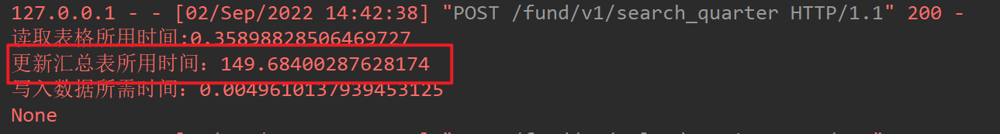
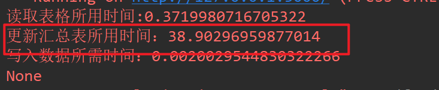

# 基础知识

## 多线程

### wait()阻塞主线程进行

```python
from concurrent.futures import ThreadPoolExecutor, wait, ALL_COMPLETED, FIRST_COMPLETED
import time

# 参数times用来模拟网络请求的时间
def get_html(times):
    time.sleep(times)
    print("get page {}s finished".format(times))
    return times

executor = ThreadPoolExecutor(max_workers=2)
urls = [3, 2, 4] # 并不是真的url
all_task = [executor.submit(get_html, (url)) for url in urls]
wait(all_task, return_when=ALL_COMPLETED)
print("main")
# 执行结果 
# get page 2s finished
# get page 3s finished
# get page 4s finished
# main
```

`wait`方法接收3个参数，等待的任务序列、超时时间以及等待条件。等待条件`return_when`默认为`ALL_COMPLETED`，表明要等待所有的任务都结束。可以看到运行结果中，确实是所有任务都完成了，主线程才打印出`main`。等待条件还可以设置为`FIRST_COMPLETED`，表示第一个任务完成就停止等待。

### 并发与并行

**并发**:在同一时间段内多个任务同时互相交替执行，指的是多线程

**并行**:在同一时刻，多个任务同时执行，指的是多进程

### 同步与异步，阻塞与非阻塞

同步，多个任务按照设定的顺序依次执行，一个执行完才能够执行下一个

异步（async），多个任务不按顺序执行，可同时执行。

阻塞 (wait)：任务停止不再往下执行，调用者阻塞任务。

非阻塞：任务继续往下执行。

### 线程安全

多个线程操作同一个对象，A线程还没有操作完该对象，B线程就对该对象操作，造成最终结果出错，可以添加互斥锁，保证每个线程在操作该对象时，其他线程不能操作，但性能也会降低。

### 死锁的概念

若干个线程竞争资源，等待其他资源释放锁，但每个线程都不释放锁，导致阻塞，无法继续往下执行。

### GIL全局解释锁

GIL是一个互斥锁，作用时确保在解释器级别上，同时只有一个线程可以执行python字节码，因为cPython解释器种的内存管理并不是线程安全的，GIL的引入可以避免多线程同时操作python对象引起的内存管理问题，但也会对python多线程的性能有影响


在同一个时间内，python只能运行一个线程，这也大大影响python多线程的性能。只有线程获取到这个GIL解释锁

## 装饰器

装饰器不需要传参数

```python
import time 
def timer(func):
    def function(*args,**kwargs):
        start = time.time()
        func(*args,**kwargs)
        end = time.time()
        print("所花时间：",(end - start))
    return function


@timer
def test1():
    time.sleep(1)
    print("test1")
    

test1()
"""
打印如下：
test1
所花时间： 1.0114130973815918
"""

```


需要传参数时，需要再套一层函数

```python
# 装饰器
from functools import wraps

ls = []


def addRecord(data={}):
    def record_wrapper(func):
        @wraps(func)
        def function(*args, **kwargs):
            print(func.__name__ + " was called")
            result = func(*args, **kwargs)
            ls.append(data.get("msg", "fail"))
		    return result
        return function

    return record_wrapper


@addRecord({"msg": "success"})
def test1(a):
    print("test1:", a)


test1("ready")
print(ls)


"""
结果：

test1 was called
test1: ready
['success']
"""
```

**在修饰的函数里修改装饰器的参数值**

```python
# 装饰器
def addActionRecord(function):
    @wraps(function)
    def inner(*args, **kwargs):
        result = function(*args, **kwargs)
        try:
            kwargs = kwargs.get("data", kwargs)
            obj = ActionRecordInfo()
            obj.apply_num = kwargs.get("apply_num", "")

            db.session.add(obj)
        except Exception as e:
            logging.error("addActionRecord异常:" + str(e))
        return result

    return inner

# 函数
@addActionRecord
def modifiedFundState(**kwargs):
    kwargs = kwargs.get("data", kwargs)
    kwargs["description"] = description
    kwargs["remark"] = remark

## 调用装饰器函数
# 使用data变量代替kwargs,修改data的参数值，即可修改kwargs的参数值
data = {
    **kwargs
}
modifiedFundState(data=data)

```

## python命令行


### 导出python安装的包

`pip freeze > requirements.txt`

### 下载requirements.txt包

`python.exe -m pip install -r requirements.txt -i https://pypi.tuna.tsinghua.edu.cn/simple/`

### linux安装python

1. 下载python3.x版本的tgz包（以python3.7.9为例）
2. 解压：`tar -xf Python-3.7.9.tgz`
3. 进入 `Python-3.7.9`目录
4. 运行`./configure --prefix=/usr/local/lib/python37`
5. 编译安装:`make && make install`


## Flask

### Flask-sqlalchemy 批量增删改查

#### 循环单次增加（效率慢，不推荐）

```python
data = [
    {
        "name":"xx",
        "age":15
    },
    {
        "name":"yy",
        "age":16
    },
    {
        "name":"zz",
        "age":17
    },
]
for item in data:
    obj = SummaryInfo()
    obj.name = item.name
    obj.age = item.age
    db.session.add(obj)
db.session.commit()
```

#### 批量添加（推荐）

```python
data = [
    {
        "name":"xx",
        "age":15
    },
    {
        "name":"yy",
        "age":16
    },
    {
        "name":"zz",
        "age":17
    },
]
db.session.bulk_save_objects(
    [
        SummaryInfo(**item) for item in data
    ]
)
db.session.commit()
```

#### 循环单次查询

场景：需要查询列表里的数据，如果存在数据，则修改数据里的值

```python
data = [
    {
        "name":"xx",
        "age":15
    },
    {
        "name":"yy",
        "age":16
    },
    {
        "name":"zz",
        "age":17
    },
]
for item in data:
    res = db.session.query(SummaryInfo).filter(SummaryInfo.name == item.name,
                                               SummaryInfo.age == age).first()
    if res:
        res.name = "xxx"
        res.age = 20
db.session.commit()
```


#### 批量查询（推荐）

```python
from sqlalchemy import and_, text, or_
data = [
    {
        "name":"xx",
        "age":15
    },
    {
        "name":"yy",
        "age":16
    },
    {
        "name":"zz",
        "age":17
    }
]

temp_list = []
for item in data:
    temp_list.append(and_(
    	SummaryInfo.name == item.name,
        SummaryInfo.age == item.age
    ))
res_list = db.session.query(SummaryInfo).filter(or_(*temp_list)).all()
for i in res_list:
    for j in data:
        if i.name == j.get("name","") and i.age == j.get("age",""):
            i.name = "xx"
            i.age = 20
db.session.commit()

```


原始代码

```python
@staticmethod
    @addIORecord
    def fundUpdateSummaryInfo(*args, **kwargs):
        # todo: 更新表格数据到汇总表
        error = ""
        df = kwargs.get("df", None)
        df.fillna('', inplace=True)
        project_name = kwargs.get("project_name", "")
        apply_date = kwargs.get("apply_date", "")
        file_path = kwargs.get("file_path", "")
        file_type = kwargs.get("file_type", "")
        author = kwargs.get("author", "")
        fund_state = kwargs.get("fund_state", -1)
        fail_data_list = []
        for index, data in df.iterrows():
            try:
                if index >= 7 and index <= (len(df) - 5):
                    row = data.tolist()

                    bank_num = row[1]
                    name = row[5]
                    refund_fund = row[7]
                    actual_amount = row[10]
                    status_description = row[13]
                    if status_description == '处理成功':
                        fund_state = 1
                    elif status_description == '处理失败':
                        fund_state = 2
                    remark = row[15]

                    # 数据入库
                    res = db.session.query(SummaryInfo).filter(SummaryInfo.account_name == name,
                                                               SummaryInfo.bank_number == bank_num,
                                                               SummaryInfo.apply_date == apply_date,
                                                               SummaryInfo.project_name == project_name).first()
                    if res and res.fund_state in [0, 1, 2, 9]:
                        DBSessionAction.setIsDelete(apply_num=res.apply_num,is_deleted=0,status=1)
                        res.fund_state = fund_state
                        res.remark = remark
                    else:
                        fail_data_list.append(row)


            except Exception as e:
                error = "插入退票回单信息错误：" + str(e)
                logging.error(error)
                # return error
        return fail_data_list, error

```


批量查询（修改第一版后的代码）

```python
@staticmethod
    @addIORecord
    def fundUpdateSummaryInfo(*args, **kwargs):
        # todo: 更新表格数据到汇总表
        error = ""
        df_data = kwargs.get("df_data", None)
        project_name = kwargs.get("project_name", "")
        apply_date = kwargs.get("apply_date", "")
        file_path = kwargs.get("file_path", "")
        file_type = kwargs.get("file_type", "")
        author = kwargs.get("author", "")
        fund_state = kwargs.get("fund_state", -1)
        fail_data_list = []
        start = time.time()
        temp_list = []
        for index, data in enumerate(df_data):
            try:

                bank_num = data["bank_num"]  # 银行账号
                name = data["account_name"]  # 姓名
                temp_list.append(and_(
                    SummaryInfo.account_name == name,
                    SummaryInfo.bank_number == bank_num,
                    SummaryInfo.apply_date == apply_date,
                    SummaryInfo.project_name == project_name
                ))
            except Exception as e:
                error = "插入退票回单信息错误：" + str(e)
                logging.error(error)
        # 批量数据查询
        data_list = db.session.query(SummaryInfo).filter(or_(*temp_list)).all()
        for iItem in data_list:
            for jItem in df_data:
                status_description = jItem["status_description"]  # 状态说明
                remark = jItem["remark"]  # 备注
                if status_description == '处理成功':
                    fund_state = 1
                elif status_description == '处理失败':
                    fund_state = 2
                if iItem.account_name == jItem.get("name","") and iItem.bank_number == jItem.get("bank_num",""):
                    if iItem.fund_state in [0, 1, 2, 9]:
                        DBSessionAction.setIsDelete(apply_num=iItem.apply_num, is_deleted=0, status=1)
                        iItem.fund_state = fund_state
                        iItem.remark = remark
                    else:
                        fail_data_list.append(jItem)
                # return error
        end = time.time()
        logging.error(f"更新汇总表所用时间：{end - start}")
        return fail_data_list, error
    
"""
select * from summary_info where (account_name,bank_number,apply_date,project_name) in (
("xxx","2022100","2022-1","高校毕业生基层就业补贴"),
("xxx","2022100","2022-1","高校毕业生基层就业补贴"),
("xxx","2022100","2022-1","高校毕业生基层就业补贴"),
...
)
"""
```


效率比较

源代码效率：



批量查询后效率提升：



### Flask生命周期

```python
bp = Blueprint('api', __name__)

# before_request只适用于当前蓝图的处理请求
@bp.before_request
def identify_role():
    reg = ResMsg()
    logging.error("api before_request")


# before_app_request 适用于全局app的处理请求，处理顺序根据注册蓝图顺序
@bp.before_app_request
def test():
    logging.error("api before_app_request")
    
# before_app_first_request 当全局app调用第一个接口时执行
@bp.before_app_first_request
def test():
    logging.error("api before_app_first_request")
```

### Flask自动生成接口文档

1. 下载：`pip install flask-docs`

2. 配置：

    ```python
    from flask import Flask
    from flask_docs import ApiDoc
    
    app = Flask(__name__)
    
    ApiDoc(
        app,
        title="Sample App",
        version="1.0.0",
        description="A simple app API",
    )
    
    ```

    

    相关的配置

    ```python
    # 使用 CDN
    # app.config["API_DOC_CDN"] = True
    
    # 禁用文档页面
    # app.config["API_DOC_ENABLE"] = False
    
    # SHA256 加密的授权密码，例如这里是 admin
    # echo -n admin | shasum -a 256
    # app.config["API_DOC_PASSWORD_SHA2"] = "8c6976e5b5410415bde908bd4dee15dfb167a9c873fc4bb8a81f6f2ab448a918"
    
    # 允许显示的方法
    # app.config["API_DOC_METHODS_LIST"] = ["GET", "POST", "PUT", "DELETE", "PATCH"]
    
    # 自定义 url_prefix
    # app.config["API_DOC_URL_PREFIX"] = "/docs/api"
    
    # 需要排除的 RESTful Api 类名
    # app.config["API_DOC_RESTFUL_EXCLUDE"] = ["Todo"]
    
    # 需要显示的 Api 蓝图名称
    # app.config["API_DOC_MEMBER"] = ["api", "platform"]
    
    # 需要排除的子成员 Api 函数名称
    # app.config["API_DOC_MEMBER_SUB_EXCLUDE"] = ["delete_data"]
    
    ```

3. 书写markdown文档

    >@@@
    >在注释结尾用 “@@@” 包含 markdown 格式文档
    >@@@

```python
@common.route("/api/test")
def index():
    """
    @@@
    测试接口
    ```json
    {
    "data":[],
    "code":200,
    "msg":""
    }
```

    @@@
    """
    
    return jsonify({"data":[]})

```
4. 查看文档

    `http://127.0.0.1:端口号/docs/api/`

```


## 数据库

### SQLite操作

```python
import sqlite3
class SQLiteAction(object):
    def __init__(self,filePath):
        self.__conn = sqlite3.connect(filePath)
        self.__cursor = self.__conn.cursor()

    def select_data(self, sql):
        """
        查询数据
        :return:
        """
        self.__cursor.execute(sql)
        head = self.__cursor.description
        data = self.__cursor.fetchall()
        final_data = []
        for _i in data:
            dic = {}
            for _index, _j in enumerate(_i):
                dic[head[_index][0]] = _j
            final_data.append(dic)
        return final_data

    def execute(self,sql):
        self.__cursor.execute(sql)


    def update_data(self, sql):
        try:
            self.__cursor.execute(sql)


        except Exception as error:
            logging.error(f"更新数据异常：{str(error)}")
            self.__conn.rollback()

    def commit_data(self):
        self.__conn.commit()

```


创建自增id的表格

`CREATE TABLE company_info(id INTEGER  primary key AUTOINCREMENT,pid integer )`


sqlite特性

sqlite3删除表数据后文件没有变小

## 单例模式

```python
class PersonMetaclass(type):
    """单例模式"""
    __instance = None

    def __call__(cls, *args, **kwargs):
        if not cls.__instance:
            cls.__instance = super().__call__(*args, **kwargs)
        return cls.__instance


class RedisAction(object, metaclass=PersonMetaclass):
    def __init__(self, host, port=6379, db=0, password=None):
        # decode_responses: True:返回字符串；False：返回字节
        self.__redis = redis.StrictRedis(host=host, port=port, db=db, password=password, decode_responses=True)

    def get_redis_obj(self):
        return self.__redis

    @testUtils
    def test(self):
        # print(self.__redis.exists("name"))  # 判断一个键是否存在， 结果：1
        # print(self.__redis.delete("name"))  # 删除一个键，结果：1
        # print(self.__redis.type("name"))  # 判断数据类型，，结果：string
        # print(self.__redis.expire("name", 10))  # 设置超时时间，结果：True
        # print(self.__redis.ttl("name"))  # 获取键的过期时间，单位为秒，-1表示永久不过期，-2表示键已过期
        print(self.__redis.move("name", 0))  # 将键移动到其他数据库

    @testUtils
    def setDictList(self, name, ndata):
        res = self.__redis.set(name, json.dumps(ndata, ensure_ascii=False))
        if res:
            logging.error("设置成功")
        else:
            logging.error("设置失败")

    @testUtils
    def getDictList(self, name):
        data = self.__redis.get(name)
        return json.loads(data)

```


## typing

作用：对函数的变量参数类型和结果返回类型做注释，起类型注解的功能。

typing是python的标准包，提供了很多种类型和泛型，提高代码可读性、可维护性和可靠性。

### typing常用类型

int,str,bool,str,bytes不需要import typing

Any,Union,Tuple,List 等需要import typing

基本类型：

- int: 整数类型
- float: 浮点数类型
- bool: 布尔类型
- str: 字符串类型
- bytes: 字节类型
- Any: 任意类型
- Union: 多个类型的联合类型，表示可以是其中任意一个类型
- Tuple: 固定长度的元组类型
- List: 列表类型
- Dict: 字典类型，用于键值对的映射

泛型：

- Generic: 泛型基类，用于创建泛型类或泛型函数
- TypeVar: 类型变量，用于创建表示不确定类型的占位符
- Callable: 可调用对象类型，用于表示函数类型
- Optional: 可选类型，表示一个值可以为指定类型或None
- Iterable: 可迭代对象类型
- Mapping: 映射类型，用于表示键值对的映射
- Sequence: 序列类型，用于表示有序集合类型
- Type:泛型类，用于表示类型本身

ex1:

```python
from typing import List
 
def func(a: int,b: str) -> List[int or str]:# 使用or关键字表示多种类型
    list1 = []
    list1.append(a)
    list1.append(b)
    return list1

l = func(3, "aa")
print(l) # [3, 'aa']
```

ex2:

定义一个不确定类型的占位符T，用作函数的形参，函数的返回值是str类型

```python
import typing

T=typing.TypeVar('T',int,float,str)

def foo(name:T)->str:
    return str(name)

print(foo(2.012)) # 2.012
print(foo(35)) # 35
print(foo("hahaha")) # hahaha
```


## 单元测试

### 单元测试的意义

单元测试，对任何语言的开发者都是非常有必要的，自己开发的项目时隔数月后再回来调试自己的复杂程序时，修改和调试是非常的痛苦的，而单元测试可以帮助我们很快的定位到问题的位置，出现问题的模块和单元。


### 如何单元测试

下载pytest，`pip install pytest`

> 注意事项：
>
> 1. 文件名必须以test_开头
> 2. 测试类必须以Test开头，并且不能有init方法
> 3. 测试方法必须以test开头

简单测试用例

```python
# test_module1
import pytest


class TestDemo:

    def test_demo1(self):
        print("bbb")
        assert 11 == 12


if __name__ == '__main__':
    pytest.main()
```

### pytest.main()的相关参数

```python
if __name__ == '__main__':
    pytest.main(["-s"])
```

main()方法的常见参数

- `-s`:显示程序中的print/logging等内容，输出到控制台
- `-v`:丰富信息模式，输出更详细的用例执行信息
- `-q`:安静模式，不输出环境信息
- `-x`:出现一条测试用例失败就退出测试
- `-k`:可以使用and、not、or等逻辑运算符，匹配范围（文件名、类名、函数名）

```python
# 执行具体的某一测试文件
pytest 脚本名称.py

# 执行所有的测试文件
pytest -sv

# 执行指定包或者文件夹下面的所有文件
pytest -sv 包名或文件夹名

# 执行测试用例名称包含phone的所有用例
pytest -k phone test_demo.py

# 执行测试用例名称 不包含phone的所有用例
pytest -s -k "not phone" test_demo.py

# 执行测试用例名称包含 phone 或 login 的所有用例
pytest -s -k "phone or login" test_demo.py

# 运行.py模块里面,测试类里面的某个方法
pytest test_demo.py::TestClass::test_one
```

1）运行**所有用例**，以test_开始的用例

```text
import pytest
def test_one():
	pass
	
if __name__ == '__main__':
    pytest.main()
```

2）运行指定**目录的用例**

```text
import pytest
def test_one():
	pass
	
if __name__ == '__main__':
    pytest.main(["./testcase/product"])
```

3）运行指定**py的用例**

```text
import pytest
def test_one():
	pass
	
if __name__ == '__main__':
    pytest.main(["./testcase/product/test_add_product.py"])
```

4）运行指定py的测试**类用例**

```text
python
import pytest
def test_one():
	pass
	
if __name__ == '__main__':
    pytest.main(["./testcase/product/test_add_product.py::TestProduct"])
```

5）运行指定py的测试类中的**用例**

```text
import pytest
def test_one():
	pass
	
if __name__ == '__main__':
    pytest.main(["./testcase/product/test_add_product.py::TestProduct::test_add_01"])
```

### 用例执行状态

- **passed**：测试通过，一般使用 **.** 来表示
- **failed**：断言失败，一般使用 **F** 来表示
- **error**：代码错误，一般使用 **E** 来表示


# 问题集

## Pandas

### pandas读取的Series的值是NAN，如何转成None

```python
# numpy和Series对象的NaN
data[pd.isna(data)] = None
return data.tolist()  # DataFrame没有tolist()函数，需要np.array()转成ndarray对象
```

## Python运行报错 

### 报错是：ImportError: libbz2.so.1.0: cannot open shared object file: No such file or directory

解决方法：

cd /usr/lib64

ll libbz2* （可省略）

ln -s libbz2.so.1 libbz2.so.1.0


# 常用代码片段

## 查询IP

本地IP

```python
获取本地IP
import socket
def get_host_ip():
    """
    查询本机ip地址
    :return:
    """
    try:
        s=socket.socket(socket.AF_INET,socket.SOCK_DGRAM)
        s.connect(('8.8.8.8',80))
        ip=s.getsockname()[0]
    finally:
        s.close()
    return ip

IP = get_host_ip()
if "10.128.23" in IP:
    HOST = "10.128.185.99"
else:
    HOST = "192.168.210.9"
```


外网IP

```python
import requests
url = "http://ip-api.com/json/{}".format(addr)
response = requests.get(url)
data = response.json()
```

## 异或加密（对称加密）

```python
import json
import base64 as b64
string = json.dumps({
    "isLogin": True,
    "isAdmin": False,
    "username": "yangjunjian"
})
secret_key = "asd123EsCAdoasnd123azxc123a1dE"


def xor_encrypt(tips, key):
    ltips = len(tips)
    lkey = len(key)
    secret = []
    num = 0
    for each in tips:
        if num >= lkey:
            num = num % lkey
        secret.append(chr(ord(each) ^ ord(key[num])))
        num += 1

    return b64.b64encode("".join(secret).encode()).decode()


def xor_decrypt(secret, key):
    tips = b64.b64decode(secret.encode()).decode()

    ltips = len(tips)
    lkey = len(key)
    secret = []
    num = 0
    for each in tips:
        if num >= lkey:
            num = num % lkey
        secret.append(chr(ord(each) ^ ord(key[num])))
        num += 1

    return "".join(secret)

xor = xor_encrypt(string,secret_key)
print(xor)
print(xor_decrypt(xor,secret_key))

```

## Flask异步处理耗时任务

使用ThreadPoolExecutor线程池

```python
# -*- coding: utf-8 -*-
from flask import Flask, jsonify
from time import sleep
from concurrent.futures import ThreadPoolExecutor

# 创建线程池执行器
executor = ThreadPoolExecutor(5)
app = Flask(__name__)

# 耗时任务是否完成（推荐redis存储 唯一标识）
gl = True


def getPersonPartOfInfo(card_num):
    """获取人员部分详情信息"""
    try:
        rd = RecatchData(card_num)
        rd.getUnemploymentInfo()
        return True
    except Exception as e:
        logging.error(e)
        return False


@app.route("/api/v1/getPersonPartOfInfo", methods=["get"])
def getPersonParty():
    card_ID = request.values.get("card_ID", None)
    result = executor.submit(getPersonPartOfInfo, card_ID)  # 处理耗时任务
	# done方法用于判定某个任务是否完成
	print(result.done())
# cancel方法用于取消某个任务,该任务没有放入线程池中才能取消成功
	print(result.cancel())
	time.sleep(4)
	print(result.done())
	# result方法可以获取task的执行结果
	print(result.result())
    return jsonify({"isOK": 1})

```

## Requests跳过https验证的warning警告

requests.packages.urllib3.disable_warnings()

## 解压压缩包

```python
import zipfile
import os
import shutil


def unzipFile(abs_path, file_name):
    """

    :param abs_path: 绝对路径
    :param file_name: 文件名
    :return:
    """
    file_ls = []
    new_abs_path = abs_path.replace("/", os.sep)
    # 创建一个临时文件
    temp = os.path.join(new_abs_path, ".temp")
    if not os.path.exists(temp):
        os.makedirs(temp)
    z = zipfile.ZipFile(os.path.join(new_abs_path, file_name))
    for file in z.namelist():
        if not file.endswith("/"):
            z.extract(file, temp)
    z.close()
    for filePath, fileName, fileNames in os.walk(temp):
        for fName in fileNames:
            if not os.path.basename(fName).startswith("."):
                path = os.path.join(filePath, fName)
                if not os.path.exists(os.path.join(new_abs_path, fName)):
                    shutil.copyfile(path, os.path.join(new_abs_path, fName))  # 拷贝文件
                    file_ls.append(fName)
    shutil.rmtree(temp)  # 删除有文件的文件夹
    return file_ls


if __name__ == '__main__':
    list_str = "['/bc3a93bdd5dabaeccc2fd645c72b6affb7561383/80c716694e208aae29392629a73cae48a5682fca.JPG', '/bc3a93bdd5dabaeccc2fd645c72b6affb7561383/d8ed7f6db0e318dbfbdd6c06ecb4cd542efaa442.ZIP']"
    ls = eval(list_str)
    for item in ls:
        if item.lower().endswith(".zip"):
            name = os.path.basename(item)
            f_list = unzipFile("./", name)
            print(f_list)

```

## excel转pdf

方法1：

```python
import xlwings as xw
import pythoncom
pythoncom.CoInitialize()  # 必须添加，否则报错
xlApp = xw.App(visible=False, add_book=False)
wb = xlApp.books.open(self.target_excel_path)
wb.to_pdf(self.target_pdf_path)
wb.close()
xlApp.quit()

```

方法2：

```python
from win32com.client import DispatchEx
pythoncom.CoInitialize() # 必须添加，否则报错，
xlApp = DispatchEx("Excel.Application")
xlApp.Visible = False
xlApp.DisplayAlerts = 1
books = xlApp.Workbooks.Open(self.target_excel_path, False)
books.ExportAsFixedFormat(0, self.target_pdf_path)
books.Close(False)
xlApp.Quit()

```

## 数字金额转大写金额

```python
def switch_upper_digit(num):
    num = str(Decimal(num).quantize(Decimal("0.00")))
    if num[0] == "-":
        num = num[1:]
    m = {"0": "零", "1": "壹", "2": "贰", "3": "叁", "4": "肆", "5": "伍", "6": "陆", "7": "柒", "8": "捌", "9": "玖"}
    n = {0: "", 1: "拾", 2: "佰", 3: "仟", 4: "万", 5: "拾", 6: "佰", 7: "仟", 8: "亿"}
    li = num.split(".")
    s = []
    r = ""
    is_zero = False
    for i in li[0][::-1]:
        if i == "0" and not is_zero:
            s.append("")
        if i == "0" and is_zero:
            s.append(m[i])
            is_zero = False
        if i != "0":
            s.append(m[i])
            is_zero = True
    for i in range(len(s)):
        if n[i] == "万":
            r += n[i]
        elif s[i] != "" and s[i] != "零":
            r += n[i]
        r += s[i]
    r = r[::-1]
    if r == "":
        r = "零"
    if len(li) > 1:
        if int(li[1]) == 0:
            r += "元整"
        else:
            """
            r+="点"
            for i in li[1]:
                r += m[i]
            r+="元"
            """
            r += "元"
            if len(li[1]) == 1:
                r += m[li[1][0]] + "角整" if li[1][0] != "0" else ""
            if len(li[1]) >= 2:
                r += m[li[1][0]] + "角" if li[1][0] != "0" else ""
                r += m[li[1][1]] + "分" if li[1][1] != "0" else "整"
    else:
        r += "元整"
    return r.replace("零万", "万")


```

## python环境执行js代码

```python

# 加密函数
jsFunc = r"""
function md5(string) {
    function md5_RotateLeft(lValue, iShiftBits) {
        return (lValue << iShiftBits) | (lValue >>> (32 - iShiftBits));
    }
    function md5_AddUnsigned(lX, lY) {
        var lX4, lY4, lX8, lY8, lResult;
        lX8 = (lX & 0x80000000);
        lY8 = (lY & 0x80000000);
        lX4 = (lX & 0x40000000);
        lY4 = (lY & 0x40000000);
        lResult = (lX & 0x3FFFFFFF) + (lY & 0x3FFFFFFF);
        if (lX4 & lY4) {
            return (lResult ^ 0x80000000 ^ lX8 ^ lY8);
        }
        if (lX4 | lY4) {
            if (lResult & 0x40000000) {
                return (lResult ^ 0xC0000000 ^ lX8 ^ lY8);
            } else {
                return (lResult ^ 0x40000000 ^ lX8 ^ lY8);
            }
        } else {
            return (lResult ^ lX8 ^ lY8);
        }
    }
    function md5_F(x, y, z) {
        return (x & y) | ((~x) & z);
    }
    function md5_G(x, y, z) {
        return (x & z) | (y & (~z));
    }
    function md5_H(x, y, z) {
        return (x ^ y ^ z);
    }
    function md5_I(x, y, z) {
        return (y ^ (x | (~z)));
    }
    function md5_FF(a, b, c, d, x, s, ac) {
        a = md5_AddUnsigned(a, md5_AddUnsigned(md5_AddUnsigned(md5_F(b, c, d), x), ac));
        return md5_AddUnsigned(md5_RotateLeft(a, s), b);
    };
    function md5_GG(a, b, c, d, x, s, ac) {
        a = md5_AddUnsigned(a, md5_AddUnsigned(md5_AddUnsigned(md5_G(b, c, d), x), ac));
        return md5_AddUnsigned(md5_RotateLeft(a, s), b);
    };
    function md5_HH(a, b, c, d, x, s, ac) {
        a = md5_AddUnsigned(a, md5_AddUnsigned(md5_AddUnsigned(md5_H(b, c, d), x), ac));
        return md5_AddUnsigned(md5_RotateLeft(a, s), b);
    };
    function md5_II(a, b, c, d, x, s, ac) {
        a = md5_AddUnsigned(a, md5_AddUnsigned(md5_AddUnsigned(md5_I(b, c, d), x), ac));
        return md5_AddUnsigned(md5_RotateLeft(a, s), b);
    };
    function md5_ConvertToWordArray(string) {
        var lWordCount;
        var lMessageLength = string.length;
        var lNumberOfWords_temp1 = lMessageLength + 8;
        var lNumberOfWords_temp2 = (lNumberOfWords_temp1 - (lNumberOfWords_temp1 % 64)) / 64;
        var lNumberOfWords = (lNumberOfWords_temp2 + 1) * 16;
        var lWordArray = Array(lNumberOfWords - 1);
        var lBytePosition = 0;
        var lByteCount = 0;
        while (lByteCount < lMessageLength) {
            lWordCount = (lByteCount - (lByteCount % 4)) / 4;
            lBytePosition = (lByteCount % 4) * 8;
            lWordArray[lWordCount] = (lWordArray[lWordCount] | (string.charCodeAt(lByteCount) << lBytePosition));
            lByteCount++;
        }
        lWordCount = (lByteCount - (lByteCount % 4)) / 4;
        lBytePosition = (lByteCount % 4) * 8;
        lWordArray[lWordCount] = lWordArray[lWordCount] | (0x80 << lBytePosition);
        lWordArray[lNumberOfWords - 2] = lMessageLength << 3;
        lWordArray[lNumberOfWords - 1] = lMessageLength >>> 29;
        return lWordArray;
    };
    function md5_WordToHex(lValue) {
        var WordToHexValue = "", WordToHexValue_temp = "", lByte, lCount;
        for (lCount = 0; lCount <= 3; lCount++) {
            lByte = (lValue >>> (lCount * 8)) & 255;
            WordToHexValue_temp = "0" + lByte.toString(16);
            WordToHexValue = WordToHexValue + WordToHexValue_temp.substr(WordToHexValue_temp.length - 2, 2);
        }
        return WordToHexValue;
    };
    function md5_Utf8Encode(string) {
        string = string.replace(/\r\n/g, "\n");
        var utftext = "";
        for (var n = 0; n < string.length; n++) {
            var c = string.charCodeAt(n);
            if (c < 128) {
                utftext += String.fromCharCode(c);
            } else if ((c > 127) && (c < 2048)) {
                utftext += String.fromCharCode((c >> 6) | 192);
                utftext += String.fromCharCode((c & 63) | 128);
            } else {
                utftext += String.fromCharCode((c >> 12) | 224);
                utftext += String.fromCharCode(((c >> 6) & 63) | 128);
                utftext += String.fromCharCode((c & 63) | 128);
            }
        }
        return utftext;
    };
    var x = Array();
    var k, AA, BB, CC, DD, a, b, c, d;
    var S11 = 7, S12 = 12, S13 = 17, S14 = 22;
    var S21 = 5, S22 = 9, S23 = 14, S24 = 20;
    var S31 = 4, S32 = 11, S33 = 16, S34 = 23;
    var S41 = 6, S42 = 10, S43 = 15, S44 = 21;
    string = md5_Utf8Encode(string);
    x = md5_ConvertToWordArray(string);
    a = 0x67452301; b = 0xEFCDAB89; c = 0x98BADCFE; d = 0x10325476;
    for (k = 0; k < x.length; k += 16) {
        AA = a; BB = b; CC = c; DD = d;
        a = md5_FF(a, b, c, d, x[k + 0], S11, 0xD76AA478);
        d = md5_FF(d, a, b, c, x[k + 1], S12, 0xE8C7B756);
        c = md5_FF(c, d, a, b, x[k + 2], S13, 0x242070DB);
        b = md5_FF(b, c, d, a, x[k + 3], S14, 0xC1BDCEEE);
        a = md5_FF(a, b, c, d, x[k + 4], S11, 0xF57C0FAF);
        d = md5_FF(d, a, b, c, x[k + 5], S12, 0x4787C62A);
        c = md5_FF(c, d, a, b, x[k + 6], S13, 0xA8304613);
        b = md5_FF(b, c, d, a, x[k + 7], S14, 0xFD469501);
        a = md5_FF(a, b, c, d, x[k + 8], S11, 0x698098D8);
        d = md5_FF(d, a, b, c, x[k + 9], S12, 0x8B44F7AF);
        c = md5_FF(c, d, a, b, x[k + 10], S13, 0xFFFF5BB1);
        b = md5_FF(b, c, d, a, x[k + 11], S14, 0x895CD7BE);
        a = md5_FF(a, b, c, d, x[k + 12], S11, 0x6B901122);
        d = md5_FF(d, a, b, c, x[k + 13], S12, 0xFD987193);
        c = md5_FF(c, d, a, b, x[k + 14], S13, 0xA679438E);
        b = md5_FF(b, c, d, a, x[k + 15], S14, 0x49B40821);
        a = md5_GG(a, b, c, d, x[k + 1], S21, 0xF61E2562);
        d = md5_GG(d, a, b, c, x[k + 6], S22, 0xC040B340);
        c = md5_GG(c, d, a, b, x[k + 11], S23, 0x265E5A51);
        b = md5_GG(b, c, d, a, x[k + 0], S24, 0xE9B6C7AA);
        a = md5_GG(a, b, c, d, x[k + 5], S21, 0xD62F105D);
        d = md5_GG(d, a, b, c, x[k + 10], S22, 0x2441453);
        c = md5_GG(c, d, a, b, x[k + 15], S23, 0xD8A1E681);
        b = md5_GG(b, c, d, a, x[k + 4], S24, 0xE7D3FBC8);
        a = md5_GG(a, b, c, d, x[k + 9], S21, 0x21E1CDE6);
        d = md5_GG(d, a, b, c, x[k + 14], S22, 0xC33707D6);
        c = md5_GG(c, d, a, b, x[k + 3], S23, 0xF4D50D87);
        b = md5_GG(b, c, d, a, x[k + 8], S24, 0x455A14ED);
        a = md5_GG(a, b, c, d, x[k + 13], S21, 0xA9E3E905);
        d = md5_GG(d, a, b, c, x[k + 2], S22, 0xFCEFA3F8);
        c = md5_GG(c, d, a, b, x[k + 7], S23, 0x676F02D9);
        b = md5_GG(b, c, d, a, x[k + 12], S24, 0x8D2A4C8A);
        a = md5_HH(a, b, c, d, x[k + 5], S31, 0xFFFA3942);
        d = md5_HH(d, a, b, c, x[k + 8], S32, 0x8771F681);
        c = md5_HH(c, d, a, b, x[k + 11], S33, 0x6D9D6122);
        b = md5_HH(b, c, d, a, x[k + 14], S34, 0xFDE5380C);
        a = md5_HH(a, b, c, d, x[k + 1], S31, 0xA4BEEA44);
        d = md5_HH(d, a, b, c, x[k + 4], S32, 0x4BDECFA9);
        c = md5_HH(c, d, a, b, x[k + 7], S33, 0xF6BB4B60);
        b = md5_HH(b, c, d, a, x[k + 10], S34, 0xBEBFBC70);
        a = md5_HH(a, b, c, d, x[k + 13], S31, 0x289B7EC6);
        d = md5_HH(d, a, b, c, x[k + 0], S32, 0xEAA127FA);
        c = md5_HH(c, d, a, b, x[k + 3], S33, 0xD4EF3085);
        b = md5_HH(b, c, d, a, x[k + 6], S34, 0x4881D05);
        a = md5_HH(a, b, c, d, x[k + 9], S31, 0xD9D4D039);
        d = md5_HH(d, a, b, c, x[k + 12], S32, 0xE6DB99E5);
        c = md5_HH(c, d, a, b, x[k + 15], S33, 0x1FA27CF8);
        b = md5_HH(b, c, d, a, x[k + 2], S34, 0xC4AC5665);
        a = md5_II(a, b, c, d, x[k + 0], S41, 0xF4292244);
        d = md5_II(d, a, b, c, x[k + 7], S42, 0x432AFF97);
        c = md5_II(c, d, a, b, x[k + 14], S43, 0xAB9423A7);
        b = md5_II(b, c, d, a, x[k + 5], S44, 0xFC93A039);
        a = md5_II(a, b, c, d, x[k + 12], S41, 0x655B59C3);
        d = md5_II(d, a, b, c, x[k + 3], S42, 0x8F0CCC92);
        c = md5_II(c, d, a, b, x[k + 10], S43, 0xFFEFF47D);
        b = md5_II(b, c, d, a, x[k + 1], S44, 0x85845DD1);
        a = md5_II(a, b, c, d, x[k + 8], S41, 0x6FA87E4F);
        d = md5_II(d, a, b, c, x[k + 15], S42, 0xFE2CE6E0);
        c = md5_II(c, d, a, b, x[k + 6], S43, 0xA3014314);
        b = md5_II(b, c, d, a, x[k + 13], S44, 0x4E0811A1);
        a = md5_II(a, b, c, d, x[k + 4], S41, 0xF7537E82);
        d = md5_II(d, a, b, c, x[k + 11], S42, 0xBD3AF235);
        c = md5_II(c, d, a, b, x[k + 2], S43, 0x2AD7D2BB);
        b = md5_II(b, c, d, a, x[k + 9], S44, 0xEB86D391);
        a = md5_AddUnsigned(a, AA);
        b = md5_AddUnsigned(b, BB);
        c = md5_AddUnsigned(c, CC);
        d = md5_AddUnsigned(d, DD);
    }
    return (md5_WordToHex(a) + md5_WordToHex(b) + md5_WordToHex(c) + md5_WordToHex(d)).toUpperCase();
}
"""
jscontext = execjs.compile(jsFunc)

jscontext.call("md5", header_token)
```

## 合并多个pdf

```python
import os
from PyPDF2 import PdfFileMerger


def merge_pdf(dir_path,target):
    pdf_lst = [f for f in os.listdir(dir_path) if f.endswith('.pdf')]
    pdf_lst = [os.path.join(dir_path, pdf_name) for pdf_name in pdf_lst]
    pdf_merger = PdfFileMerger()  # 实例化

    for pdf in pdf_lst:  # 逐个读取需要合并的pdf文件
        with open(pdf, 'rb') as input:
            pdf_merger.append(input)

    with open(target, 'wb') as output:
        pdf_merger.write(output)  # 将多个pdf文件合并后保存为output.pdf
        print(target + "合并完成！！！")


if __name__ == '__main__':
    pdf_path = r'C:\Users\root\Downloads\新建文件夹'  # 相对路径，多个需要合并的pdf文件存放在pre_pdf文件夹下
    target_path = r"C:\Users\root\Downloads\result.pdf"

    merge_pdf(pdf_path,target_path)
```

## 计算发票pdf的金额

```python
from tool.common.pdf_handle import read_pdf_to_table,read_pdf_to_text
import os,re
import decimal
import uuid
dir_path = r"D:\广州申迪\报销\发票库"
ll = os.listdir(dir_path)
summary = 0
for item in ll:
    file_path = os.path.join(dir_path,item)
    result = read_pdf_to_text(file_path)
    result = re.findall("[¥|￥]([0-9]+\.[0-9]{2})",result)
    if len(result) == 2:
        pre = result[0]
        aft = result[1]
        if decimal.Decimal(aft) <= decimal.Decimal(pre) * decimal.Decimal(0.05):

            total = decimal.Decimal(aft) + decimal.Decimal(pre)
        else:
            total = result[-1]
    else:
        total = result[-1]
    summary += decimal.Decimal(total)
    rename = os.path.join(dir_path,str(uuid.uuid1()) + f"-{str(total)}.pdf")
    os.rename(file_path,rename)
print(summary)


```


## pdf压缩

1. 安装pymupdf

    `pip install pymupdf==1.18.0`

    `pip install frontend`

    python版本要求3.8以上

2. 示例代码

    ```python
    import fitz
    import os
    
    
    def zipToPDF(old_file, new_file, zoom):
        """压缩图片pdf
        old_file 旧PDF文件路径
        new_file 新PDF文件路径
        zoom     压缩分辨率
        """
        doc = fitz.open(old_file)
        totaling = doc.pageCount
        if os.path.exists('.pdf'):  # 临时文件，需为空
            os.removedirs('.pdf')
        os.mkdir('.pdf')
        for pg in range(totaling):
            page = doc[pg]
            zoom = int(zoom)  # 值越大，分辨率越高，文件越清晰
            rotate = int(0)
            trans = fitz.Matrix(zoom / 100.0, zoom / 100.0).preRotate(rotate)
            pm = page.getPixmap(matrix=trans, alpha=False)
    
            lurl = '.pdf/%s.jpg' % str(pg + 1)
            pm.writePNG(lurl)
        doc.close()
    
        doc = fitz.open()
        for pg in range(totaling):
            img = '.pdf/%s.jpg' % str(pg + 1)
            imgdoc = fitz.open(img)  # 打开图片
            pdfbytes = imgdoc.convertToPDF()  # 使用图片创建单页的 PDF
            os.remove(img)
            imgpdf = fitz.open("pdf", pdfbytes)
            doc.insertPDF(imgpdf)  # 将当前页插入文档
        if os.path.exists(new_file):  # 若文件存在先删除
            os.remove(new_file)
        doc.save(new_file)  # 保存pdf文件
        doc.close()
    
        os.removedirs('.pdf')
        print(f"{old_file}文件大小:{get_fileSize(old_file)}--压缩完成--{new_file}文件大小：{get_fileSize(new_file)}")
        
    def get_fileSize(filePath):
        fsize = os.path.getsize(filePath)
        fsize = fsize / float(1024 * 1024)
        return str(round(fsize, 2)) + "MB"
    
    if __name__ == "__main__":
        dir_path = f"D:{os.sep}test{os.sep}劳动合同"
        for (dirpath, dirnames, filenames) in os.walk(dir_path):
    
            for filename in filenames:
                old_name = dirpath + os.sep + filename
                new_name = dirpath + os.sep + "bk_" + filename
                if old_name.endswith(".pdf"):
                    zipToPDF(old_name, new_name, 65)
    
    
    ```

## 前后端下载文件代码

前端

```js
axios({
            method: 'post',
            url: '/reissue/exportRepayFile',
            responseType: 'blob',
            data: data
        })
    .then(response => {
    if (response.data.type === "application/json") {
                const reader = new FileReader();  //创建一个FileReader实例
                reader.readAsText(response.data, 'utf-8'); //读取文件,结果用字符串形式表示
                reader.onload = function () {//读取完成后,**获取reader.result**
                    let res = JSON.parse(reader.result)
                    if (res.code === -1) {
                        message.error(res.msg)
                    } else {
                        message.success(res.msg)
                    }

                }
            } else {
                const blob = new Blob([response.data]);
                var fileName = '';
                var disposition = response.headers['content-disposition'];
                if (disposition && disposition.indexOf('attachment') !== -1) {
                    var filenameRegex = /filename\*=UTF-8''(.*)/;   // 匹配文件名
                    var matches = filenameRegex.exec(disposition);
                    if (matches != null && matches[1]) {
                        var fileName = matches[1];
                        fileName = decodeURIComponent(fileName);
                    }
                    if (fileName === "" || fileName === null) {
                        var filenameRegex = /filename\*?=(.*)/
                        var matches = filenameRegex.exec(disposition);
                        if (matches != null && matches[1]) {
                            var fileName = matches[1];
                            fileName = decodeURIComponent(fileName);
                        }

                    }
                }
                if ('download' in document.createElement('a')) {
                    // 非IE下载
                    const url = window.URL.createObjectURL(blob);
                    let a = document.createElement('a');
                    a.href = url;
                    a.download = fileName;
                    document.body.appendChild(a);
                    a.click();
                    window.URL.revokeObjectURL(url);
                    document.body.removeChild(a);
                } else {
                    navigator.msSaveBlob(blob, fileName);
                }
            }

});
```

后端Flask

```python
response = make_response(
            send_from_directory(
                directory=STATIC_FILE_PATH + NORMAL_SAVE_PATH, 
                filename=file_name.encode('utf-8').decode('utf-8'),
                as_attachment=True)
)
return response
```


## 前后端流式输出

### SSE

SSE (Server- Send- Events)是一种基于HTTP协议的服务端推送技术。

实时通知，流式返回前端渲染。

使用场景： 当你问GPT的时候，使用http，则是等待gpt完全回答好问题的时候返回，但使用SSE可以可以不断地渲染gpt输出的文字，有种打字的感觉。

如何实现？

1.   FE下载`fetch-event-source`: `npm install @microsoft/fetch-event-source`

2.   BE下载`sse_starlette`: `pip install sse_starlette`

3.   二次封装 -- FE：

     ```react
     import { fetchEventSource } from '@microsoft/fetch-event-source'
     // eventSource
     export const postByEventSource = async (
         url: string, body: any = null, header: any = {}
     ) => {
         const ctrl = new AbortController()
         let token_type = sessionStorage.getItem("token_type")
         let token = sessionStorage.getItem("token")
         fetchEventSource(url, {
             method: "POST",
             headers: {
                 // ...header,
                 'Content-Type': 'application/json',
                 "Authorization": `${token_type} ${token}`
             },
             body: JSON.stringify(body),
             signal: ctrl.signal,
             openWhenHidden: true,  //页面退至后台保持连接
             async onopen(response: any) {
                 // 成功连接时回调
                 if (response.ok && response.headers.get('content-type') === 'text/event-stream; charset=utf-8') {
                     return // everything's good
                 } else if (response.status >= 400 && response.status < 500 && response.status !== 429) {
                     // client-side errors are usually non-retriable:
                     //   throw new FatalError()
     
                 } else {
                     //   throw new RetriableError()
                 }
             },
             onmessage(msg: { data: any; event: string }) {
                 // 服务器返回消息回调 返回{ data,event,id,retry } ，data即服务器返回数据
                 console.log(msg)
     
     
                 // if (msg.event === 'close') {
                 //     ctrl.abort()
                 // }
             },
             onclose() {
                 console.log("onClose EventSource")
                 // 正常结束的回调
                 ctrl?.abort()
                 throw new Error()
             },
             onerror(err: any) {
                 // 连接出现异常回调
                 // 必须抛出错误才会停止
                 console.log("onError EventSource")
                 ctrl?.abort()
                 throw new Error()
             },
     
         })
     }
     ```

4.   调用该方法 -- FE:

     ```react
     postByEventSource(HTTP_API.qa, {
         context: chatContext.context
     })
     ```

5.   编写SSE代码 -- BE, 以python的FastAPI framework举例

     ```python
     from sse_starlette import EventSourceResponse
     chat_router = APIRouter(
         tags=["chat"]
     )
     @chat_router.post("/chat/qa")
     async def qa(request: QARequest, token: TokenData = Security(verify_user_request)):
         logger = LoguruLogger.get_logger()
         logger.info(f"<{token.username}> call qa API, context: {request.context}")
         service = get_chat_service()
         return EventSourceResponse(service.chat_simple_qa())
     
     # service function
     from sse_starlette import ServerSentEvent
     async def chat_simple_qa(self):
         for i in range(10):
             await asyncio.sleep(1)
             yield ServerSentEvent(
                 event="test",
                 data= """
                 如果想要调整单独应用程序的音量大小，只需要右键点击音量图标，然后在弹出菜单中选择“打开音量混合器”菜单项。 
                 4/4 接下来在弹出的音量调节菜单中，就可以的到熟悉的音量调整窗口了，在这里可以单独调整某个应用的音量大小。
                 """,
             )
     
     ```

     

### Websocket


# 算法集

## 大文件的读取与写入

>某文件是纯文本的记录，每行一条记录，一条记录32个字符，总记录大约1亿条（文件大小约3G），请实现对文件读取，并对文件内容由小到大排序，排序结果写入新文件。
>
>要求：
>
>1. 内存占用不应大于200M
>2. 不改动源文件内容
>3. 合理地IO操作，拥有较高的IO效率
>4. 拥有比较优异的算法，在普通PC上能数分钟内完成排序操作。

```python
import random
from memory_profiler import profile
from concurrent.futures import ThreadPoolExecutor
import psutil
import os

count = 100000000
file_path = "D://data/data.txt"
pool_count = 6
executor = ThreadPoolExecutor(pool_count)

fp = open(file_path,"w",encoding="utf-8")
for j in range(count):
    # 0-9:48-57  a-z:97-122
    string = ""
    for i in range(32):
        # 0-9随机号
        num = random.randint(48,57)
        apl = random.randint(97,122)
        d = random.randint(0,1)
        if d == 0:
            string += chr(num)
        else:
            string += chr(apl)
    string += "\n"
    fp.write(string)

fp.close()


print('A：%.2f MB' % (psutil.Process(os.getpid()).memory_info().rss / 1024 / 1024))

未写完
```

