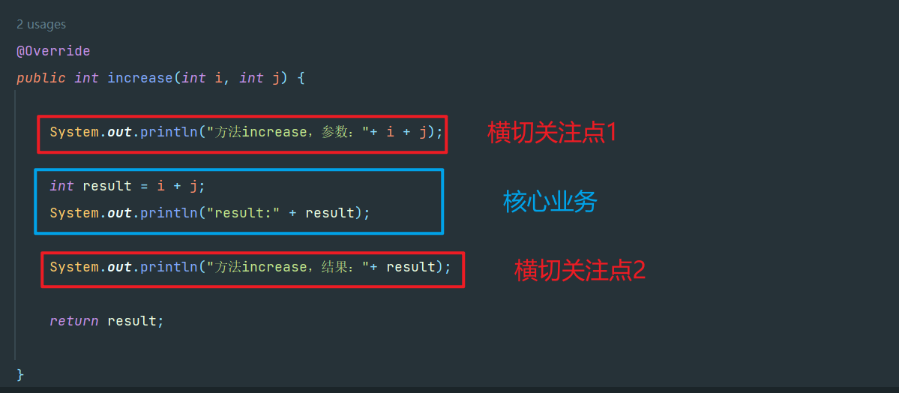
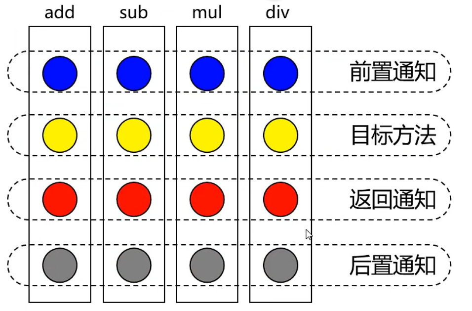
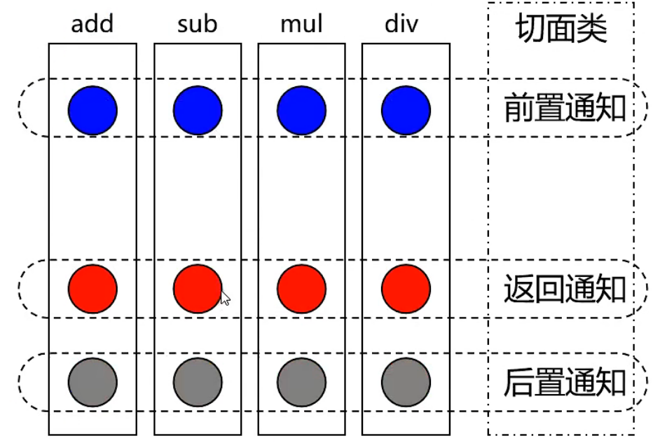
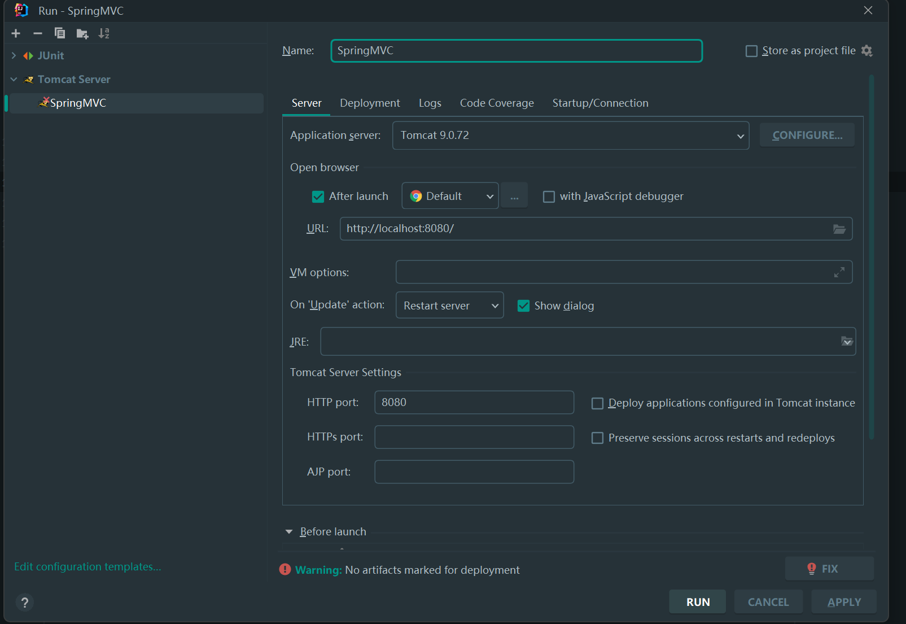
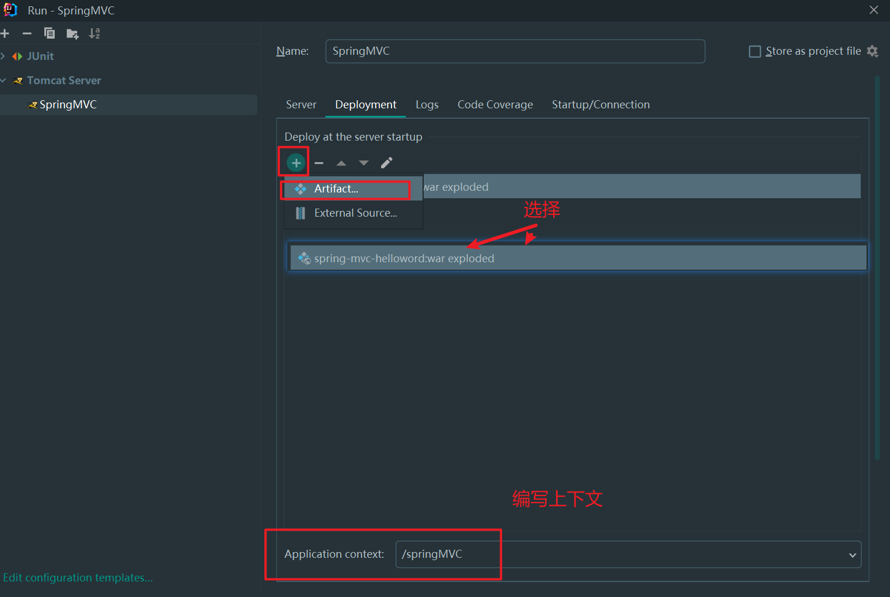
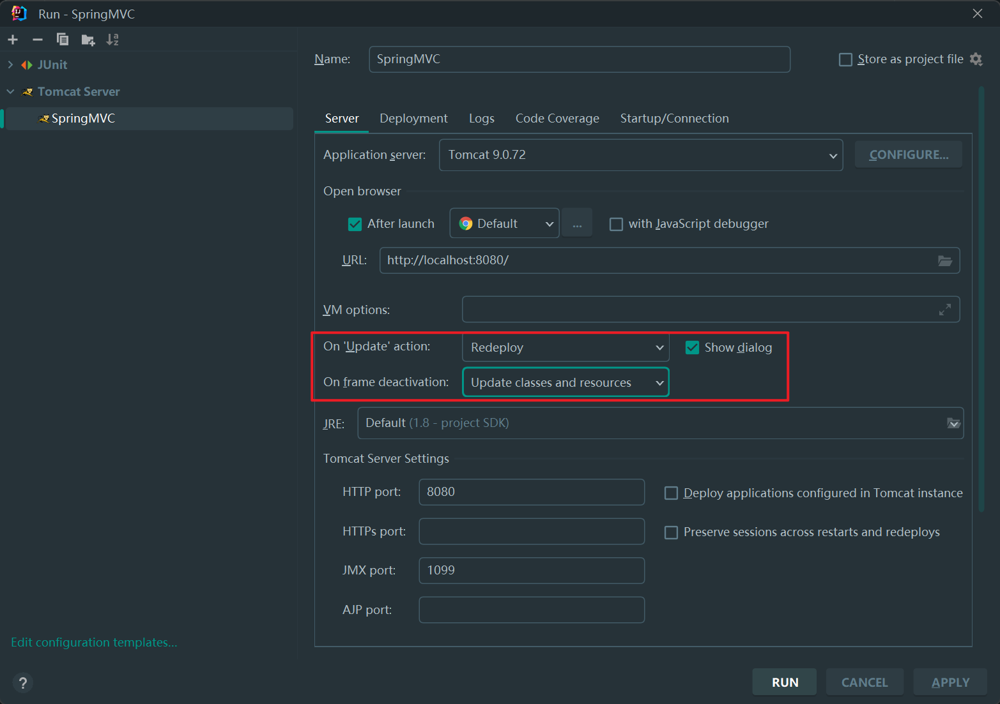
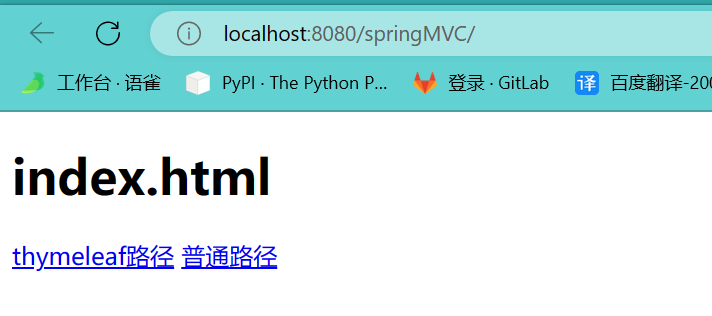

## Spring是什么？

JAVA Web开发框架，轻量级。

核心技术：IOC（控制反转）和AOP（面向切面编程）

IOC的表现DI（dependency injection）依赖注入

## IOC是什么

IOC（控制反转）是一个理念，思想

把对象的创建、赋值、管理工作都交给代码之外的容器实现，

控制：创建对象，对象属性赋值，对象之间的关系管理

反转：由开发人员在代码中管理对象，移交给代码外的容器实现。

好处：减少对代码的改动，也能实现不同的功能，解耦合。

## maven配置

```xml
<dependencies>
	 <dependency>
         <groupId>org.springframework</groupId>
         <artifactId>spring-aspects</artifactId>
         <version>5.3.1</version>
    </dependency>
    <dependency>
        <groupId>junit</groupId>
        <artifactId>junit</artifactId>
        <version>4.12</version>
        <scope>test</scope>
    </dependency>
</dependencies>
```

## 创建IOC容器

|             类型名              | 简介                                                         |
| :-----------------------------: | ------------------------------------------------------------ |
| ClassPathXmlApplicationContext  | 通过读取类路径下的XML格式的配置文件创建IOC容器对象（推荐）   |
| FileSystemXmlApplicationContext | 通过文件系统路径读取XML格式的配置文件创建IOC容器对象（不推荐） |
| ConfigurableApplicationContext  | ApplicationContext的子接口，包含扩展方法refresh()和close()，让ApplicationContext具有启动、关闭和刷新上下文的能力 |
|      WebApplicationContext      | 专门为Web应用准备，基于Web环境创建IOC容器对象，并将对象引入存入ServletContext域中。 |

## 基于XML管理bean

### 基本用例

```java
package com.yangjj.pojo;

public class Helloworld {
    public void sayHello(){
        System.out.println("hello spring!!");
    }
}
```

配置applicationContext.xml

```xml
<?xml version="1.0" encoding="UTF-8"?>
<beans xmlns="http://www.springframework.org/schema/beans"
       xmlns:xsi="http://www.w3.org/2001/XMLSchema-instance"
       xsi:schemaLocation="http://www.springframework.org/schema/beans http://www.springframework.org/schema/beans/spring-beans.xsd">
    <bean id="test" class="com.yangjj.pojo.Helloworld"/>
</beans>
```

测试

```java
public class SpringTest {
    @Test
    public void test(){
        // 获取IOC容器
        ApplicationContext ioc = new ClassPathXmlApplicationContext("applicationContext.xml");
        Helloworld hw = (Helloworld) ioc.getBean("test");
        hw.sayHello();
    }
}
```

### 获取bean的三种方式

1. 根据bean的id获取

2. 根据bean的类型获取（最常见）

    注意：要求IOC容器中只有一个类型匹配的bean

    若没有任何一个类型匹配的bean，抛出异常：`NoSuchBeanDefinitionException`

    若有多个类型匹配的bean，抛出异常：`NoUniqueBeanDefinitionException`

3. 根据bean的id和类型获取

总结：

根据类型来获取bean时，在满足bean唯一性的前提下，其实只是看：【对象 instanof 指定的类型】的返回结果，只要返回的是true就可以认定为类型匹配，能够获取到。

### 依赖注入之setter注入

配置bean时为属性赋值

```xml
<bean id="studentOne" class="com.yangjj.spring.bean.Student">
    <!--
 		property标签：通过组件类的setXxx()方法给组件对象设置属性
		name属性：指定属性名（get set方法定义的，与成员变量无关）
	-->
	<property name="id" value="1001"/>
    <property name="name" value="zhangsan"/>
    <property name="sex" value="男"/>
</bean>
```

测试

```java
ApplicationContext ioc = new ClassPathXmlApplicationContext("applicationContext.xml");
Student student = ioc.getBean("studentOne",Student.class);
```

### 依赖注入之构造器注入

```xml
<bean id="studentOne" class="com.yangjj.spring.bean.Student">
    <!--
 		name属性可以省略，对应的是构造器的参数值
	-->
	<constructor-arg name="id" value="1001"/>
    <constructor-arg name="name" value="zhangsan"/>
    <constructor-arg name="sex" value="男"/>
</bean>
```

### 依赖注入的特殊值处理

1. null值

    ```xml
    <!-- 使用null标签-->
    <bean id="studentOne" class="com.yangjj.pojo.Student">
    <!--    <property name="sName" value="王五"/>-->
        <property name="sName">
            <null />
        </property>
    </bean>
    ```

2. xml实体

    ```xml
    <!-- 小于号在XML文档中用于定义标签的开始，不能随便使用
    	解决方案一：使用XML实体来代替
    -->
    <property name="expression" value="a &lt; b"></property>
    ```

3. CDATA节

    ```xml
    <!-- 小于号在XML文档中用于定义标签的开始，不能随便使用
    	解决方案二：使用![CDATA[]]
    -->
    <bean id="studentTwo" class="com.yangjj.pojo.Student">
        <property name="sId" value="1001"/>
        <!--    <property name="sName" value="王五"/>-->
        <property name="sName">
            <value><![CDATA[<王五>]]></value>
        </property>
        <property name="age" value="18"/>
        <property name="gender" value="男"/>
    </bean>
    ```

4. 对象（引用外部的bean）

    ```xml
    <bean id="studentThree" class="com.yangjj.pojo.Student">
            <property name="sId" value="1001"/>
            <property name="sName" value="yjj"/>
            <property name="team" ref="teamOne"/>
    </bean>
    <bean id="teamOne" class="com.yangjj.pojo.Team">
        <property name="id" value="1002"/>
        <property name="name" value="敢死队"/>
    </bean>
    ```

    ```java
    @Test
    public void test2(){
        ApplicationContext ioc = new ClassPathXmlApplicationContext("applicationContext.xml");
        Student student = ioc.getBean("studentThree", Student.class);
        System.out.println(student);
    }
    ```

5. 对象（内部bean）

    ```xml
    <bean id="studentThree" class="com.yangjj.pojo.Student">
        <property name="sId" value="1001"/>
        <property name="sName" value="yjj"/>
        <property name="team">
            <bean id="teamOne" class="com.yangjj.pojo.Team">
                <property name="id" value="1002"/>
                <property name="name" value="敢死队"/>
        	</bean>
        </property>
    </bean>
    
    ```

    ```java
    @Test
    public void test2(){
        ApplicationContext ioc = new ClassPathXmlApplicationContext("applicationContext.xml");
        Student student = ioc.getBean("studentThree", Student.class);
        System.out.println(student);
    }
    ```

6. 数组类型

    ```xml
    <bean id="studentThree" class="com.yangjj.pojo.Student">
        <property name="sId" value="1001"/>
        <property name="sName" value="yjj"/>
        <property name="hobby">
            <array>
                <value>抽烟</value>
                <value>喝酒</value>
                <!-- 对象数组 <ref bean=""/> -->
            </array>
        </property>
    </bean>
    ```

7. list集合类型

    方式一：

    ```xml
    <bean id="studentThree" class="com.yangjj.pojo.Student">
        <property name="sId" value="1001"/>
        <property name="sName" value="yjj"/>
        <property name="hobby">
            <list>
                <value>抽烟</value>
                <value>喝酒</value>
                <!-- 对象数组 <ref bean=""/> -->
            </list>
        </property>
    </bean>
    ```

    方式二：

    ```xml
    <bean id="studentThree" class="com.yangjj.pojo.Student">
        <property name="sId" value="1001"/>
        <property name="sName" value="yjj"/>
        <property name="hobby" ref="hobbyList"></property>
    </bean>
    <!-- 配置一个集合类型的bean，需要使用util的约束 -->
    <util:list id="hobbyList">
    	<ref bean="studentOne"/>
       	<ref bean="studentTwo"/>
    </util:list>
    ```

8. map集合类型

    方式一：

    ```xml
    <bean id="studentThree" class="com.yangjj.pojo.Student">
        <property name="sId" value="1001"/>
        <property name="sName" value="yjj"/>
        <property name="hobby">
            <map>
                <!-- 
    				key ,key-ref,value,value-ref
    			-->
                <entry key="10086" value-ref="teacherOne"/>
                <entry key="10087" value-ref="teacherTwo"/>
            </map>
        </property>
    </bean>
    <bean id="teacherOne" class="com.yangjj.pojo.Teacher">
    	<property name="id" value="123"/>
        <property name="name" value="李老师"/>
    </bean>
    <bean id="teacherTwo" class="com.yangjj.pojo.Teacher">
    	<property name="id" value="123"/>
        <property name="name" value="李老师"/>
    </bean>
    ```

    方式二：

    ```xml
    <bean id="studentThree" class="com.yangjj.pojo.Student">
        <property name="sId" value="1001"/>
        <property name="sName" value="yjj"/>
        <property name="hobby" ref="hobbyMap"></property>
    </bean>
    <!-- 配置一个集合类型的bean，需要使用util的约束 -->
    <util:map id="hobbyMap">
    	<entry key="10086" value-ref="teacherOne"/>
        <entry key="10087" value-ref="teacherTwo"/>
    </util:map>
    
    <bean id="teacherOne" class="com.yangjj.pojo.Teacher">
    	<property name="id" value="123"/>
        <property name="name" value="李老师"/>
    </bean>
    <bean id="teacherTwo" class="com.yangjj.pojo.Teacher">
    	<property name="id" value="123"/>
        <property name="name" value="李老师"/>
    </bean>
    ```


### 配置druid数据池

```xml
 <!-- 导入jdbc.properties -->
<context:property-placeholder location="jdbc.properties"/>
<bean id="dataSource" class="com.alibaba.druid.pool.DruidDataSource">
    <property name="driverClassName" value="${jdbc.driver}"/>
    <property name="url" value="${jdbc.url}"/>
    <property name="username" value="${jdbc.username}"/>
    <property name="password" value="${jdbc.password}"/>
</bean>
```

```java
@Test
public void test1() throws SQLException {
    ApplicationContext ioc = new ClassPathXmlApplicationContext("spring-dataSource.xml");
    DruidDataSource dataSource = ioc.getBean(DruidDataSource.class);
    Connection connection = dataSource.getConnection();
    System.out.println(connection);

}
```

### bean的作用域

如果scope的值为prototype，对象多例

如果scope的值为singleton，对象单例

```xml
<bean id="teacherTwo" class="com.yangjj.pojo.Teacher" scope="protoType">
	<property name="id" value="123"/>
    <property name="name" value="李老师"/>
</bean>
```

### bean的生命周期

1. 对象实例化
2. 依赖注入
3. 对象初始化前操作（bean的后置处理器操作）
4. 对象初始化，需要通过bean的init-method指定初始化的方法
5. 对象初始化后操作（bean的后置处理器操作）
6. 容器关闭时对象销毁，需要通过bean的destory-method指定初始化的方法

>注意：
>
>若bean的作用域为单例时，生命周期的前三个步骤会在获取IOC容器时执行
>
>若bean的作用域为多例时，生命周期的前三个步骤会在获取bean时执行

### bean的后置处理器

> bean的后置处理器会在生命周期的初始化前后添加额外的操作，需要实现BeanPostProcessor接口，且配置倒IOC容器中，需要注意的是，bean后置处理器是针对所有bean都会执行

```java
package com.yangjj.process;

import org.springframework.beans.BeansException;
import org.springframework.beans.factory.config.BeanPostProcessor;

public class MyBeanPostProcessor implements BeanPostProcessor {
    @Override
    public Object postProcessBeforeInitialization(Object bean, String beanName) throws BeansException {
        System.out.println("初始化前操作" + beanName);
        return bean;
    }

    @Override
    public Object postProcessAfterInitialization(Object bean, String beanName) throws BeansException {
        System.out.println("初始化后操作" + beanName);
        return bean;
    }
}

```

```xml
<bean id="myBeanPostProcessor" class="com.yangjj.process.MyBeanPostProcessor"/>
```

### FactoryBean

> 1、FactoryBean是一个工厂Bean，可以生成某一个类型Bean实例，它最大的一个作用是：可以让我们自定义Bean的创建过程。FactoryBean本质就是用来给我们实例化、或者动态的注入一些比较复杂的Bean，比如像一些接口的代理对象。
> 2、BeanFactory是Spring容器中的一个基本类也是很重要的一个类，在BeanFactory中可以创建和管理Spring容器中的Bean，它对于Bean的创建有一个统一的流程

FactoryBean和BeanFactory的区别：

> 1、FactoryBean是动态注入Bean
> 2、BeanFactory主要是负责Bean实例化、定位、配置应用程序中的对象及建立这些对象间的依赖

使用场景：

1. 生成AOP代理对象的ProxyFactoryBean
2. 生成mapper代理对象的MapperFactoryBean

```java
public interface FactoryBean<T> {
    //返回的对象实例,我们可以在这里返回我们需要实例化的Bean
    T getObject() throws Exception;
    //Bean的类型,针对上面返回的实例，我们指定实例所对应的类型
    Class<?> getObjectType();
    //true是单例，false是非单例  在Spring5.0中此方法利用了JDK1.8的新特性变成了default方法，返回true
    boolean isSingleton();
}
```


### 自动装配

>自动装配：
>
>根据指定的策略，在IOC容器中匹配某个bean，自动为bean中的类类型的属性或接口类型的属性赋值
>
>可以通过bean标签中的autowire属性设置自动装配策略
>
>自动装配策略：
>
>- no,default:表示不装配，bean中的属性不会自动匹配某个bean为属性赋值。
>
>- byType:根据要赋值的属性类型，在IOC容器中匹配某个bean，为属性赋值。
>
>    - 若通过类型没有找到任何一个类型匹配的bean，此时不装配，属性使用默认值。
>
>    - 若通过类型找到了多个类型匹配的bean，此时会抛出异常，NoUniqueBeanDefinitionException
>
>        总结：使用byType实现自动装配时，IOC容器中有且只有一个类型匹配的bean能够为属性赋值
>
>- byName:将要赋值的属性的属性名作为bean的id在IOC容器中匹配某个bean，为属性赋值。


没有设置自动装配

```xml
<bean id="userController" class="com.yangjj.spring.userController">
	<property name="userService" ref="userService"></property>
</bean>
<bean id="userService" class="com.yangjj.spring.userServiceImpl">
	<property name="userDao" ref="userDao"></property>
</bean>
<bean id="userDao" class="com.yangjj.spring.userDaoImpl"></bean>
```

设置自动装配（基于xml的自动装配之byType）

```xml
<bean id="userController" class="com.yangjj.spring.userController" autowire="byType">
	<!--<property name="userService" ref="userService"></property> -->
</bean>
<bean id="userService" class="com.yangjj.spring.userServiceImpl" autowire="byType">
	<!-- <property name="userDao" ref="userDao"></property> -->
</bean>
<bean id="userDao" class="com.yangjj.spring.userDaoImpl"></bean>
```


## 基于注解管理bean

标识组件的常用注解

- @Component: 将类标识为普通组件
- @Controller：将类标识为控制层组件
- @Service：将类标识为业务层组件
- @Repository：将类标识为持久层组件

这些标识组件对于spring管理IOC容器，没有区别

对于开发人员能够便于分辨组件的作用，提高代码可读性。


```java
package com.yangjj.spring.controller;
import org.springframework.stereotype.Controller;

@Controller
public class UserController {
}

// ==========================================================================
package com.yangjj.spring.dao.impl;
import com.yangjj.spring.dao.UerDao;
import org.springframework.stereotype.Repository;


@Repository
public class UserDaoImpl implements UerDao {
}


```

```xml
<?xml version="1.0" encoding="UTF-8"?>
<beans xmlns="http://www.springframework.org/schema/beans"
       xmlns:xsi="http://www.w3.org/2001/XMLSchema-instance"
       xmlns:context="http://www.springframework.org/schema/context"
       xsi:schemaLocation="http://www.springframework.org/schema/beans http://www.springframework.org/schema/beans/spring-beans.xsd http://www.springframework.org/schema/context https://www.springframework.org/schema/context/spring-context.xsd">

    <!-- 扫描包下的所有加了注解的类 -->
    <context:component-scan base-package="com.yangjj.spring"/>
</beans>
```

### 排除扫描

> context:exlcude-filter:排除扫描
>
> type:设置排除扫描的方式 ="annotation|assignable"
>
> annotation:根据注解的类型进行排除，expression需要设置排除的注解的全类名
>
> assignable:根据类的类型进行排除，expression需要设置排除的类的全类名

```xml
<!-- 扫描包下的所有加了注解的类 -->
<context:component-scan base-package="com.yangjj.spring">
    <!--        <context:exclude-filter type="annotation" expression="org.springframework.stereotype.Controller"/>-->
    <context:exclude-filter type="assignable" expression="com.yangjj.spring.controller.UserController"/>
</context:component-scan>
```

### 包含扫描

> context:include-filter :包含扫描
>
> 注意：需要在context:component-scan标签中设置use-default-filters="false"
>
> use-default-filters="true"，所设置的包下所有的类都需要扫描，此时可以使用排除扫描
>
> use-default-filters="false"，所设置的包下所有的类都不需要扫描，此时可以使用包含扫描

```xml
<context:component-scan base-package="com.yangjj.spring" use-default-filters="false">
    <context:include-filter type="annotation" expression="org.springframework.stereotype.Controller"/>
</context:component-scan>
```

### 自动装配

> 使用@Autowired注解，实现自动装配功能
>
> @Autowired注解能够标识的位置
>
> - 标识在成员变量上，此时不需要设置成员变量的set方法
> - 标识在set方法上
> - 标识在为当前成员变量赋值的有参构造器上
>
> @Autowired注解原理
>
> - 默认通过byType的方式，在IOC容器中通过类型匹配某个bean为属性赋值
>
> - 若有多个类型匹配的bean，此时会自动转换为byName的方式实现自动装配的效果
>
> - 若byType和byName的方式都无法实现自动装配，此时可以在要赋值的属性上，添加一个注解@Qualifier
>
>     通过该注解的value属性值，指定某个bean的id，将这个bean为属性赋值。


```java
package com.yangjj.spring.controller;


import com.yangjj.spring.service.UserService;
import org.springframework.beans.factory.annotation.Autowired;
import org.springframework.stereotype.Controller;

@Controller
public class UserController {
    @Autowired
    @Qualifier("userServiceImpl")
    private UserService userService;

    public void saveData(){
        userService.saveData();
    }

    public UserService getUserService() {
        return userService;
    }

    public void setUserService(UserService userService) {
        this.userService = userService;
    }


}

```

### 设置bean的id

```java
@Controller("userController")
public class UserController {
    @Autowired
    @Qualifier("userServiceImpl")
    private UserService userService;

    public void saveData(){
        userService.saveData();
    }

    public UserService getUserService() {
        return userService;
    }

    public void setUserService(UserService userService) {
        this.userService = userService;
    }


}
```


## 动态代理

动态代理有两种：

1. jdk动态代理，要求必须有接口，最终生成的代理类和目标类实现相同的接口，在com.sun.proxy包下，类名为$proxy2
2. cglib动态代理，最终生成的代理类会继承目标类，并且和目标类在相同的包下

### jdk动态代理

```java
package com.yangjj.work;

import org.springframework.cglib.proxy.InvocationHandler;
import org.springframework.cglib.proxy.Proxy;

import java.lang.reflect.Method;
import java.util.Arrays;

public class ProxyFactory {

    private Object target;
    public  ProxyFactory(Object obj){
        this.target = obj;
    }
    public Object getProxy(){
        /**
         * ClassLoader loader：指定加载动态生成的代理类的类加载器（该动态代理对象的类加载器）
         * Class[] interfaces:获取目标对象实现的所有接口的class对象的数组
         * InvocationHandler h：设置代理类中的抽象方法如何重写
         */
        ClassLoader cl = this.getClass().getClassLoader();
        Class[] interfaces = target.getClass().getInterfaces();
        InvocationHandler h = new InvocationHandler() {
            @Override
            public Object invoke(Object proxy, Method method, Object[] objects) throws Throwable {
                System.out.println("方法--" + method.getName() + "--参数:" + Arrays.toString(objects));
                Object result = method.invoke(target,objects);
                System.out.println("方法--" + method.getName() + "--结果：" + result);
                return result;
            }
        };
        return Proxy.newProxyInstance(cl,interfaces,h);
    }

}

```


```java
// 被代理类
// 计算机实现类
public class CalculatorImpl implements Calculator{

    @Override
    public int increase(int i, int j) {
        int result = i + j;
        System.out.println("result:" + result);
        return result;

    }

    @Override
    public int decrease(int i, int j) {
        int result = i - j;
        System.out.println("result:" + result);
        return result;
    }
}

```


测试

```java
@Test
public void test2(){
    ProxyFactory factory = new ProxyFactory(new CalculatorImpl());
    Calculator proxy = (Calculator) factory.getProxy();
    proxy.increase(5,6);
}
```


## AOP概念

AOP（Aspect Oriented Programming）是一种设计思想，是软件设计领域中的面向切片编程，它以预编译方式和运行期动态代理方式实现在不修改源码的情况下给程序动态统一添加额外功能的一种技术。

OOP（Object Oriented Programming）面向对象编程，纵向继承

AOP（Aspect Oriented Programming） 面向切片编程，横向抽取

### 专业术语

1. 横切关注点

    从每个方法中抽取出来的同一类非核心业务。可以使用多个横切关注点对相关方法进行多个不同方面的增强。

    如下图，计算机核心业务为计算加法部分，横切关注点1和横切关注点2为日志部分（非核心业务）

    

2. 通知

    每一个横切关注点上要做的事情都需要写一个方法来实现，这种方法叫通知方法

    - 前置通知：在被代理的目标方法前执行。
    - 返回通知：在被代理的目标方法成功结束后执行
    - 异常通知：在被代理的目标方法异常结束后执行
    - 后置通知：在被代理的目标方法最终结束后执行
    - 环绕通知：使用try...catch...finally结构围绕整个被代理的目标方法，包括上面四种通知对应的方法

    

3. 切面

    封装通知方法的类

    

4. 目标

    被代理的目标对象

5. 代理

    向目标对象应用通知之后创建的代理对象

6. 连接点

     与横切关注点的位置相同，在核心代码中需要插入非核心代码的位置

7. 切入点

    定位连接点的方式


### 准备环境

```xml
<!-- 添加依赖 -->
<dependency>
    <groupId>org.springframework</groupId>
    <artifactId>spring-context</artifactId>
    <version>5.3.18</version>
</dependency>
<dependency>
    <groupId>org.springframework</groupId>
    <artifactId>spring-aspects</artifactId>
    <version>5.3.1</version>
</dependency>
<dependency>
    <groupId>junit</groupId>
    <artifactId>junit</artifactId>
    <version>4.12</version>
    <scope>test</scope>
</dependency>
```

### 测试用例

1.   需要在bean的配置文件中开启aop

     ```xml
     <?xml version="1.0" encoding="UTF-8"?>
     <beans xmlns="http://www.springframework.org/schema/beans"
            xmlns:xsi="http://www.w3.org/2001/XMLSchema-instance"
            xmlns:context="http://www.springframework.org/schema/context"
            xmlns:aop="http://www.springframework.org/schema/aop"
            xsi:schemaLocation="http://www.springframework.org/schema/beans http://www.springframework.org/schema/beans/spring-beans.xsd http://www.springframework.org/schema/context https://www.springframework.org/schema/context/spring-context.xsd http://www.springframework.org/schema/aop https://www.springframework.org/schema/aop/spring-aop.xsd">
         <context:component-scan base-package="com.yangjj.spring"/>
         <!-- 开启基于注解的aop模式 -->
         <aop:aspectj-autoproxy/>
     
     </beans>
     ```

2.   将接口实现类和切面类添加注解

     ```java
     package com.yangjj.spring.annotation;
     
     import org.springframework.stereotype.Component;
     
     @Component
     public class CalculatorImpl implements Calculator {
         @Override
         public int increase(int i, int j) {
             return i + j;
         }
     
         @Override
         public int decrease(int i, int j) {
             return i - j;
         }
     
         @Override
         public int sub(int i, int j) {
             return i * j;
         }
     
         @Override
         public int dev(int i, int j) {
             return i / j;
         }
     }
     
     ```

     

     切面类需要额外添加@Aspect注解

     

     ```java
     package com.yangjj.spring.annotation;
     
     
     import org.aspectj.lang.annotation.Aspect;
     import org.aspectj.lang.annotation.Before;
     import org.springframework.stereotype.Component;
     
     @Component
     @Aspect
     public class LoggerAspect {
         // 前置通知方法
         @Before("execution(public int com.yangjj.spring.annotation.CalculatorImpl.increase(int,int))")
         public void beforeAdviceMethod(){
             System.out.println("前置通知消息。。。。。。。。。。。。");
         }
     }
     
     ```

3.   测试

     注意：切面类实现原理为动态代理，bean管理需要获取接口的Class对象，而不是接口实现类对象。

     ```java
     package com.yangjj.spring.test;
     
     import com.yangjj.spring.annotation.Calculator;
     import org.junit.Test;
     import org.springframework.context.ApplicationContext;
     import org.springframework.context.support.ClassPathXmlApplicationContext;
     
     
     public class AopTest {
         @Test
         public void test(){
             ApplicationContext ioc = new ClassPathXmlApplicationContext("aop-annotation.xml");
             Calculator calculator = ioc.getBean(Calculator.class);
             int result = calculator.increase(6, 7);
             System.out.println(result);
         }
     }
     
     ```


### 切入点表达式

```java
package com.yangjj.spring.annotation;


import org.aspectj.lang.annotation.Aspect;
import org.aspectj.lang.annotation.Before;
import org.springframework.stereotype.Component;


@Component
@Aspect
public class LoggerAspect {
    // 前置通知方法,使用通配符
    // @Before("execution(public int com.yangjj.spring.annotation.CalculatorImpl.increase(int,int))")
    // 匹配com.yangjj.spring.annotation包下所有类的任意修饰符和返回值的所有方法，(..)表示任意参数
    // @Before("execution(* com.yangjj.spring.annotation.*.*(..))")
    // 匹配com.yangjj.spring.annotation包下的CalculatorImpl接口实现类的所有方法
    @Before("execution(* com.yangjj.spring.annotation.CalculatorImpl.*(..))")
    public void beforeAdviceMethod(){
        System.out.println("前置通知消息。。。。。。。。。。。。");
    }
}

```

**<font color="aqua">总结</font>**：

1.   在切面中，需要通过指定的注解将方法标识为通知方法

     *   **@Before**：前置通知，在目标对象方法执行前执行。
     *   **@AfterReturning**：返回通知，在目标对象方法执行后执行
     *   **@AfterThrowing**：异常通知，在目标对象方法执行异常时执行
     *   **@After**:后置通知，在目标对象的finally子句中执行
     *   **@Around**：环绕通知，包含上面四个通知。 

2.   获取连接点的信息

     在通知方法的参数位置，设置JoinPoint类型的参数，就可以获取父节点所对应方法的信息

     ```java
     @Component
     @Aspect
     public class LoggerAspect {
         // 前置通知方法,使用通配符
         // @Before("execution(public int com.yangjj.spring.annotation.CalculatorImpl.increase(int,int))")
         // 匹配com.yangjj.spring.annotation包下所有类的任意修饰符和返回值的所有方法，(..)表示任意参数
         // @Before("execution(* com.yangjj.spring.annotation.*.*(..))")
         // 匹配com.yangjj.spring.annotation包下的CalculatorImpl接口实现类的所有方法
         @Before("execution(* com.yangjj.spring.annotation.CalculatorImpl.*(..))")
         public void beforeAdviceMethod(JoinPoint joinPoint){
             // 获取连接点对应方法的方法名
             Signature signature = joinPoint.getSignature();
             // 获取连接点所对应方法的参数
             Object[] args = joinPoint.getArgs();
             
             System.out.println("前置通知消息。。。。。。。。。。。。");
             // signature.getName() 获取方法名
             // signature.getDeclaringTypeName()  获取接口全类名
             System.out.println("方法名为："+ signature.getName() + ";参数：" + Arrays.toString(args));
         }
     }
     ```

3.   重用切入点

     >@Pointcut声明一个公共的切入点
     >
     >@Pointcut("execution(* com.yangjj.spring.annotation.CalculatorImpl.*(..))")
     >    public void pointCut(){}

     ```java
     @Component
     @Aspect
     public class LoggerAspect {
         @Pointcut("execution(* com.yangjj.spring.annotation.CalculatorImpl.*(..))")
         public void pointCut(){}
         
         @Before("pointCut()")
         public void beforeAdviceMethod(JoinPoint joinPoint){
             // 获取连接点对应方法的方法名
             Signature signature = joinPoint.getSignature();
             // 获取连接点所对应方法的参数
             Object[] args = joinPoint.getArgs();
             System.out.println("前置通知消息。。。。。。。。。。。。");
             System.out.println("方法名为："+ signature.getName() + ";参数：" + Arrays.toString(args));
         }
     
         @After("pointCut()")
         public void afterAdviceMethod(){
             System.out.println("前置通知消息。。。。。。。。。。。。");
         }
     }
     
     ```


### 通知方法

-   **@Before**：前置通知，在目标对象方法执行前执行。
-   **@AfterReturning**：返回通知，在目标对象方法执行后执行
-   **@AfterThrowing**：异常通知，在目标对象方法执行异常时执行
-   **@After**:后置通知，在目标对象的finally子句中执行
-   **@Around**：环绕通知，包含上面四个通知。


```java

@Component
@Aspect
public class LoggerAspect {

    @Pointcut("execution(* com.yangjj.spring.annotation.CalculatorImpl.*(..))")
    public void pointCut(){}

    @Before("pointCut()")
    public void beforeAdviceMethod(JoinPoint joinPoint){
        // 获取连接点对应方法的方法名
        Signature signature = joinPoint.getSignature();
        // 获取连接点所对应方法的参数
        Object[] args = joinPoint.getArgs();
        System.out.println("前置通知消息。。。。。。。。。。。。");
        System.out.println("方法名为："+ signature.getName() + ";参数：" + Arrays.toString(args));
    }

    @After("pointCut()")
    public void afterAdviceMethod(){
        System.out.println("前置通知消息。。。。。。。。。。。。");
    }

    /**
     * 在返回通知中若要获取目标对象方法的返回值
     * 组需要通过@AfterReturning注解的returning属性
     * 就可以将通知方法的某个参数指定为接收目标对象方法的返回值的参数
     */
    @AfterReturning(value = "pointCut()",returning = "result")
    public void afterReturningAdviceMethod(JoinPoint joinPoint,Object result){
        System.out.println("返回通知....................结果：" + result);
    }
    
    @AfterThrowing(value = "pointCut()",throwing = "exception")
    public void afterThrowingAdviceMethod(JoinPoint joinPoint,Throwable exception){
        Signature signature = joinPoint.getSignature();
        
        System.out.println("方法" + signature.getName() + "出现异常:" + exception);
    }
    
    @Around("pointCut()")
    public Object aroundAdviceMethod(ProceedingJoinPoint joinPoint){
        Object result = null;
        try {
            System.out.println("环绕通知--->前置通知");
            result = joinPoint.proceed();
            System.out.println("环绕通知--->返回通知");
        } catch (Throwable e) {
            System.out.println("环绕通知--->异常通知");
            throw new RuntimeException(e);
        }finally {
            System.out.println("环绕通知--->后置通知");
        }
        return result;
    }
}
```

注意：多个切面类时，使用@Order(int)注解排优先级。数字越小，优先级越高

```java
@Component
@Aspect
@Order(1)
public class LoggerAspect {
}
```


## JDBCTemplate

### 准备工作

```xml
<dependency>
      <groupId>org.springframework</groupId>
      <artifactId>spring-context</artifactId>
      <version>5.3.18</version>
</dependency>
<dependency>
    <groupId>org.springframework</groupId>
    <artifactId>spring-aspects</artifactId>
    <version>5.3.1</version>
</dependency>
<!-- Spring 持久化层支持jar包 -->
<dependency>
    <groupId>org.springframework</groupId>
    <artifactId>spring-orm</artifactId>
    <version>5.3.3</version>
</dependency>
<dependency>
    <groupId>junit</groupId>
    <artifactId>junit</artifactId>
    <version>4.12</version>
    <scope>test</scope>
</dependency>
<dependency>
    <groupId>org.springframework</groupId>
    <artifactId>spring-test</artifactId>
    <version>5.3.18</version>
    <scope>test</scope>
</dependency>

<dependency>
    <groupId>mysql</groupId>
    <artifactId>mysql-connector-java</artifactId>
    <version>8.0.28</version>
</dependency>
<dependency>
    <groupId>com.alibaba</groupId>
    <artifactId>druid</artifactId>
    <version>1.2.8</version>
</dependency>
```

```java
package com.yangjj.test;


import com.yangjj.spring.Person;
import org.junit.Test;
import org.junit.runner.RunWith;
import org.springframework.beans.factory.annotation.Autowired;
import org.springframework.jdbc.core.BeanPropertyRowMapper;
import org.springframework.jdbc.core.JdbcTemplate;
import org.springframework.test.context.ContextConfiguration;
import org.springframework.test.context.junit4.SpringJUnit4ClassRunner;

import java.util.List;


@RunWith(SpringJUnit4ClassRunner.class)
// 设置Spring测试环境的配置文件，需要添加classpath:
@ContextConfiguration("classpath:spring-jdbc.xml")
public class JdbcTemplateTest {
    @Autowired
    private JdbcTemplate jdbcTemplate;

    @Test
    public void test1(){
        String sql = "insert into person_info VALUES(null,?,?,?,?)";
        jdbcTemplate.update(sql,"吴炯","男",32,54100.25);
    }

    @Test
    public void test2(){
        String sql = "select * from person_info";
        List<Person> list = jdbcTemplate.query(sql, new BeanPropertyRowMapper<>(Person.class));
        list.forEach(System.out::println);
    }

}

```


## 基于注解的事务管理

bean管理对象的配置文件中需要设置 事务管理器和注解驱动

```xml
<!-- 配置事务管理器 -->
<bean id="transactionManager" class="org.springframework.jdbc.datasource.DataSourceTransactionManager">
    <property name="dataSource" ref="druidDataSource"/>
</bean>
<!--
        开启事务的注解驱动
        将使用@Transactional注解所标识的方法或类中所有方法使用事务进行管理
        transaction-manager属性设置事务管理器的id
        若事务管理器bean的id为transactionManager,则该属性可以不写
    -->
<tx:annotation-driven transaction-manager="transactionManager"/>
```

```java
@Override
@Transactional
public void buyBook(Integer userId,Integer bookId){
    // 查询图书的价格
    Integer price = bookDao.getPriceByBookId(bookId);
    // 更新图书的库存
    bookDao.updateStock(bookId);
    // 更新用户的余额
    bookDao.updateBalance(userId,price);
}
```

### 设置事务属性：只读

`@Transactional(readOnly=true)`

如果进行增删改操作，则会报错

### 设置事务属性：超时

`@Transactional(timeout=3)`

如果事务操作执行了三秒后，强制回滚


### 设置事务属性：回滚策略

声明式事务默认只针对运行时异常回滚

可以通过@Transactional中相关属性设置回滚策略

- **rollbackFor**属性：需要设置一个Class类型的对象
- **rollbackForClassName**属性：需要设置一个字符串类型的全类名
- **noRollbackFor**属性：需要设置一个Class类型的对象
- **noRollbackForClassName**属性：需要设置一个字符串类型的全类名


```java
@Transactional(noRollbackFor=ArithmeticException.class)
@Transactional(noRollbackForClassName="java.lang.ArithmeticException")
```


### 设置事务属性：隔离级别

@Transactional(isolation=Isolation.DEFAULT)


### 设置事务属性：传播行为

当A，B方法都有事务且B调用A时，则B的事务会覆盖A的事务，A的事务不生效

如果想阻断传播行为，即使用A事务，则需要在A事务设置属性，@Transactional(propagation=Propagation.REQUIRES_NEW)

具体案例：

学生S打算用100元买书，分别是B1（50元）、B2（80元），买书的行为作为事务T1，结账的行为作为事务T2，结账的时候同时买B1、B2（T2调用T1）,但钱不够，

所以最后两本书都买不了（都回滚）

如果设置阻断事务的传播行为，则只会买B1的书，B2没有买成功


## 基于XML的事务管理

```xml
<!-- 配置事务管理器 -->
<bean id="transactionManager" class="org.springframework.jdbc.datasource.DataSourceTransactionManager">
    <property name="dataSource" ref="druidDataSource"/>
</bean>
<!--
        配置事务通知
    -->
<tx:advice id="tx" transaction-manager="transactionManager">
    <tx:attributes>
    	<tx:method name="buyBook" />
        <!-- 切入点下的所有方法都开启事务 -->
        <tx:method name="*"  />
    </tx:attributes>
</tx:advice>

<aop:config>
	<aop:advisor advice-ref="tx" pointcut="execution(* com.yangjj.spring.service.impl.*.*(..))" />
</aop:config>
```

需要配置spring-aspects的依赖

```xml
<!-- 基于xml实现aop-->
<dependency>
    <groupId>org.springframework</groupId>
    <artifactId>spring-aspects</artifactId>
    <version>5.3.1</version>
</dependency>
```


## SpringMVC

### 准备工作

#### 创建web.xml

路径：$modules/src/main/webapp/WEB-INF/web.xml

#### maven依赖配置

```xml
<dependencies>
    <dependency>
        <groupId>junit</groupId>
        <artifactId>junit</artifactId>
        <version>4.12</version>
        <scope>test</scope>
    </dependency>
    <!-- SpringMVC -->
    <dependency>
        <groupId>org.springframework</groupId>
        <artifactId>spring-webmvc</artifactId>
        <version>5.3.18</version>
    </dependency>
    <dependency>
        <groupId>javax.servlet</groupId>
        <artifactId>javax.servlet-api</artifactId>
        <version>4.0.1</version>
        <scope>provided</scope>
    </dependency>
    <!-- 日志 -->
    <dependency>
        <groupId>ch.qos.logback</groupId>
        <artifactId>logback-classic</artifactId>
        <version>1.2.4-groovyless</version>
        <scope>test</scope>
    </dependency>
    <!-- Spring5和Thymeleaf整合包 -->
        <dependency>
            <groupId>org.thymeleaf</groupId>
            <artifactId>thymeleaf-spring5</artifactId>
            <version>3.0.12.RELEASE</version>
        </dependency>


</dependencies>
```

#### 配置web.xml

```xml
<?xml version="1.0" encoding="UTF-8"?>
<web-app xmlns="http://xmlns.jcp.org/xml/ns/javaee"
         xmlns:xsi="http://www.w3.org/2001/XMLSchema-instance"
         xsi:schemaLocation="http://xmlns.jcp.org/xml/ns/javaee http://xmlns.jcp.org/xml/ns/javaee/web-app_4_0.xsd"
         version="4.0">
    <!--
     配置SpringMVC的前端控制器DispatcherServlet

     url-pattern中/和/*的区别
     /：匹配浏览器向服务器发送的所有请求（不包括.jsp）
     /*：匹配浏览器向服务器发送的所有请求（包括.jsp）
     -->
    <servlet>
        <servlet-name>SpringMVC</servlet-name>
        <servlet-class>org.springframework.web.servlet.DispatcherServlet</servlet-class>
    </servlet>
    <servlet-mapping>
        <servlet-name>SpringMVC</servlet-name>
        <url-pattern>/</url-pattern>
    </servlet-mapping>
</web-app>
```

#### 创建请求控制器

 ```java
 package com.yangjj.mvc.pojo;
 
 
 import org.springframework.stereotype.Controller;
 
 @Controller
 public class HelloController {
     @RequestMapping("/")
     public String index(){
         // 将逻辑视图返回
         return "index";
     }
 }
 
 ```


#### 创建SpringMVC的配置文件

SpringMVC的配置文件默认的位置和名称：

- 位置：WEB-INF下
- 名称：需结合web.xml中的servlet-name标签的值，<servlet-name>-servlet.xml，当前配置下的配置文件名为SpringMVC-servlet.xml

```XML
<?xml version="1.0" encoding="UTF-8"?>
<beans xmlns="http://www.springframework.org/schema/beans"
       xmlns:xsi="http://www.w3.org/2001/XMLSchema-instance"
       xmlns:context="http://www.springframework.org/schema/context"
       xsi:schemaLocation="http://www.springframework.org/schema/beans http://www.springframework.org/schema/beans/spring-beans.xsd http://www.springframework.org/schema/context https://www.springframework.org/schema/context/spring-context.xsd">

    <!--扫描控制层组件 -->
    <context:component-scan base-package="com.yangjj.mvc.controller"/>

    <!-- 配置Thymeleaf视图解析器 -->
    <bean id="viewResolver" class="org.thymeleaf.spring5.view.ThymeleafViewResolver">
        <property name="order" value="1"/>
        <property name="characterEncoding" value="UTF-8"/>
        <property name="templateEngine">
            <bean class="org.thymeleaf.spring5.SpringTemplateEngine">
                <property name="templateResolver">
                    <bean class="org.thymeleaf.spring5.templateresolver.SpringResourceTemplateResolver">
                        <!-- 视图前缀 -->
                        <property name="prefix" value="/WEB-INF/templates"/>
                        <!-- 视图后缀 -->
                        <property name="suffix" value=".html"/>
                        <property name="templateMode" value="HTML5"/>
                        <property name="characterEncoding" value="UTF-8"/>
                    </bean>
                </property>
            </bean>
        </property>
    </bean>
</beans>
```

#### 拓展

通过init-param标签指定servlet配置文件的路径

```xml
<?xml version="1.0" encoding="UTF-8"?>
<web-app xmlns="http://xmlns.jcp.org/xml/ns/javaee"
         xmlns:xsi="http://www.w3.org/2001/XMLSchema-instance"
         xsi:schemaLocation="http://xmlns.jcp.org/xml/ns/javaee http://xmlns.jcp.org/xml/ns/javaee/web-app_4_0.xsd"
         version="4.0">
    <!--
     配置SpringMVC的前端控制器DispatcherServlet
     url-pattern中/和/*的区别
     /：匹配浏览器向服务器发送的所有请求（不包括.jsp）
     /*：匹配浏览器向服务器发送的所有请求（包括.jsp）
     -->
    <servlet>
        <servlet-name>SpringMVC</servlet-name>
        <servlet-class>org.springframework.web.servlet.DispatcherServlet</servlet-class>
       <!-- 设置SpringMVC配置文件的位置和名称 -->
        <init-param>
            <param-name>contextConfigLocation</param-name>
            <param-value>classpath:springMVC.xml</param-value>
        </init-param>
        <!-- 将DispatcherServlet的初始化时间提前到服务器启动时-->
        <load-on-startup>1</load-on-startup>
    </servlet>
    <servlet-mapping>
        <servlet-name>SpringMVC</servlet-name>
        <url-pattern>/</url-pattern>
    </servlet-mapping>
</web-app>
```


#### 功能测试

将Tomcat添加到Run Debug Configruation中







编写index.html

```html
<!DOCTYPE html>
<html lang="en" xmlns:th="http://www.thymeleaf.org">
<head>
    <meta charset="UTF-8">
    <title>首页</title>
</head>
<body>
<h1>index.html</h1>
<a th:href="@{/hello}">thymeleaf路径</a>
<a href="/hello">普通路径</a>
</body>
</html>
```

运行结果




## @RequestMapping注解

### @RequestMapping标识的位置

- @RequestMapping标识一个类：设置映射请求的请求路径的初始信息
- @RequestMapping标识一个方法：设置映射请求请求路径的具体信息

```java
@Controller
@RequestMapping("/test")
public class TestRequestMappingController{
    //此时控制器方法请求的路径为  /test/hello
    @RequestMapping("/hello")
    public String hello(){
        return "hello";
    }
}
```

### @RequestMapping的value属性

作用：通过请求的请求路径匹配请求

可支持多个路径

```text
@RequestMapping("/test")
@RequestMapping({"/test","abc"})
```


### @RequestMapping的method属性

作用:通过请求的请求方式匹配请求

可支持多个请求

```text
@RequestMapping(value="/test",method=RequestMethod.GET)
@RequestMapping(value="/test",method={RequestMethod.GET,RequestMethod.POST})
```

### @RequestMapping的params属性（了解）

作用：通过请求的请求参数匹配请求。

params可以使用四种表达式：

- `param`:表示当前所匹配请求的请求参数必须携带param参数
- `!param`:表示当前所匹配请求的请求参数一定不能携带param参数
- `param=value`:表示当前所匹配请求的请求参数必须携带param参数且值必须等于value
- `param!=value`:表示当前所匹配请求的请求参数必须携带param参数，但携带值一定不能等于value

```text
@RequestMapping(
	value="/test",
	params={"username","!password","age=20","gender!=女"}
)
```


### @RequestMapping的headers属性（了解）

作用：通过请求的请求头信息匹配请求映射

headers的规则于params一致。

```text
@RequestMapping(
	value="/test",
	headers={"referer"}
)
```


### @RequestMapping注解使用路径中的占位符

```java
@RequestMapping("/test/rest/{username}/{id}")
public String testRest(@PathVariable("id") Integer id,@PathVariable("username") String username){
    System.out.println("id:" + id + ",username:" + username);
    return "success";
}
```


## 获取请求参数

### 通过ServletAPI获取请求参数

```java
@RequestMapping("/test")
public String test(HttpServletRequest request){
    HttpSession session = request.getSession();
    String username = request.getParameter("username");
    String password = request.getParameter("password");
    System.out.println("username=" + username + ";password=" + password);
    return "test";
}
```

### 通过控制器方法的形参获取

只需要在控制器方法的形参位置，设置形参，形参的名字和请求参数的名字一致即可

```java
@RequestMapping("/test")
public String test(String username,String password){
    System.out.println("username=" + username + ";password=" + password);
    return "test";
}
```

如果前端属性名和后端属性名不一致时，使用@RequestParam注解设置

```java
@RequestMapping("/test")
public String test(
    @RequestParam("userName")String username,
    String password
){
    System.out.println("username=" + username + ";password=" + password);
    return "test";
}
```

@RequestParam的三个参数

- value：前端传的属性名
- required:默认值为true，前端必传的参数
- defaultValue：前端没传的时候，该属性的值为当前默认值


### @RequestHeader和@CookieValue

用法和参数与@RequestParam一致。

```java
@RequestMapping("/test")
public String test(
    @RequestParam("userName")String username,
    String password,
    @RequestHeader("referer") String referer,
    @CookieValue("jsessionId") String jessionId
){
    System.out.println("username=" + username + ";password=" + password);
    return "test";
}
```

### 通过pojo获取请求参数

通过实体类类型的形参获取请求参数

要保证实体类中的属性的属性名和请求参数的名字一致

```java
@RequestMapping("/test")
public String test(User user){
    System.out.println(User);
    return "test";
}
```

### 解决请求参数乱码问题

需要在web.xml中注册

```xml
<filter>
    <filter-name>CharacterEncodingFilter</filter-name>
    <filter-class>org.springframework.web.filter.CharacterEncodingFilter</filter-class>
    <init-param>
        <param-name>encoding</param-name>
        <param-value>UTF-8</param-value>
    </init-param>
    <init-param>
        <param-name>forceEncoding</param-name>
        <param-value>true</param-value>
    </init-param>
</filter>
<filter-mapping>
    <filter-name>CharacterEncodingFilter</filter-name>
    <url-pattern>/</url-pattern>
</filter-mapping>
```


## 域对象共享数据

### 使用ServletAPI向request域对象共享数据

```java
@RequestMapping("/test1")
public String test1(HttpServletRequest request){
    request.setAttribute("username","password");
    return "test";
}
```


### 使用ModelAndView向request域对象共享数据

```java
@RequestMapping("/test2")
public ModelAndView TestModelAndView(){
    ModelAndView mav = new ModelAndView();
    // 向请求域中共享数据
    mav.addObject("test","hello,ModelAndView");
    // 设置逻辑视图
    mav.setViewName("index");
    return mav;
}
```


在模板html中使用

```html
<!DOCTYPE html>
<html lang="en" xmlns:th="http://www.thymeleaf.org">
<head>
    <meta charset="UTF-8">
    <title>首页</title>
</head>
<body>
<h1>index.html</h1>
<p th:text="${test}"></p>
</body>
</html>
```

### 使用Model、ModelMap、Map向request域对象共享数据

```java
@RequestMapping("/test1")
public String test1(Model model){
    model.setAttribute("username","password");
    return "test";
}
```


## MVC的视图控制器

```xml
<!-- 开启mvc的注解驱动 -->
    <mvc:annotation-driven/>
    <!--
        视图控制器：为当前的请求直接设置视图名称实现页面跳转
        若设置视图控制器，则只有视图控制器所设置的请求会被处理，其他的请求将全部404
        必须再配置一个标签 <mvc:annotation-driven/>
    -->
    <mvc:view-controller path="/" view-name="index"/>
```


## SpringMVC处理ajax请求


### 使用@RequestBody注解处理--fastjson

配置依赖

```xml
<dependency>
    <groupId>com.alibaba.fastjson2</groupId>
    <artifactId>fastjson2</artifactId>
    <version>2.0.23</version>
</dependency>
```

```java
@RequestMapping(value = "/test/ajax",method = RequestMethod.POST)
public void ajaxTest(@RequestBody String json, HttpServletResponse response) throws IOException {
    JSONObject obj = JSON.parseObject(json);
    String apply_date = obj.getString("apply_date");
    String function_name = obj.getString("function_name");
    List<String> fund_source = obj.getJSONArray("fund_source").toJavaList(String.class);
    System.out.println(apply_date);
    System.out.println(function_name);
    fund_source.forEach(System.out::println);
    response.getWriter().write("hello,ajax");

}
```

### 使用@RequestBody注解处理--jackson

1. 配置依赖

    ```xml
    <dependency>
        <groupId>com.fasterxml.jackson.core</groupId>
        <artifactId>jackson-databind</artifactId>
        <version>2.14.1</version>
    </dependency>
    ```

2. 在SpringMVC配置文件中设置`<mvc:annotation-driven/>`

3. 在处理请求的控制器方法的形参位置，使用@RequestBody接受

    ```java
    @RequestMapping("/test/ajaxToMap")
    public void ajaxToMap(@RequestBody Map<String,Object> map,HttpServletResponse response) throws IOException {
        System.out.println(map);
        response.getWriter().write("ajaxToMap");
    
    }
    ```

    


### 使用@ResponseBody注解响应--jackson

```java
@RequestMapping("/test/ajaxToMap")
@ResponseBody
public String ajaxToMap(@RequestBody Map<String,Object> map) throws IOException {
    System.out.println(map);
    return JSON.toJSONString(map);
}
```

如果中文乱码，则需要设置mvc的注解驱动

```xml
<mvc:annotation-driven>
    <mvc:message-converters>
        <bean class="org.springframework.http.converter.StringHttpMessageConverter">
            <property name="supportedMediaTypes">
                <list>
                    <value>application/json;charset=UTF-8</value>
                </list>
            </property>
        </bean>
    </mvc:message-converters>
</mvc:annotation-driven>
```

## @RestController注解

@RestController注解是SpringMVC提供的一个符合注解，标识在控制器的类上，相当于类添加上了@Controller注解，并且为其中的每个方法添加了@ResponseBody注解

  ## 文件下载

### 基于spring的ResponseEntity

```java
@RequestMapping("/test/download")
public ResponseEntity<byte[]> testResponseEntity() throws IOException {

    InputStream is = Files.newInputStream(Paths.get("D:\\data\\local\\lib\\byrsjPro\\fundFile\\normal\\2021-4灵活就业补贴60913.xls"));
    // is.available()获取文件的字节数
    byte[] bytes = StreamUtils.copyToByteArray(is);
    int length = is.read(bytes);
    // 创建请求头，并设置下载方式以及文件名字
    MultiValueMap<String,String> headers = new HttpHeaders();
    headers.add("Content-Disposition","attachment;filename=" + URLEncoder.encode("2021-4灵活就业补贴60913.xls","utf-8"));
    // 设置响应状态码
    HttpStatus status = HttpStatus.OK;
    // 创建ResponseEntity对象
    ResponseEntity<byte[]> responseEntity = new ResponseEntity<>(bytes,headers,status);
    is.close();
    return responseEntity;
}
```


### 基于java通用下载方式

```java
@RequestMapping("/test/testHttpDownload")
public void download(HttpServletRequest request,HttpServletResponse response) throws IOException {
    // 设置响应头和保存文件名
    response.setCharacterEncoding("utf-8");
    response.setContentType("multipart/form-data");
    // 如果中文，需要处理
    response.setHeader("Content-Disposition","attachment;filename=" + URLEncoder.encode("2021-4灵活就业补贴60913.xls","utf-8"));
    InputStream is = Files.newInputStream(Paths.get("D:\\data\\local\\lib\\byrsjPro\\fundFile\\normal\\2021-4灵活就业补贴60913.xls"));

    OutputStream outputStream = response.getOutputStream();
    byte[] buff = new byte[1024];
    int len = 0;
    while ((len=is.read(buff)) > 0){
        outputStream.write(buff,0,len);
    }
    is.close();
    outputStream.close();


}
```


## 文件上传

1. 添加maven依赖

    ```xml
    <dependency>
        <groupId>commons-fileupload</groupId>
        <artifactId>commons-fileupload</artifactId>
        <version>1.4</version>
    </dependency>
    
    ```

2. 配置文件上传解析器

    ```xml
    <!-- 配置文件上传解析器 -->
    <bean id="multipartResolver" class="org.springframework.web.multipart.commons.CommonsMultipartResolver">
        <!--
                两个比较有用的属性
                    maxUploadSizePerFile：单个文件大小限制（byte）
                    maxUploadSize：整个请求大小限制（byte）
            -->
        <property name="maxUploadSize" value="#{1024*1024*100}"/>
        <property name="maxUploadSizePerFile" value="#{1024*1024*5}"/>
    </bean>
    ```

3. 编写代码

    ```java
    @RequestMapping("/test/upload")
    public String testUpload(@RequestParam("largeFile") MultipartFile file,HttpServletRequest request) throws IOException {
        String filename = file.getOriginalFilename();
        String name = file.getName();
        System.out.println(filename);  // 文件名
        System.out.println(name);  // 参数名
    
        file.transferTo(Paths.get("D:\\data\\local\\lib\\byrsjPro\\fundFile\\" + filename));
        return "上传成功";
    }
    ```


## 拦截器 

拦截器的三个方法：

- preHandle():在控制器方法执行之前执行，其返回值表示对控制器方法的放行(true)或者拦截(false)
- postHandle():在控制器方法执行之后执行
- afterCompletion():在控制器方法执行之后，且渲染视图完毕之后执行


1. 编写拦截器代码

    ```java
    @Component
    public class FirstInterceptor implements HandlerInterceptor {
        @Override
        public boolean preHandle(HttpServletRequest request, HttpServletResponse response, Object handler) throws Exception {
            System.out.println("interceptor-->preHandle");
    
            return true;
        }
    
        @Override
        public void postHandle(HttpServletRequest request, HttpServletResponse response, Object handler, ModelAndView modelAndView) throws Exception {
            System.out.println("interceptor-->postHandle");
        }
    
        @Override
        public void afterCompletion(HttpServletRequest request, HttpServletResponse response, Object handler, Exception ex) throws Exception {
            System.out.println("interceptor-->afterCompletion");
        }
    }
    ```

2. 注册拦截器

    ```xml
     <mvc:interceptors>
         <!--
                bean和ref标签所配置的拦截器默认对DispatcherServlet处理的所有请求进行拦截
            -->
         <!--        <bean class="com.yangjj.mvc.interceptor.FirstInterceptor"/>-->
         <!--        <ref bean="firstInterceptor"/>-->
         <mvc:interceptor>
             <!-- mvc:mapping拦截的请求路径，注意：/*表示一层的任意路径；/**表示任意路径-->
             <mvc:mapping path="/*"/>
             <!-- 排除拦截的请求路径 -->
             <mvc:exclude-mapping path="/test/aa"/>
             <!-- 配置拦截器 -->
             <ref bean="firstInterceptor"/>
         </mvc:interceptor>
    </mvc:interceptors>
    ```

    

### 多个拦截器的执行顺序

preHandle()按照配置的顺序执行，而postHandle()和afterCompletion()按照配置的反序执行。


<<<<<<< HEAD
## 注解配置springMVC


使用配置类和注解代替web.xml和SpringMVC配置文件的功能

在Servlet3.0环境中，容器会在类路径中查找实现javax.servlet.ServletContainerInitializer接口的类，如果找到的话就用它来配置Servlet容器。 Spring提供了这个接口的实现，名为SpringServletContainerInitializer，这个类又会查找实现WebApplicationInitializer的类并将配置的任务交给它们来完成。Spring3.2引入了一个便利的WebApplicationInitializer基础实现，名为AbstractAnnotationConfigDispatcherServletInitializer，当我们的类扩展了AbstractAnnotationConfigDispatcherServletInitializer并将其部署到Servlet3.0容器的时候，容器会自动发现它，并用它来配置Servlet上下文。

意思就是容器会自动发现继承了AbstractAnnotationConfigDispatcherServletInitializer的子类，并用它来配置servlet上下文。（用来代替web.xml）


### 注解代替配置web.xml

```java
//代替web.xml   filter过滤器   spring  springmvc的配置类    dispracture的映射路径
public class WebInit extends AbstractAnnotationConfigDispatcherServletInitializer {

    //    指定spring配置类
    @Override
    protected Class<?>[] getRootConfigClasses() {
        return new Class[]{SpringConfig.class};
    }

    // 指定springMCV配置类
    @Override
    protected Class<?>[] getServletConfigClasses() {
        return new Class[]{SpringMvcConfig.class};
    }


    // 指定dispracture的映射路径 即url-pattern
    @Override
    protected String[] getServletMappings() {
        return new String[]{"/"};
    }

    // 注册编码过滤器
    @Override
    protected Filter[] getServletFilters() {
        CharacterEncodingFilter encodingFilter = new CharacterEncodingFilter();
        encodingFilter.setEncoding("UTF-8");
        encodingFilter.setForceRequestEncoding(true);
        HiddenHttpMethodFilter hiddenHttpMethodFilter = new HiddenHttpMethodFilter();

        return new Filter[]{encodingFilter,hiddenHttpMethodFilter};

    }
}
```


### 注解类代替springMVC-servlet.xml配置文件

Spring-mvc配置文件（不管是xml还是注解的类）有如下八个功能

1视图解析器  

2.扫描包的范围（组件扫描）  

3.view-controller（只返回视图的控制方法）  

4.defalut-servlet-handler  静态资源处理

5  mvc注解驱动  

6.文件上传解析器  

7.异常处理  

8.拦截器

```java
// 扫描包的范围（组件扫描）
@ComponentScan("com.yangjj.mvc")
// 开启MVC注解驱动
@EnableWebMvc
@Configuration
public class SpringMvcConfig implements WebMvcConfigurer {
    //配置视图解析器
    // 这个注解是将类放进ioc容器中  因为web.xml中就是嵌套的
    @Bean
    public ITemplateResolver templateResolver(){
        WebApplicationContext webApplicationContext = ContextLoader.getCurrentWebApplicationContext();
        ServletContextTemplateResolver templateResolver = new ServletContextTemplateResolver(
                 webApplicationContext.getServletContext()
        );
        templateResolver.setPrefix("/WEB-INF/templates/");
        templateResolver.setSuffix(".html");
        templateResolver.setCharacterEncoding("utf-8");
        templateResolver.setTemplateMode(TemplateMode.HTML);
        return templateResolver;
    }

    // 生成模板引擎并为模板引擎注入模板解析器
    @Bean
    public SpringTemplateEngine templateEngine(ITemplateResolver templateResolver){
        SpringTemplateEngine templateEngine = new SpringTemplateEngine();
        templateEngine.setTemplateResolver(templateResolver);
        return templateEngine;
    }

    @Bean
    public ViewResolver viewResolver(SpringTemplateEngine templateEngine){
        ThymeleafViewResolver viewResolver = new ThymeleafViewResolver();
        viewResolver.setCharacterEncoding("UTF-8");
        viewResolver.setTemplateEngine(templateEngine);
        return viewResolver;
    }

    // 添加拦截器
    @Override
    public void addInterceptors(InterceptorRegistry registry) {
        MyInterceptor interceptor = new MyInterceptor();
        // addPathPatterns("/") 是设置拦截的url
        // excludePathPatterns():是设置不拦截的url
        registry.addInterceptor(interceptor).addPathPatterns("/**");
    }

    // 视图控制器
    @Override
    public void addViewControllers(ViewControllerRegistry registry) {
        registry.addViewController("/hello").setViewName("success");
    }

    // 配置文件上传解析器
    @Bean
    public CommonsMultipartResolver multipartResolver(){
        CommonsMultipartResolver multipartResolver = new CommonsMultipartResolver();
        multipartResolver.setMaxUploadSizePerFile(1024*1024*5);  // 设置单个文件大小
        return multipartResolver;
    }

    // 配置异常映射
    @Override
    public void configureHandlerExceptionResolvers(List<HandlerExceptionResolver> resolvers) {
        SimpleMappingExceptionResolver exceptionResolver = new SimpleMappingExceptionResolver();
        Properties properties = new Properties();
        // 设置异常视图，如果是ArithmeticException，则返回error视图
        properties.setProperty("java.lang.ArithmeticException","error");
        // 设置异常映射
        exceptionResolver.setExceptionMappings(properties);
        // 设置共享异常信息的键
        exceptionResolver.setExceptionAttribute("ex");
        resolvers.add(exceptionResolver);
    }
}

```

对应的xml配置

```xml
<?xml version="1.0" encoding="UTF-8"?>
<beans xmlns="http://www.springframework.org/schema/beans"
       xmlns:xsi="http://www.w3.org/2001/XMLSchema-instance"
       xmlns:context="http://www.springframework.org/schema/context"
       xmlns:mvc="http://www.springframework.org/schema/mvc"
       xsi:schemaLocation="http://www.springframework.org/schema/beans http://www.springframework.org/schema/beans/spring-beans.xsd http://www.springframework.org/schema/context https://www.springframework.org/schema/context/spring-context.xsd http://www.springframework.org/schema/mvc https://www.springframework.org/schema/mvc/spring-mvc.xsd">
      <!--2.扫描包的范围（组件扫描）-->
    <context:component-scan base-package="com.hxut.rj1192.zyk"/>
 
    <!-- 1.配置Thymeleaf视图解析器 -->
    <bean id="viewResolver" class="org.thymeleaf.spring5.view.ThymeleafViewResolver">
        <property name="order" value="1"/>
        <property name="characterEncoding" value="UTF-8"/>
        <property name="templateEngine">
            <bean class="org.thymeleaf.spring5.SpringTemplateEngine">
                <property name="templateResolver">
                    <bean class="org.thymeleaf.spring5.templateresolver.SpringResourceTemplateResolver">
                        <property name="prefix" value="/WEB-INF/templates/"/>
                        <property name="suffix" value=".html"/>
                        <property name="templateMode" value="HTML5"/>
                        <property name="characterEncoding" value="UTF-8"/>
                    </bean>
                </property>
            </bean>
        </property>
    </bean>
    <!--4.静态资源处理-->
    <mvc:default-servlet-handler/>
    <!--5.mvc注解驱动-->
    <mvc:annotation-driven/>

    <bean class="org.springframework.web.servlet.handler.SimpleMappingExceptionResolver">
        <property name="exceptionMappings">
            <props>
                <prop key="java.lang.ArithmeticException">error</prop>
            </props>
        </property>
        <property name="exceptionAttribute" value="ex"></property>
    </bean>
<!-- 3.view-controller -->
<mvc:view-controller path="/testView" view-name="success"></mvc:view-controller>
<!--4.文件上传解析器-->
    <bean id="multipartResolver"
          class="org.springframework.web.multipart.commons.CommonsMultipartResolver">
    </bean>
<!--7.异常处理-->
    <bean class="org.springframework.web.servlet.handler.SimpleMappingExceptionResolver">
            <property name="exceptionMappings">
                <props>
                    <prop key="java.lang.ArithmeticException">error</prop>
                </props>
            </property>
            <!--        将错误信息放到ex这个变量中，并放进model中-->
            <property name="exceptionAttribute" value="ex"></property>
        </bean>
<!--8.拦截器-->
   <mvc:interceptors>
        <!--
            bean和ref标签所配置的拦截器默认对DispatcherServlet处理的所有请求进行拦截
        -->
<!--        <bean class="com.yangjj.mvc.interceptor.FirstInterceptor"/>-->
<!--        <ref bean="firstInterceptor"/>-->
        <mvc:interceptor>
            <!-- mvc:mapping拦截的请求路径，注意：/*表示一层的任意路径；/**表示任意路径-->
            <mvc:mapping path="/*"/>
            <!-- 排除拦截的请求路径 -->
            <mvc:exclude-mapping path="/test/aa"/>
            <!-- 配置拦截器 -->
            <ref bean="firstInterceptor"/>
        </mvc:interceptor>
    </mvc:interceptors>
</beans>
 

```

## SpringMVC常用组件

-   DispatcherServlet:前端控制器

    作用：统一处理请求和响应，整个流程控制的中心，由它调用其他组件处理用户的请求

-   HandlerMapping：处理映射器

    作用：根据请求的url、method等信息查找Handler，即控制器方法（controller注解的类的方法）

-   Handler：处理器，即（controller注解的类的方法）

    作用：在DispatcherServlet的控制下Handler对具体的用户请求进行处理

-   HandlerAdapter：处理器适配器

    作用：通过HandlerAdapter对处理器（控制器方法）进行执行 

-   ViewResolver:视图解析器

    作用：进行视图解析，得到相应的视图

-   View：视图

    作用：将模型数据通过页面展示给用户


## ContextLoaderListener

Spring提供监听器ContextLoader，在web服务器的启动时，读取Spring的配置文件，创建Spring的IOC容器，web应用中必须在web.xml中配置

```xml
<listener>
	<!--
 	配置Spring的监听器，
	-->
    <listener-class>org.springframework.web.context.ContextLoaderListener</listener-class>
</listener>
<!-- 自定义Spring配置文件的位置和名称 -->
<context-param>
	<param-name>contextConfigLocation</param-name>
    <param-value>classpath:spring.xml</param-value>
</context-param>
```


## SSM整合

### maven配置

```xml
<?xml version="1.0" encoding="UTF-8"?>
<project xmlns="http://maven.apache.org/POM/4.0.0"
         xmlns:xsi="http://www.w3.org/2001/XMLSchema-instance"
         xsi:schemaLocation="http://maven.apache.org/POM/4.0.0 http://maven.apache.org/xsd/maven-4.0.0.xsd">
    <modelVersion>4.0.0</modelVersion>

    <groupId>com.yangjj.ssm</groupId>
    <artifactId>spring-ssm</artifactId>
    <version>1.0-SNAPSHOT</version>
    <packaging>war</packaging>
    <properties>
        <maven.compiler.source>8</maven.compiler.source>
        <maven.compiler.target>8</maven.compiler.target>
        <spring.version>5.3.18</spring.version>
    </properties>
    <dependencies>
        <dependency>
            <groupId>org.springframework</groupId>
            <artifactId>spring-context</artifactId>
            <version>${spring.version}</version>
        </dependency>
        <!-- SpringMVC -->
        <dependency>
            <groupId>org.springframework</groupId>
            <artifactId>spring-webmvc</artifactId>
            <version>${spring.version}</version>
        </dependency>
        <!-- 事务管理 -->
        <dependency>
            <groupId>org.springframework</groupId>
            <artifactId>spring-jdbc</artifactId>
            <version>${spring.version}</version>
        </dependency>
        <dependency>
            <groupId>org.springframework</groupId>
            <artifactId>spring-aspects</artifactId>
            <version>${spring.version}</version>
        </dependency>
        <dependency>
            <groupId>org.springframework</groupId>
            <artifactId>spring-test</artifactId>
            <version>${spring.version}</version>
            <scope>test</scope>
        </dependency>
        <dependency>
            <groupId>org.mybatis</groupId>
            <artifactId>mybatis</artifactId>
            <version>3.5.7</version>
        </dependency>
        <!-- mybatis和spring整合包 -->
        <dependency>
            <groupId>org.mybatis</groupId>
            <artifactId>mybatis-spring</artifactId>
            <version>2.0.6</version>
        </dependency>
        <!-- 连接池 -->
        <dependency>
            <groupId>com.alibaba</groupId>
            <artifactId>druid</artifactId>
            <version>1.2.8</version>
        </dependency>

        <dependency>
            <groupId>junit</groupId>
            <artifactId>junit</artifactId>
            <version>4.12</version>
            <scope>test</scope>
        </dependency>
        <dependency>
            <groupId>log4j</groupId>
            <artifactId>log4j</artifactId>
            <version>1.2.17</version>
        </dependency>
        <!-- 分页插件 -->
        <dependency>
            <groupId>com.github.pagehelper</groupId>
            <artifactId>pagehelper</artifactId>
            <version>5.2.0</version>
        </dependency>
        <!-- 日志 -->
        <dependency>
            <groupId>ch.qos.logback</groupId>
            <artifactId>logback-classic</artifactId>
            <version>1.2.3</version>
        </dependency>
        <dependency>
            <groupId>javax.servlet</groupId>
            <artifactId>javax.servlet-api</artifactId>
            <version>4.0.1</version>
            <scope>provided</scope>
        </dependency>
        <dependency>
            <groupId>com.fasterxml.jackson.core</groupId>
            <artifactId>jackson-databind</artifactId>
            <version>2.14.1</version>
        </dependency>
        <dependency>
            <groupId>commons-fileupload</groupId>
            <artifactId>commons-fileupload</artifactId>
            <version>1.4</version>
        </dependency>
        <!-- Spring5和Thymeleaf整合包 -->
        <dependency>
            <groupId>org.thymeleaf</groupId>
            <artifactId>thymeleaf-spring5</artifactId>
            <version>3.0.12.RELEASE</version>
        </dependency>
    </dependencies>
</project>
```


### springmvc配置

```xml
<?xml version="1.0" encoding="UTF-8"?>
<beans xmlns="http://www.springframework.org/schema/beans"
       xmlns:xsi="http://www.w3.org/2001/XMLSchema-instance" xmlns:mvc="http://www.springframework.org/schema/mvc"
       xmlns:context="http://www.springframework.org/schema/context"
       xsi:schemaLocation="http://www.springframework.org/schema/beans http://www.springframework.org/schema/beans/spring-beans.xsd http://www.springframework.org/schema/mvc https://www.springframework.org/schema/mvc/spring-mvc.xsd http://www.springframework.org/schema/context https://www.springframework.org/schema/context/spring-context.xsd">

    <context:component-scan base-package="com.yangjj.ssm.controller"/>
    <!-- 1.配置Thymeleaf视图解析器 -->
    <bean id="viewResolver" class="org.thymeleaf.spring5.view.ThymeleafViewResolver">
        <property name="order" value="1"/>
        <property name="characterEncoding" value="UTF-8"/>
        <property name="templateEngine">
            <bean class="org.thymeleaf.spring5.SpringTemplateEngine">
                <property name="templateResolver">
                    <bean class="org.thymeleaf.spring5.templateresolver.SpringResourceTemplateResolver">
                        <property name="prefix" value="/WEB-INF/templates/"/>
                        <property name="suffix" value=".html"/>
                        <property name="templateMode" value="HTML5"/>
                        <property name="characterEncoding" value="UTF-8"/>
                    </bean>
                </property>
            </bean>
        </property>
    </bean>
    <!--4.静态资源处理-->
    <mvc:default-servlet-handler/>

    <!--5.文件上传解析器-->
    <bean id="multipartResolver"
          class="org.springframework.web.multipart.commons.CommonsMultipartResolver">
    </bean>

    <!-- 3.视图控制器 -->
    <mvc:view-controller path="/" view-name="index"/>

    <!-- 加载mvc注解驱动 -->
    <mvc:annotation-driven/>
</beans>
```


### spring配置

```xml
<?xml version="1.0" encoding="UTF-8"?>
<beans xmlns="http://www.springframework.org/schema/beans"
       xmlns:xsi="http://www.w3.org/2001/XMLSchema-instance"
       xmlns:context="http://www.springframework.org/schema/context"
       xsi:schemaLocation="http://www.springframework.org/schema/beans http://www.springframework.org/schema/beans/spring-beans.xsd http://www.springframework.org/schema/context https://www.springframework.org/schema/context/spring-context.xsd">

    <context:property-placeholder location="classpath:jdbc.properties"/>
    <!-- 扫描组件（除控制层） -->
    <context:component-scan base-package="com.yangjj.ssm">
        <context:exclude-filter type="annotation" expression="org.springframework.stereotype.Controller"/>
    </context:component-scan>

    <bean id="dataSource" class="com.alibaba.druid.pool.DruidDataSource">
        <property name="driverClassName" value="${jdbc.driver}"/>
        <property name="url" value="${jdbc.url}"/>
        <property name="username" value="${jdbc.username}"/>
        <property name="password" value="${jdbc.password}"/>
    </bean>
	<!-- 配置事务管理器 -->
    <bean id="transactionManager" class="org.springframework.jdbc.datasource.DataSourceTransactionManager">
        <property name="dataSource" ref="dataSource"/>
    </bean>
    <!-- 开始事务注解驱动 -->
    <tx:annotation-driven transaction-manager="transactionManager"/>
    
    
    <!-- 配置SqlSessionFactoryBean，可以直接在spring的IOC中获取SqlSessionFactory -->
    <bean class="org.mybatis.spring.SqlSessionFactoryBean">
        <!-- 设置MyBatis的核心配置文件的路径-->
        <!--        <property name="configLocation" value="classpath:mybatis-config.xml"/>-->
        <!-- 设置数据源 -->
        <property name="dataSource" ref="dataSource"/>
        <!-- 设置类型别名所在的包 -->
        <property name="typeAliasesPackage" value="com.yangjj.ssm.pojo"/>
        <!-- 设置映射文件的路径，只有映射文件的包和mapper接口的包不一致时需要设置 -->
        <!--        <property name="mapperLocations" value="classpath:mappers/*.xml"/>-->
        <!-- 全局配置 对应mybatis-config的setting-->
        <property name="configurationProperties">
            <props>
                <prop key="mapUnderscoreToCamelCase">true</prop>
            </props>
        </property>
        <!-- 分页插件 -->
        <property name="plugins">
            <array>
                <bean class="com.github.pagehelper.PageInterceptor"/>
            </array>
        </property>
    </bean>

    <!--
        配置mapper接口的扫描，可以将指定包下所有的mapper接口
        通过SqlSession创建代理实现类对象，并将这些对象交给IOC容器管理
     -->
    <bean class="org.mybatis.spring.mapper.MapperScannerConfigurer">
        <property name="basePackage" value="com.yangjj.ssm.mapper"/>
    </bean>
</beans>
```

