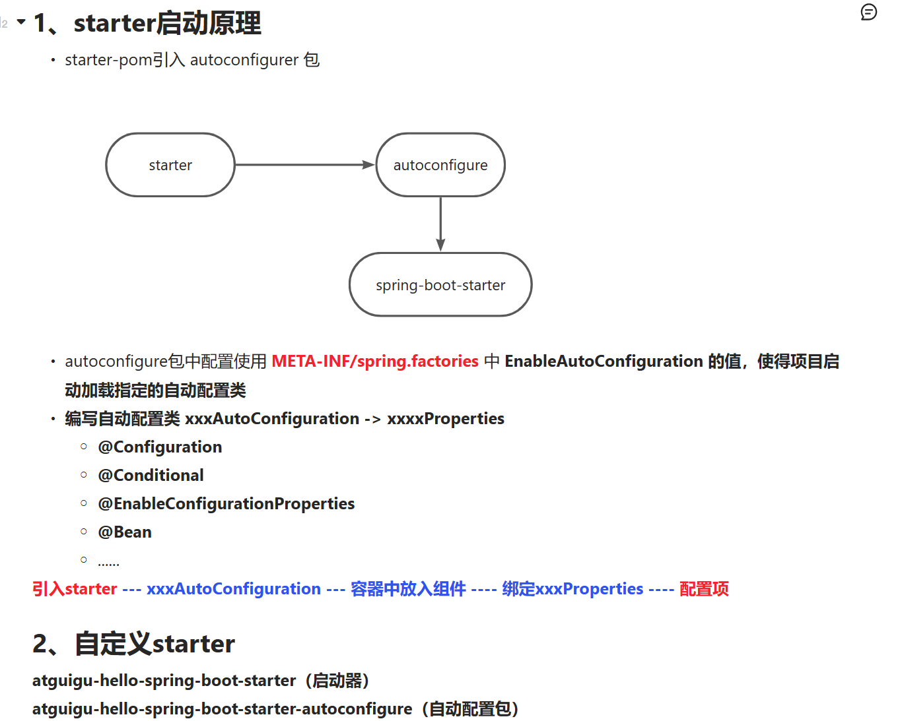

## 简介

> springboot是spring家族中的一个全新框架，用来简化spring程序的创建和开发过程。在以往我们通过SpringMVC+Spring+Mybatis框架进行开发的时候，我们需要配置web.xml，spring配置，mybatis配置，然后整合在一起，而springboot抛弃了繁琐的xml配置过程，采用大量默认的配置来简化我们的spring开发过程。

参考知识：`https://www.yuque.com/atguigu/springboot`

## 四大核心

### 依赖管理

- 父项目做依赖管理

- 开发导入starter场景启动器

    ```xml
    1. 见到很多 spring-boot-starter-*: *就某种场景
    2. 只要引入starter，这个场景的所有常规需要的依赖都自动导入
    https://docs.spring.io/spring-boot/docs/2.7.9/reference/html/using.html#using.build-systems.starters
    3. 见到的 *-spring-boot-starter:第三方为我们提供的简化开发的场景启动器
    ```

- 无需关注版本号

- 可以修改版本号

    ```xml
    1. 查看spring-boot-dependencies里规定当前依赖的版本用的key
    2. 在当前项目里重写配置
    <properties>
    	<mysql.version>5.1.2</mysql.version>
    </properties>
    ```


### 自动配置

- 自动配置Tomcat
- 自动配置SpringMVC
    - 引入SpringMVC全套组件
    - 自动配置SpringMVC常用组件（功能）
- 自动配置Web常见功能，如：字符编码问题
    - SpringBoot帮助我们配置好所有web开发的常见场景
- 默认的包结构
    - 主程序所在包及其下面的所有子包里面的组件都会被默认扫描出来
    - 无需配置包扫描
    - 想要改变扫描路径，@SpringBootApplication(scanBasePackages="com.atguigu")
- 各种配置拥有默认值
    - 默认配置最终都是映射到对应的实体类对象中
    - 配置文件的值最终会绑定到每个类上，这个类会在容器中创建对象
- 按需加载所有自动配置项
    - 非常多的starter
    - 引入了某个场景，则这个场景的自动配置才会开启
    - SpringBoot所有的自动配置功能都在spring-boot-autoconfigure包里面

## 简单用例

### maven配置

```xml
<?xml version="1.0" encoding="UTF-8"?>
<project xmlns="http://maven.apache.org/POM/4.0.0"
         xmlns:xsi="http://www.w3.org/2001/XMLSchema-instance"
         xsi:schemaLocation="http://maven.apache.org/POM/4.0.0 http://maven.apache.org/xsd/maven-4.0.0.xsd">
    <parent>
        <groupId>org.springframework.boot</groupId>
        <artifactId>spring-boot-starter-parent</artifactId>
        <version>2.7.9</version>
    </parent>
    <modelVersion>4.0.0</modelVersion>

    <artifactId>boot-helloworld</artifactId>

    <properties>
        <maven.compiler.source>8</maven.compiler.source>
        <maven.compiler.target>8</maven.compiler.target>
    </properties>
    <dependencies>
        <dependency>
            <groupId>org.springframework.boot</groupId>
            <artifactId>spring-boot-starter-web</artifactId>
        </dependency>
    </dependencies>
</project>
```

### 编写主程序

```java
package com.yangjj.boot;

import org.springframework.boot.SpringApplication;
import org.springframework.boot.autoconfigure.SpringBootApplication;

@SpringBootApplication
public class MainApplication {

    public static void main(String[] args) {
        SpringApplication.run(MainApplication.class,args);
    }
}

```

```java
@RestController
public class HelloController {

    @RequestMapping("/api/index")
    public String index(){
        return "helloworld!!!";
    }
}
```

### 部署

编写maven配置

```xml
<project>
    ...
	<packaging>jar</packaging>
    ...
    <build>
        <plugins>
            <plugin>
                <groupId>org.springframework.boot</groupId>
                <artifactId>spring-boot-maven-plugin</artifactId>
            </plugin>
        </plugins>
    </build>
    
</project>
```

运行maven指令

```text
maven clean package
```

打包后，运行jar包

```java
java -jar xxxxx.jar
```


## **@Configuration**注解

作用：代替spring配置文件注册bean

创建Configuration配置类，注册Pet组件

最佳实战：

- 配置类组件之间**<font color='aqua'>无</font>**依赖关系用Lite模式加速容器启动过程，减少判断
- 配置类组件之间**<font color='red'>有</font>**依赖关系，方法会被调用得到之前单示例组件，用Full模式

```java

/**
 * 1. 配置类里面使用@Bean标注在方法上给容器注册组件，默认也是单实例
 * 2. 配置类本身也是组件
 * 3. proxyBeanMethod:代理bean的方法，默认为true，代理对象调用方法，springboot总会检查这个组件是否存在容器该组件的实例，有则返回
 *      Full模式--true:单例
 *      Lite模式--false：多例
 */

@Configuration
public class MyConfiguration {
    /**
     *  外部无论对配置类中的这个组件注册方法调用多少次，获取的都是之前注册容器中的单实例。
     */
    // Bean注解的参数作为注册bean的id，不填时，方法名为注册bean的id
    @Bean  // 给容器添加组件，以方法名作为组件的id，返回类型就是组件类型，返回的值，就是容器中的实例。
    public Pet pet01(){
        return new Pet("王八","dog");
    }
}

```


## @Import注解

作用：代替spring配置文件注册bean

 标注位置：在包扫描的任何一个组件对象，@Controller，@Repository，@Service,@Configuration等

给容器中自动创建出这两个类型的组件，默认组件的名字就是全类名

```java
@Import({Pet.class})
@Configuration
public class MyConfiguration {}
```


## @Conditional注解

作用：条件装配，满足Conditional指定的条件，则进行组件注入


比如：

```java
如果容器中有tom的bean，则装配MyConfiguration里的所有bean
@ConditionalOnBean(name="tom")
@Configuration
public class MyConfiguration {}

// ===========================================
如果容器中没有tom的bean，则装配MyConfiguration里的所有bean
@ConditionalOnMissingBean(name="tom")
@Configuration
public class MyConfiguration {}

```

## @ImportResource注解

作用：导入Spring配置文件

```java
@Configuration
@ImportResource("classPath:beans.xml")
public class MyConfiguration {}
```


## 配置绑定

作用：将properties配置文件里的值绑定在类的属性上。

使用ConfigurationProperties注解时会警告`springboot configuration annotation processor not configured`

解决方案：

在pom.xml添加依赖

```xml
<dependency>
    <groupId>org.springframework.boot</groupId>
    <artifactId>spring-boot-configuration-processor</artifactId>
    <optional>true</optional>
</dependency>
 <build>
     <plugins>
         <plugin>
             <groupId>org.springframework.boot</groupId>
             <artifactId>spring-boot-maven-plugin</artifactId>
             <!-- 打包时排除-->
             <configuration>
                 <excludes>
                     <exclude>
                         <groupId>org.springframework.boot</groupId>
                         <artifactId>spring-boot-configuration-processor</artifactId>
                     </exclude>
                 </excludes>
             </configuration>
         </plugin>
     </plugins>
</build>
```

 

该依赖是springboot注解执行器，对使用ConfigurationProperties注解后，可以在配置文件中提示


### @Component + @ConfigurationProperties

```java
@Component
@ConfigurationProperties(prefix = "mycar")
public class Car {
    private String name;
    private String type;
    
    ....
        
}
// ---------------------------------------------------------------
// application.properties
server.port=8888

mycar.name=奥迪
mycar.type=A6L
// =================================================================
// controller
    
@RestController
public class HelloController {

    @Autowired
    private Car car;
    @RequestMapping("/car")
    public Car testCar(){

        return car;
    }
}
```

### @Configuration + @EnableConfigurationProperties + @ConfigurationProperties(推荐)

```java
@ConfigurationProperties(prefix = "mycar")
public class Car {
    private String name;
    private String type;
    
    ....
        
}
// ---------------------------------------------------------------
// application.properties
server.port=8888

mycar.name=奥迪
mycar.type=A6L
// ===============================================================
// configuration配置类
@Configuration
@EnableConfigurationProperties(value = Car.class)
// 1. 开启Car配置绑定功能
// 2. 把这个Car这个组件自动注册到容器中
public class MyConfiguration {}
```


## 开发技巧

### Lombok

作用：简化javabean开发

```xml
<dependency>
    <groupId>org.projectlombok</groupId>
    <artifactId>lombok</artifactId>
</dependency>
```

下载lombok插件（idea插件）

使用：

```java
@Data  // 设置成员变量的get、set方法
@ToString  // 重写toString方法
@AllArgsConstructor  // 设置全部成员变量的构造器
@NoArgsConstructor  // 设置空构造器
@EqualsAndHashCode  // 重写equals和hashcode方法
@ConfigurationProperties(prefix = "mycar")
public class Car {
    private String name;
    private String type;


}
```

```java
// 简化日志开发
@Slf4j
@RestController
public class HelloController {


    @RequestMapping("/api/index")
    public String index(){
        log.error("helloworld!!");  // slf4j日志功能

        return "helloworld!!!";
    }
}

```


### 直接获取配置文件的值


```java
public class HelloController {
	直接获取配置文件的person.name配置的值，如果没有配置，则结果是"里斯"    
    @Value("${person.name:里斯}")
    private String name;
}
```


## yaml规则

yaml也可以是yml

```java
@Component
@Data
@ToString
@NoArgsConstructor
@AllArgsConstructor
@ConfigurationProperties(prefix = "person")
public class Person {
    private String userName;
    private Boolean boss;


    private Date birth;
    private Integer age;
    private Pet pet;
    private String[] interests;
    private List<String> animal;
    private Map<String,Object> score;
    private Set<Double> salarys;
    private Map<String,List<Pet>> allPets;

}
```

```java
@Data
@AllArgsConstructor
@NoArgsConstructor
public class Pet {
    private String name;
    private String type;

}
```

```yml
person:
  # 字符串加单引号，控制台输出会转义，，如：\n输出\\n
  # 加双引号，则不会转义，如：\n输出换行
  userName: 王五
  boss: true
  birth: 2021-09-20
  age: 29
  pet:
    name: 旺财
    type: 狗
  interests:
    - 18
    - 打篮球
    - 踢足球
  animal: ["狗","猫","熊猫"]
  score:
    english: 80
    math: 90
  salarys: [55.68,95.54]
  allPets:
    health:
      - name: "钢炮"
        type: "猫"
      - {name: "砖头",type: "加菲猫"}
    sick: [{name: "螺丝钉",type: "狗"},{name: "小黑",type: "眼镜蛇"}]

```


## Web开发

### 静态资源访问

#### 静态资源目录

只要静态资源在类路径下：called `/static`(or `/public` or `/resources` or `/META-INF/resources`)

访问：当前项目根路径/ + 静态资源名

#### 静态资源访问前缀

```yaml
spring:
  mvc:
    static-path-pattern: /res/**
```


### Rest风格

- @xxxMapping；
- Rest风格支持（*使用**HTTP**请求方式动词来表示对资源的操作*）

- - *以前：**/getUser*  *获取用户*    */deleteUser* *删除用户*   */editUser*  *修改用户*      */saveUser* *保存用户*
    - *现在： /user*    *GET-**获取用户*    *DELETE-**删除用户*     *PUT-**修改用户*      *POST-**保存用户*
    - 核心Filter；HiddenHttpMethodFilter

- - - 用法： 表单method=post，隐藏域 _method=put
        - SpringBoot中手动开启

    - 

```yaml
spring:
  mvc:
    hiddenmethod:
      filter:
        enabled: true   #开启页面表单的Rest功能
```


### 常用参数注解使用

```java
@GetMapping("/car/{id}/owner/{username}")
public Map<String,Object> getCar(
    @PathVariable("id") String id,
    @PathVariable("username") String name,
    @PathVariable Map<String,String> pv,
    @RequestHeader("User-Agent") String userAgent,
    @RequestHeader Map<String,String> headers,
    @RequestParam("age") Integer age,
    @RequestParam("integers")List<String> inters,  // 参数已逗号隔开
    @RequestParam Map<String,String> params,
    @CookieValue("_ga") String ga,
    @CookieValue("_ga") Cookie cookie
){
    Map<String,Object> map = new HashMap<>();
    map.put("id",id);
    map.put("username",name);
    map.put("pv",pv);
    map.put("User-Agent",userAgent);
    map.put("headers",headers);
    map.put("age",age);
    map.put("inters",inters);
    map.put("params",params);
    map.put("_ga",ga);
    map.put("cookie",cookie.getName()+"===>"+cookie.getValue());
    return map;
}
```

### RequestAttribute(获取request域请求)

```java

@Controller
public class AttributeController {

    @GetMapping("/goto")
    public String gotoSwitch(HttpServletRequest request){
        request.setAttribute("msg","操作成功。。。。");
        request.setAttribute("code",200);
        return "forward:/success";
    }

    @ResponseBody
    @GetMapping("/success")
    public Map<String,Object> success(HttpServletRequest request,
                                      @RequestAttribute("msg") String msg,
                                      @RequestAttribute("code") int code
                                      ){
        Map<String,Object> map = new HashMap<>();
        map.put("param",request.getAttribute("msg"));
        map.put("annotation",msg);
        return map;

    }
}

```


### 拦截器

```java
// 登录拦截器
public class LoginInterceptor implements HandlerInterceptor {
    @Override
    public boolean preHandle(HttpServletRequest request, HttpServletResponse response, Object handler) throws Exception {
        /**
         * 登录前拦截请求
         */
        System.out.println("处理请求前执行....");
        return true;  // 放行
    }

    @Override
    public void postHandle(HttpServletRequest request, HttpServletResponse response, Object handler, ModelAndView modelAndView) throws Exception {
        System.out.println("处理请求后执行....");
    }

    @Override
    public void afterCompletion(HttpServletRequest request, HttpServletResponse response, Object handler, Exception ex) throws Exception {
        System.out.println("控制器方法执行后执行....");
    }
}
```

注册拦截器

```java
@Configuration
public class AdminConfig implements WebMvcConfigurer {

    @Override
    public void addInterceptors(InterceptorRegistry registry) {
        registry.addInterceptor(new LoginInterceptor())
                .addPathPatterns("/**")   // 拦截器拦截所有请求
                .excludePathPatterns("/","/api/v1/login","/images/**","/static/**"); // 拦截器排除该路径
    }
}
```

注意：

如果拦截所有请求，静态资源也会被拦截


### 上传文件

```java
// 上传文件
@RestController
@Slf4j
public class UploadController {
    @RequestMapping("/upload")
    public String uploadFile(
            @RequestParam("email") String email,
            @RequestParam("username") String username,
            @RequestPart("headImage") MultipartFile headImage,
            @RequestPart("icons") MultipartFile[] icons
            ) throws IOException {

        log.info("输出内容：email={},username={}，headImage={}，icons={}",
                email,username,headImage.getSize(),icons.length
                );

        if (!headImage.isEmpty()){
            headImage.transferTo(new File("D://data/" + headImage.getOriginalFilename()));
        }
        if (icons.length > 0){
            for (MultipartFile file:icons){
                if (!file.isEmpty()){
                    file.transferTo(new File("D://data/" + file.getOriginalFilename()));
                }
            }
        }

        return "上传成功";
    }
}
```

注意：如果文件过大，可以修改配置文件

```yaml
spring:
	servlet:
        multipart:
          max-request-size:  200MB
          max-file-size: 10MB

```


### 错误页面处理

404需要放在

```
src/
 +- main/
     +- java/
     |   + <source code>
     +- resources/
         +- public/
             +- error/
             |   +- 404.html
             +- <other public assets>
```

5xx需要放在

```
src/
 +- main/
     +- java/
     |   + <source code>
     +- resources/
         +- templates/
             +- error/
             |   +- 500.html
             +- <other public assets>
```

### Web原生注入Servlet、Filter、Listener

#### 使用Servlet API

需要在Application应用中添加ServletComponentScan注解

```java
@ServletComponentScan(basePackages = "com.yangjj.web.servlet")
@SpringBootApplication
public class BootWebApplication {

    public static void main(String[] args) {
        SpringApplication.run(BootWebApplication.class, args);
    }

}
```

```java
//MyServlet.class
// 自定义Servlet，路径匹配
@WebServlet(urlPatterns = "/my")
public class MyServlet extends HttpServlet {
    @Override
    protected void doGet(HttpServletRequest req, HttpServletResponse resp) throws ServletException, IOException {
        resp.getWriter().write("徐小迪");
    }
}
```

```java
// MyFilter.class
@Slf4j
@WebFilter
public class MyFilter implements Filter {
    @Override
    public void init(FilterConfig filterConfig) throws ServletException {
        log.info("Filter初始化完成.....");
    }

    @Override
    public void doFilter(ServletRequest servletRequest, ServletResponse servletResponse, FilterChain filterChain) throws IOException, ServletException {
        log.info("MyFilter工作！！！");
        filterChain.doFilter(servletRequest, servletResponse);
    }

    @Override
    public void destroy() {
        Filter.super.destroy();
    }
}


// MyListener.class
@Slf4j
//@WebListener
public class MyListener implements ServletContextListener {
    @Override
    public void contextInitialized(ServletContextEvent sce) {
        log.info("监听器已开启");
        ServletContextListener.super.contextInitialized(sce);
    }

    @Override
    public void contextDestroyed(ServletContextEvent sce) {
        ServletContextListener.super.contextDestroyed(sce);
    }
}


```


#### 使用RegistrationBean

```java

@Configuration
public class MyRegistConfig {

    @Bean
    public ServletRegistrationBean myServlet(){
        MyServlet servlet = new MyServlet();
        return new ServletRegistrationBean(servlet,"/my");
    }

    @Bean
    public FilterRegistrationBean myFilter(){
        MyFilter filter = new MyFilter();
        FilterRegistrationBean filterRegistrationBean = new FilterRegistrationBean(filter);
        filterRegistrationBean.setUrlPatterns(Arrays.asList("/my","/ss"));
        return filterRegistrationBean;
    }

    @Bean
    public ServletListenerRegistrationBean myListener(){
        MyListener listener = new MyListener();
        return new ServletListenerRegistrationBean(listener);

    }
}
```


## 数据访问


### 自定义配置druid数据源

pom.xml

```xml
<dependency>
    <groupId>org.springframework.boot</groupId>
    <artifactId>spring-boot-starter-data-jdbc</artifactId>
</dependency>
<dependency>
    <groupId>mysql</groupId>
    <artifactId>mysql-connector-java</artifactId>
    <version>8.0.31</version>
</dependency>
<!-- https://mvnrepository.com/artifact/com.alibaba/druid -->
<dependency>
    <groupId>com.alibaba</groupId>
    <artifactId>druid</artifactId>
    <version>1.2.8</version>
</dependency>
```

```yaml
# application.yml
spring:
  datasource:
    url: jdbc:mysql://127.0.0.1:3306/blogdb
    username: root
    password: 123456
    driver-class-name: com.mysql.cj.jdbc.Driver
```

```java
//DataSourceConfig.java

@Configuration
public class DataSourceConfig {
    /**
     * 配置Druid数据源
     * @return
     */
    @Bean
    @ConfigurationProperties(prefix = "spring.datasource")
    public DataSource dataSource() throws SQLException {
        DruidDataSource dataSource = new DruidDataSource();
        // stat:sql监控；
        // wall:开启防火墙
        dataSource.setFilters("stat,wall");
        return dataSource;
    }


    /**
     * 配置druid的监控页面
     */
    @Bean
    public ServletRegistrationBean<StatViewServlet> statViewServlet(){
        StatViewServlet statViewServlet = new StatViewServlet();
        ServletRegistrationBean<StatViewServlet> servletRegistrationBean = new ServletRegistrationBean<>(statViewServlet, "/druid/*");
        Map<String,String> map = new HashMap<>();
        map.put("resetEnable","true");
        map.put("loginUsername","admin");
        map.put("loginPassword","1234");
        servletRegistrationBean.setInitParameters(map);
        return servletRegistrationBean;
    }
    // https://github.com/alibaba/druid/wiki/%E9%85%8D%E7%BD%AE_%E9%85%8D%E7%BD%AEWebStatFilter
    @Bean
    public FilterRegistrationBean druidWebStatFilter(){
        WebStatFilter webStatFilter = new WebStatFilter();
        FilterRegistrationBean<WebStatFilter> webStatFilterFilterRegistrationBean = new FilterRegistrationBean<>(webStatFilter);
//        Map<String,String> map = new HashMap<>();
//        map.put("exclusions","*.js,*.gif,*.jpg,*.png,*.css,*.ico,/druid/*");
//        webStatFilterFilterRegistrationBean.setInitParameters(map);
        webStatFilterFilterRegistrationBean.addInitParameter("exclusions","*.js,*.gif,*.jpg,*.png,*.css,*.ico,/druid/*");
        webStatFilterFilterRegistrationBean.setUrlPatterns(Arrays.asList("/*"));
        return webStatFilterFilterRegistrationBean;
    }
}

```


## starter引入druid数据源

```pom
<dependency>
    <groupId>com.alibaba</groupId>
    <artifactId>druid-spring-boot-starter</artifactId>
    <version>1.1.10</version> 
</dependency>
```

```yml
# application.yml
spring:
  datasource:
    url: jdbc:mysql://127.0.0.1:3306/blogdb
    username: root
    password: 123456
    driver-class-name: com.mysql.cj.jdbc.Driver
```

配置监控页

```properties
########## 配置StatViewServlet（监控页面），用于展示Druid的统计信息 ##########
# 启用StatViewServlet
spring.datasource.druid.stat-view-servlet.enabled=true
# 访问内置监控页面的路径，内置监控页面的首页是/druid/index.html
spring.datasource.druid.stat-view-servlet.url-pattern=/druid\/*
# 不允许清空统计数据,重新计算
spring.datasource.druid.stat-view-servlet.reset-enable=false
# 配置监控页面访问用户名
#spring.datasource.druid.stat-view-servlet.login-username=admin
# 配置监控页面访问密码
#spring.datasource.druid.stat-view-servlet.login-password=admin
# 允许访问的地址，如果allow没有配置或者为空，则允许所有访问
#spring.datasource.druid.stat-view-servlet.allow=127.0.0.1
# 拒绝访问的地址，deny优先于allow，如果在deny列表中，就算在allow列表中，也会被拒绝
#spring.datasource.druid.stat-view-servlet.deny=
########## 配置WebStatFilter，用于采集web关联监控的数据 ##########
# 启动 StatFilter
spring.datasource.druid.web-stat-filter.enabled=true
# 过滤所有url
spring.datasource.druid.web-stat-filter.url-pattern=\/*
# 排除一些不必要的url
spring.datasource.druid.web-stat-filter.exclusions=/druid\/*,*.js,*.gif,*.jpg,*.bmp,*.png,*.css,*.ico
# 开启session统计功能
spring.datasource.druid.web-stat-filter.session-stat-enable=true
# session的最大个数,默认1000
spring.datasource.druid.web-stat-filter.session-stat-max-count=1000
spring.datasource.druid.initial-size=5
spring.datasource.druid.min-idle=5
spring.datasource.druid.max-active=20
# 配置获取连接等待超时的时间
spring.datasource.druid.max-wait=60000
# 配置间隔多久才进行一次检测，检测需要关闭的空闲连接，单位是毫秒
spring.datasource.druid.time-between-eviction-runs-millis=60000
# 配置一个连接在池中最小生存的时间，单位是毫秒
spring.datasource.druid.min-evictable-idle-time-millis=30000
spring.datasource.druid.validation-query=SELECT 1 FROM DUAL
spring.datasource.druid.test-while-idle=true
spring.datasource.druid.test-on-borrow=false
spring.datasource.druid.test-on-return=false
# 打开PSCache，并且指定每个连接上PSCache的大小
spring.datasource.druid.pool-prepared-statements=true
spring.datasource.druid.max-pool-prepared-statement-per-connection-size=20
spring.datasource.druid.filters=stat,wall
# Spring 监控，利用aop 对指定接口的执行时间，jdbc数进行记录
spring.datasource.druid.aop-patterns= com.admin.controller.*,com.front.controller.*

```


## 整合mybatis（starter引入）

```xml
  <dependency>
      <groupId>org.mybatis.spring.boot</groupId>
      <artifactId>mybatis-spring-boot-starter</artifactId>
      <version>2.1.4</version>
</dependency>
```

```yaml
mybatis:
#  config-location: classpath:/mybatis/mybatis-config.xml   # 配置文件路径，如果配置了configuration选项，则不能配置该行
  mapper-locations: classpath:/mybatis/mapper/*.xml  # 配置mapper的xml文件路径
  configuration:  # 全局配置
    map-underscore-to-camel-case: true  # 配置大小写转换
```

```java
// UserInfo.java

@Data
public class UserInfo {
    private Long id;
    private String username;
    private String password;
    private String email;

}


// mapper/UserInfoMapper
@Mapper
public interface UserInfoMapper {
    UserInfo getUserInfoById(@Param("id") Long id);

}
```

```xml
<!--   UserInfoMapper.xml   -->
<?xml version="1.0" encoding="UTF-8"?>
<!DOCTYPE mapper
        PUBLIC "-//mybatis.org//DTD Mapper 3.0//EN"
        "http://mybatis.org/dtd/mybatis-3-mapper.dtd">
<mapper namespace="com.yangjj.web.mapper.UserInfoMapper">
    <resultMap id="userInfo" type="com.yangjj.web.bean.UserInfo">
        <result property="username" column="u_user"/>
        <result property="password" column="u_pwd" />
        <result property="email" column="u_email" />
    </resultMap>

    <select id="getUserInfoById" resultMap="userInfo">
        select * from user_info where id = #{id}
    </select>
</mapper>

```


### mybatis注解配置混合

```java
@Mapper
public interface CityMapper {
    
    @Select("select * from city where id=#{id}")
    City getById(Integer id);
    
    @Insert("insert into city(`name`,`state`,`country`) values(#{name},#{state},#{country})")
    @Options(useGeneratedKeys=true,keyProperty="id")
    public void insert(City city);
}
```

最佳实战：

- 引入mybatis-starter
- 配置application.yaml中，指定mapper-location位置即可
- 编写Mapper接口并标注@Mapper注解
- 简单方法直接注解方式
- 复杂方法编写mapper.xml进行绑定映射
- @MapperScan("com.yangjj.web.mapper")简化，其他接口就可以不用标注@Mapper注解

## 整合mybatis-plus（starter引入）

### 安装

1. 安装插件->mybatisx

2. 引入pom

    ```xml
    <dependency>
    	<groupId>com.baomidou</groupId>
        <artifactId>mybatis-plus-boot-starter</artifactId>
        <version>3.4.1</version>
    </dependency>
    ```

    

### 使用

定义bean类

```java
// StudentInfo.class
@ToString
@Data
@TableName("student_info")
public class StudentInfo {

    /*
    所有属性都应该在数据库中，需要加上注解TableField，表示该变量不在数据库中
     */
    @TableField(exist = false)
    private String username;
    @TableField(exist = false)
    private String password;


    /*
    库表字段
     */
    private Integer id;
    private String name;
    private Integer age;
    private String sex;
    private String email;

}
```

定义mapper接口

mapper接口继承BaseMapper，即可使用Mabatis-plus的通用方法

```java
@Mapper
public interface StudentInfoMapper extends BaseMapper<StudentInfo> {
}

```

测试功能

```java
@Autowired
StudentInfoMapper studentInfoMapper;  

@Test
void test1(){
    StudentInfo studentInfo = studentInfoMapper.selectById(1L);
    System.out.println(studentInfo);
}

```


### mybatis-plus操作Service层

定义Service接口,继承`IService`，泛型为返回的对象类型。

```java
public interface StudentInfoService extends IService<StudentInfo> {
}

```

定义Service接口的实现类，继承`ServiceImpl`，泛型有两个，第一个是Mapper接口，第二个是返回的对象类型。

```java
@Service
public class StudentInfoServiceImpl extends ServiceImpl<StudentInfoMapper, StudentInfo> implements StudentInfoService {
}

```

使用studentInfoService去查询

```java
@RestController
public class MybatisPlusController {

    @Autowired
    StudentInfoService studentInfoService;

    @GetMapping("/getStudent")
    public List<StudentInfo> getStudentList(){
        List<StudentInfo> studentInfoList = studentInfoService.list();
        return studentInfoList;

    }
}
```

分页

```java
@GetMapping("/getStudent")
public List<StudentInfo> getStudentList(){
    List<StudentInfo> studentInfoList = studentInfoService.list();

    // 分页操作
    // 第一页，40条数据
    Page<StudentInfo> studentInfoPage = new Page<>(1, 40);

    // 分页查询的结果
    Page<StudentInfo> page = studentInfoService.page(studentInfoPage, null);

    List<StudentInfo> records = page.getRecords();  // 获取分页后的数据
    long current = page.getCurrent();  // 获取当前页码
    long pages = page.getPages();  // 获取总页数
    long total = page.getTotal();  // 获取数据总量


    return studentInfoList;

}
```


## 整合Redis

导入starter

```xml
<dependency>
    <groupId>org.springframework.boot</groupId>
    <artifactId>spring-boot-starter-data-redis</artifactId>
</dependency>
```

配置redis

```yaml
spring:
  redis:
    database: 1
    host: localhost
    password: Sd_12345
    client-type: lettuce
```


使用，默认是lettuce

```java

@Autowired
StringRedisTemplate redisTemplate;
@Test
void test2(){
    ValueOperations<String, String> valueOperations = redisTemplate.opsForValue();
    valueOperations.set("/asds","123");

    String s = valueOperations.get("/asds");
    System.out.println(s);
}
```


切换jedis,只需要加载jedis的配置

```pom
<dependency>
    <groupId>redis.clients</groupId>
    <artifactId>jedis</artifactId>
</dependency>
```

配置`spring.redis.client-type`,值为`jedis`


## Junit5常用注解

- @Test:表示测试方法

- @DisplayName：给测试类起名字，使用范围：可以在类或者类方法使用。

- @BeforeEach：在每个单元测试运行之前执行

- @AfterEach：在每个单元测试运行之后执行

- @BeforeAll：表示在所有单元测试之前执行，只运行一次，因此需要使用static修饰

- @AfterAll: 表示在所有单元测试之后执行，只运行一次，因此需要使用static修饰

- @Disabled：表示测试方法不执行。

- @Timeout：表示测试方法执行如果超过指定时间，则会抛出异常。

    ```java
    // 超过5秒，则抛出异常
    @Timeout(value = 5,unit = TimeUnit.SECONDS)
    @Test
    void test2(){
        ValueOperations<String, String> valueOperations = redisTemplate.opsForValue();
        valueOperations.set("/asds","123");
    
        String s = valueOperations.get("/asds");
        System.out.println(s);
    }
    ```

- @RepeatedTest:重复运行次数

### 断言测试(Asserts)

断言是测试方法中的核心部分，用来对测试需要满足的条件进行验证。

```java

public class AssertsTest {
    @DisplayName("测试简单断言")
    @Test
    void test1(){
        int cal = 3+5;
        assertEquals(8,cal,"计算结果不一致");
    }

    @DisplayName("测试对象是否一致断言")
    @Test
    void test2(){
        Object obj1 = new Object();
        Object obj2 = new Object();
        assertSame(obj1,obj2,"对象不一致");
    }

    @DisplayName("测试数组断言")
    @Test
    void test3(){
        assertArrayEquals(new int[]{3,5},new int[]{3,5},"数组内容不一致");
    }

    @DisplayName("测试组合断言")
    @Test
    void test4(){
        /**
         * 当所有断言都成功后，才往下继续执行
         */
        assertAll(
                "test",
                ()->assertTrue(true && true,"为真"),
                ()->assertEquals(5,5,"数字相同")
                );
    }

    @DisplayName("测试异常断言")
    @Test
    void test5(){
        Assertions.assertThrows(ArithmeticException.class,()->{
            int i = 10/0;
            },"报错不执行！！");
    }

    @DisplayName("测试超时断言")
    @Test
    void test6(){
        Assertions.assertTimeout(Duration.ofSeconds(500),()->{
            Thread.sleep(500);
        },"运行超时");
    }

    @DisplayName("快速失败")
    @Test
    void test7(){
        Assertions.fail("直接失败");
    }

}
```

### 前置条件（Assumptions）

如果不满足条件，就没有必要继续往下执行，则会跳过测试

### 参数化测试（ParamterizedTest）

```java
@ParameterizedTest
@DisplayName("参数化测试")
@ValueSource(strings = {"aa","bb","cc"})
@MethodSource("getStreamTest")
void test8(String str){
    System.out.println(str);
}

static Stream<String> getStreamTest(){
    return Stream.of("dd","ee","ff");
}
```


## Profile功能

为了方便多环境适配，springboot简化了profile功能


### application-profile功能

- 默认配置文件 application.yaml，任何时候都会加载

- 指定环境配置文件  application-{env}.yaml

- 激活指定环境

    - 配置文件激活：`spring.profiles.active={env}`

    - 命令行激活：`java -jar xxxx.jar --spring.profiles.active={env}`

        修改配置文件的任意值，命令行优先

    - 默认配置与环境配置同时生效

    - 同名配置项，profile配置优先

### 条件装配

在prod环境下才加载该配置

```java
@Configuration(proxyBeanMethods = false)
@Profile("prod")
public class MyConfiguration {
    
}

```


## 自定义starter



## 问题

如果出现`Whitelabel Error Page`,则需要把Application启动文件放到controller、mapper同级的文件夹目录。

### 拦截器、过滤器、监听器的区别

Spring的拦截器、过滤器、监听器都是用于增强Spring应用程序的功能和扩展Spring应用程序的应用的组件，但它们的作用和使用场景不同。

拦截器(Interceptor)：是在Spring MVC框架中用来拦截请求并进行处理的组件。拦截器可以对请求进行预处理、修改请求参数、修改请求头信息、验证请求合法性、过滤敏感信息等操作，然后将请求传递给下一个拦截器或Controller进行处理。拦截器只能拦截Spring MVC中的请求。

过滤器(Filter)：是在Servlet容器接收到请求之后，但在Spring MVC处理请求之前进行拦截和处理的组件。过滤器可以对请求进行预处理、修改请求参数、修改请求头信息、验证请求合法性、过滤敏感信息等操作，然后将请求传递给下一个过滤器或Spring MVC进行处理。过滤器可以拦截Spring MVC、Struts等框架中的请求。

监听器(Listener)：是用于监听Spring容器中的事件和状态变化的组件。监听器可以监听Spring容器的生命周期事件（如容器初始化、销毁等）、Session生命周期事件（如Session创建、销毁、属性变化等）、ServletRequest生命周期事件（如请求属性变化等）等。通过监听器，可以在事件触发时执行自定义的操作，例如记录日志、清理资源、修改配置等。

综上，拦截器主要用于拦截Spring MVC中的请求，过滤器主要用于拦截Servlet容器中的请求，监听器主要用于监听Spring容器中的事件和状态变化。三者的作用和使用场景不同，但它们都可以用于增强Spring应用程序的功能和扩展Spring应用程序的应用。

