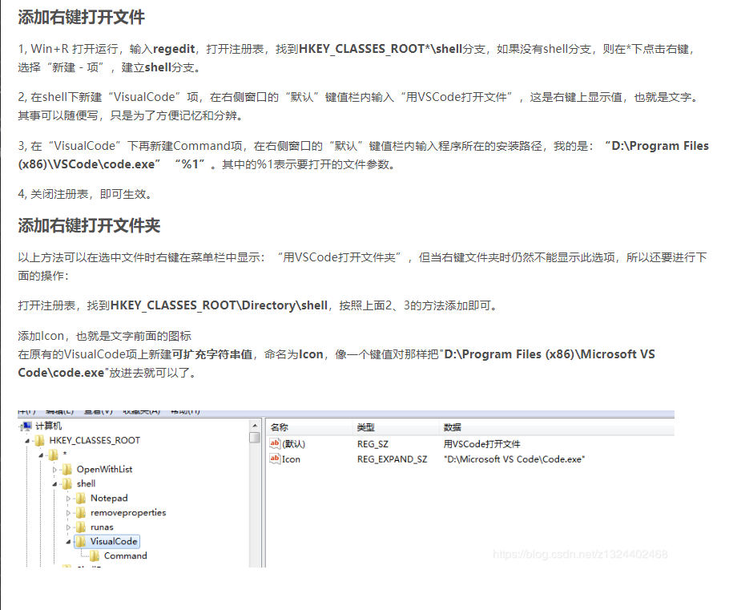

## VSCode设置用户代码片段

1. 文件-->首选项-->用户片段

2. 选择新建代码片段

3. 配置如下图，拿箭头函数举例子

   ```text
   {
   // Example:
   	// "Print to console": {
   	// 	"scope": "javascript,typescript",
   	// 	"prefix": "log",
   	// 	"body": [
   	// 		"console.log('$1');",
   	// 		"$2"
   	// 	],
   	// 	"description": "Log output to console"
   	// }
   	"箭头函数":{
   		"prefix": "df",
   		"body":[
   			"($1) => { \n //函数体 \n$2}"
   		],
   		"description": "Arrow Function"
   	}
   }
   ```

   4.使用自定义代码片段

   ```text
   输入df，按回车即可生成自定义代码片段
   () => { 
    //函数体 
   }
   ```

   ## 编码规范

   1. 项目所用常量统一管理到一个文档中。

## 将VSCode添加到注册表

