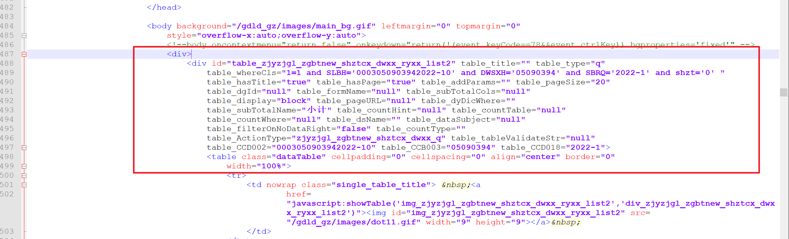
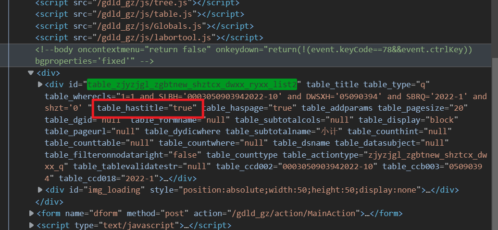

### ① 	contains用法

意义：包含，可用于属性、字符串

例如：

> 文本包含666的所有td元素
>
> //td[contains(text(),"666")]

> class属性包含a1的所有td元素
>
> //td[contains(@class,"a1")]

### ②	ends-with 用法

意义：以...结尾

**ends-with(@id,str)** 等价于 **substring(@id, string-length(@id) - string-length(str) +1) = str**

**<font color='red'>但ends-with使用无效，目前只能使用后者的表达式</font>**

例如：

> 寻找字符串结尾为tdList的所有td元素
>
> //td[substring(@id, string-length(@id) - string-length("tdList") +1) = "tdList"]

### xpath节点用法

- attribute 选取当前节点的所有属性    /attribute::id
- child  选取当前节点的所有子元素
- ancestor 父辈元素   /ancestor::div  所有父辈div元素
- descendant 后代 /descendant-or-self 后代及当前节点本身
- following  选取文档中当前接待你的结束标签之后的所有节点
- namespace 选取当前接待你的所有命名空间节点
- parent  选取当前节点的父节点
- preceding  选取文档中当前节点的开始标签之前的所有节点
- preceding-sibling 选取当前节点之前的所有同级节点

**<font color='red'>//td[contains(text(),'2020')]/preceding-sibling::td[2] 这里td[2]是指离该元素的距离
而不是从开头数起</font>**

### xpath索引使用管道符

//div[postion()=4 or position()=3]


## xpath获取自定义属性值失败



通过 `//div[@id='table_zjyzjgl_zgbtnew_shztcx_dwxx_ryxx_list2']/@table_hasTile`xpath获取div标签的hasTitle属性值，结果是无法获取对应的值。

原因：解析到html时，标签的属性值变成了小写。



所以xpath应该为`//div[@id='table_zjyzjgl_zgbtnew_shztcx_dwxx_ryxx_list2']/@table_hastile`


## 处理没有标签的文本内容

```html
<button>
    <i>[]</i>
    "	
    	合同复核
    	"
</button>
```


//button[contains(normalize-space(.),"合同复核")]
