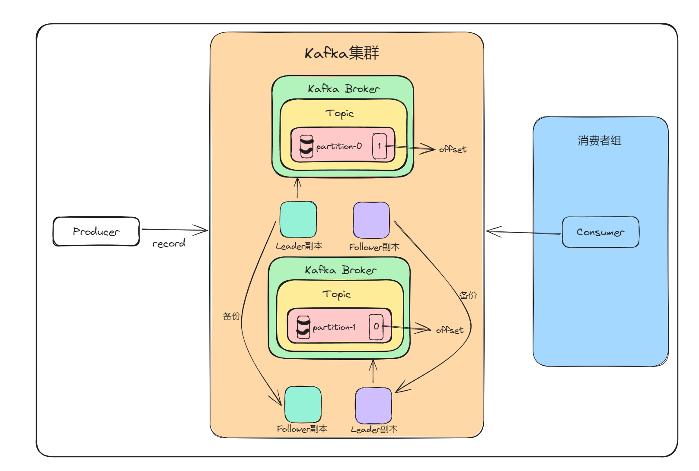
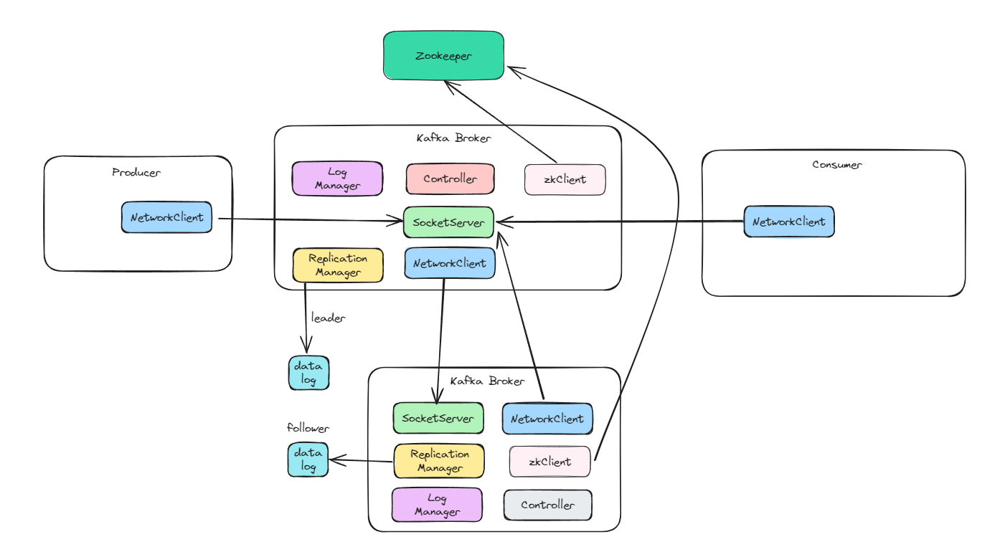

# Kafka

## 安装kafka

1.   安装zookeeper： [Zookeeper下载与安装教程（for windows）_zk下载windows-CSDN博客](https://blog.csdn.net/zlbdmm/article/details/109669049)
2.   安装kafka

## 启动

1.   启动zookeeper： `cmd` -> `zkServer`
2.   启动kafka

## 知识点

### 横向拓展和纵向拓展

>   横向拓展： 增加服务节点，搭建服务集群，降低单点故障所带来的风险

>   纵向扩展：增加服务器配置，选用更高配置的硬件。

### kafka框架

为了数据可靠性，可以将数据文件进行备份，在Kafka中称为副本， 多个副本同时只能有一个提供哦那个数据的读写操作

具有读写能力的副本叫Leader副本，作为备份的副本成为Follower副本

### 基础组件框架

1.   Replication Manager: 对副本(数据| record)的管理
2.   每个Broker都有一个zkClient, 连接到Zookeeper, 通过Zookeeper选举做kafka控制器
3.   多个Broker中有一个Controller，管理所有Broker

