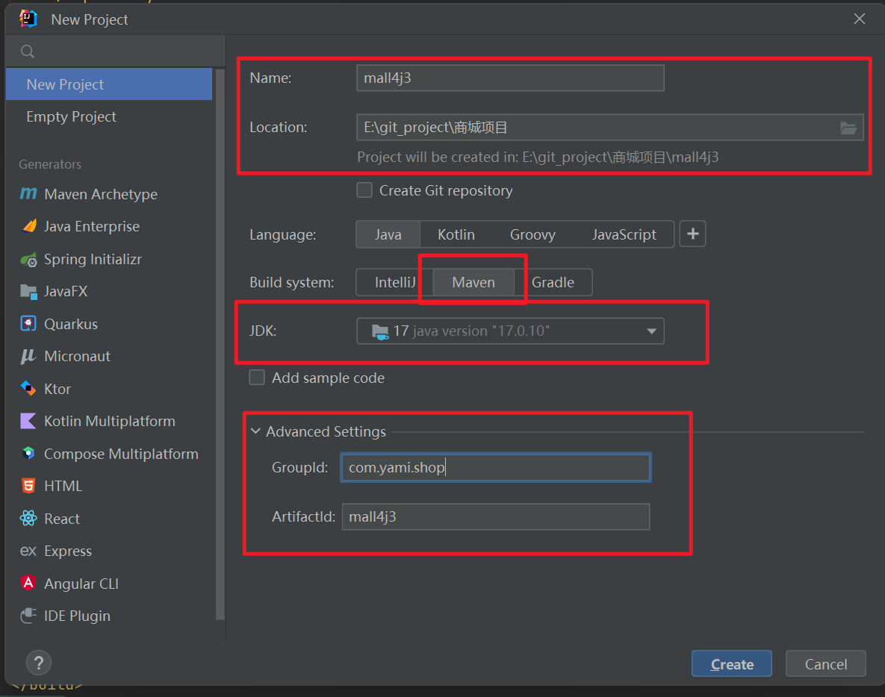
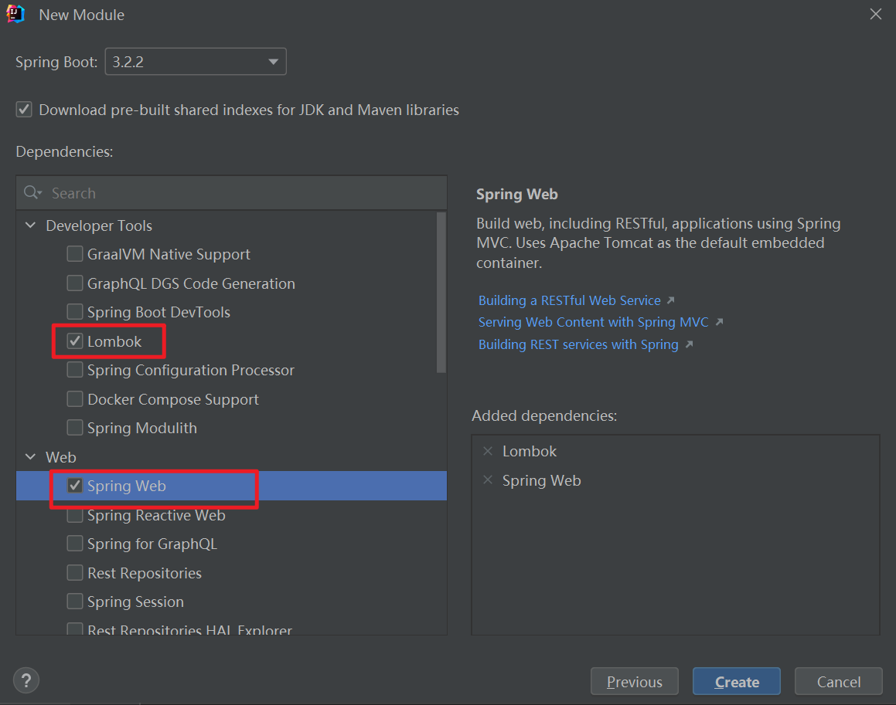

# 内容介绍

本篇内容主要以java17与springboot3.x编写。


# 基础知识

## profiles特性

application支持多配置文件，由profiles控制使用哪个配置文件

主配置文件`application.yml`

```yml
spring:
  # 环境 dev|test|prod
  profiles:
    active: dev   # 加载application-dev.yml配置文件
```

## @Component的作用

`@Component`是Spring框架中的一个注解，`@Component`注解标识的类会被Spring自动扫描并注册为Bean，

可以在其他组件中通过`@Autowired`注解进行注入和使用

`@Component`常用参数如下：

1.   value：指定组件的名称，如果不指定，默认为类名的首字母小写，可以通过value属性指定别名，方便在注入时使用
2.   scope:指定组件的作用域，包括：singleton(单例)、prototype(原型)、request(请求)、session(会话)等
3.   lazy:指定组件是否为懒加载，默认false，即容器启动时就会实例化该组件。
4.   autowire:指定组件的自动装配方式，no（不自动装配）、byType（按类型自动装配）、byName（按名称自动装配）

## AOP切面

### 表达式@Around("@annotation(authCheck)")的含义

在 Spring Boot 中，`@Around("@annotation(authCheck)")` 是一种使用 AOP (面向切面编程) 的切点表达式。具体来说，`@Around` 注解定义了一个环绕通知，而 `@annotation(authCheck)` 是一个切点表达式，用于匹配带有特定注解的方法。下面是对这个表达式的解释：

1.  **@Around**：这是一种通知类型，表示在方法执行之前和之后都可以执行一些特定的操作。环绕通知通常用于请求处理、事务管理或安全检查等场景。
2.  **@annotation(authCheck)**：这个部分是切点表达式，意思是匹配所有被 `authCheck` 注解标记的方法。在这里，`authCheck` 是一个注解，它可以是你自己定义的注解，用于标记需要进行某种特定授权检查的方法。这使得你能够针对标注了这个注解的方法应用 AOP 逻辑，例如认证、日志、性能监控等。


## AOP不生效

1.   检查aop表达式是否正确， 

     比如如下代码，我想表达的是com.forty.controller所有类的所有方法。

     但如果表达式是`"execution(* com.forty.controller.*(..))"`,少了一个星号，则匹配不上

     ```java
     @Slf4j
     @Aspect
     @Component
     public class LogAspect {
     
         @Pointcut("execution(* com.forty.controller.*.*(..))")
         public void pointcut() {}
     
         @Before("pointcut()")
         public void beforeInterceptor(JoinPoint joinPoint) {
             log.info("audit... " + joinPoint.getSignature().getName());
         }
     }
     
     ```

2.   检查启动类是否添加注释开启aop. `EnableAspectJAutoProxy`开启aop

     ```java
     @SpringBootApplication
     @MapperScan("com.forty.mapper")
     @EnableAspectJAutoProxy(proxyTargetClass = true, exposeProxy = true)  
     public class OpenApiBackendApplication {
     
         public static void main(String[] args) {
             SpringApplication.run(OpenApiBackendApplication.class, args);
         }
     
     }
     ```


## Mybatis-plus自定义mapper函数中如何使用Wrapper

使用场景：

1.   mybatis-plus提供的方法不满足需求，需要自己写一个mapper函数和`mapper.xml`
2.   想使用现成的Wrapper体系


步骤：

1.   在mapper接口中定义方法， 使用`@Param(Constants.WRAPPER) QueryWrapper<T> queryWrapper`

     ```java
     public interface RoleAssignmentMapper extends BaseMapper<RoleAssignment> {
         List<RoleAssignmentVO> getRoleAssignmentList(@Param(Constants.WRAPPER) QueryWrapper<RoleAssignment> queryWrapper);
     
     }
     
     ```

2.   在`mapper.xml`文件中使用wrapper， 用`${ew.customSqlSegment}`

     ```java
     <mapper namespace="com.forty.mapper.RoleAssignmentMapper">
     
         <resultMap id="RoleMapResult" type="com.forty.model.vo.RoleAssignmentVO">
             <result property="roleId" column="role_id" jdbcType="INTEGER"/>
             <result property="userId" column="user_id" jdbcType="BIGINT"/>
             <result property="roleName" column="role_name" jdbcType="VARCHAR"/>
             <result property="userAccount" column="user_account" jdbcType="VARCHAR"/>
         </resultMap>
     
     
     
         <select id="getRoleAssignmentList" resultMap="RoleMapResult">
           select
               role_assignment.role_id as role_id, role_assignment.user_id as user_id,
               user_info.user_account as user_account, user_role.role_name as role_name
           from role_assignment
           LEFT JOIN user_info ON user_info.id = role_assignment.user_id
           LEFT JOIN user_role ON user_role.role_id = role_assignment.role_id
           ${ew.customSqlSegment}
         </select>
     </mapper>
     
     ```

     

# 环境搭建

使用intellij创建项目

1.   新建项目

     

2.   新建Web模块

     

     

     

## 


# 其他未整合部分


## swagger

作用：快速生成接口文档并可以实时更新。

1. 使用swagger

    引入swagger依赖

    ```xml
    <dependency>
        <groupId>io.springfox</groupId>
        <artifactId>springfox-boot-starter</artifactId>
        <version>3.0.0</version>
    </dependency>
    ```

    

2. 编写swagger配置类

    ```java
    
    
    @Data
    @EnableOpenApi  // 开启openApi接口规范
    @ConfigurationProperties("swagger")
    @Configuration
    public class SwaggerConfig {
        /**
         * 生产环境一般是关闭的，所以定义一个变量
         */
    
        private Boolean enable = true;
    
        /**
         * 项目应用名
         */
        private String applicationName;
    
    
        /**
         *  项目版本信息
         */
        private String applicationVersion;
    
        // 项目描述信息
        private String applicationDescription;
    
        @Bean
        public Docket docket(){
            return new Docket(DocumentationType.OAS_30)
                    .pathMapping("/")
                    .enable(enable)
                    .apiInfo(apiInfo())
                    .protocols(new HashSet<>(Arrays.asList("http","https")))   // 支持的协议
                    .select()
                    //apis(Predicate selector) 控制哪些接口暴露给swagger，
                    // 1. RequestHandlerSelectors.any() 所有都暴露
                    // 2. RequestHandlerSelectors.basePackage("com.keep.*")  指定包位置
                    // 3. withMethodAnnotation(ApiOperation.class)标记有这个注解 ApiOperation
                    .apis(RequestHandlerSelectors.basePackage("com.jyzx.modules"))
                    .paths(PathSelectors.ant("/controller/**"))
                    .build();
    
        }
    
        private ApiInfo apiInfo() {
            return new ApiInfoBuilder()
                    .title(applicationName)
                    .description(applicationDescription)
                    .contact(new Contact("yangjj", "localhost:8080", "995854654@qq.com"))
                    .version(applicationVersion)
                    .build();
        }
    }
    
    
    ```

    

3. application配置，解决空指针异常

    ```yaml
    spring:
      mvc:
        pathmatch:
          matching-strategy: ant_path_matcher
    ```

    

4. 编写测试用例

    ```java
    /**
     * 用户接口类
     * @author admin
     */
    @Api(name = "用户管理")
    @RestController
    @RequestMapping("/user")
    public class UserController {
    
        @Operation(tags = "用户管理", summary = "获取用户信息", description = "获取指定用户的用户信息")
        @ApiResponses(value = {
                @ApiResponse(responseCode = "200", description = "成功", content = {
                        @Content(mediaType = "application/json")
                }),
                @ApiResponse(responseCode = "400", description = "失败", content = {
                        @Content(mediaType = MediaType.APPLICATION_JSON_VALUE)
                }),
        })
        @GetMapping(value = "/{user_id}")
        public UserResponse getUserInfo(
                @Parameter(name = "user_id", description = "用户信息ID")
                @PathVariable(name = "user_id") String userId) {
            return UserResponse.builder()
                    .id(userId)
                    .name("lisi")
                    .address("shanxi")
                    .age(20)
                    .build();
        }
    }
    
    ```

5. 访问swagger接口文档页面

    `http://localhost:端口号/swagger-ui/index.html`

6. 常用接口注解

    | swagger2 | OpenAPI 3 | 注解位置 |
    | :--------: | :---------: | :--------: |
    |@Api |	@Tag(name = “接口类描述”) |	Controller 类上 |
    |@ApiOperation|	@Operation(summary =“接口方法描述”)|	Controller 方法上|
    |@ApiImplicitParams|	@Parameters	|Controller 方法上|
    |@ApiImplicitParam|	@Parameter(description=“参数描述”)	|Controller 方法上@Parameters 里|
    |@ApiParam|	@Parameter(description=“参数描述”)	|Controller 方法的参数上|
    |@ApiIgnore|	@Parameter(hidden = true) 或 @Operation(hidden = true) 或 @Hidden	|-|
    |@ApiModel|	@Schema|	DTO类上|
    |@ApiModelProperty|	@Schema|	DTO属性上|


- `@Parameters`:
    - name–参数名
    - value–参数说明
    - dataType–数据类型
    - paramType–参数类型
    - example–举例说明
- `@Parameter`:
    - name–参数名
    - value–参数说明
    - required–是否必填


返回参数配置

注意：@ApiResponses和@ApiResponse均使用swagger2.0

```java
package com.sys.controller;

@Slf4j
@RestController
@Tag(name="角色管理")
@RequestMapping("sys")
public class RoleController {
    @Autowired
    RoleService roleService;

    @Operation(tags = "角色管理", summary = "获取所有域", description = "返回域列表")
    @ApiResponses(value = {
            @ApiResponse(code = 200, message = "", examples = @Example(
                    @ExampleProperty(mediaType = "application/json", value = "{\"code\":200,\"data\":[" +
                            "{\"domainId\":\"e1583022-1746-132c-7719-38bf5ec3979b\",\"domainName\":\"个人\"}]," +
                            "\"msg\":\"成功\"}")
            ))
    })
    @GetMapping("/role/getAllDomain")
    public Map<String,Object> getAllDomain(){
        ResponseMessage<List<SysDomainDTO>> res = new ResponseMessage<>();
        List<SysDomainDTO> list = roleService.getSysDomainData();
        res.update(list);
        return res.getData();
    }
}

```


## Shiro安全框架


### 依赖

```xml
<dependency>
    <groupId>org.apache.shiro</groupId>
    <artifactId>shiro-core</artifactId>
    <version>1.4.1</version>
</dependency>
```

### 基本使用

1. 编写ini文件

```ini
[users]
zhangsan=123456,domain
lisi=123123,department
admin=1234,admin 

[roles]
admin=*   # 所有权限
domain=order-add,order-del,order-list
department=dept-add,dept-del


```

```java
 @Test
public void test1(){

    // step one: create a secret management
    DefaultSecurityManager securityManager = new DefaultSecurityManager();

    // step two: create a realm
    IniRealm iniRealm = new IniRealm("classpath:static/shiro.ini");

    // step three: set realm to secret management
    securityManager.setRealm(iniRealm);

    // step four: set secret management to SecurityUtils
    SecurityUtils.setSecurityManager(securityManager);

    // step five: take a subject object through SecurityUtils
    Subject subject = SecurityUtils.getSubject();


    // authentication following
    UsernamePasswordToken token = new UsernamePasswordToken("admin", "1234");
    //        token.setRememberMe(true);
    //        System.out.println(token);
    boolean flag = false;
    try{
        subject.login(token);
        flag = true;
    }catch(IncorrectCredentialsException e){
        System.out.println("验证失败！");
    }catch (UnknownAccountException e){
        System.out.println("没有该账号！");
    }
    System.out.println(flag ? "登录成功！":"登录失败");

    // authorization
    // judge if the account has some roles.
    System.out.println(subject.hasRole("admin"));

    // judge if the account has some authority.
    System.out.println(subject.isPermitted("dept-add"));

    // 结果：
    /**
        登录成功！
        true
        true
        */


}

```


## SpringBoot 整合shiro

### 依赖

```xml
<dependency>
    <groupId>org.apache.shiro</groupId>
    <artifactId>shiro-spring</artifactId>
    <version>1.4.1</version>
</dependency>
<!--缓存-->
<dependency>
    <groupId>org.apache.shiro</groupId>
    <artifactId>shiro-ehcache</artifactId>
    <version>1.2.3</version>
</dependency>
<dependency>
    <groupId>net.sf.ehcache</groupId>
    <artifactId>ehcache</artifactId>
    <version>2.10.4</version>
</dependency>
```


### shiro使用（ini配置）

配置config

```java

@Configuration
public class ShiroConfig {

    @Bean
    public IniRealm getIniRealm(){
        return new IniRealm("classpath:static/shiro.ini");
    }

    @Bean
    public DefaultWebSecurityManager getDefaultWebSecurityManager(IniRealm iniRealm){
        DefaultWebSecurityManager defaultWebSecurityManager = new DefaultWebSecurityManager();
        defaultWebSecurityManager.setRealm(iniRealm);
        return defaultWebSecurityManager;
    }

    @Bean
    public ShiroFilterFactoryBean getShiroFilterFactoryBean(DefaultWebSecurityManager defaultWebSecurityManager){
        ShiroFilterFactoryBean filter = new ShiroFilterFactoryBean();
        filter.setSecurityManager(defaultWebSecurityManager);
        // set the intercept rule of shiro.
        // anon 匿名用户可访问， authc 认证用户可访问
        // user 使用RememberMe的用户可以访问   perms 对应权限可以访问
        // role 对应的角色可以访问
        Map<String, String> filterMap = new HashMap<>();
        filterMap.put("/","anon");
        filterMap.put("/controller/login","anon");
        filterMap.put("/**","authc");

        filter.setFilterChainDefinitionMap(filterMap);
        return filter;
    }


}
```


测试

写一个shiro的service层

```java
@Service
public class SysUserServiceImpl implements SysUserService {

    @Autowired
    SysUserMapper sysUserMapper;

    @Override
    public SysUser getUserByUserName(String username) {
        return sysUserMapper.getUserByUserName(username);
    }
}

```

### shiro使用（自定义Realm）

1.   配置自定义Realm，认证和授权的相关配置

```java
// ShiroRealm

public class ShiroRealm extends AuthorizingRealm {

    @Resource
    private SysUserMapper sysUserMapper;


    @Override
    public String getName() {
        return "ShiroRealm";
    }

    /**
     * doGetAuthorizationInfo:获取授权数据（角色权限信息）
     */
    @Override
    protected AuthorizationInfo doGetAuthorizationInfo(PrincipalCollection principalCollection) {
        //获取用户的用户名
        String username  = (String) principalCollection.iterator().next();

        //根据用户名查询用户权限
        Set<String> permissions = sysUserMapper.getPermissionByUsername(username);
        SimpleAuthorizationInfo info=new SimpleAuthorizationInfo();
        info.setStringPermissions(permissions);
        return info;
    }

    /**
     * 获取认证的安全数据（从数据库查询到的用户正确数据）
     */
    @Override
    protected AuthenticationInfo doGetAuthenticationInfo(AuthenticationToken authenticationToken) throws AuthenticationException {
        //参数authenticationToken就是传递的 subject.login(token)
        UsernamePasswordToken token = (UsernamePasswordToken) authenticationToken;
        //从token中获取用户名
        String username = token.getUsername();
        //根据用户名从数据库查询用户安全数据
        SysUserDao user = sysUserMapper.getUserByUserName(username);
        SimpleAuthenticationInfo info = null;
        if (user != null){
            info = new SimpleAuthenticationInfo(
                    user,  // 注意需要传user对象
                    user.getPassword(),
//                    ByteSource.Util.bytes("11"),
                    getName());
        }
        return info;
    }

    //清除缓存
    public void clearCached() {
        PrincipalCollection principals = SecurityUtils.getSubject().getPrincipals();
        super.clearCache(principals);
    }

}
```


2.   配置ShiroConfig

     ```java
     
     @Configuration
     public class ShiroConfig {
     
         // 注册自定义Realm
         @Bean
         public ShiroRealm getShiroRealm(){
             return new ShiroRealm();
         }
     
         @Bean
         public SessionsSecurityManager sessionManager(){
             return null;
         }
     
         // 配置缓存管理器
         @Bean
         public EhCacheManager cacheManager(){
             EhCacheManager ehCacheManager = new EhCacheManager();
             ehCacheManager.setCacheManagerConfigFile("classpath:shiro/shiro-cache.xml");
             return ehCacheManager;
         }
         // SecurityManager安全管理器
         @Bean
         public DefaultWebSecurityManager getDefaultWebSecurityManager(ShiroRealm shiroRealm, EhCacheManager cacheManager){
             DefaultWebSecurityManager securityManager = new DefaultWebSecurityManager();
             // securityManger要完成校验，需要realm
             shiroRealm.setAuthenticationCachingEnabled(true);  // 开始缓存
             securityManager.setRealm(shiroRealm);
             securityManager.setCacheManager(cacheManager);
             return securityManager;
         }
     
         // 配置过滤器
         @Bean
         public ShiroFilterFactoryBean getShiroFilterFactoryBean(DefaultWebSecurityManager defaultWebSecurityManager){
             ShiroFilterFactoryBean filter = new ShiroFilterFactoryBean();
             filter.setSecurityManager(defaultWebSecurityManager);
             // 设置shiro的拦截规则
             /**
              * anon 匿名用户可访问
              * authc 认证用户可访问
              * user 使用RememberMe的用户可访问
              * perms 得到对应权限的可访问
              * role 对应角色的可以访问
              */
             Map<String,String> map = new HashMap<>();
             map.put("/**","anon");  // 所有用户都可以访问所有链接
             filter.setFilterChainDefinitionMap(map);
     
             return filter;
         }
     
     
     }
     
     ```

3.   测试

     服务层

     ```java
     @Service
     public class ShiroServiceImpl implements ShiroService {
     
         private Subject subject;
         @Override
         public Subject checkLogin(String username,String password){
             Subject subject = SecurityUtils.getSubject();
     
             UsernamePasswordToken token = new UsernamePasswordToken(username, password);
     
             System.out.println(subject.getPrincipal());
             subject.login(token);
     
             System.out.println(subject.getPrincipal());
             return subject;
     
         }
     }
     
     ```

     控制层

     ```java
     @PostMapping("login")
     public Map login(
         @RequestParam("username") String username,
         @RequestParam("password") String password,
         @RequestParam("domainId") String domainId
     ) {
         ResponseMessage res = new ResponseMessage();
         boolean judgeResult = ValidParamsUtils.judgeParamsAllExists(username, password, domainId);
         // 判断传入参数是不是有异常
         if (!judgeResult){
             res.update(ResponseCode.FAIL.getCode(),ResponseCode.FAIL.getMsg());
             return res.getData();
         }
     
         String sha_password = new SimpleHash("SHA-1",password).toHex();
     
         String error = "";
         try {
             Subject currentUser = shiroService.checkLogin(username, sha_password);
             Session session = currentUser.getSession();
             String sessionId = session.getId().toString();
     
     
         } catch (IncorrectCredentialsException e) {
             error = "用户名或密码错误";
             log.error(error);
             res.update(ResponseCode.FAIL.getCode(),error);
             return res.getData();
         } catch (UnknownAccountException e){
             error = "账户不存在";
             log.error(error);
             res.update(ResponseCode.FAIL.getCode(),error);
             return res.getData();
         }catch (AuthenticationException e){
             error = "其他认证异常";
             log.error(error);
             res.update(ResponseCode.FAIL.getCode(),error);
             return res.getData();
         }catch (Exception e){
             error = "其他异常";
             log.error("{}:{}",error,e.getMessage());
             res.update(ResponseCode.FAIL.getCode(),error);
             return res.getData();
         }
     
     
         return res.getData();
     }
     ```

     

### shiro报错

[shiro登录页面报错及解决：org.apache.shiro.crypto.CryptoException: Unable to execute 'doFinal' with cipher instance]

出现此问题是因为在shiro应用做了记住我功能，而这个功能在服务端通过cookie存储账号信息时，会对账号信息进行Base64加密，在加密时会创建一把密钥在服务端重启时会丢失，当我们再次通过浏览器访问服务时，因为客户端存储账号信息的cookie还是有效的，所以浏览器依旧会携带cookie到服务端，但是服务端解密cookie信息的密钥丢失，所以不能完成解密操作，就会出现如上异常。


## 手动开启事务

```java
@Slf4j
@RestController
@RequestMapping("sys/user")
public class UserController {

    @Autowired
    DataSourceTransactionManager transactionManager;

    @Autowired
    TransactionDefinition transactionDefinition;

    @PostMapping("/addUser")
    public Map addUser(@RequestBody AddUserDTO addUserDTO) {
       	....
        // 手动开启事务
        TransactionStatus transactionStatus = transactionManager.getTransaction(transactionDefinition);
        try {
            // 提交事务
            transactionManager.commit(transactionStatus);
        }
        catch (Exception err){
            // 事务回滚
            transactionManager.rollback(transactionStatus);
        }

        return res.getData();

    }
}
```


