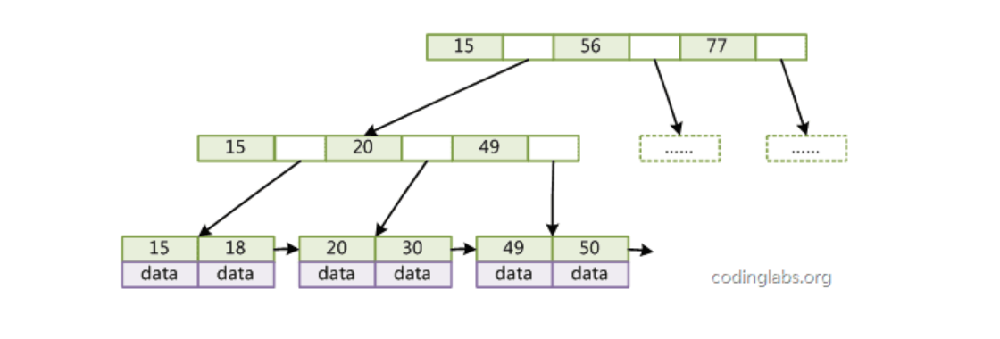

# Python

## Flask


### Flask是一个轻量级python Web框架，具有以下优点：

1. 简单易用，Flask的核心具有很少的功能，可以轻松地拓展其他功能
2. 模块化：Flask提供了许多插件来实现常用功能。
3. 灵活性高：Flask没有强制的目录结构和文件命名规则
4. 轻量级：Flask的代码量少，可以让开发者快速了解项目文件结构。

### Flask框架依赖组件

1. Route路由
2. Models(ORM模型)
3. Blueprint(蓝图)
4. Jinja2模板引擎

### Flask蓝图的作用

1. 对Flask应用进行模块化处理
2. 解决了循环导入问题，避免循环导入app.route
3. 简化代码管理和后期功能添加
4. 一个蓝图可以对应一个项目

### 应用上下文和请求上下文的区别
current_app,q请求上下文：保存了客户端和服务器交互的数据
request,session应用上下文：保存一些配置信息，比如程序名、数据库连接、应用信息等

# MySQL

## 索引

### 基础知识

1. 索引类型
    Mysql支持多种索引类型，有 单列索引，组合索引，全文索引，唯一索引，空间索引等。

  1. 单列索引，只包含单个列
  2. 组合索引，包含多个列
  3. 唯一索引，保证索引列的唯一。
  4.  空间索引，引用于地理空间数据类型

2. 索引常见的数据结构

  1. B-tree索引
  2. B+tree索引，innoDB默认索引类型。
  3. 哈希索引
  4. 全文索引

3. 索引创建

  在MySQL中，可以使用`CREATE INDEX`创建索引

  ```sql
  CREATE INDEX index_name ON table_name (column1,column2,..);
  ```

4. 索引优化

  使用索引可以显著提高查询速度，但也会对插入、更新和删除操作产生一定影响。需要权衡索引的使用，确保性能和数据一致性平衡。


### 面试题

#### 什么是B+树，为什么B+树成为主要的SQL数据库的索引实现

B+树是一种基于B树的数据结构，他的特点是在内部节点不存储数据，只存储索引的值，而所有数据都保存在叶子节点。

内部节点是有子节点，

叶子节点是终端节点，没有子节点的节点

 



B+树特点：

1. 所有叶子节点都是按照顺序连接在一起，可以很方便地遍历整颗树的所有叶子节点，也方便基于范围的查询操作
2. 所有数据记录的指针都保存在叶子节点上，因此在进行数据查询的时候，只需要搜索一次B+树就可以找到所有需要的数据
3. B+树的内部节点只存储索引的值，而不存储数据记录的指针，因此B+树的内部节点可以存放更多的索引，从而减少树的高度，提高查询效率
4. B+树的高度很低，因为每个节点存储的索引值比B树多，更好利用磁盘预读特性，从而减少I/O操作的次数。


# Java


## 锁

锁的概念是防止多线程中共享变量时出现数据不一致的现象。确保在多线程环境中安全地访问共享资源。

### 锁的种类

偏向锁 -> 自旋锁 -> 轻量级锁  -> 重量级锁。 按照此顺序，锁的重量依次增加。

偏向锁： 这个锁会偏向于第一个获得它的线程，当这个线程再次请求锁的时候不需要进行任何同步操作，从而提高性能。

轻量级锁： 当偏向锁的条件不满足，有多线程并发争抢同一锁对象时，但并发数不大，优先使用轻量锁。一般只有两个线程争抢锁标记时，优先使用轻量锁。

重量级锁： 具有完整monitor功能的锁

自旋锁： 是一个过渡的锁，从轻量级到重量级锁的过度。

NOTE：Java中的各种锁对程序员来说是透明的，创建锁过程中，JVM先创建最轻的锁，条件不满足时则将锁升级。基于synchronized关键字实现的。


按照锁的特性分类：

1.   悲观锁： 独占锁，会导致其他所有需要锁的线程都挂起，等待持有锁的线程释放锁。
2.   乐观锁：每次不是加锁，而是假设没有冲突而去试探性的完成操作，如果因为冲突失败了就会去重试，直到成功。

按照锁的顺序分类：

1.   公平锁：指多个线程按照申请锁的顺序来获取锁。java里可以通过ReentrantLock这个锁对象，指定是否公平。
2.   非公平锁：指多个线程获取锁的顺序并不是按照申请锁的顺序，有可能后申请的线程会比先申请的优先获取锁。使用synchronized是无法指定公平与否，它是不公平的。

独占锁/共享锁：

1.   独占锁： 排他锁。锁一次只能被一个线程所持有。ReentrantLock和Synchronized都是独占锁
2.   共享锁：这个锁可以被多个线程所持有。ReentrantReadWriteLock，读锁是共享锁， 写锁是独占锁。


### 锁的使用场景

#### 乐观锁

是一种并发控制策略，每次访问共享资源时，都假设自己是唯一的，并在修改共享资源时检查数据是否被其他线程修改过，如果数据未修改，则允许当前线程或进程修改数据，否则拒绝修改。乐观锁是通过版本号、时间戳、哈希值等方式来实现数据的版本控制和检查。

通常用于读多写少、竞争不激烈的情况下使用，例如： 缓存、消息队列、数据同步等。

在Spring Boot中，使用Spring Data JPA来实现乐观锁。

#### 悲观锁

悲观锁是一种并发控制策略，它的核心思想是在访问共享资源时假定其他线程或进程会修改该资源，并在访问共享资源前对资源进行加锁，以防止其他线程或进程对资源进行修改。悲观锁通常使用互斥锁、共享锁、读写锁等方式来实现资源的加锁和解锁。

在实际应用中，悲观锁通常用于读少写多、竞争激烈的场景，例如数据库、文件系统、网络通信等。在 Spring Boot 中，可以使用 synchronized 关键字、ReentrantLock、ReadWriteLock 等方式来实现悲观锁。


#### 分布式锁

用于在分布式环境中对共享资源进行加锁和解锁。

常见的分布式锁实现方式包括基于数据库、基于缓存、基于 ZooKeeper 等方式。在 Spring Boot 中，可以使用 Spring Integration、Spring Cloud、Redisson 等框架来实现分布式锁。

分布式锁可以使用基于数据库、基于缓存、基于 ZooKeeper 等方式来实现，


# 场景题


## 假如要查询用户的后四位手机号，如何高效率查，并建立索引

建多一张表，存放手机后四位以及手机号码，手机后四位创建索引。


## 分布式锁加锁失败后的等待逻辑是如何实现的？


## Netty相比原生的IO模型有什么优势？


## 常见的索引结构有？哈希表结构属于那种场景？


## redis里lru、 lfu缺点是什么？ 有什么解决方法？


## spring声明式事务原理？哪些场景会失效？


## 说一下分布式锁的理解，以及分布式锁的实现？

理解：


## 说一下Mybatis里面的缓存机制


## 如果要你实现Spring IOC，你会注意哪些问题？


## Redis中多大的key算热key，该如何解决？


## threadlocal参数如何传递，线程池如何传递


## 如果jvm出现频繁FullGC如何解决？


## 短URL生成器设计：百亿短URL怎样做到无冲突？


## 如何设计RPC框架在10万QPS下实现毫秒级的服务调用？

