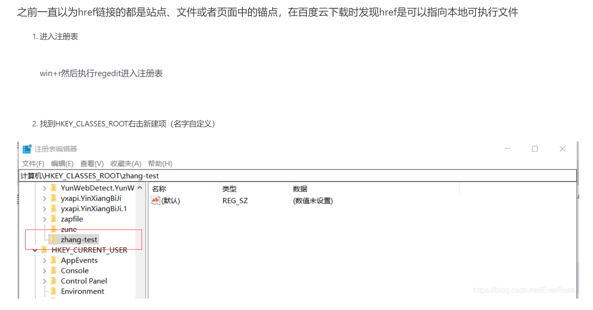
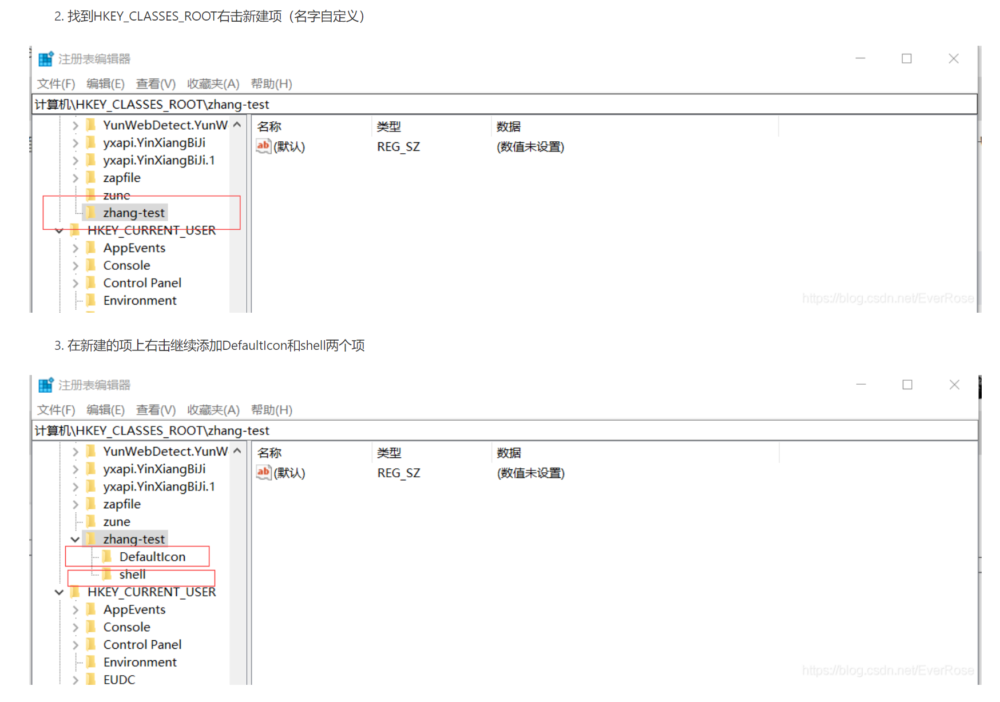
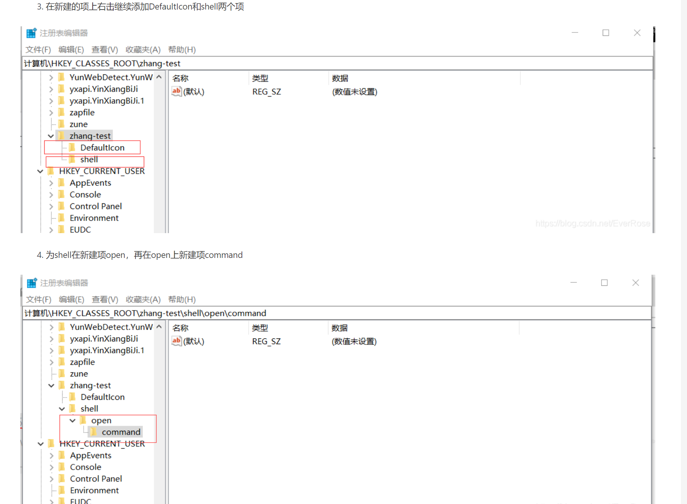
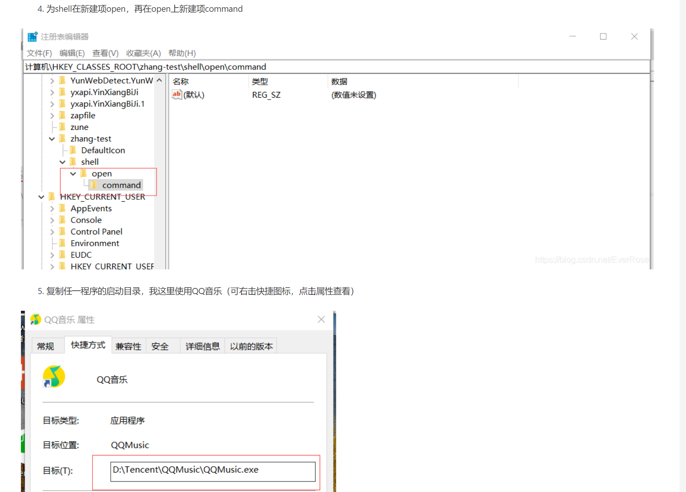
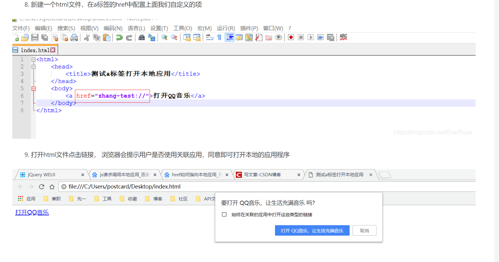

## [React笔记](./React_use.md)

[BootCDN - Bootstrap 中文网开源项目免费 CDN 加速服务](https://www.bootcdn.cn/)

### 前端项目打包

- 下载nodejs（需要自带的npm包）

- 在前端项目目录下，打开终端
- npm install
- npm run build

### npm设置淘宝镜像

npm config set registry https://registry.npm.taobao.org

### Vue CLI脚手架下载

> npm install -g @vue/cli
>
> vue create xxxx
>
> npm run serve

### body标签设置，铺满全屏

```html
<body style="height: 100%;margin-top: 0px;margin-bottom: 0px;margin-left: 0px;margin-right: 0px;">
    <div id="app"></div>
  </body>
```

### flex布局

1. 作用：Flex是Flexible Box的缩写，意为”弹性布局”，用来为盒状模型提供最大的灵活性。

2. 使用：

   ```css
   <style>
   .demo {  /* 父元素*/
       display:flex;  /* 开启flex布局*/
   }
   </style>
   ```

3. 最后一个元素靠右

   ```css
   <style>
   .demo {  /* 父元素*/
       display:flex;  /* 开启flex布局*/
   }
   .demo1 {  /* 子元素*/
       margin-left:auto;
   }
   </style>
   ```

   


## 获取镜像源

**npm get registry**

## 设置镜像源

`npm config set registry http://registry.npm taobao.org/`


### 

# axios

## axios返回对象为文件对象，下载文件

同时处理blob文件和json返回数据

```jsx
axios({
            method: 'post',
            url: '/reissue/exportRepayFile',
            responseType: 'blob',
            data: data
        })
    .then(response => {
    if (response.data.type === "application/json") {
        const reader = new FileReader();  //创建一个FileReader实例
        reader.readAsText(response.data, 'utf-8'); //读取文件,结果用字符串形式表示
        reader.onload=function(){//读取完成后,**获取reader.result**
            let res = JSON.parse(reader.result)
            if (res.code === -1) {
                message.error(res.msg)
            } else { 
                message.success(res.msg)
            }

        }
    } else { 
        const blob = new Blob([response.data]);
        var fileName = '';
        var disposition = response.headers['content-disposition'];
        if (disposition && disposition.indexOf('attachment') !== -1) {
            console.log(disposition)
            var filenameRegex = /filename\*=UTF-8''(.*)/;   // 匹配文件名
            var matches = filenameRegex.exec(disposition);
            if (matches != null && matches[1]) {
                var fileName = matches[1];
                fileName = decodeURIComponent(fileName);
            }
        }
        
        
        if ('download' in document.createElement('a')) {
            // 非IE下载
            const url = window.URL.createObjectURL(blob);
            let a = document.createElement('a');
            a.href = url;
            a.download = fileName;
            document.body.appendChild(a);
            a.click();
            window.URL.revokeObjectURL(url);
            document.body.removeChild(a);
        } else {
            navigator.msSaveBlob(blob, fileName);
        }
    }

});
```

## axios拦截器

建立axios的工具包

```js
// utils/ajax.js
import axios from "axios"
import { message } from "antd";
const ajax = axios.create({
    timeout: 10000, // 设置超时时间10s，如果10秒没有返回结果则中断请求，认为连接超时
    baseURL: "/" // 根据自己配置的代理去设置不同环境的baseUrl
})


// http请求拦截器
ajax.interceptors.request.use((config) => {
    // 关闭浏览器后清除token，并重定向到登录页
    console.log("config",config)
    // if (!sessionStorage.getItem('token') && !window.location.href.includes('login')) {
    //   window.location = `/login`;
    // }
  //   // if (config.method === 'post') {
  //   //   config.headers = {
  //   //     ...config.headers,
  //   //     'datae-token': sessionStorage.getItem('token'),
  //   //   };
  //   // } else if (config.method === 'get') {
  //   //   config.headers = {
  //   //     ...config.headers,
  //   //     'datae-token': sessionStorage.getItem('token'),
  //   //   };
  //   // }
    return config;
  });

  // http请求响应器
  ajax.interceptors.response.use(
    (response) => {
   
      return response
  },
  (error) => {
      alert("请求异常！！");
      console.log("@@",error)
      return Promise.reject(error);
  }
  )


  export default ajax;


```

使用：导入该工具类

```js
import axios from '@/utils/ajax';
axios.get("/sys/v1/getAllDomain")
```


# 函数拓展

## flatMap

```js
const array = [1, 2, 3, 4, 5];

// 使用 map 方法对数组中的每个元素进行处理，返回一个新的数组
const mappedArray = array.map(num => [num, num * 2]);
console.log(mappedArray);
// Output: [[1, 2], [2, 4], [3, 6], [4, 8], [5, 10]]

// 使用 flat 方法展开数组
const flattenedArray = mappedArray.flat();
console.log(flattenedArray);
// Output: [1, 2, 2, 4, 3, 6, 4, 8, 5, 10]

// 使用 flatMap 方法可以一步完成上述操作
const flatMappedArray = array.flatMap(num => [num, num * 2]);
console.log(flatMappedArray);
// Output: [1, 2, 2, 4, 3, 6, 4, 8, 5, 10]

```


# 其他


## 基本下载包

1. axios： `npm i axios --save`
2. antd:   `npm i antd@4.19.0 --save`
3. antd按需引入：`npm install babel-plugin-import less less-loader --save-dev`
4. http-proxy-middleware:`npm i http-proxy-middleware --save`
5. react-router-dom:`npm install react-router-dom@5.2.0`

antd修改主题色：

1. 下载craco:`npm i craco craco-less`

2. 项目目录配置craco.config.js

    ```js
    const CracoLessPlugin = require('craco-less');
    module.exports = {
      plugins: [
        {
          plugin: CracoLessPlugin,
          options: {
            lessLoaderOptions: {
              lessOptions: {
                modifyVars: { '@primary-color': "#63c0b5" },
                javascriptEnabled: true,
              },
            },
          },
        },
      ],
    };
    ```

3. 修改package.json

    ```json
    {
        ...,
      "scripts": {
        //"start": "react-scripts start",
        //"build": "react-scripts build",
        //"test": "react-scripts test",
        "start": "craco start",
        "build": "craco build",
        "test": "craco test",
        "eject": "react-scripts eject"
      },
    }
    ```

4. 修改其他主题色

    ```less
    // App.less
    @import '~antd/dist/antd.less';
    @primary-color: #1890ff; // 全局主色
    @link-color: #1890ff; // 链接色
    @success-color: #52c41a; // 成功色
    @warning-color: #faad14; // 警告色
    @error-color: #f5222d; // 错误色
    @font-size-base: 14px; // 主字号
    @heading-color: rgba(0, 0, 0, 0.85); // 标题色
    @text-color: rgba(0, 0, 0, 0.65); // 主文本色
    @text-color-secondary: rgba(0, 0, 0, 0.45); // 次文本色
    @disabled-color: rgba(0, 0, 0, 0.25); // 失效色
    @border-radius-base: 2px; // 组件/浮层圆角
    @border-color-base: #d9d9d9; // 边框色
    @box-shadow-base: 0 3px 6px -4px rgba(0, 0, 0, 0.12), 0 6px 16px 0 rgba(0, 0, 0, 0.08),
      0 9px 28px 8px rgba(0, 0, 0, 0.05); // 浮层阴影
    ```

    

## axios返回对象为文件对象，下载文件

同时处理blob文件和json返回数据

```jsx
axios({
            method: 'post',
            url: '/reissue/exportRepayFile',
            responseType: 'blob',
            data: data
        })
    .then(response => {
    if (response.data.type === "application/json") {
        const reader = new FileReader();  //创建一个FileReader实例
        reader.readAsText(response.data, 'utf-8'); //读取文件,结果用字符串形式表示
        reader.onload=function(){//读取完成后,**获取reader.result**
            let res = JSON.parse(reader.result)
            if (res.code === -1) {
                message.error(res.msg)
            } else { 
                message.success(res.msg)
            }

        }
    } else { 
        const blob = new Blob([response.data]);
        const fileName = type === 0 ? `${moment().format('YYYYMMDD')}补发申请表.xls` : `${moment().format('YYYYMMDD')}补发花名册.xls`;
        if ('download' in document.createElement('a')) {
            // 非IE下载
            const url = window.URL.createObjectURL(blob);
            let a = document.createElement('a');
            a.href = url;
            a.download = fileName;
            document.body.appendChild(a);
            a.click();
            window.URL.revokeObjectURL(url);
            document.body.removeChild(a);
        } else {
            navigator.msSaveBlob(blob, fileName);
        }
    }

});
```


## 页面展示docx、xlsx文件

1. 下载`react-file-viewer`

    `npm i react-file-viewer`

2. 使用

    ```react
    import FileViewer from "react-file-viewer"
    
    <FileViewer
    fileType='docx'//文件类型
    filePath={url} //文件地址
    />
    ```

    

## antd Table组件手动调节列宽

下载`React-Resizable`:`npm i React-Resizable`


## antd Table组件components参数的使用

场景：给符合条件的每一行添加Tooltip组件

结合rowClassName使用

```react
const EditableRow = ({ index, ...props }) => {
  return (
    <Tooltip>
      <tr {...props} />
    </Tooltip>
        
     
  );
};
const EditableCell = ({
  title,
  editable,
  children,
  dataIndex,	
  record,
  handleSave,
  ...restProps
})=>{
   return <td {...restProps}>{childNode}</td>;
}

const components = {
  body: {
    row: EditableRow,
    cell: EditableCell
  }
};


  const rowClassName = (record) => {
    if (record.doubtType != "undefined" && record.doubtType != null && record.doubtType === 0) {
      return "selected-doubt-black"
    }
    if (!record.isIdentify) {
      return 'selected-row'
    }

  };


export default function (){
    return (
    <Table
      components={components}
      rowClassName={rowClassName}
      
  );
}
```


## 使用@代替src目录


1. 执行`npm run eject`暴露配置文件

2. 编辑`config/webpack.config.js`

    ```js
    // 
    resolve {
        alias: {
            //...
            // 添加一行配置
            '@': paths.appSrc
        }
    }
    ```

    

## 大数据可视化

技术栈：React、Echarts，DataV

1. 下载

   `npm install --save echarts`

   `npm install --save echarts-for-react`

   `npm install @jiaminghi/data-view-react`

   

2. 使用

   ```jsx
   import React, { Component } from 'react'
   import { Page } from 'sdcube';
   // import axios from 'axios';
   import echarts from 'echarts/lib/echarts';
   import ReactEcharts from "echarts-for-react";  // 如果不引入该行，则需要单独导入option里提及的组件，比如下面的组件
   /*
   
   import  'echarts/lib/chart/bar';
   // 引入提示框和标题组件
   import 'echarts/lib/component/tooltip';
   import 'echarts/lib/component/title';
   
   */
   export default class Visualization extends Component {
     componentDidMount() {
   		// 初始化echarts实例，将其挂载到id为main的dom元素上展示 
   		var myChart = echarts.init(document.getElementById("main"));
   		// 绘制图表 
   		myChart.setOption({
   			...
   		});
   	}
   	render() { //渲染需要陈放Echart实例的容器元素
   		return <div id = "main"
   		style = {
   			{
   				width: 400,
   				height: 400
   			}
   		} > < /div>; 
   	}
   
   }
   
   ```

```js
官网链接：http://echarts.baidu.com/echarts2/doc/example/themeDesigner.html
https://www.echartsjs.com/tutorial.html#5%20%E5%88%86%E9%92%9F%E4%B8%8A%E6%89%8B%20ECharts
theme = {
    // 全图默认背景
    // backgroundColor: 'rgba(0,0,0,0)',
    
    // 默认色板
    color: ['#ff7f50','#87cefa','#da70d6','#32cd32','#6495ed',
            '#ff69b4','#ba55d3','#cd5c5c','#ffa500','#40e0d0',
            '#1e90ff','#ff6347','#7b68ee','#00fa9a','#ffd700',
            '#6699FF','#ff6666','#3cb371','#b8860b','#30e0e0'],
 
 
    // 图表标题
    title: {
        x: 'left',                 // 水平安放位置，默认为左对齐，可选为：
                                   // 'center' ¦ 'left' ¦ 'right'
                                   // ¦ {number}（x坐标，单位px）
        y: 'top',                  // 垂直安放位置，默认为全图顶端，可选为：
                                   // 'top' ¦ 'bottom' ¦ 'center'
                                   // ¦ {number}（y坐标，单位px）
        //textAlign: null          // 水平对齐方式，默认根据x设置自动调整
        backgroundColor: 'rgba(0,0,0,0)',
        borderColor: '#ccc',       // 标题边框颜色
        borderWidth: 0,            // 标题边框线宽，单位px，默认为0（无边框）
        padding: 5,                // 标题内边距，单位px，默认各方向内边距为5，
                                   // 接受数组分别设定上右下左边距，同css
        itemGap: 10,               // 主副标题纵向间隔，单位px，默认为10，
        textStyle: {
            fontSize: 18,
            fontWeight: 'bolder',
            color: '#333'          // 主标题文字颜色
        },
        subtextStyle: {
            color: '#aaa'          // 副标题文字颜色
        }
    },
    
    // 图例
    legend: {
        orient: 'horizontal',      // 布局方式，默认为水平布局，可选为：
                                   // 'horizontal' ¦ 'vertical'
        x: 'center',               // 水平安放位置，默认为全图居中，可选为：
                                   // 'center' ¦ 'left' ¦ 'right'
                                   // ¦ {number}（x坐标，单位px）
        y: 'top',                  // 垂直安放位置，默认为全图顶端，可选为：
                                   // 'top' ¦ 'bottom' ¦ 'center'
                                   // ¦ {number}（y坐标，单位px）
        backgroundColor: 'rgba(0,0,0,0)',
        borderColor: '#ccc',       // 图例边框颜色
        borderWidth: 0,            // 图例边框线宽，单位px，默认为0（无边框）
        padding: 5,                // 图例内边距，单位px，默认各方向内边距为5，
                                   // 接受数组分别设定上右下左边距，同css
        itemGap: 10,               // 各个item之间的间隔，单位px，默认为10，
                                   // 横向布局时为水平间隔，纵向布局时为纵向间隔
        itemWidth: 20,             // 图例图形宽度
        itemHeight: 14,            // 图例图形高度
        textStyle: {
            color: '#333'          // 图例文字颜色
        }
    },
    
    // 值域
    dataRange: {
        orient: 'vertical',        // 布局方式，默认为垂直布局，可选为：
                                   // 'horizontal' ¦ 'vertical'
        x: 'left',                 // 水平安放位置，默认为全图左对齐，可选为：
                                   // 'center' ¦ 'left' ¦ 'right'
                                   // ¦ {number}（x坐标，单位px）
        y: 'bottom',               // 垂直安放位置，默认为全图底部，可选为：
                                   // 'top' ¦ 'bottom' ¦ 'center'
                                   // ¦ {number}（y坐标，单位px）
        backgroundColor: 'rgba(0,0,0,0)',
        borderColor: '#ccc',       // 值域边框颜色
        borderWidth: 0,            // 值域边框线宽，单位px，默认为0（无边框）
        padding: 5,                // 值域内边距，单位px，默认各方向内边距为5，
                                   // 接受数组分别设定上右下左边距，同css
        itemGap: 10,               // 各个item之间的间隔，单位px，默认为10，
                                   // 横向布局时为水平间隔，纵向布局时为纵向间隔
        itemWidth: 20,             // 值域图形宽度，线性渐变水平布局宽度为该值 * 10
        itemHeight: 14,            // 值域图形高度，线性渐变垂直布局高度为该值 * 10
        splitNumber: 5,            // 分割段数，默认为5，为0时为线性渐变
        color:['#1e90ff','#f0ffff'],//颜色 
        //text:['高','低'],         // 文本，默认为数值文本
        textStyle: {
            color: '#333'          // 值域文字颜色
        }
    },
 
 
    toolbox: {
        orient: 'horizontal',      // 布局方式，默认为水平布局，可选为：
                                   // 'horizontal' ¦ 'vertical'
        x: 'right',                // 水平安放位置，默认为全图右对齐，可选为：
                                   // 'center' ¦ 'left' ¦ 'right'
                                   // ¦ {number}（x坐标，单位px）
        y: 'top',                  // 垂直安放位置，默认为全图顶端，可选为：
                                   // 'top' ¦ 'bottom' ¦ 'center'
                                   // ¦ {number}（y坐标，单位px）
        color : ['#1e90ff','#22bb22','#4b0082','#d2691e'],
        backgroundColor: 'rgba(0,0,0,0)', // 工具箱背景颜色
        borderColor: '#ccc',       // 工具箱边框颜色
        borderWidth: 0,            // 工具箱边框线宽，单位px，默认为0（无边框）
        padding: 5,                // 工具箱内边距，单位px，默认各方向内边距为5，
                                   // 接受数组分别设定上右下左边距，同css
        itemGap: 10,               // 各个item之间的间隔，单位px，默认为10，
                                   // 横向布局时为水平间隔，纵向布局时为纵向间隔
        itemSize: 16,              // 工具箱图形宽度
        featureImageIcon : {},     // 自定义图片icon
        featureTitle : {
            mark : '辅助线开关',
            markUndo : '删除辅助线',
            markClear : '清空辅助线',
            dataZoom : '区域缩放',
            dataZoomReset : '区域缩放后退',
            dataView : '数据视图',
            lineChart : '折线图切换',
            barChart : '柱形图切换',
            restore : '还原',
            saveAsImage : '保存为图片'
        }
    },
 
 
    // 提示框
    tooltip: {
        trigger: 'item',           // 触发类型，默认数据触发，见下图，可选为：'item' ¦ 'axis'
        showDelay: 20,             // 显示延迟，添加显示延迟可以避免频繁切换，单位ms
        hideDelay: 100,            // 隐藏延迟，单位ms
        transitionDuration : 0.4,  // 动画变换时间，单位s
        backgroundColor: 'rgba(0,0,0,0.7)',     // 提示背景颜色，默认为透明度为0.7的黑色
        borderColor: '#333',       // 提示边框颜色
        borderRadius: 4,           // 提示边框圆角，单位px，默认为4
        borderWidth: 0,            // 提示边框线宽，单位px，默认为0（无边框）
        padding: 5,                // 提示内边距，单位px，默认各方向内边距为5，
                                   // 接受数组分别设定上右下左边距，同css
        axisPointer : {            // 坐标轴指示器，坐标轴触发有效
            type : 'line',         // 默认为直线，可选为：'line' | 'shadow'
            lineStyle : {          // 直线指示器样式设置
                color: '#48b',
                width: 2,
                type: 'solid'
            },
            shadowStyle : {                       // 阴影指示器样式设置
                width: 'auto',                   // 阴影大小
                color: 'rgba(150,150,150,0.3)'  // 阴影颜色
            }
        },
        textStyle: {
            color: '#fff'
        }
    },
 
 
    // 区域缩放控制器
    dataZoom: {
        orient: 'horizontal',      // 布局方式，默认为水平布局，可选为：
                                   // 'horizontal' ¦ 'vertical'
        // x: {number},            // 水平安放位置，默认为根据grid参数适配，可选为：
                                   // {number}（x坐标，单位px）
        // y: {number},            // 垂直安放位置，默认为根据grid参数适配，可选为：
                                   // {number}（y坐标，单位px）
        // width: {number},        // 指定宽度，横向布局时默认为根据grid参数适配
        // height: {number},       // 指定高度，纵向布局时默认为根据grid参数适配
        backgroundColor: 'rgba(0,0,0,0)',       // 背景颜色
        dataBackgroundColor: '#eee',            // 数据背景颜色
        fillerColor: 'rgba(144,197,237,0.2)',   // 填充颜色
        handleColor: 'rgba(70,130,180,0.8)'     // 手柄颜色
    },
 
 
    // 网格
    grid: {
        x: 80,
        y: 60,
        x2: 80,
        y2: 60,
        // width: {totalWidth} - x - x2,
        // height: {totalHeight} - y - y2,
        backgroundColor: 'rgba(0,0,0,0)',
        borderWidth: 1,
        borderColor: '#ccc'
    },
 
 
    // 类目轴
    categoryAxis: {
        position: 'bottom',    // 位置
        nameLocation: 'end',   // 坐标轴名字位置，支持'start' | 'end'
        boundaryGap: true,     // 类目起始和结束两端空白策略
        axisLine: {            // 坐标轴线
            show: true,        // 默认显示，属性show控制显示与否
            lineStyle: {       // 属性lineStyle控制线条样式
                color: '#48b',
                width: 2,
                type: 'solid'
            }
        },
        axisTick: {            // 坐标轴小标记
            show: true,       // 属性show控制显示与否，默认不显示
            interval: 'auto',
            // onGap: null,
            inside : false,    // 控制小标记是否在grid里 
            length :5,         // 属性length控制线长
            lineStyle: {       // 属性lineStyle控制线条样式
                color: '#333',
                width: 1
            }
        },
        axisLabel: {           // 坐标轴文本标签，详见axis.axisLabel
            show: true,
            interval: 'auto',
            rotate: 0,
            margin: 8,
            // formatter: null,
            textStyle: {       // 其余属性默认使用全局文本样式，详见TEXTSTYLE
                color: '#333'
            }
        },
        splitLine: {           // 分隔线
            show: true,        // 默认显示，属性show控制显示与否
            // onGap: null,
            lineStyle: {       // 属性lineStyle（详见lineStyle）控制线条样式
                color: ['#ccc'],
                width: 1,
                type: 'solid'
            }
        },
        splitArea: {           // 分隔区域
            show: false,       // 默认不显示，属性show控制显示与否
            // onGap: null,
            areaStyle: {       // 属性areaStyle（详见areaStyle）控制区域样式
                color: ['rgba(250,250,250,0.3)','rgba(200,200,200,0.3)']
            }
        }
    },
 
 
    // 数值型坐标轴默认参数
    valueAxis: {
        position: 'left',      // 位置
        nameLocation: 'end',   // 坐标轴名字位置，支持'start' | 'end'
        nameTextStyle: {},     // 坐标轴文字样式，默认取全局样式
        boundaryGap: [0, 0],   // 数值起始和结束两端空白策略
        splitNumber: 5,        // 分割段数，默认为5
        axisLine: {            // 坐标轴线
            show: true,        // 默认显示，属性show控制显示与否
            lineStyle: {       // 属性lineStyle控制线条样式
                color: '#48b',
                width: 2,
                type: 'solid'
            }
        },
        axisTick: {            // 坐标轴小标记
            show: false,       // 属性show控制显示与否，默认不显示
            inside : false,    // 控制小标记是否在grid里 
            length :5,         // 属性length控制线长
            lineStyle: {       // 属性lineStyle控制线条样式
                color: '#333',
                width: 1
            }
        },
        axisLabel: {           // 坐标轴文本标签，详见axis.axisLabel
            show: true,
            rotate: 0,
            margin: 8,
            // formatter: null,
            textStyle: {       // 其余属性默认使用全局文本样式，详见TEXTSTYLE
                color: '#333'
            }
        },
        splitLine: {           // 分隔线
            show: true,        // 默认显示，属性show控制显示与否
            lineStyle: {       // 属性lineStyle（详见lineStyle）控制线条样式
                color: ['#ccc'],
                width: 1,
                type: 'solid'
            }
        },
        splitArea: {           // 分隔区域
            show: false,       // 默认不显示，属性show控制显示与否
            areaStyle: {       // 属性areaStyle（详见areaStyle）控制区域样式
                color: ['rgba(250,250,250,0.3)','rgba(200,200,200,0.3)']
            }
        }
    },
 
 
    polar : {
        center : ['50%', '50%'],    // 默认全局居中
        radius : '75%',
        startAngle : 90,
        splitNumber : 5,
        name : {
            show: true,
            textStyle: {       // 其余属性默认使用全局文本样式，详见TEXTSTYLE
                color: '#333'
            }
        },
        axisLine: {            // 坐标轴线
            show: true,        // 默认显示，属性show控制显示与否
            lineStyle: {       // 属性lineStyle控制线条样式
                color: '#ccc',
                width: 1,
                type: 'solid'
            }
        },
        axisLabel: {           // 坐标轴文本标签，详见axis.axisLabel
            show: false,
            textStyle: {       // 其余属性默认使用全局文本样式，详见TEXTSTYLE
                color: '#333'
            }
        },
        splitArea : {
            show : true,
            areaStyle : {
                color: ['rgba(250,250,250,0.3)','rgba(200,200,200,0.3)']
            }
        },
        splitLine : {
            show : true,
            lineStyle : {
                width : 1,
                color : '#ccc'
            }
        }
    },
 
 
    // 柱形图默认参数
    bar: {
        barMinHeight: 0,          // 最小高度改为0
        // barWidth: null,        // 默认自适应
        barGap: '30%',            // 柱间距离，默认为柱形宽度的30%，可设固定值
        barCategoryGap : '20%',   // 类目间柱形距离，默认为类目间距的20%，可设固定值
        itemStyle: {
            normal: {
                // color: '各异',
                barBorderColor: '#fff',       // 柱条边线
                barBorderRadius: 0,           // 柱条边线圆角，单位px，默认为0
                barBorderWidth: 1,            // 柱条边线线宽，单位px，默认为1
                label: {
                    show: false
                    // position: 默认自适应，水平布局为'top'，垂直布局为'right'，可选为
                    //           'inside'|'left'|'right'|'top'|'bottom'
                    // textStyle: null      // 默认使用全局文本样式，详见TEXTSTYLE
                }
            },
            emphasis: {
                // color: '各异',
                barBorderColor: 'rgba(0,0,0,0)',   // 柱条边线
                barBorderRadius: 0,                // 柱条边线圆角，单位px，默认为0
                barBorderWidth: 1,                 // 柱条边线线宽，单位px，默认为1
                label: {
                    show: false
                    // position: 默认自适应，水平布局为'top'，垂直布局为'right'，可选为
                    //           'inside'|'left'|'right'|'top'|'bottom'
                    // textStyle: null      // 默认使用全局文本样式，详见TEXTSTYLE
                }
            }
        }
    },
 
 
    // 折线图默认参数
    line: {
        itemStyle: {
            normal: {
                // color: 各异,
                label: {
                    show: false
                    // position: 默认自适应，水平布局为'top'，垂直布局为'right'，可选为
                    //           'inside'|'left'|'right'|'top'|'bottom'
                    // textStyle: null      // 默认使用全局文本样式，详见TEXTSTYLE
                },
                lineStyle: {
                    width: 2,
                    type: 'solid',
                    shadowColor : 'rgba(0,0,0,0)', //默认透明
                    shadowBlur: 5,
                    shadowOffsetX: 3,
                    shadowOffsetY: 3
                }
            },
            emphasis: {
                // color: 各异,
                label: {
                    show: false
                    // position: 默认自适应，水平布局为'top'，垂直布局为'right'，可选为
                    //           'inside'|'left'|'right'|'top'|'bottom'
                    // textStyle: null      // 默认使用全局文本样式，详见TEXTSTYLE
                }
            }
        },
        //smooth : false,
        //symbol: null,         // 拐点图形类型
        symbolSize: 2,          // 拐点图形大小
        //symbolRotate : null,  // 拐点图形旋转控制
        showAllSymbol: false    // 标志图形默认只有主轴显示（随主轴标签间隔隐藏策略）
    },
    
    // K线图默认参数
    k: {
        // barWidth : null          // 默认自适应
        // barMaxWidth : null       // 默认自适应 
        itemStyle: {
            normal: {
                color: '#fff',          // 阳线填充颜色
                color0: '#00aa11',      // 阴线填充颜色
                lineStyle: {
                    width: 1,
                    color: '#ff3200',   // 阳线边框颜色
                    color0: '#00aa11'   // 阴线边框颜色
                }
            },
            emphasis: {
                // color: 各异,
                // color0: 各异
            }
        }
    },
    
    // 散点图默认参数
    scatter: {
        //symbol: null,      // 图形类型
        symbolSize: 4,       // 图形大小，半宽（半径）参数，当图形为方向或菱形则总宽度为symbolSize * 2
        //symbolRotate : null,  // 图形旋转控制
        large: false,        // 大规模散点图
        largeThreshold: 2000,// 大规模阀值，large为true且数据量>largeThreshold才启用大规模模式
        itemStyle: {
            normal: {
                // color: 各异,
                label: {
                    show: false
                    // position: 默认自适应，水平布局为'top'，垂直布局为'right'，可选为
                    //           'inside'|'left'|'right'|'top'|'bottom'
                    // textStyle: null      // 默认使用全局文本样式，详见TEXTSTYLE
                }
            },
            emphasis: {
                // color: '各异'
                label: {
                    show: false
                    // position: 默认自适应，水平布局为'top'，垂直布局为'right'，可选为
                    //           'inside'|'left'|'right'|'top'|'bottom'
                    // textStyle: null      // 默认使用全局文本样式，详见TEXTSTYLE
                }
            }
        }
    },
 
 
    // 雷达图默认参数
    radar : {
        itemStyle: {
            normal: {
                // color: 各异,
                label: {
                    show: false
                },
                lineStyle: {
                    width: 2,
                    type: 'solid'
                }
            },
            emphasis: {
                // color: 各异,
                label: {
                    show: false
                }
            }
        },
        //symbol: null,         // 拐点图形类型
        symbolSize: 2           // 可计算特性参数，空数据拖拽提示图形大小
        //symbolRotate : null,  // 图形旋转控制
    },
 
 
    // 饼图默认参数
    pie: {
        center : ['50%', '50%'],    // 默认全局居中
        radius : [0, '75%'],
        clockWise : false,          // 默认逆时针
        startAngle: 90,
        minAngle: 0,                // 最小角度改为0
        selectedOffset: 10,         // 选中是扇区偏移量
        itemStyle: {
            normal: {
                // color: 各异,
                borderColor: '#fff',
                borderWidth: 1,
                label: {
                    show: true,
                    position: 'outer'
                    // textStyle: null      // 默认使用全局文本样式，详见TEXTSTYLE
                },
                labelLine: {
                    show: true,
                    length: 20,
                    lineStyle: {
                        // color: 各异,
                        width: 1,
                        type: 'solid'
                    }
                }
            },
            emphasis: {
                // color: 各异,
                borderColor: 'rgba(0,0,0,0)',
                borderWidth: 1,
                label: {
                    show: false
                    // position: 'outer'
                    // textStyle: null      // 默认使用全局文本样式，详见TEXTSTYLE
                },
                labelLine: {
                    show: false,
                    length: 20,
                    lineStyle: {
                        // color: 各异,
                        width: 1,
                        type: 'solid'
                    }
                }
            }
        }
    },
    
    map: {
        mapType: 'china',   // 各省的mapType暂时都用中文
        mapLocation: {
            x : 'center',
            y : 'center'
            // width    // 自适应
            // height   // 自适应
        },
        showLegendSymbol : true,       // 显示图例颜色标识（系列标识的小圆点），存在legend时生效
        itemStyle: {
            normal: {
                // color: 各异,
                borderColor: '#fff',
                borderWidth: 1,
                areaStyle: {
                    color: '#ccc'//rgba(135,206,250,0.8)
                },
                label: {
                    show: false,
                    textStyle: {
                        color: 'rgba(139,69,19,1)'
                    }
                }
            },
            emphasis: {                 // 也是选中样式
                // color: 各异,
                borderColor: 'rgba(0,0,0,0)',
                borderWidth: 1,
                areaStyle: {
                    color: 'rgba(255,215,0,0.8)'
                },
                label: {
                    show: false,
                    textStyle: {
                        color: 'rgba(139,69,19,1)'
                    }
                }
            }
        }
    },
    
    force : {
        // 数据map到圆的半径的最小值和最大值
        minRadius : 10,
        maxRadius : 20,
        density : 1.0,
        attractiveness : 1.0,
        // 初始化的随机大小位置
        initSize : 300,
        // 向心力因子，越大向心力越大
        centripetal : 1,
        // 冷却因子
        coolDown : 0.99,
        // 分类里如果有样式会覆盖节点默认样式
        itemStyle: {
            normal: {
                // color: 各异,
                label: {
                    show: false
                    // textStyle: null      // 默认使用全局文本样式，详见TEXTSTYLE
                },
                nodeStyle : {
                    brushType : 'both',
                    color : '#f08c2e',
                    strokeColor : '#5182ab'
                },
                linkStyle : {
                    strokeColor : '#5182ab'
                }
            },
            emphasis: {
                // color: 各异,
                label: {
                    show: false
                    // textStyle: null      // 默认使用全局文本样式，详见TEXTSTYLE
                },
                nodeStyle : {},
                linkStyle : {}
            }
        }
    },
 
 
    chord : {
        radius : ['65%', '75%'],
        center : ['50%', '50%'],
        padding : 2,
        sort : 'none', // can be 'none', 'ascending', 'descending'
        sortSub : 'none', // can be 'none', 'ascending', 'descending'
        startAngle : 90,
        clockWise : false,
        showScale : false,
        showScaleText : false,
        itemStyle : {
            normal : {
                label : {
                    show : true
                    // textStyle: null      // 默认使用全局文本样式，详见TEXTSTYLE
                },
                lineStyle : {
                    width : 0,
                    color : '#000'
                },
                chordStyle : {
                    lineStyle : {
                        width : 1,
                        color : '#666'
                    }
                }
            },
            emphasis : {
                lineStyle : {
                    width : 0,
                    color : '#000'
                },
                chordStyle : {
                    lineStyle : {
                        width : 2,
                        color : '#333'
                    }
                }
            }
        }
    },
 
 
    island: {
        r: 15,
        calculateStep: 0.1  // 滚轮可计算步长 0.1 = 10%
    },
    
    markPoint : {
        symbol: 'pin',         // 标注类型
        symbolSize: 10,        // 标注大小，半宽（半径）参数，当图形为方向或菱形则总宽度为symbolSize * 2
        //symbolRotate : null, // 标注旋转控制
        itemStyle: {
            normal: {
                // color: 各异，
                // borderColor: 各异,     // 标注边线颜色，优先于color 
                borderWidth: 2,            // 标注边线线宽，单位px，默认为1
                label: {
                    show: true,
                    position: 'inside' // 可选为'left'|'right'|'top'|'bottom'
                    // textStyle: null      // 默认使用全局文本样式，详见TEXTSTYLE
                }
            },
            emphasis: {
                // color: 各异
                label: {
                    show: true
                    // position: 'inside'  // 'left'|'right'|'top'|'bottom'
                    // textStyle: null     // 默认使用全局文本样式，详见TEXTSTYLE
                }
            }
        }
    },
    
    markLine : {
        // 标线起始和结束的symbol介绍类型，如果都一样，可以直接传string
        symbol: ['circle', 'arrow'],  
        // 标线起始和结束的symbol大小，半宽（半径）参数，当图形为方向或菱形则总宽度为symbolSize * 2
        symbolSize: [2, 4],
        // 标线起始和结束的symbol旋转控制
        //symbolRotate : null,
        itemStyle: {
            normal: {
                // color: 各异,           // 标线主色，线色，symbol主色
                // borderColor: 随color,     // 标线symbol边框颜色，优先于color 
                borderWidth: 2,          // 标线symbol边框线宽，单位px，默认为2
                label: {
                    show: false,
                    // 可选为 'start'|'end'|'left'|'right'|'top'|'bottom'
                    position: 'inside',  
                    textStyle: {         // 默认使用全局文本样式，详见TEXTSTYLE
                        color: '#333'
                    }
                },
                lineStyle: {
                    // color: 随borderColor, // 主色，线色，优先级高于borderColor和color
                    // width: 随borderWidth, // 优先于borderWidth
                    type: 'solid',
                    shadowColor : 'rgba(0,0,0,0)', //默认透明
                    shadowBlur: 5,
                    shadowOffsetX: 3,
                    shadowOffsetY: 3
                }
            },
            emphasis: {
                // color: 各异
                label: {
                    show: false
                    // position: 'inside' // 'left'|'right'|'top'|'bottom'
                    // textStyle: null    // 默认使用全局文本样式，详见TEXTSTYLE
                },
                lineStyle : {}
            }
        }
    },
 
 
    textStyle: {
        decoration: 'none',
        fontFamily: 'Arial, Verdana, sans-serif',
        fontFamily2: '微软雅黑',    // IE8- 字体模糊并且不支持不同字体混排，额外指定一份
        fontSize: 12,
        fontStyle: 'normal',
        fontWeight: 'normal'
    },
 
 
    // 默认标志图形类型列表
    symbolList : [
      'circle', 'rectangle', 'triangle', 'diamond',
      'emptyCircle', 'emptyRectangle', 'emptyTriangle', 'emptyDiamond'
    ],
    loadingText : 'Loading...',
    // 可计算特性配置，孤岛，提示颜色
    calculable: false,              // 默认关闭可计算特性
    calculableColor: 'rgba(255,165,0,0.6)',       // 拖拽提示边框颜色
    calculableHolderColor: '#ccc', // 可计算占位提示颜色
    nameConnector: ' & ',
    valueConnector: ' : ',
    animation: true,
    animationThreshold: 2500,       // 动画元素阀值，产生的图形原素超过2500不出动画
    addDataAnimation: true,         // 动态数据接口是否开启动画效果
    animationDuration: 2000,
    animationEasing: 'ExponentialOut'    //BounceOut
}
```


## GIS数据格式

文档参考`https://www.yuque.com/datav/datav-cool/swteb8`

### 定义

GIS是地理信息系统，是一个创建、管理、分析和绘制所有类型数据的系统。

### 常见GIS数据格式

GIS数据分为`矢量`和`栅格`

矢量常用GeoJSON

GeoJSON使用JSON的数据格式来表达地理数据，本质上是JSON，

### 地图选择器

- 地图生成器DataV `http://datav.aliyun.com/portal/school/atlas/area_selector`


## git拉取的前端项目不能直接运行

- `npm install -g cnpm --registry=https://registry.npm.taobao.org`

- `cnpm install --registry=https://registry.npm.taobao.org`

  

## 前端调用本地应用













## css选择器

问题1：`css,有两个class，class1="ant-menu-item-active ant-menu-item-selected" class2="ant-menu-item-active"
如何只对class2进行样式修改`

```css
.ant-menu-item-active:not(.ant-menu-item-selected) {
  /* 设置样式 */
}
```


## 前端如何解决跨域问题

使用CORS解决跨域

CORS是一个W3C标准，全称是`跨域资源共享`，允许浏览器向跨源服务器发出XMLHttpRequest请求

原理：浏览器会将ajax请求分为两类，其处理方案略有差异：简单请求、特殊请求。


1. 简单请求：

    1. 请求方法：POST GET HEAD三种的其中之一。

    2. 请求头中不存在自定义头，即只包含以下几个字段

        Accept、Accept-Language、Content-Language、Last-Event-ID、Content-Type( 值为 application/x-www-form-urlencoded、multipart/form-data、text/plain 其中之一 ）

    当浏览器发现的ajax请求是简单请求时，会在请求头中携带一个字段：Origin

    Origin中会指出当前请求属于哪个域（协议+域名+端口），服务器会根据这个值决定是否允许跨域。

    如果服务器允许跨域，需要在返回的响应头中携带下面信息：

    ```text
    Access-Control-Allow-Origin: http://manage.leyou.com
    Access-Control-Allow-Credentials: true
    Content-Type: text/html; charset=utf-8
    ```

    Access-Control-Allow-Origin：可接受的域，是一个具体域名或者*，代表任意；
    Access-Control-Allow-Credentials：是否允许携带cookie，默认情况下，cors不会携带cookie，除非这个值是true。

    如果跨域请求要想操作cookie，需要满足3个条件：

    - 服务的响应头中需要携带Access-Control-Allow-Credentials并且为true。
    - 浏览器发起ajax需要指定withCredentials 为true
    - 响应头中的Access-Control-Allow-Origin一定不能为*，必须是指定的域名


### 前端下载附件

```js
axios({
         method: 'get',
         url: record.file_path,
         responseType: 'blob',
     }).then(
         res => {
             const blob = new Blob([res.data]);
             const fileName = record.file_name;
             const elink = document.createElement('a');
             elink.download = fileName;
             elink.style.display = 'none';
             elink.href = URL.createObjectURL(blob);
             document.body.appendChild(elink);
             elink.click();
             URL.revokeObjectURL(elink.href);// 释放URL 对象
             document.body.removeChild(elink);
         }
 )
```

# 问题集


## npm下载包异常

npm ERR! code CERT_HAS_EXPIRED npm ERR! errno CERT_HAS_EXPIRED


npm cache clean --force
npm config set strict-ssl false
npm install
即安装成功


## npm打包异常

Error: error:0308010C:digital envelope routines::unsupported

原因：最新的nodejs使用的是openssl3，与旧版的冲突

有两个解决方法，一个是将nodejs退版本

第二个是最优解，在package.json添加配置`SET NODE_OPTIONS=--openssl-legacy-provider `

```json
  "scripts": {
    "start": "SET NODE_OPTIONS=--openssl-legacy-provider && node scripts/start.js",
    "build": "SET NODE_OPTIONS=--openssl-legacy-provider && node scripts/build.js",
    "test": "node scripts/test.js __jest__/__tests__"
  },
```


## setupProxy.js不生效

### setupProxy.js放置位置错误

应该放在项目的src目录下

### 新版的代理需要使用createProxyMiddleware


## 访问空白页

在package.json添加此配置

```json
"homepage": "./",
```

