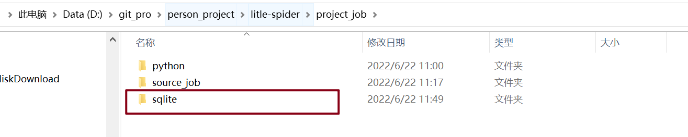

## 开发方式

技术栈：前端框架react + 后端框架Flask(python)

打包工具：electron（GUI界面），pyinstaller

## 环境搭建

### 下载nodejs

1. 拷贝环境部署包中的nodejs.zip，解压后，配置系统环境变量
2. 打开cmd，node -v
3. 下载npm 

### 配置electron

1. 下载electron:`npm install electron --save-dev`

2. 在项目的根目录下新建main.js文件（不是src目录下）

   ```js
   // 引入electron并创建一个Browserwindow
   const {app, BrowserWindow} = require('electron')
   const path = require('path')
   const url = require('url')
    
   app.commandLine.appendArgument('--no-sandbox');
   // 保持window对象的全局引用,避免JavaScript对象被垃圾回收时,窗口被自动关闭.
   let mainWindow
    
   function createWindow () {
   //创建浏览器窗口,宽高自定义具体大小你开心就好
   mainWindow = new BrowserWindow({width: 800, height: 600})
    
   
      // 加载应用-----  electron-quick-start中默认的加载入口
       // mainWindow.loadURL(url.format({
       //   pathname: path.join(__dirname, './build/index.html'),
       //   protocol: 'file:',
       //   slashes: true
       // }))
   
     // 加载应用----适用于 react 项目
     mainWindow.loadURL('http://localhost:3000/');
     
     // 打开开发者工具，默认不打开
     // mainWindow.webContents.openDevTools()
    
     // 关闭window时触发下列事件.
     mainWindow.on('closed', function () {
       mainWindow = null
     })
   }
    
   // 当 Electron 完成初始化并准备创建浏览器窗口时调用此方法
   app.on('ready', createWindow)
    
   // 所有窗口关闭时退出应用.
   app.on('window-all-closed', function () {
     // macOS中除非用户按下 `Cmd + Q` 显式退出,否则应用与菜单栏始终处于活动状态.
     if (process.platform !== 'darwin') {
       app.quit()
     }
   })
    
   app.on('activate', function () {
      // macOS中点击Dock图标时没有已打开的其余应用窗口时,则通常在应用中重建一个窗口
     if (mainWindow === null) {
       createWindow()
     }
   })
    
   // 你可以在这个脚本中续写或者使用require引入独立的js文件. 
   //热加载
   // try {
   //     require('electron-reloader')(module)
   // } catch (_) {}
   
   ```

3. 修改package.json配置文件

   ```js
   {
     "name": "react_job",
     "version": "0.1.0",
     "private": true,
     "main": "main.js",   // 必须配置
     "dependencies": {
       "electron": "^19.0.4",
       "electron-reloader": "^1.2.3",
       "nanoid": "^3.2.0",
       "react": "^17.0.2",
       "react-dom": "^17.0.2",
       "react-router-dom": "^5.2.0",
       "react-scripts": "5.0.0",
       "web-vitals": "^2.1.4"
     },
     "scripts": {
       "start": "craco start",
       "build": "craco build",
       "test": "craco test",
       "eject": "react-scripts eject",
       "electron-start": "electron ."  // 必须配置
     },
   ...
     "homepage": "./"   // 必须配置
   }
   ```

4. 配置热加载

   ```js
   //热加载
   // npm install electron-reloader
   // 在main.js的最后添加代码
   try {
       require('electron-reloader')(module)
   } catch (_) {}
   // 热加载的意义：代码发生改变后，app能够自动更新
   ```


### sqlite3安装



将sqlite配置到环境变量中


## electron打包

1. react项目打包

   - 修改main.js,加载应用换成打包代码
   - npm run build

2. electron打包

   - 下载electron-packager `npm install electron-packager --save-dev`

   - 安装electron-packager指令  `npm install electron-packager -g`

   - `electron-packager <location of project> <name of project> <platform> <architecture> <electron version> <optional options>`

     location of project: 项目的本地地址，此处我这边是 ~/knownsec-fed
     location of project: 项目名称，此处是 knownsec-fed
     platform: 打包成的平台
     architecture: 使用 x86 还是 x64 还是两个架构都用
     electron version: electron 的版本

   为了便捷打包，在package.json中配置electron的打包指令

   ```js
   "scripts": {
       "start": "craco start",
       "build": "craco build",
       "test": "craco test",
       "eject": "react-scripts eject",
       "electron-start": "electron .",
       "package": "electron-packager ./ react_job --platform=win32 --out=./dist --electron-version 19.0.4 --ignore='(src*|.gitignore|.idea|README.md|node_modules)'
   " 
     },
   
   ```

## electron打包优化

1. 修改打包指令：

   `electron-packager ./ react_job --win --arch=x64 --out=release --electron-version=19.0.4 --ignore="(src*|.gitignore|.idea|README.md|node_modules)"`

2. 加密源码

   1. 下载asar:`npm install -g asar`
   2. 在打包后的文件夹中，加密源码：`asar pack ./app app.asar`


## 项目打包顺序

1. 打包前端项目

   修改main.js的加载应用配置，然后`npm run build`

2. electron打包

   `electron-packager ./ react_job --win --arch=x64 --out=release --electron-version=19.0.4 --ignore="(src*|.gitignore|.idea|README.md|node_modules)"`

## 启动electron遇到的坑

1. 下载过程中可能会失败

设置electron的下载镜像源 `npm config set electron_mirror "https://npm.taobao.org/mirrors/electron/"`

2. electron启动失败

   没有下载全局：`npm install -g electron`

3. unable to find electron app ....

   package.json配置文件中少配置了"main"进入配置
