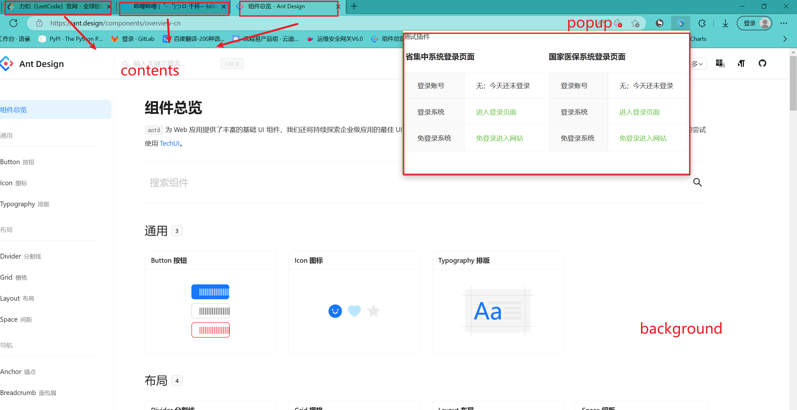
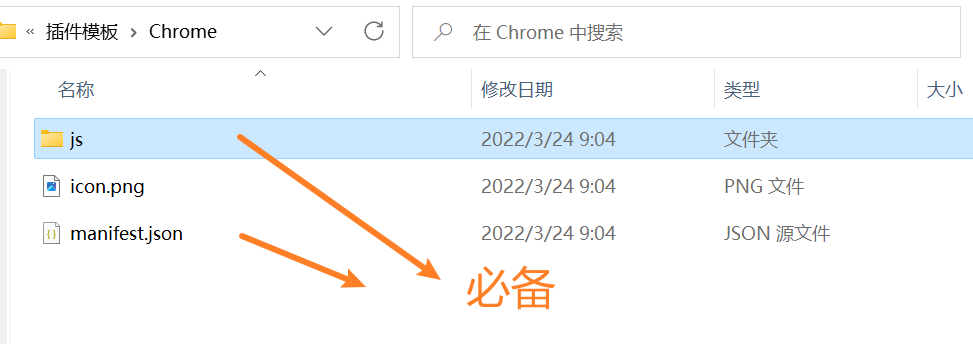

# 简介

插件，在浏览器中称为`扩展`，是自定义浏览体验的小型软件程序。它们让用户可以通过多种方式定制 Chrome 的功能和行为。适用于各个chrome内核的浏览器，比如：360浏览器，edge浏览器，谷歌浏览器等。

浏览器将在2023年停止支持manifest v2，本篇文章主要结合使用react+manifest v3进行插件的开发。使用旧版浏览器依旧可支持使用manifest v2。

详细文档参考：[chrome插件文档](https://doc.yilijishu.info/chrome/)

# 插件作用

1. 获取cookie保持登录
2. 元素捕获器
3. 浏览器换皮肤
4. 参考油猴
5. ....

# 插件框架描述

插件框架主要有三部分，`content_script`、`background`、`popup`

`content_script`:包含了所有的tab,每个tab下的页面都是一个content，可以直接操作该页面的网页元素。每个tab都有一个tabID，当要操作某个页面下的网页元素时，需要定位到该tab下。

`background`：插件存在则存在, 随着浏览器的打开而打开，随着浏览器的关闭而关闭, 通常把需要一直运行的、启动就运行的、全局的代码放在background里面

background的权限非常高，几乎可以调用所有的Chrome扩展API（除了devtools），而且它可以无限制跨域，也就是可以跨域访问任何网站而无需要求对方设置CORS。

`popup`: 插件的页面。



# manifest V2(<font color='red'>即将过时</font>)


## 文件布局



## manifest.json配置解析 v2版

```json
{
    "name": "名称",
    "description": "描述",
    "version": "打包完成后用于判断插件是否需要更新",
    "manifest_version": 2,
    "browser_action": {
        "default_icon": "icon.png"
    },
    "icons": {
        "16": "icon.png",
        "48": "icon.png",
        "128": "icon.png"
    },
    "background": {
        "scripts": [
            "bg1.js",
            "bg2.js"
        ], // 后台脚本可以注册多个
        "persistent": false // 是否是持久的，一般为 false, 某些特殊情况需要参考文档 
    },
    "commands": {
        "xxx": {
            "suggested_key": {
                "default": "Ctrl+X",
                "mac": "Command+X",
                "windows": "Ctrl+X"
            }
        },
        "_execute_browser_action": {...
        },
        "_execute_page_action": {...
        }
    }
   "content_scripts": [
        {
            "matches": [
                "<all_urls>"
            ],
            "js": [
                "js/targetSelect.js"
            ],
            "run_at": "document_start",
            "all_frames": true
        }
    ],
    "permissions": [
        "tabs",
        "activeTab",
        "cookies",  // 需要添加才能操作浏览器cookies
         "<all_urls>"  // 需要添加才能操作浏览器cookies
    ]
}
```

> 1. `manifest_version` 必填
>
>     清单文件格式的版本， Chrome 18 开发 写 `2` 即可
>
> 2. `name` 必填
>
>     插件名称
>
> 3. `version`必填
>
>     插件版本，发布新版本后，浏览器会比较其已安装的插件的版本，有更新的版本则会自动更新
>
> 4. `description`选填
>
>      插件的描述，132个字符限制
>
> 5. `icons`选填
>
>     插件图标，最好是png
>
>     1. `16`:16*16的图标
>     2. `48`:48*48的图标
>     3. `128`:128*128的图标
>
> 6. `browser_action` 选填
>
>     可以用来定义点击图标后展示的窗口，对应接口 `chrome.browserAction`，这项配置与 `page_action` 是对立的，只能二选一
>
>     1. `default_icon: Object | string`: 一个或者一组图标的路径
>     2. `default_title`:设置 tooltip
>     3. `default_popup`:指定弹出的窗口，可以是任意 html
>     4. `badges`:“徽章” 就是小图标上的一个标记，用来展示一些状态
>
> 7. `page_action` 选填
>
>     代表可以在当前页面执行的操作，不活动时显示灰色,对应接口 `chrome.pageAction`
>
>     可用 `pageAction.(show|hide)` 改变插件活动状态
>
> 8. `background`选填
>
>     用来定义后台脚本部分 
>
>      扩展是基于事件的程序，这些事件包括导航到新页面、删除书签、或者关闭选项卡，扩展在他们的后台脚本中监视这些事件，然后用指定的指令进行响应 
>
>      关于后台脚本的状态
>
>     1. 首次下载后或者更新后被加载
>     2. 后台脚本下载后会处于休眠状态，直到它侦听的某个事件被触发，
>     3. 侦听到事件后，会使用指定的指令响应（怎么相应自定义）
>
>     以下情况会需要调用到后台脚本 
>
>     1. 扩展首次下载或者版本更新
>     2. 后台脚本中正在监听事件，并且这事件被触发了
>     3. `content_script` 或者其他扩展中调用了 sendMessage
>     4. 当前扩展中的其他部分，例如弹窗中调用了 runtime.getBackgroundPage
>
> 9. `commands`
>
>     操作快捷键后，插件后台会监听到对应的事件，监听代码如下。
>
> 10. `content_scripts`
>
>     在一个特殊的环境中运行，可以称之为隔离环境，在这里可以访问所注入页面的DOM，但是不能访问里边的任何 javascript 变量和函数，反之，页面中的js 也不能访问 `content_script` 中的变量和函数
>
>     访问目标网站的 DOM ，可以用来进行通信
>
>     分为两种情况，一种是声明型注入脚本，使用 `content_scripts` 配置项，另一种是编程方式注入使用 `permissions: ["activeTab"]` 选项
>
>     1. 声明型注入脚本 
>
>         `content_scripts` 值可以是一个数组，设置不同站点的不同注入文件 
>
>         - 需要设置 `matches: ["http://"]` 指定匹配的网址，
>         - `js` 设置注入脚本
>         - `css` 设置注入样式
>         - `run_at` 定义注入要本的时机 `document_idle` 表示浏览器帮你把握时机，会在 DOM 完成 与 window.onload 之后注入；`document_start` 在 CSS 注入之后，其他任何脚本或者 DOM 之前注入；`document.end` DOM 完成之后立即注入，但是在图像等资源之前
>
>     2. 编程方式注入，不需要指定可访问的域名，可以针对当前活动的选项卡运行，获取临时访问权限 `permissions: ["tabs"]` 编程方式注入会在 `chrome.tabs.executeScript(tabId, details, callback)` 接口中详细介绍
>
> 11. `offline_enabled`
>
>       扩展是否需要离线工作，默认为 true, 当chrome 检测到离线时，程序会被高亮显示
>
> 12. `permissions`
>
>       声明 权限（插件实现基础功能所需要的）
>
>      - `activeTab` 允许用户在调用扩展时临时访问当前活动的选项卡， // 常用
>      - `background` 后台权限，可以用来增加Chrome 运行时间，即开机即运行（虽然是不可见的）
>      - `bookmarks` 书签操作权限
>      - `browsingData` 浏览器数据操作权限，主要用来清除浏览器数据 cookie storage 等
>      - `contentSettings` 浏览器设置权限
>      - `contextMenus` 上下文菜单添加权限
>      - `cookies` cookie 的查询、修改、onChange 监听  //常用
>      - `history` 浏览器历史记录操作权限
>      - `storage` chrome.storage 的使用权限（注意不是浏览器的 localStorage）
>      - `tabs` 选项卡权限，允许创建、修改、重新排列选项卡   // 常用
>      - `webNavigation` 请求进行过程中的操作权限
>      - `webRequest` | `webRequestBlocking` 开放 正在运行请求的 拦截、阻塞、或修改的权限


```js
commands配置监听代码
// background.js
chrome.commands.onCommand.addListener(function(command) { 
   });
```


# manifest V3 （React）

## 文件布局


## content_scripts、background、popup通信

1. content_scripts : 浏览器里面使用的,和页面共享DOM,不共享JS

    1. content-scripts不能访问绝大部分chrome.xxx.api，除了下面这4种：
    2. chrome.extension(getURL , inIncognitoContext , lastError , onRequest , sendRequest)
    3. chrome.i18n
    4. chrome.runtime(connect , getManifest , getURL , id , onConnect , onMessage , sendMessage)
    5. chrome.storage

2. background :   插件存在则存在, 随着浏览器的打开而打开，随着浏览器的关闭而关闭, 通常把需要一直运行的、启动就运行的、全局的代码放在background里面

    background的权限非常高，几乎可以调用所有的Chrome扩展API（除了devtools），而且它可以无限制跨域，也就是可以跨域访问任何网站而无需要求对方设置CORS。

3. popup页嵌入js : 仅仅该页面使用


- **接收消息：chrome.runtime.onMessage.addListener**
- **发送消息：chrome.runtime.sendMessage**

注意：向content_scripts发送消息时需要使用(因为有多个content_scripts标签，所以需要对应到明确的tabs)

```js
// 查询当前打开的标签页
	chrome.tabs.query({ active: true, currentWindow: true }, (tabs) => {
    // 向当前打开的标签页发送关闭弹窗的消息
        chrome.tabs.sendMessage(tabs[0].id, {
            todo: "closeModal",
        });
 	});

```


每个文件只接受一个onMessage.addListener

```js
// content_scripts 

// params:
// 		data:发送的数据
//		function:回调函数
//background.js
//接收消息
// 方式一
chrome.runtime.onMessage.addListener(async (req, sender, sendResponse) => {
    console.log('我是background，我接收了来自 content.js的消息：', req.info)
    sendResponse('哈哈哈')
    const tabId = await getCurrentTabId()
    // 在背景页面发送消息，需要当前 tabID
    chrome.tabs.sendMessage(tabId, '我是background，我在发送消息', function (res) {
        console.log('background：', res)
    });
})
/**
 * 获取当前 tab ID
 */
function getCurrentTabId() {
    return new Promise((resolve, reject) => {
        chrome.tabs.query({ active: true, currentWindow: true }, function (tabs) {
            resolve(tabs.length ? tabs[0].id : null)
        });
    })
}

// 方式二：
chrome.runtime.onMessage.addListener(async (req, sender, sendResponse) => {
    console.log('我是background，我接收了来自 content.js的消息：', req.info)
    sendResponse('哈哈哈')
    // 查询当前打开的标签页
	chrome.tabs.query({ active: true, currentWindow: true }, (tabs) => {
    // 向当前打开的标签页发送关闭弹窗的消息
        chrome.tabs.sendMessage(tabs[0].id, {
            todo: "closeModal",
        });
 	});
})


// data数据  sender发送方  sendResponse回调(可回传data数据)
chrome.runtime.onMessage.addListener(function(data, sender, sendResponse){})
```


## manifest v3 -- react

### 通用react-extension 模板

 [chrome-extension-react-demo-master.zip](资源包\chrome-extension-react-demo-master.zip) 

### manifest.json

```json
{
  "manifest_version": 3,
  "name": "__MSG_appName__",
  "version": "1.0.0",
  "description": "__MSG_appDescription__",
  "icons": {
    "16": "images/icon.png",
    "32": "images/icon.png",
    "48": "images/icon.png",
    "128": "images/icon.png"
  },
  "permissions": ["contextMenus", "storage", "tabs", "tts", "notifications","webRequest","cookies"],
    "host_permissions": [
    "<all_urls>"
  ],  // 需要添加此配置，cookie才能设置成功
  "action": {
    "default_popup": "popup.html"
  },
  "background": {
    "service_worker": "static/js/background.js",
    "type": "module"
  },
  "content_scripts": [
    {
      "matches": ["<all_urls>"],
      "js": ["static/js/content.js"],
      "css": ["static/css/content.css"],
      "run_at": "document_end"  // react的只能在文档加载完毕后，否则会报错
    }
  ],
  "web_accessible_resources": [
    {
      "resources": ["images/*.png"],
      "matches": ["<all_urls>"]
    }
  ],
  "options_ui": {
    "page": "options.html",
    "open_in_tab": true
  },
  "default_locale": "zh_CN",
  "homepage_url": "https://www.jianshu.com/p/257c8cae2099"
}

```


### 部分接口说明

`chrome.i18n.getMessage(String name)`:获取_locales文件夹中message.json的键name的值。

`chrome.storage.sync.set(Object obj)`:将obj信息保存到本地谷歌仓库，注意：需要搭配使用async、await关键字

```jsx
  // 点击删除按钮的回调
  const onDelete = async (value) => {
    // 获取日志数据
    const data = await chrome.storage.sync.get("logs");
    if (data?.logs?.length) {
      const newLogs = data.logs.filter((log) => log !== value);
      // 重新保存日志数据
      await chrome.storage.sync.set({ logs: newLogs });
      // 修改数据刷新页面
      setLogList(newLogs);
      // 更改插件图标上徽标文字
      chrome.action.setBadgeText({
        text: newLogs.length ? newLogs.length.toString() : "",
      });
    }
  };
```


`chrome.contextMenus.create(Object obj)`:设置上下文，即右键菜单

```js
// background.js
// 创建上下文菜单
const contextMenus = [
  { id: "addLog", title: "添加日志" },
  { id: "translate", title: "谷歌翻译" },
  { id: "play", title: "语音朗读" },
];
for (let menu of contextMenus) {
  chrome.contextMenus.create({
    id: menu.id,
    type: "normal",
    title: menu.title,
    contexts: ["selection"], // 右键点击选中文字时显示
    documentUrlPatterns: ["<all_urls>"], // 限制菜单选项仅应用于URL匹配给定模式之一的页面
  });
}

```


`chrome.contextMenus.onClicked.addListener(function(info){})`:上下文选择监听器

`chrome.tabs.create(Object obj)`:浏览器tab打开网页

`chrome.tabs.update(Object obj)`:浏览器tab跳转页面

```js
const openReact = () => {
    chrome.tabs.create({ url: `https://react.docschina.org/` });
  }.then(
  	tab => {
        
    }
  );
```


`chrome.tabs.query()`:查询当前打开的标签页，异步函数，需要加上`async`，`await`

```js
// 查询当前打开的标签页
chrome.tabs.query({ active: true, currentWindow: true }, (tabs) => {
    // 向当前打开的标签页发送关闭弹窗的消息
    chrome.tabs.sendMessage(tabs[0].id, {
        todo: "closeModal",
    });
});  
```

`chrome.cookies.set(Object obj)`:设置cookie

```js
     chrome.cookies.set({
        url: "https://www.baidu.com",
        domain: "www.baidu.com",
        path: "/",
        name: "yangjj",
        value: "yangjj,sendi,test1"
    })
```


# 技巧

### 通过xpath获取element对象，并修改样式

```js
// 通过xpath获取单个元素
function getElementByXpath(path) {
    return document.evaluate(path, document, null, XPathResult.FIRST_ORDERED_NODE_TYPE, null).singleNodeValue;
}
// 通过xpath获取多个元素
function getElementByMoreXpath(xpath) {
    let nodes = document.evaluate(xpath, document, null, XPathResult.ORDERED_NODE_ITERATOR_TYPE, null);
    let arr = []
    let ele;
    while ((ele = nodes.iterateNext()) != null) {
        arr.push(ele)
    }
    return arr;
}

// 通过xpath定位添加线框
export function addBorderByXpath(xpath,borderObj) {
    let arr = getElementByMoreXpath(xpath);
    if (arr.length == 0) {
        console.log(xpath,"定位失败")
    }
    arr.forEach((item,index) => { 
        for (config in borderObj) {
            item.style[config] = borderObj[config]
        }
    })
}

```


### 本地存储

```js
// 读取数据，第一个参数是指定要读取的key以及设置默认值
chrome.storage.sync.get({color: 'red', age: 18}, function(items) {
    console.log(items.color, items.age);
});
// 保存数据
chrome.storage.sync.set({color: 'blue'}, function() {
    console.log('保存成功！');
});
```


# 插件开发经验积累

## manifest相关文档

manifest：
https://developer.chrome.com/docs/extensions/mv3/manifest/

manifest_version：
https://developer.chrome.com/docs/extensions/mv3/manifest/manifest_version/

content script：
https://developer.chrome.com/docs/extensions/mv3/content_scripts/

permissions：
https://developer.chrome.com/docs/extensions/mv3/declare_permissions/

## chromeAPI

在content-script中，chromeAPI仅支持部分接口

- i18n
- storage
- runtime
    - connect
    - getManifest
    - getURL
    - id
    - onConnect
    - onMessage
    - sendMessage


## content_script、background、popup通信

1. 每个文件只接受一个onMessage.addListener
2. 相关API
    - **接收消息：chrome.runtime.onMessage.addListener**
    - **发送消息：chrome.runtime.sendMessage**


## PubSub-JS发布与订阅


## 遇到的问题

### 代码如何引入静态文件

1. manifest.json配置

    ```json
    ..., 
    "web_accessible_resources": [
        {
          "resources": ["/images/*.png"],  // 仅允许引入public/images文件夹里所有png文件
          "matches": ["<all_urls>"]
        }
      ],
    ```

2. 导入静态文件
    ```js
    const float_icon_url = chrome.runtime.getURL("images/brain.png")
    ```

    

### 鼠标移入移出，react如何控制参数变化。

例如：

参数isHover，当鼠标移入div元素，isHover应为true,鼠标移出时，isHover应为false

```js
<div className='CRX-float-window-container'
onMouseEnter={() => {
    setIsHovered(true);
}}
onMouseLeave={() => {
    setIsHovered(false)
}}>
</div>
```

### 谷歌插件样式与页面样式冲突

